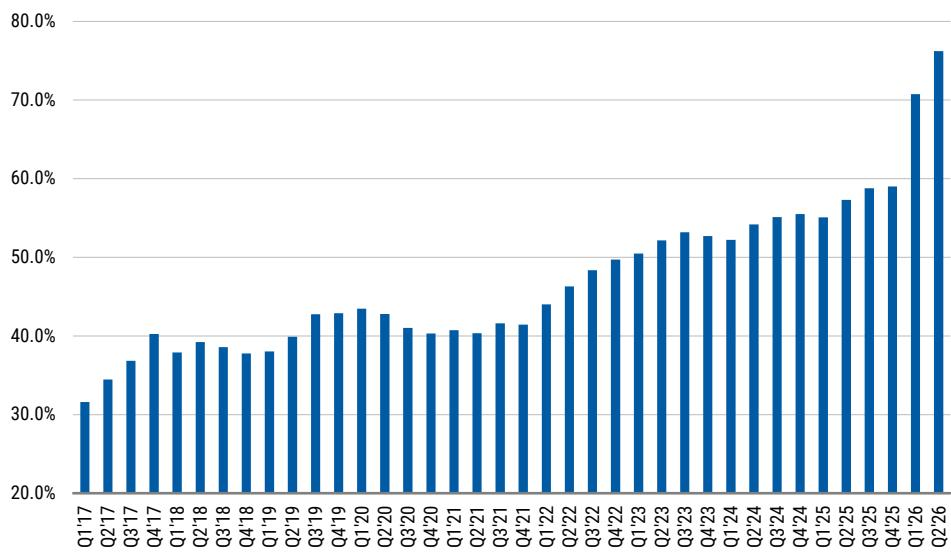
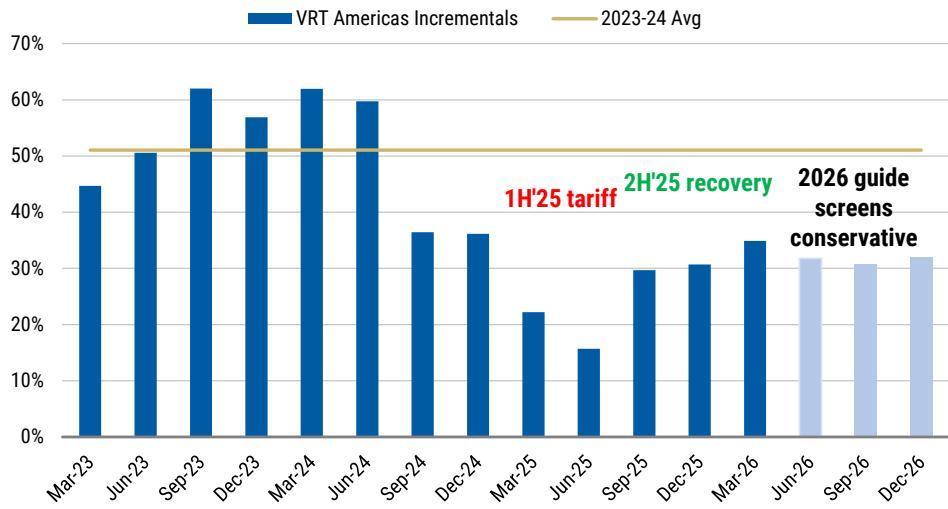
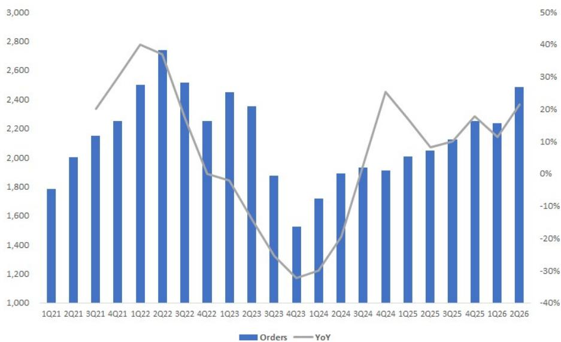

# MS：Q2-26预览-跟随2H成交量进入2027

这份MS在7月发布的美国多行业Q2预览报告，核心判断并不复杂：市场已经充分预期了Q2的普遍超预期，美国工业股估值已站上历史均值两个标准差。真正决定下半年资金走向的，不是Q2数字本身，而是管理层在会议中给出的2H指引。报告认为，2H指引将出现分化，而这种分化直接决定了哪些公司能在2027年持续获得正面的盈利修正，哪些公司会面临估值压缩。

报告覆盖了30余家美国工业公司，从分销商、电气设备到暖通空调和自动化，分析师逐一拆解了每家的Q2预期和2H不确定性。但贯穿全文的只有一条主线：在估值高位，盈利修正才是报价继续上行的相对少见燃料。

## 1. 2H指引才是KPI，Q2超预期已被定价

报告明确指出，美国多行业公司Q2中位数运营利润增长面临一个相对容易的同比基数，市场对此已有充分预期。真正的问题在于，2H的基数将显著变难，而市场对2H的有机增长预期却高达5-6%，高于1H的3-4%。这意味着，如果2H指引不能兑现，或者兑现的代价是透支了下半年需求，那么当前的高估值将失去支撑。

分析师用了一个关键指标来佐证这一判断：美国商业与工业贷款周度数据在6月开始走平，7月第一周甚至出现回落。虽然他们仍认为未来12个月趋势向上，但春季渠道补库的信号（IEEPA关税回撤叠加中东冲突带来的供应链不确定性）可能意味着短期改善速率将节奏变化。这不是周期拐点，但足以让市场对2H指引变得挑剔。

> **KC评论：** 报告的核心不是预测Q2好坏，而是提醒读者，当所有人都预期Q2不错时，报价已经price in了这种不错。2H指引才是区分“周期上行受益者”和“渠道补库受益者”的分水岭。读者需要关注的不是Q2数据本身，而是管理层如何描述下半年的订单能见度和终端需求。

## 2. 工业优于消费，但价格回归是双刃剑

报告在行业层面给出了一个清晰的排序：工业短周期优于消费端。分析师认为，虽然Q2两者都会改善，但工业需求的持续性更强。背后的结构性逻辑是，美国制造业资本开支的驱动力已经从消费需求转向了关税规避和本土化研究。报告展示了一张关键图表：美国资本品进口与消费品进口的走势出现历史性背离，前者持续走强，后者走弱。分析师认为，这种背离背后是美国1.2万亿美元的贸易逆差——关税规避驱动的研究是独一无二的美国市场现象。

但价格回归带来了新的复杂性。Q2工业分销商调查显示，供应商提价速度是2022年以来最快的，分销商对维持价差也更有信心。这支撑了2H有机增长和利润率上行，但报告也提醒，如果提价只是成本转嫁而非需求拉动，那么对消费端的挤压最终会反噬工业需求。消费端的数据并不乐观：可支配收入持续减速，储蓄率降至历史新低，实际工资在领先指标上已经转负。

## 3. 数据中心订单仍强，但2H面临更难的比较

报告对数据中心设备板块整体保持建设性看法，预计Q2订单依然强劲。但2H的同比基数将显著变难，市场将密切关注订单的持续性。分析师认为，订单压缩的不确定性来自两个方向：一是对数据中心资本开支持续性的担忧，二是架构快速变化带来的内容份额不确定性。

最受益的公司是那些拥有持续积压订单可见性的，以及未来内容争议较小的，例如Vertiv和Eaton。在电气设备领域，交期最长的公司（电气设备优于冷水机组）最有能力维持2H订单强度。报告还指出，锁定产能的紧迫性取决于终端用户对计算ROI的判断，而这一判断可以快速变化，从而影响设备订单的节奏。

## 4. 住宅暖通空调：Q2量好，但可能是渠道补库的假象

报告对住宅暖通空调板块持谨慎看法。虽然Q2销量有望超预期，但利润率面临关税和通胀带来的成本不确定性，Lennox和Carrier的利润率预期可能过于乐观。更关键的是，报告认为Q2的销量增长至少部分来自渠道在最新一轮涨价前的补库，这可能会透支2H的需求。

分析师还直接反驳了“积压需求”的说法：2024-2025年住宅暖通空调平均年化销量为850万台，高于2018-2019年的800万台。而2021-2023年疫情期间，市场出货量接近1000万台，这本身就是需求的前置。在消费者不确定性持续、住宅建设疲软、产品价格再次上涨的背景下，很难找到需求改善的底层驱动力。

> **KC评论：** 报告对住宅暖通空调的判断值得注意。市场可能将Q2的销量增长解读为需求回暖，但报告提醒，这更可能是渠道补库和涨价前的抢购。如果2H销量回落，那些估值已经因数据中心概念而大幅扩张的公司（如Carrier）将面临双重不确定性。

## 5. 公司分化的逻辑：谁能在2H证明2027年的增长

报告在公司层面给出了清晰的偏好排序。最看好的公司是那些市场在Q2财报后会对2027年持续增长更有信心的：Rockwell Automation、Ralliant、Eaton、Ametek、Trane Technologies、Hubbell和Parker-Hannifin。此外，Grainger和Watsco因其显著的EPS上行空间而获得偏好。

谨慎的公司分为两类：一类是2H存在EPS或有机增长节奏变化不确定性的，如Emerson Electric、Honeywell、Otis和Allegion；另一类是年初至今估值扩张已超出2H盈利修正和2027年增长前景所能支撑的，如Carrier、Lennox、Stanley Black & Decker和Dover。报告还特别指出，中东地区复苏的假设可能过于乐观，这对Emerson、Otis、Honeywell、Trane、Johnson Controls和Ingersoll Rand构成2H不确定性。

这份报告的价值不在于给出一个简单的“买或卖”清单，而在于提供了一个在估值高位评估工业股的框架：当所有人都预期Q2不错时，真正的超额收益来自对2H指引的分辨能力。在渠道补库、价格回归和结构性研究交织的当下，能证明2027年增长可持续的公司，才能在高估值区间站住脚。

For informational purposes only. Portions may be generated,translated,summarized,or edited with AI assistance based on source materials and may contain omissions or errors. Please verify independently. This is not investment,legal,tax,accounting,or other professional advice.

