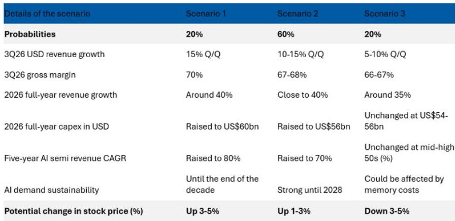
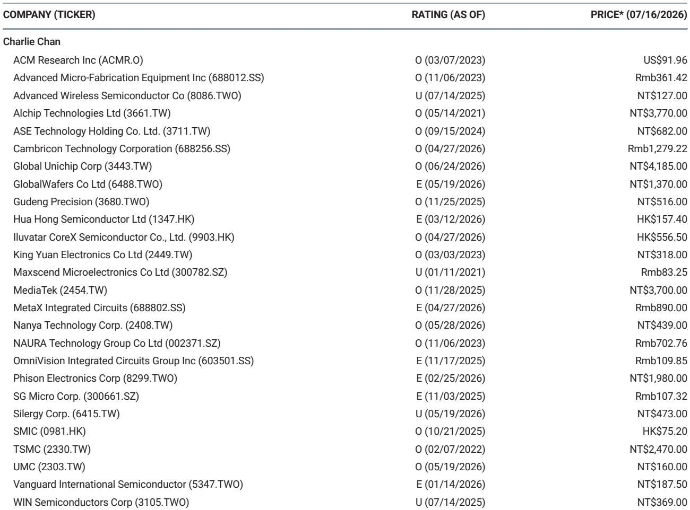
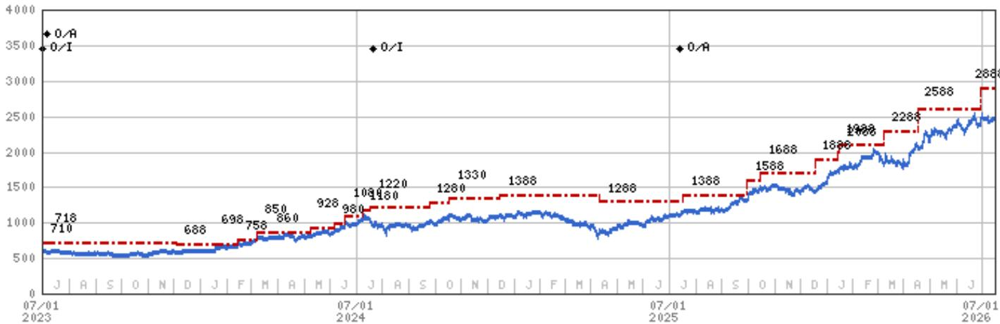

# MS：TSMC与OWAsiaPacific2026revenue

台积电在2026年第二季度财报交流中，将全年营收增长指引从“高于30%”上调至“高于40%”，超出MS此前40%的街顶预期，也高于市场普遍预期的35%-40%。这份报告的核心判断是：AI需求正在加速，而非趋缓。

指引上调的直接原因是CSP客户正在快速增加云端资本支出。台积电没有更新其AI半导体收入复合年增长率的预测，但明确表示实际增速正高于此前预估。MS在财报前的情景分析中，将2026年营收增长40%作为Scenario 1（概率20%）的假设，但实际结果甚至超出了这一乐观情景。

与此同时，台积电将2026年资本支出目标提高至600-640亿美元，高于此前520-560亿美元的高端。报告指出，这暗示了部分设备成本通胀，但更关键的是，资本支出强度将进一步上升。台积电没有提供市场此前预期的三年2000亿美元资本支出指引，但管理层表示强度还会增加。

> **KC评论：** 资本支出上调往往被市场解读为成本不确定性，但在这份报告里，它更应被看作台积电对AI需求持续性的信心信号。设备成本通胀是次要的，真正重要的是公司愿意为未来产能下注。

## 1. 毛利率预期低于市场幻想，但不应成为卖出理由

第二季度毛利率达到67.7%，略高于MS预期的67.4%。但第三季度毛利率指引中值为66%，低于MS预期的67.5%，更远低于买方不切实际的70%预期。报告认为，2纳米制程的稀释效应是主因。

MS明确表示，读者应在毛利率预期落空后逢低买入。这一判断的逻辑在于：市场对毛利率的预期已经过高，而营收增长的上调才是更实质的信号。毛利率的短期波动，不应掩盖AI需求驱动的收入加速。

## 2. 先进封装瓶颈缓解，英特尔扮演了意外角色

台积电对英特尔在先进封装领域的角色表达了欢迎态度。管理层表示，英特尔EMIB-T技术有助于缓解先进封装供应限制，并支持客户成功。值得注意的是，联发科是英特尔EMIB-T的主要用户，用于一个TPU项目。

这一表态值得关注。先进封装一直是AI芯片供应的瓶颈环节，台积电自身产能紧张。英特尔的介入，至少在短期内为供应链提供了额外弹性。台积电没有表现出竞争排斥，而是以客户成功为导向。

## 3. 领先制程没有捷径，但竞争格局正在微妙变化

管理层重申，领先制程能力需要数年积累，新建一座晶圆厂需要2-3年。这是对竞争格局的明确表态：短期内没有谁能挑战台积电在先进制程的地位。

但英特尔在封装环节的参与，以及联发科等客户的多元化选择，暗示了生态系统的微妙变化。台积电的核心优势仍在制造本身，但客户正在为供应链安全做更多准备。这份报告没有展开讨论，但这是一个值得持续观察的变量。

> **KC评论：** 台积电的竞争壁垒依然是时间——2-3年的建厂周期和数年的技术积累。但客户开始分散封装环节的订单，说明供应链韧性正在成为比单纯制程领先更重要的考量。

这份报告最值得记住的数字是：2026年营收增长从“高于30%”上调至“高于40%”，资本支出从520-560亿美元上调至600-640亿美元。AI需求是相对少见驱动，也是相对少见需要关注的不确定性。

For informational purposes only. Portions may be generated,translated,summarized,or edited with AI assistance based on source materials and may contain omissions or errors. Please verify independently. This is not investment,legal,tax,accounting,or other professional advice.

For informational purposes only. Portions may be generated,translated,summarized,or edited with AI assistance based on source materials and may contain omissions or errors. Please verify independently. This is not investment,legal,tax,accounting,or other professional advice.

