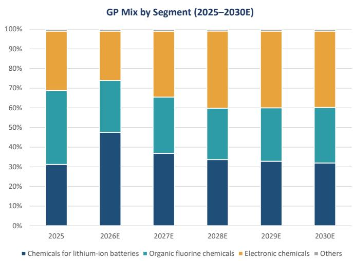

July 14, 2026 10:09 AM GMT

Shenzhen Capchem Technology Co Ltd | Asia Pacific

# 受益于半导体材料行业趋势；上调评级

<table><tr><td colspan="3">变化</td></tr><tr><td>深圳新宙邦科技股份有限公司 (300037.SZ)</td><td>从</td><td>到</td></tr><tr><td>评级</td><td>中性</td><td>增持</td></tr><tr><td>目标价</td><td>人民币30.00元</td><td>人民币93.00元</td></tr></table>

我们认为新宙邦提供了半导体材料领域的业务布局，且其盈利基础日益稳固。预计未来两年，公司的盈利增长和估值驱动因素将从电解液转向电子化学品。我们上调评级至增持。

半导体材料业务具备盈利支撑。新宙邦在半导体价值链中的参与主要体现在为半导体制造工厂供应冷却和清洗化学品。其大部分客户位于中国大陆，以及韩国和日本。公司预计，受下游强劲的半导体需求和进口替代推动，其电子信息化学品板块在2026-2028年期间将实现40-50%的年复合增长率。结合氟化学品和电容器化学品的稳步改善，我们认为公司净利润有望从2026年预计的约22亿元人民币增长至2028年的约30亿元人民币。

展望2026年之后，我们预计公司的增长和估值驱动因素将从电解液转向电子化学品。2026年，我们预计大部分盈利增长将来自公司的电池电解液业务，因其收购的六氟磷酸锂业务盈利能力正在恢复。然而，考虑到预计从2026年下半年开始的大量六氟磷酸锂产能扩张，我们认为这种恢复可能难以持续。

尽管如此，我们并不认为电解液潜在的盈利压力会显著影响公司估值，因为公司2026年之后的增长前景将转向电子化学品。该板块增长前景更佳，且享有更高的估值倍数。我们预计电子化学品将占公司总毛利润的约40%，高于2025年的30%。

上调目标价，上调至增持评级。我们将2026-2027年净利润预测分别上调33%和4%，并引入2028年预测。我们将估值基准滚动至2027年，认为市场已基本消化了2026年之后的盈利预期。同时，我们上调估值倍数以反映强于预期的增长前景。基于新的增长预测，我们给予公司电解液业务15倍2027年市盈率、氟化学品30倍2027年市盈率、电子化学品40倍2027年市盈率。我们的分部加总法得出的新目标价为93元人民币，对应32倍2027年市盈率。

<table><tr><td colspan="2">MS亚洲有限公司+</td></tr><tr><td colspan="2">Kaylee Xu</td></tr><tr><td colspan="2">股票分析师</td></tr><tr><td>Kaylee.Xu@morganstanley.com</td><td>+852 2239-1506</td></tr><tr><td colspan="2">Jack Lu</td></tr><tr><td colspan="2">股票分析师</td></tr><tr><td>Jack.Lu@morganstanley.com</td><td>+852 2848-5044</td></tr></table>

## 亚洲夏季学校 2026

## 深圳新宙邦科技股份有限公司 (300037.SZ, 300037 CS)

中国能源与化工 | 中国

<table><tr><td>股票评级</td><td>增持</td></tr><tr><td>行业观点</td><td>中性</td></tr><tr><td>目标价</td><td>人民币93.00元</td></tr><tr><td>目标价上行/下行空间 (%)</td><td>34</td></tr><tr><td>股价，收盘价 (2026年7月14日)</td><td>人民币69.25元</td></tr><tr><td>52周区间</td><td>人民币96.08-32.69元</td></tr><tr><td>摊薄后总股本，当前 (百万股)</td><td>767</td></tr><tr><td>总市值，当前 (百万元)</td><td>人民币53,138.3</td></tr><tr><td>企业价值，当前 (百万元)</td><td>人民币54,896.1</td></tr><tr><td>日均交易额 (百万元)</td><td>人民币1,426</td></tr></table>

<table><tr><td>财政年度截止日</td><td>12/25</td><td>12/26e</td><td>12/27e</td><td>12/28e</td></tr><tr><td>每股收益 (人民币)**</td><td>1.43</td><td>2.83</td><td>2.93</td><td>3.93</td></tr><tr><td>先前每股收益 (人民币)**</td><td>1.61</td><td>2.16</td><td>2.85</td><td>3.23</td></tr><tr><td>每股收益 (人民币)§</td><td>1.52</td><td>2.96</td><td>3.60</td><td>4.39</td></tr><tr><td>营业收入，净额 (百万元人民币)</td><td>9,639.2</td><td>14,711.7</td><td>16,419.6</td><td>17,681.2</td></tr><tr><td>息税折旧摊销前利润 (百万元人民币)</td><td>1,765.3</td><td>2,805.5</td><td>3,032.1</td><td>4,052.9</td></tr><tr><td>ModelWare净利润 (百万元人民币)</td><td>1,097.3</td><td>2,172.4</td><td>2,247.3</td><td>3,014.5</td></tr><tr><td>市盈率</td><td>36.6</td><td>24.5</td><td>23.6</td><td>17.6</td></tr><tr><td>市净率</td><td>3.7</td><td>4.2</td><td>3.8</td><td>3.3</td></tr><tr><td>净资产回报表现 (%)</td><td>(2.8)</td><td>13.2</td><td>13.4</td><td>18.2</td></tr><tr><td>股本回报率 (%)</td><td>11.3</td><td>20.1</td><td>17.8</td><td>21.4</td></tr><tr><td>企业价值/息税折旧摊销前利润</td><td>23.8</td><td>19.2</td><td>17.4</td><td>12.7</td></tr><tr><td>股息率 (%)</td><td>1.0</td><td>1.5</td><td>1.5</td><td>2.0</td></tr><tr><td>自由现金流回报表现比率 (%)*</td><td>0.5</td><td>2.7</td><td>3.5</td><td>4.6</td></tr><tr><td>杠杆率 (期末) (%)</td><td>12.2</td><td>2.6</td><td>(5.1)</td><td>(14.5)</td></tr></table>

除非另有说明，所有指标均基于MS ModelWare框架
\*\* = 基于一致预期方法
§ = 一致预期数据由Refinitiv Estimates提供
e = MS预测

MS与报告中涉及的公司有业务往来或寻求业务合作。因此，读者应注意，该公司可能存在利益冲突，可能影响MS的客观性。读者应将MS视为其决策的单一因素。

## 关于分析师认证及其他重要披露，请参阅本报告末尾的披露部分。

+= 非美国关联公司雇用的分析师未在FINRA注册，可能不是该会员的关联人士，并且可能不受FINRA关于与主题公司沟通、公开露面以及持有研究分析师账户中交易证券的限制。

# 增长驱动因素将转向电子化学品

具备真实半导体材料业务布局和盈利支撑的优质公司。我们认为新宙邦是一家在半导体材料领域拥有良好记录的优质公司。其产品组合包括高纯度湿电子化学品、蚀刻液、半导体冷却液和半导体清洗化学品。公司已进入国内主要半导体制造工厂的供应链，服务于逻辑芯片和存储芯片生产。同时，公司也为韩国和日本的特定半导体制造工厂供货。除半导体材料外，氟化学品和电容器化学品的持续进展也为公司整体盈利和当前估值提供了支撑。

盈利驱动因素将从2026年的电解液转向此后的电子化学品。我们预测，2026年大部分盈利增长仍将来自电解液相关产品，这得益于六氟磷酸锂和添加剂产品盈利能力的改善。然而，考虑到计划从2026年下半年开始的大量六氟磷酸锂和添加剂产能扩张，我们认为这一趋势在2026年之后难以持续。因此，我们预测公司电解液业务在2027年及之后的盈利将同比下降。尽管如此，我们认为新宙邦电解液业务的重要性将逐渐下降，因为电子化学品将在未来三年内成为公司的主要盈利驱动因素。我们预测电子化学品的收入贡献将从2025年的15%增加到2028年的24%，其对总毛利润的贡献将从2025年的30%上升到2028年的约40%。

图表1：收入构成 – 电子化学品贡献将从2025年的15%上升至2028年的24%

来源：公司数据，MS预测。

图表2：毛利润构成 – 电子化学品贡献将从2025年的30%上升至2028年的约40%

来源：公司数据，MS预测。

盈利预测调整与估值：我们将2026年净利润预测上调33%，主要反映了电池电解液和电子化学品均强于预期的盈利表现。我们下调了2026年氟化学品的预测，部分原因是过去几年盈利改善慢于预期。我们将2027年净利润预测上调4%，并调整了盈利组合假设，因为我们预计电子化学品将成为公司的盈利驱动因素。我们还引入了2028年的预测。

图表3：新宙邦 – 盈利预测调整

<table><tr><td rowspan="2">百万元人民币</td><td colspan="4">2026财年预测</td><td colspan="4">2027财年预测</td><td colspan="4">2028财年预测</td></tr><tr><td>新</td><td>旧</td><td>变动%</td><td>同比%</td><td>新</td><td>旧</td><td>变动%</td><td>同比%</td><td>新</td><td>旧</td><td>变动%</td><td>同比%</td></tr><tr><td>销量 (吨)</td><td></td><td></td><td></td><td></td><td></td><td></td><td></td><td></td><td></td><td></td><td></td><td></td></tr><tr><td>锂离子电池化学品</td><td>738,105</td><td>410,864</td><td>80%</td><td>37%</td><td>885,726</td><td>485,027</td><td>83%</td><td>20%</td><td>1,018,585</td><td>n.a.</td><td>n.a</td><td>15%</td></tr><tr><td>有机氟化学品</td><td>13,440</td><td>32,400</td><td>-59%</td><td>20%</td><td>15,456</td><td>40,500</td><td>-62%</td><td>15%</td><td>17,775</td><td>n.a.</td><td>n.a</td><td>15%</td></tr><tr><td>电子化学品</td><td>114,954</td><td>91,075</td><td>26%</td><td>40%</td><td>160,935</td><td>100,917</td><td>59%</td><td>40%</td><td>225,310</td><td>n.a.</td><td>n.a</td><td>40%</td></tr><tr><td>每吨毛利润 (人民币/吨)</td><td></td><td></td><td></td><td></td><td></td><td></td><td></td><td></td><td></td><td></td><td></td><td></td></tr><tr><td>锂离子电池化学品</td><td>2,600</td><td>2,100</td><td>24%</td><td>92%</td><td>1,800</td><td>2,500</td><td>-28%</td><td>-31%</td><td>1,800</td><td>n.a.</td><td>n.a</td><td>0%</td></tr><tr><td>有机氟化学品</td><td>79,000</td><td>105,000</td><td>-25%</td><td>0%</td><td>80,000</td><td>105,000</td><td>-24%</td><td>1%</td><td>80,000</td><td>n.a.</td><td>n.a</td><td>0%</td></tr><tr><td>电子化学品</td><td>8,800</td><td>6,556</td><td>34%</td><td>2%</td><td>9,500</td><td>6,416</td><td>48%</td><td>8%</td><td>9,500</td><td>n.a.</td><td>n.a</td><td>0%</td></tr><tr><td>营业收入</td><td>14,712</td><td>13,171</td><td>12%</td><td>53%</td><td>16,420</td><td>15,833</td><td>4%</td><td>12%</td><td>17,681</td><td>n.a.</td><td>n.a</td><td>8%</td></tr><tr><td>锂离子电池化学品</td><td>10,776</td><td>7,879</td><td>37%</td><td>61%</td><td>11,337</td><td>9,486</td><td>20%</td><td>5%</td><td>11,001</td><td>n.a.</td><td>n.a</td><td>-3%</td></tr><tr><td>有机氟化学品</td><td>1,734</td><td>3,620</td><td>-52%</td><td>22%</td><td>1,994</td><td>4,524</td><td>-56%</td><td>15%</td><td>2,275</td><td>n.a.</td><td>n.a</td><td>14%</td></tr><tr><td>电子化学品</td><td>2,104</td><td>1,575</td><td>34%</td><td>44%</td><td>2,977</td><td>1,712</td><td>74%</td><td>42%</td><td>4,281</td><td>n.a.</td><td>n.a</td><td>44%</td></tr><tr><td>其他</td><td>98</td><td>98</td><td>0%</td><td>42%</td><td>111</td><td>111</td><td>0%</td><td>14%</td><td>124</td><td>n.a.</td><td>n.a</td><td>12%</td></tr><tr><td>毛利润</td><td>4,032</td><td>3,538</td><td>14%</td><td>72%</td><td>4,324</td><td>4,451</td><td>-3%</td><td>7%</td><td>5,446</td><td>n.a.</td><td>n.a</td><td>26%</td></tr><tr><td>锂离子电池化学品</td><td>1,919</td><td>863</td><td>122%</td><td>163%</td><td>1,594</td><td>1,213</td><td>31%</td><td>-17%</td><td>1,833</td><td>n.a.</td><td>n.a</td><td>15%</td></tr><tr><td>有机氟化学品</td><td>1,062</td><td>2,035</td><td>-48%</td><td>21%</td><td>1,236</td><td>2,543</td><td>-51%</td><td>16%</td><td>1,422</td><td>n.a.</td><td>n.a</td><td>15%</td></tr><tr><td>电子化学品</td><td>1,012</td><td>600</td><td>69%</td><td>43%</td><td>1,448</td><td>650</td><td>123%</td><td>43%</td><td>2,140</td><td>n.a.</td><td>n.a</td><td>48%</td></tr><tr><td>其他</td><td>40</td><td>40</td><td>0%</td><td>78%</td><td>45</td><td>45</td><td>0%</td><td>13%</td><td>50</td><td>n.a.</td><td>n.a</td><td>11%</td></tr><tr><td>毛利率</td><td>27%</td><td>27%</td><td>1 ppt</td><td>3 ppt</td><td>26%</td><td>28%</td><td>-2 ppt</td><td>-1 ppt</td><td>31%</td><td>n.a.</td><td>n.a</td><td>4 ppt</td></tr><tr><td>锂离子电池化学品</td><td>18%</td><td>11%</td><td>7 ppt</td><td>7 ppt</td><td>14%</td><td>13%</td><td>1 ppt</td><td>-4 ppt</td><td>17%</td><td>n.a.</td><td>n.a</td><td>3 ppt</td></tr><tr><td>有机氟化学品</td><td>61%</td><td>56%</td><td>5 ppt</td><td>0 ppt</td><td>62%</td><td>56%</td><td>6 ppt</td><td>1 ppt</td><td>63%</td><td>n.a.</td><td>n.a</td><td>0 ppt</td></tr><tr><td>电子化学品</td><td>48%</td><td>38%</td><td>10 ppt</td><td>0 ppt</td><td>49%</td><td>38%</td><td>11 ppt</td><td>1 ppt</td><td>50%</td><td>n.a.</td><td>n.a</td><td>1 ppt</td></tr><tr><td>其他</td><td>41%</td><td>41%</td><td>0 ppt</td><td>8 ppt</td><td>40%</td><td>40%</td><td>0 ppt</td><td>0 ppt</td><td>40%</td><td>n.a.</td><td>n.a</td><td>0 ppt</td></tr><tr><td>销售及管理费用</td><td>(1,059)</td><td>(948)</td><td>12%</td><td>63%</td><td>(1,117)</td><td>(1,140)</td><td>-2%</td><td>5%</td><td>(1,202)</td><td>n.a.</td><td>n.a</td><td>8%</td></tr><tr><td>息税前利润</td><td>2,208</td><td>1,931</td><td>14%</td><td>86%</td><td>2,387</td><td>2,519</td><td>-5%</td><td>8%</td><td>3,359</td><td>n.a.</td><td>n.a</td><td>41%</td></tr><tr><td>息税前利润率</td><td>15%</td><td>15%</td><td>0 ppt</td><td>3 ppt</td><td>15%</td><td>16%</td><td>-1 ppt</td><td>0 ppt</td><td>19%</td><td>n.a.</td><td>n.a</td><td>4 ppt</td></tr><tr><td>财务费用，净额</td><td>(76)</td><td>(72)</td><td>6%</td><td>69%</td><td>(67)</td><td>(58)</td><td>17%</td><td>-11%</td><td>(50)</td><td>n.a.</td><td>n.a</td><td>-27%</td></tr><tr><td>税后利润</td><td>2,194</td><td>1,653</td><td>33%</td><td>100%</td><td>2,270</td><td>2,176</td><td>4%</td><td>3%</td><td>3,045</td><td>n.a.</td><td>n.a</td><td>34%</td></tr><tr><td>净利润</td><td>2,172</td><td>1,635</td><td>33%</td><td>98%</td><td>2,247</td><td>2,152</td><td>4%</td><td>3%</td><td>3,015</td><td>n.a.</td><td>n.a</td><td>34%</td></tr><tr><td>净利润率</td><td>15%</td><td>12%</td><td>2 ppt</td><td>3 ppt</td><td>14%</td><td>14%</td><td>0 ppt</td><td>-1 ppt</td><td>17%</td><td>n.a.</td><td>n.a</td><td>3 ppt</td></tr><tr><td>每股股息</td><td>1.01</td><td>0.65</td><td>55%</td><td>103%</td><td>1.05</td><td>0.86</td><td>22%</td><td>3%</td><td>1.40</td><td>n.a.</td><td>n.a</td><td>34%</td></tr><tr><td>调整后每股收益</td><td>2.83</td><td>2.16</td><td>31%</td><td>98%</td><td>2.93</td><td>2.85</td><td>3%</td><td>3%</td><td>3.93</td><td>n.a.</td><td>n.a</td><td>34%</td></tr></table>

来源：公司数据，MS预测。

估值：我们继续使用分部加总法对新宙邦进行估值。我们上调估值倍数以反映修正后的盈利轨迹和变化的盈利组合。我们将估值基准滚动至2027年，认为市场已基本消化了2026年之后的盈利预期。有关各板块比较估值的详细讨论，请参阅下文。

图表4：新旧估值倍数对比

<table><tr><td></td><td>旧估值倍数</td><td>新估值倍数</td><td>对标同业</td></tr><tr><td colspan="4">分部加总法</td></tr><tr><td>锂离子电池化学品</td><td>10倍市盈率</td><td>15倍市盈率</td><td>天赐材料 (002709.SS), 多氟多 (002407.SS)</td></tr><tr><td>有机氟化学品</td><td>15倍市盈率</td><td>30倍市盈率</td><td>昊华科技 (600378.SS), 巨化股份 (600160.SS)</td></tr><tr><td>电子化学品</td><td>25倍市盈率</td><td>40倍市盈率</td><td>江化微 (603078.SS), 晶瑞电材 (300655.SS)</td></tr><tr><td>其他</td><td>5倍市盈率</td><td>5倍市盈率</td><td></td></tr></table>

来源：公司数据，MS预测

(1) 锂离子电池化学品：我们给予公司电解液业务15倍2027年市盈率（此前为10倍2025年市盈率），与其电解液同业天赐材料 (002709.SS) 和多氟多 (002407.SS) 持平，这两家公司按销量计是全球最大的电解液和六氟磷酸锂生产商。根据我们的预测和一致预期，这两家公司目前交易在平均15倍2027年市盈率（天赐材料使用MS预测，多氟多使用FactSet一致预期）。因此，我们采用此估值倍数来评估新宙邦的电解液业务，因为我们认为，鉴于该市场价格透明度高，新宙邦的电解液业务应表现出与同业相似的利润率趋势。

(2) 氟化学品业务：新宙邦的氟化学品业务专注于高端产品，因此我们将其估值对标A股领先的高端氟化工企业。我们认为昊华科技 (600378.SS) 和巨化股份 (600160.SS) 是最接近的可比公司。根据FactSet一致预期，这两家公司目前交易在平均23倍2027年市盈率。我们认为，鉴于新宙邦氟化学品业务拥有更先进的产品组合和更强的盈利能力，其应享有估值溢价。该板块的毛利率超过60%，而同业约为25-30%。因此，我们给予新宙邦氟化学品业务30倍2027年市盈率（此前为15倍2025年市盈率），以反映其优越的利润率水平。此外，国内涉及半导体材料业务的氟化工企业的估值今年迄今也显著扩张。例如，根据FactSet数据，昊华科技的远期市盈率已从2026年初的23倍上升至目前的35倍。因此，我们认为这支持了我们对新宙邦氟化学品业务采用更高估值倍数的决定。

(3) 电子化学品：鉴于中国半导体及半导体材料领域的市场情绪积极，国内电子化学品公司的估值倍数今年迄今已显著上升。我们认为江化微 (603078.SS) 和晶瑞电材 (300655.SS) 是最接近的可比公司，两者均是湿电子化学品领域的领先企业，并有望受益于进口替代。下面的图表5显示，这些同业的估值倍数已大幅提升，且目前均交易在较高的市盈率相对盈利增长比率水平。在此背景下，我们认为将新宙邦电子化学品业务的估值倍数从25倍上调至40倍是合理的，以反映其修正后的盈利轨迹和增长前景。我们目前对新宙邦电子化学品业务的估值倍数对应1倍市盈率相对盈利增长比率，低于同业3-5倍的水平。

图表5：鉴于半导体材料领域的市场情绪，电子化学品公司的估值倍数今年迄今已显著上升

<table><tr><td></td><td>2026年1月远期市盈率</td><td>当前远期市盈率</td><td>当前市盈率相对盈利增长比率</td></tr><tr><td>江化微 (603078.SS)</td><td>58倍</td><td>111倍</td><td>4.7倍</td></tr><tr><td>晶瑞电材 (300655.SS)</td><td>105倍</td><td>134倍</td><td>3.4倍</td></tr></table>

来源：FactSet。

基于我们的分部加总法估值，我们的新目标价为93元人民币（此前为30元人民币），并上调该股票至增持评级。新宙邦的股价在2025年末上涨，最初是由电池电解液盈利复苏推动的。我们认为，市场在2026年，特别是第二季度，才开始反映电子化学品业务的潜力。今年迄今，股价上涨约30%，而创业板指数上涨20%，其他受益于进口替代趋势的A股半导体材料公司涨幅约为50-100%。尽管近期股价有所上涨，但根据当前估值指标，新宙邦的交易价格仍低于电子化学品同业。因此，我们认为近期的价格调整为该股票缩小与同业估值差距提供了机会。

乐观情景估值：在此情景下，我们假设电解液业务盈利能力持续，同时电子化学品业务强劲增长。具体而言，我们假设公司电解液业务的盈利能力维持在2026年上半年的水平，而电子化学品业务在2026-2028年期间实现超过50%的收入年复合增长率。我们新的乐观情景估值为115元人民币（此前为61元人民币）。

悲观情景估值：在此情景下，我们假设电子化学品业务在2026-2028年期间实现约10%的收入年复合增长率，反映出进口替代进展慢于预期以及半导体需求弱于预期。我们还假设电解液业务的盈利能力显著下降，并仅维持在略高于盈亏平衡的水平。我们新的悲观情景估值为35元人民币（此前为16.50元人民币）。

图表6：新宙邦 – 财务摘要

<table><tr><td colspan="6">利润表</td></tr><tr><td>(百万元人民币)</td><td>2024</td><td>2025</td><td>2026E</td><td>2027E</td><td>2028E</td></tr><tr><td>总营业收入</td><td>7,847</td><td>9,639</td><td>14,712</td><td>16,420</td><td>17,681</td></tr><tr><td>-锂离子电池化学品</td><td>5,116</td><td>6,679</td><td>10,776</td><td>11,337</td><td>11,001</td></tr><tr><td>-有机氟化学品</td><td>1,529</td><td>1,426</td><td>1,734</td><td>1,994</td><td>2,275</td></tr><tr><td>-电子化学品</td><td>1,134</td><td>1,465</td><td>2,104</td><td>2,977</td><td>4,281</td></tr><tr><td>-其他</td><td>68</td><td>69</td><td>98</td><td>111</td><td>124</td></tr><tr><td>营业成本</td><td>(5,768)</td><td>(7,299)</td><td>(10,679)</td><td>(12,095)</td><td>(12,235)</td></tr><tr><td>毛利润</td><td>2,079</td><td>2,340</td><td>4,032</td><td>4,324</td><td>5,446</td></tr><tr><td>-锂离子电池化学品</td><td>627</td><td>730</td><td>1,919</td><td>1,594</td><td>1,833</td></tr><tr><td>-有机氟化学品</td><td>934</td><td>881</td><td>1,062</td><td>1,236</td><td>1,422</td></tr><tr><td>-电子化学品</td><td>489</td><td>707</td><td>1,012</td><td>1,448</td><td>2,140</td></tr><tr><td>-其他</td><td>29</td><td>22</td><td>40</td><td>45</td><td>50</td></tr><tr><td>税金及附加</td><td>(56)</td><td>(70)</td><td>(103)</td><td>(115)</td><td>(124)</td></tr><tr><td>销售费用</td><td>(119)</td><td>(149)</td><td>(221)</td><td>(246)</td><td>(265)</td></tr><tr><td>管理费用</td><td>(384)</td><td>(432)</td><td>(736)</td><td>(755)</td><td>(813)</td></tr><tr><td>研发费用</td><td>(393)</td><td>(502)</td><td>(765)</td><td>(821)</td><td>(884)</td></tr><tr><td>营业利润</td><td>1,128</td><td>1,187</td><td>2,208</td><td>2,387</td><td>3,359</td></tr><tr><td>财务费用</td><td>(34)</td><td>(45)</td><td>(76)</td><td>(67)</td><td>(50)</td></tr><tr><td>资产减值损失</td><td>(45)</td><td>(57)</td><td>(10)</td><td>(10)</td><td>(10)</td></tr><tr><td>信用减值损失</td><td>(22)</td><td>(65)</td><td>-</td><td>-</td><td>-</td></tr><tr><td>其他收益</td><td>82</td><td>95</td><td>-</td><td>-</td><td>-</td></tr><tr><td>投资收益</td><td>20</td><td>156</td><td>400</td><td>300</td><td>200</td></tr><tr><td>公允价值变动收益/(损失)</td><td>(27)</td><td>20</td><td>-</td><td>-</td><td>-</td></tr><tr><td>资产处置收益/(损失)</td><td>(0)</td><td>(0)</td><td>-</td><td>-</td><td>-</td></tr><tr><td>营业外收入</td><td>2</td><td>3</td><td>-</td><td>-</td><td>-</td></tr><tr><td>营业外支出</td><td>(9)</td><td>(35)</td><td>-</td><td>-</td><td>-</td></tr><tr><td>税前利润</td><td>1,095</td><td>1,261</td><td>2,522</td><td>2,609</td><td>3,500</td></tr><tr><td>所得税</td><td>(143)</td><td
