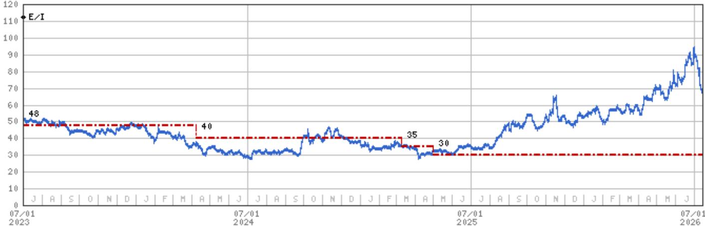
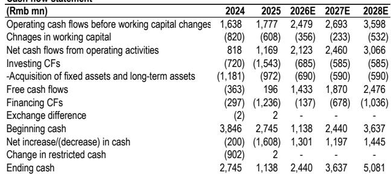
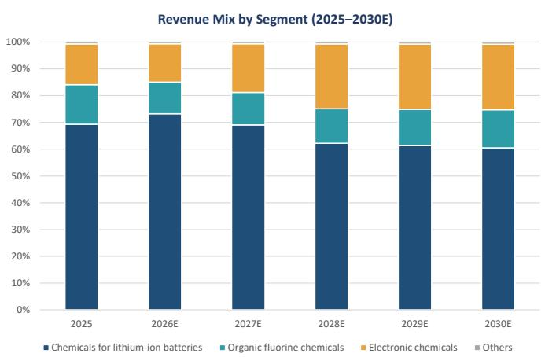

# Capchem's Earnings Engine Is Shifting from Batteries to Chips, and the Market Has Not Yet Priced the Full Upside

Shenzhen Capchem Technology, a Chinese specialty chemicals manufacturer, is undergoing a structural transformation that most observers are underestimating. The company's earnings growth over the next two years will be driven not by its legacy battery electrolyte business, but by a rapidly scaling electronic chemicals segment that supplies high-purity wet chemicals, etching solutions, and cooling fluids to semiconductor fabrication plants. A global research report from July 2026 projects that Capchem's net profit will rise from approximately RMB 2.2 billion in 2026 to roughly RMB 3.0 billion in 2028, a compound annual growth rate of about 17%. The critical insight, however, is not the headline growth number but the composition of that growth.

In 2026, the majority of earnings expansion still comes from the electrolyte business, as profitability in the acquired LiPF6 operation recovers. But that recovery is fragile. Significant new LiPF6 capacity additions are expected to begin in the second half of 2026, which will likely compress margins and make the electrolyte earnings improvement unsustainable. The market's focus on 2026 earnings, therefore, misses the real story. The valuation driver beyond 2026 is electronic chemicals, which the company expects to grow at a 40-50% CAGR from 2026 to 2028. This segment's contribution to total gross profit is projected to rise from 30% in 2025 to approximately 40% in 2028.

The case for Capchem is not about a cyclical recovery in electrolytes. It is about a structural shift in the company's earnings composition toward a higher-growth, higher-margin, and higher-multiple business that is directly tied to China's semiconductor self-sufficiency drive. The report upgrades the target to RMB 30. This 3x increase in the target reflects a fundamental re-rating of the business, not just a roll-forward of earnings.

## The Electrolyte Recovery in 2026 Is Real but Temporary, and the Market Should Not Anchor on It

Capchem's battery electrolyte business will deliver strong earnings growth in 2026. The report forecasts that electrolyte sales volume will jump 37% year-over-year, while gross profit per ton nearly doubles from RMB 1,350 in 2025 to RMB 2,600 in 2026. This recovery is driven by improving profitability in the company's LiPF6 and additive products, which had been depressed. The electrolyte segment's gross profit is expected to reach RMB 1.9 billion in 2026, up 163% from the prior year.

This improvement is not sustainable. The report explicitly notes that significant LiPF6 capacity additions are scheduled to begin in the second half of 2026. In a market where pricing is highly transparent, new supply will compress margins. The report forecasts that electrolyte gross profit per ton will decline 31% in 2027 to RMB 1,800, and that the segment's total gross profit will fall 17% year-over-year. By 2028, electrolyte revenue is projected to be slightly below 2026 levels.

The strategic implication is clear: those who focus on the 2026 electrolyte rebound will be buying into a peak that is about to reverse. The market has already begun to look past 2026 earnings, which is why the report rolls its valuation forward to 2027 estimates. The electrolyte business will remain a cash generator, but it will no longer be the growth engine. The report values this segment at 15x 2027 P/E, in line with peers like Tinci and Do-Fluoride, reflecting the transparent pricing and competitive dynamics of the market.

## Electronic Chemicals Are the Real Growth Story, and the Valuation Multiple Should Reflect That

The electronic chemicals segment is the centerpiece of Capchem's transformation. The company supplies high-purity wet chemicals, etching solutions, and semiconductor cooling and cleaning chemicals to fabrication plants in mainland China, Korea, and Japan. The segment's sales volume is projected to grow at a 40% CAGR from 2026 to 2028, reaching 225,000 tons. Revenue is expected to rise from RMB 2.1 billion in 2026 to RMB 4.3 billion in 2028, a 44% compound annual growth rate.

More important than volume growth is margin expansion. The report forecasts that electronic chemicals gross profit per ton will increase from RMB 8,800 in 2026 to RMB 9,500 in 2027 and remain at that level in 2028. Gross margins in this segment are projected to improve from 48% in 2026 to 50% in 2028. This combination of volume growth and stable-to-improving margins means that electronic chemicals gross profit will grow from RMB 1.0 billion in 2026 to RMB 2.1 billion in 2028, a 48% CAGR. By 2028, this single segment will account for roughly 39% of total company gross profit, up from 30% in 2025.

The report values this business at 40x 2027 P/E, up from 25x previously. This re-rating is supported by the strong market sentiment in the China semiconductor materials space. The report cites that peer valuations have expanded significantly year-to-date; for example, Haohua's forward P/E rose from 23x at the start of 2026 to 35x. Capchem's electronic chemicals business deserves a premium because it has a more advanced product portfolio and is a direct beneficiary of import substitution in semiconductor materials. The report's 40x multiple is not aggressive relative to the growth profile and the market environment.

## Fluorine Chemicals Provide a High-Margin Anchor That Supports the Overall Valuation

Capchem's organic fluorine chemicals business is often overlooked, but it plays a crucial role in the overall valuation story. This segment focuses on high-end fluorine chemicals, and its gross profit margin exceeds 60%, compared with approximately 25-30% for peers like Haohua and Juhua. The report forecasts that fluorine chemicals revenue will grow at a 14-15% CAGR from 2026 to 2028, with stable gross profit margins around 61-63%.

The report values this segment at 30x 2027 P/E, up from 15x previously. This premium over peers is justified by the superior margin profile. The report notes that domestic fluorine chemical players with exposure to semiconductor materials have seen their valuations expand significantly year-to-date, providing further support for the higher multiple. While fluorine chemicals are not the primary growth driver, they provide a stable, high-margin earnings base that reduces the overall risk profile of the company.

## A Decision Framework: How to Evaluate Capchem's Risk-Reward at Current Levels

For those considering Capchem at its current price of RMB 69.25, the key question is whether the market is correctly pricing the earnings shift. The report's sum-of-the-parts valuation provides a framework for thinking about the upside. The electrolyte business, valued at 15x 2027 estimated earnings of roughly RMB 2.25 per share from that segment, contributes about RMB 34 to the target. The fluorine chemicals business, valued at 30x its estimated 2027 earnings of roughly RMB 0.60 per share, contributes about RMB 18. The electronic chemicals business, valued at 40x its estimated 2027 earnings of roughly RMB 0.90 per share, contributes about RMB 36. Other businesses and corporate adjustments account for the remainder, yielding a total target of RMB 93.

The critical variable in this framework is the electronic chemicals multiple. If the market continues to re-rate semiconductor materials names upward, the 40x multiple could prove conservative. Conversely, if the semiconductor cycle turns or import substitution progress slows, the multiple could compress. The report's base case assumes that the electronic chemicals segment will deliver on its 40% volume CAGR, which is a demanding but achievable target given the company's existing customer relationships and the policy tailwinds for domestic semiconductor supply chains.

The second variable is the electrolyte business. The report assumes that gross profit per ton will stabilize at RMB 1,800 in 2027-2028 after the 2026 peak. If the LiPF6 capacity additions are more aggressive than expected, margins could fall further, reducing the electrolyte segment's contribution. However, since this segment is valued at only 15x earnings and its contribution to total profit is declining, even a 20% downside in electrolyte earnings would have a limited impact on the overall target.

The third variable is the fluorine chemicals multiple. The report's 30x multiple is based on the segment's superior margins and the re-rating of semiconductor-exposed fluorine chemical peers. If peer multiples contract, Capchem's fluorine chemicals valuation could also compress. But given the segment's high margins and stable growth, it provides a floor for the overall valuation.

The most important insight from this framework is that the electronic chemicals segment is the swing factor. If it delivers on its growth trajectory, the stock has meaningful upside to the RMB 93 target. If it disappoints, the downside is limited by the stable fluorine chemicals business and the low-multiple electrolyte business. The risk-reward is asymmetric in favor of the bull case.

*For informational purposes only. Portions may be generated, translated, summarized, or edited with AI assistance based on source materials and may contain omissions or errors. Please verify independently. This is not professional advice.*

For informational purposes only. Portions may be generated, translated, summarized, or edited with AI assistance based on source materials and may contain omissions or errors. Please verify independently. This is not professional advice.

