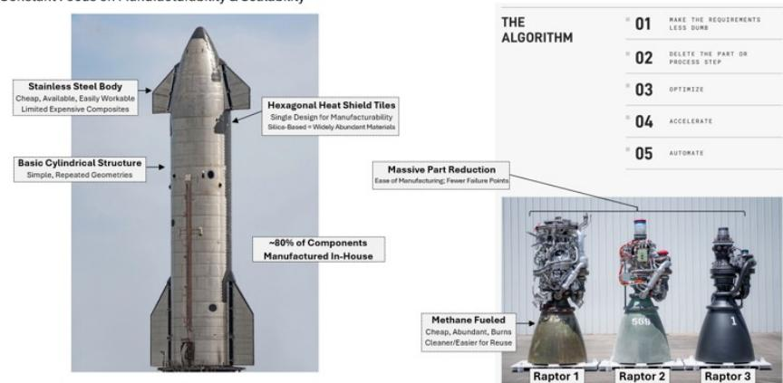
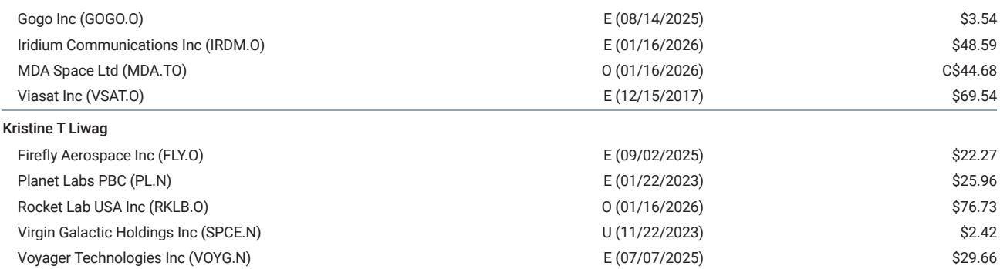
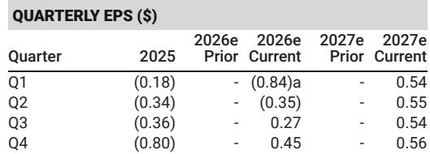

# SpaceX Is Not a Launch Company;It Is a Dimensionality Machine That Reshapes the Economics of AI Infrastructure

The most valuable company in the space industry does not derive its competitive advantage from rockets. A global research report that initiated coverage on SpaceX in July 2026 with an Overweight rating attributes just over half the total valuation—to Enterprise AI alone. Launch services account for a mere $8. That allocation is not a speculative bet. It reflects a structural reality:SpaceX has built an operational model that compresses time-to-power for AI infrastructure from years to weeks,and it is doing so by integrating capabilities that no other technology company has attempted to combine under one roof.

The report frames this advantage through a framework it calls DVFS:Dimensionality,Verticality,Flexibility,and Speed. These four attributes,taken together,describe a company that does not merely compete within existing industry boundaries but redraws them. For strategists and observers evaluating the intersection of space and AI,the critical insight is not that SpaceX builds its own rockets. It is that SpaceX treats every bottleneck in the AI value chain—from natural gas turbines to printed circuit boards to semiconductor fabrication—as an internal engineering problem rather than a supply-chain dependency. That mindset,executed at scale,creates a compound advantage that is difficult to replicate and easy to underestimate.

The timing matters. The report values SpaceX using a 2040 terminal year,a horizon that extends well beyond typical equity modeling. That long-dated framework is appropriate because the company's core thesis is not about capturing market share in existing categories. It is about enabling categories that do not yet exist. The report's $300 target implies a 0.41 EV/EBIT/Growth multiple,a figure that suggests the market has not yet priced in the compounding effects of vertical integration on cost and speed. The gap between the current share price of $139.14 and the target is not a forecast of short-term earnings momentum. It is a bet on organizational architecture.

## The most underappreciated dimension is not speed but dimensionality:SpaceX operates across more technical domains than any comparable industrial firm

The report defines dimensionality as "polymathic ability that spans a wide range of capability." In practice,this means SpaceX is simultaneously a launch provider,a satellite manufacturer,a communications network operator,a data center builder,a power infrastructure developer,and an emerging semiconductor fabricator. Each of these domains would be a standalone business for any other company. For SpaceX,they are interconnected layers of a single system designed to reduce the cost and increase the reliability of moving compute into orbit and powering it once it arrives.

Consider the causal chain. Lowering the cost of mass to orbit,measured in dollars per kilogram,unlocks the economic viability of space-based AI infrastructure. But that infrastructure requires satellites with onboard compute,which require data relay back to Earth. Starlink provides that relay. The satellites themselves need solar cells,electronics,and communications hardware—all of which SpaceX now manufactures in-house at its Bastrop,Texas facility,which the report identifies as the largest printed circuit board manufacturing plant in the United States. The company is building an 11-million-square-foot "Gigasat" factory in the same location,targeting production equivalent to 1 gigawatt of orbital AI compute annually by late 2027.

Dimensionality creates ecosystem value that a single-purpose competitor cannot match. A dedicated satellite manufacturer cannot lower its launch costs. A launch provider cannot redesign the satellite to reduce mass. A network operator cannot optimize the ground segment. SpaceX can do all three simultaneously because the same engineering organization owns every layer. The report's valuation reflects this:the Connectivity segment,driven by Starlink,accounts for a significant portion of the overall value. It is the communications backbone for an AI architecture that spans terrestrial and orbital compute.

## Vertical integration is not about cost savings;it is about removing the single most binding constraint on AI infrastructure deployment

The report states that 80 percent of Starship is made in-house. That statistic is impressive but misleading if interpreted narrowly. The more consequential vertical integration story is happening outside the rocket. SpaceX manufactures Starlink satellites and user terminals,builds ground infrastructure,produces battery systems,and is expanding into propellant production. It is breaking ground on a foundry to manufacture vanes and blades for natural gas turbines. It is planning,jointly with Tesla,a semiconductor fabrication project called Terafab that the report describes as encompassing chip fabrication,lithography,memory,packaging,and testing with a target of producing 1 terawatt of chips per year.

Each of these moves targets a specific bottleneck. The report identifies the natural gas combined-cycle turbine as the top impediment to time-to-power for terrestrial AI. Within that turbine,the supply of vanes and blades is the key constraint. SpaceX is not building a foundry to save money on turbine components. It is building a foundry because the global supply chain for those components cannot deliver at the scale and speed that SpaceX's AI infrastructure plans require. The same logic applies to semiconductors. The Terafab project is not a diversification play. It is a recognition that the existing chip supply chain,optimized for consumer electronics and general-purpose computing,cannot meet the power density and reliability requirements of gigawatt-scale AI clusters operating in space.

This approach flips the conventional make-versus-buy analysis. Most companies verticalize to capture margin or ensure quality. SpaceX verticalizes to eliminate dependencies that would otherwise determine its timeline. When the report notes that SpaceX can bring a hundred-megawatt-scale data center online in 90 days—roughly eight times faster than industry benchmarks—the speed advantage is not a function of better project management. It is a direct result of owning the turbine supply,the power electronics,the construction capability,and the grid interconnection process. The company does not use general contractors for data center construction. It does the work internally. That is not a cost decision. It is a time decision.

## Flexibility is not a cultural attribute;it is a structural hedge against technological and market uncertainty

The report defines flexibility as the "ability to learn and pivot from mistakes." But the evidence suggests something more systematic. SpaceX's approach to flexibility is built into its asset base. Gigawatt-scale compute clusters can be sold in a neocloud model to third-party AI labs. The same clusters can be shifted to internal model training as the company's AI capabilities scale. They can also be redeployed to end-to-end enterprise AI applications as the Cursor platform grows.

This optionality is not accidental. It is a deliberate design choice that reflects the uncertainty inherent in AI infrastructure development. Demand for compute is growing rapidly,but the specific configuration of that demand—training versus inference,terrestrial versus orbital,proprietary versus third-party—remains unclear. A single-purpose data center built for one use case becomes stranded if demand shifts. SpaceX builds clusters that can serve multiple masters. The neocloud model provides near-term revenue from external customers. Internal training provides a pathway to proprietary AI capabilities. Enterprise AI provides a long-term growth vector independent of both.

The report's valuation reflects this optionality. The Enterprise AI segment,valued at $152 per share,carries a 50 percent execution-risk discount. That discount acknowledges the uncertainty but also implies that the base case already prices in a significant probability of failure. The upside case,in which the neocloud model scales,Cursor accelerates,and enterprise adoption broadens,is not priced in at all. Flexibility means SpaceX can pursue multiple paths simultaneously without committing to any single one prematurely. For observers,that reduces the binary risk that typically accompanies early-stage infrastructure plays.

## Speed is not about moving fast;it is about matching velocity to mission,and that capability is a product in itself

The report makes a crucial distinction:speed in the DVFS framework does not always mean fastest. It means the ability to toggle strategy and execution to the correct velocity at the right time. In some situations,that requires moving faster than competitors. In others,it requires deliberate slowness. The key is dynamic matching of velocity to mission.

The example of data center construction illustrates the point. Industry benchmarks for bringing a 100-megawatt-scale cluster online approach two years. SpaceX does it in 90 days. That is not a marginal improvement. It is an order-of-magnitude change that fundamentally alters the economics of AI infrastructure deployment. A company that can stand up compute capacity in a quarter instead of eight quarters can capture demand windows that competitors miss. It can also iterate on design and architecture at a pace that incumbents cannot match.

But speed also applies to the launch side. The report notes that SpaceX's ability to move "an order of magnitude faster than competitors" is contextual. Starship development has followed a rapid-test-and-iterate cadence that has produced failures alongside successes. The flexibility to learn from those failures without losing momentum is itself a form of speed. A company that can absorb a launch failure,diagnose the root cause,implement a fix,and return to flight in weeks rather than months has a compounding advantage that grows with each iteration.

For strategists evaluating competitive dynamics,the implication is clear:speed is not a tactical advantage but a structural one. It compresses learning cycles,reduces capital-at-risk per iteration,and increases the probability of being first to market with new capabilities. In a domain where the technology roadmap is uncertain and the competitive landscape is shifting,the ability to learn faster than rivals is the only durable moat.

## A decision framework for evaluating SpaceX:assess the company through the lens of bottleneck ownership,not market share

The report's DVFS framework provides a lens for analysis,but the practical question for strategists and observers is how to translate these attributes into a decision framework. The most useful approach is to evaluate SpaceX not by its revenue or market share in any single category but by its ownership of the binding constraints in the AI infrastructure value chain.

Start with the bottleneck map. The path from raw energy to usable AI compute involves multiple constrained stages:power generation,power conversion,compute hardware,networking,cooling,and deployment. At each stage,the existing supply chain is either capacity-constrained,reliability-constrained,or time-constrained. SpaceX's vertical integration strategy targets the most binding constraint at each stage. The turbine foundry addresses power generation. The Terafab addresses compute hardware. The Gigasat factory addresses deployment. The in-house construction capability addresses time-to-power.

The decision framework is straightforward. For each bottleneck,ask three questions. First,does SpaceX own the critical component or capability in-house? Second,does that ownership reduce the time-to-market for the end product relative to competitors? Third,does the capability create optionality across multiple use cases or revenue streams? If the answer to all three is yes,the capability is likely to generate compounding returns. If the answer to any is no,the capability may be a cost center rather than a strategic asset.

Apply this framework to the report's valuation. The Space segment,valued at $8 per share,is the smallest component. That is not because launch is unimportant. It is because launch,while necessary,is not the binding constraint. The Connectivity segment,at $128,is larger because Starlink provides the communications layer that enables orbital AI. The Enterprise AI segment,at $152,is the largest because it represents the end market. But the true value lies in the integration. A launch provider alone is worth $8. A launch provider that also owns the network,the compute hardware,the power infrastructure,and the deployment capability is worth $300.

The risk to this thesis is execution. The report applies a 50 percent discount to the Enterprise AI valuation,acknowledging that the technology roadmap is unproven and the market is nascent. The downside risks listed in the report—slower Starship reuse cadence,weaker enterprise AI monetization,higher capital expenditure per watt of compute,longer time-to-power,regulatory delays—are real. But they are also the same risks that apply to any company attempting to create a new market. The difference is that SpaceX has already demonstrated the ability to overcome similar risks in launch and connectivity. The question is whether that pattern holds for AI.

The report's answer is yes,and the valuation reflects that conviction. For readers evaluating the thesis independently,the framework provides a structured way to test the assumptions. Monitor the progress of the Gigasat factory. Track the timeline for the turbine foundry. Watch for signs that the neocloud model is gaining enterprise traction. Each data point will either confirm or challenge the central argument:that SpaceX's organizational architecture,not any single product,is the source of its competitive advantage.

*For informational purposes only. Portions may be generated,translated,summarized,or edited with AI assistance based on source materials and may contain omissions or errors. Please verify independently. This is not professional advice.*

For informational purposes only. Portions may be generated,translated,summarized,or edited with AI assistance based on source materials and may contain omissions or errors. Please verify independently. This is not professional advice.

