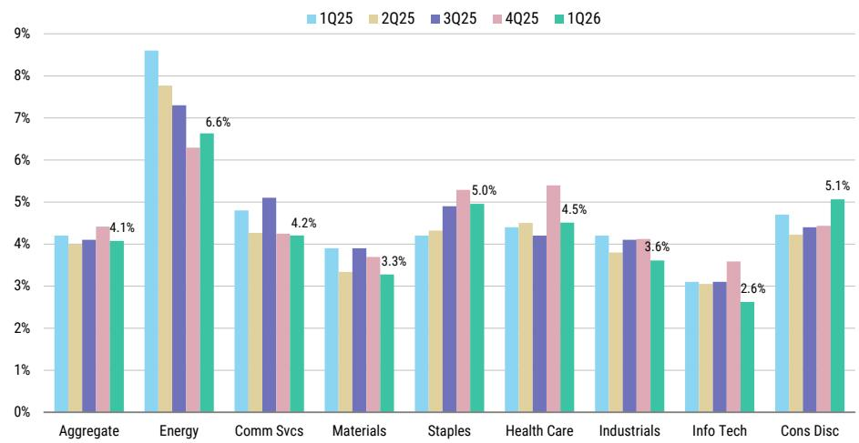
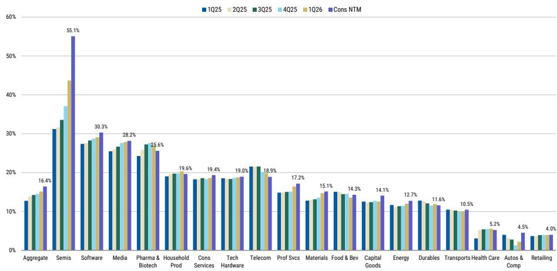
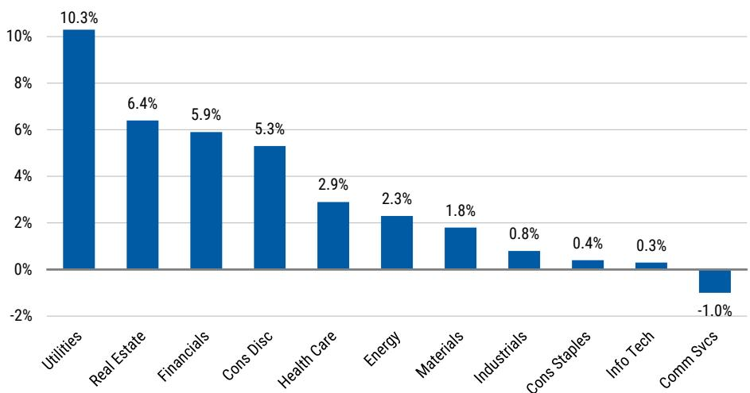

# US Companies Are Turning Record Cash Into Growth Spending, Not Shareholder Payouts, and That Changes the Risk Profile of the Market

The Russell 1000 cash balance now stands at $2.3 trillion, yet the cash-to-enterprise-value ratio has fallen to 3.3%, its lowest level in two decades. Free cash flow yield has simultaneously dropped to 2.6%, also a 20-year low. These two statistics, taken together, reveal something more consequential than a simple liquidity snapshot: US companies are making an aggressive, collective bet that deploying cash into capital expenditures will generate higher returns than returning it to shareholders. For observers, this shift rewrites the conventional playbook for portfolio construction and risk assessment.

The tension in the data is unmistakable. Operating cash flows rose 20.6% year-over-year to $3.0 trillion, while capital expenditures surged 27.1% to $1.3 trillion. Companies are earning more and spending even more on long-term assets. The result is that free cash flow, while still enormous in absolute terms at $1.7 trillion, is shrinking relative to enterprise value. The market is effectively paying a premium for the right to own companies that are reinvesting heavily, not ones that are hoarding cash or maximizing distributions.

This is not a development. The strategic choices companies make with their cash today will determine which sectors and which individual firms emerge stronger from the current cycle. The data from the first quarter of 2026 provides a clear, sector-level map of where management teams see the highest returns on investment. The information technology, consumer discretionary, and communication services sectors alone roughly 64% of all non-financial, non-utility Russell 1000 cash. These are also the sectors where capex growth is most pronounced. The pattern is not accidental.

The implications for equity observers are twofold. First, the traditional signal of a low cash-to-EV ratio as a warning of overvaluation may need recalibration when that cash is being deployed into high-return projects rather than sitting idle. Second, the dispersion in cash management strategies across sectors creates a differentiation opportunity. Companies that can generate strong free cash flow growth while maintaining balance sheet discipline are likely to offer better downside protection in a correction. The report identifies a specific set of large-cap names that meet these criteria, and understanding why they qualify is essential.

## The Collapse of the Cash-to-Enterprise-Value Ratio Reflects a Structural Shift Toward Growth Capex, Not Financial Distress

At 3.3%, the cash-to-EV ratio for the Russell 1000 is at its lowest point in twenty years. A casual observer might interpret this as a sign that corporate liquidity is deteriorating. The data does not support that conclusion. Cash balances grew to $2.3 trillion, an increase from the prior quarter. Operating cash flows expanded at a 20.6% annual rate. The ratio is declining because enterprise values are growing faster than cash balances, and enterprise values are growing because companies are spending heavily on assets that increase their productive capacity.

Consider the composition of the cash holdings. Information Technology accounts for 29.9% of the total, Consumer Discretionary for 18.8%, and Communication Services for 15.4%. These are not cash-burning industries. They are sectors where the marginal dollar invested in R&D, data centers, software platforms, or supply chain infrastructure has historically produced returns above the cost of capital. The report shows that consensus expects NTM margins to reach approximately 16.4%, and the sectors with the largest expected margin expansion are Semiconductors and Semiconductor Equipment at plus 1100 basis points, Automobiles and Components at plus 230 basis points, and Capital Goods at plus 150 basis points. These are precisely the sectors where capex intensity is highest.

The strategic implication is that observers should not treat the low cash-to-EV ratio as a warning signal for the market as a whole. Instead, they should evaluate whether the companies in their portfolios are deploying cash into investments with a clear line of sight to revenue growth and margin expansion. Companies that are spending on growth but failing to generate corresponding improvements in free cash flow will eventually face a valuation reckoning. Those that succeed will see their enterprise values continue to rise, further compressing the ratio but validating the strategy.

## Free Cash Flow Yield at a 20-Year Low Creates a Two-Tiered Market Between Self-Financing Growers and Stretched Balances

The free cash flow yield for the Russell 1000 fell to 2.6%, another 20-year low. This is a more concerning metric than the cash-to-EV ratio because it directly reflects the cash available for shareholder returns after all operating and investment needs are met. A yield this low means that observers are paying roughly 38 times free cash flow for the average large-cap stock. In any historical context, that is an expensive market.

Yet the aggregate number masks a critical divergence. The report identifies a universe of companies with fortress balance sheets, defined by a cash-to-EV ratio above 5%, positive free cash flow growth over the next two years, return on invested capital above 10%, a current ratio above 1.0x, debt-to-equity below 2.5x, and investment-grade credit ratings. These are self-financing businesses that do not depend on capital markets to fund their growth or service their debt. Names such as Airbnb, Nike, Newmont, Intuit, Medtronic, Edwards Lifesciences, Vertex Pharmaceuticals, Hewlett Packard Enterprise, Ross Stores, and Datadog appear on this list. These companies have the financial flexibility to withstand a prolonged market correction or a downturn in the economy.

On the other side of the ledger, the report flags companies with potential near-term refinancing needs. These are firms with market capitalizations above $10 billion that may face higher interest costs when their existing debt matures. The list includes Clorox, Bunge, Phillips 66, Mid-America Apartment Communities, Archer-Daniels-Midland, Camden Property Trust, Stanley Black & Decker, McCormick, EchoStar, Super Micro Computer, Ryder System, Crown Holdings, Genuine Parts, and SBA Communications. For these companies, the falling interest rate environment has provided some relief, but the report notes that every sector except Communication Services increased its debt levels over the past quarter, with Utilities, Real Estate, Financials, and Consumer Discretionary showing the largest year-over-year increases.

The decision framework for observers is straightforward. Companies that generate strong free cash flow growth and maintain low leverage are better positioned to increase shareholder returns or continue investing through a cycle. Companies that are adding debt while their free cash flow yield compresses are taking on financial risk that may not be fully priced into their equity valuations.

## Total Shareholder Return Is Rising, but the Composition Is Shifting From Buybacks Toward Dividends, Signaling a Change in Management Confidence

Total shareholder return, defined as net buybacks plus dividends, reached $2.0 trillion in the first quarter of 2026, up 2.8% quarter-over-quarter and 8.0% year-over-year. Within that total, dividends accounted for $800 billion and net buybacks for $1.2 trillion. The ratio of buybacks to dividends is roughly 1.5 to 1, which is consistent with the long-term preference for buybacks as a more flexible return mechanism.

However, the sector-level data reveals a more nuanced picture. Semiconductors and Semiconductor Equipment showed increases in both dividends and buybacks. Banks, Diversified Financials, Insurance, and Real Estate all increased both forms of shareholder return. In contrast, Automobiles and Components, Consumer Durables, Consumer Staples, Energy, and Media reduced buybacks. The sectors that are cutting buybacks are also the ones where capex demands are highest or where cash generation is under pressure.

This divergence matters because buybacks and dividends send different signals about management's confidence in the future. A company that increases its dividend is making a long-term commitment that it expects to sustain. A company that buys back stock is signaling that it believes its shares are undervalued or that it has excess cash with no better use. The fact that buybacks are declining in capital-intensive sectors while rising in financials and technology suggests that management teams in growth-oriented industries see better returns from internal investment than from repurchasing their own stock.

The report lists companies with a total shareholder return of at least 7.5%, including large-cap names such as Accenture, Salesforce, Citi, Wells Fargo, Truist Financial, General Motors, Johnson Controls, and BofA. For income-oriented observers, these are the names that combine a meaningful yield with a demonstrated commitment to returning cash. For growth-oriented observers, the more important signal is which companies are choosing not to return cash and instead investing it in the business.

## The Cash Conversion Cycle Is Slowing, and the Cause Is Inventory, Not Receivables, Pointing to a Specific Operational Risk

The cash conversion cycle for the Russell 1000 now stands at 84 days, an increase of one day quarter-over-quarter. The report attributes this slowdown entirely to less favorable days inventory outstanding. This is a critical distinction. A slowdown caused by customers paying later would signal weakening demand or deteriorating credit conditions. A slowdown caused by inventory building suggests that companies are choosing to more stock, either in anticipation of higher demand or as a buffer against supply chain disruptions.

The sector-level data supports the interpretation that inventory buildup is strategic rather than forced. The sectors with the strongest cash conversion cycle improvements are likely those that have managed their supply chains most effectively. The sectors with the weakest cycles are those where inventory is piling up faster than sales. The report provides specific screening criteria for identifying companies with the strongest and weakest cash conversion cycles, as well as those with the largest year-over-year changes.

For observers, the cash conversion cycle is a leading indicator of working capital efficiency. A company that can generate sales growth without tying up increasing amounts of cash in inventory is generating higher quality free cash flow. A company that is building inventory faster than sales growth is consuming cash that could otherwise be returned to shareholders or invested in growth. The one-day increase in the aggregate cycle is small, but it bears watching. If inventory continues to build in subsequent quarters, it will put additional pressure on free cash flow yields that are already at historic lows.

## A Decision Framework for Allocating Capital in a Low-Yield, High-Capex Environment

The data from the first quarter of 2026 provides a clear set of criteria for evaluating which companies are managing their cash effectively and which are not. Observers should apply the following framework to their portfolios.

First, measure free cash flow growth relative to capex growth. Companies where free cash flow is growing at least as fast as capital expenditures are generating a return on their investment. Companies where capex is growing faster than free cash flow are placing a bet that future revenues will justify the spending. That bet may pay off, but it introduces uncertainty that should be reflected in the valuation multiple.

Second, examine the cash conversion cycle trend. A company that is reducing its cash conversion cycle while growing revenue is becoming more operationally efficient. A company where the cycle is lengthening due to inventory buildup needs to explain why that inventory is necessary and when it will convert to cash.

Third, compare total shareholder yield to the cost of capital. Companies that are returning cash to shareholders while earning returns above their cost of capital are creating value. Companies that are borrowing to fund buybacks or dividends while earning returns below their cost of capital are destroying value, even if the absolute level of shareholder returns looks attractive.

Fourth, assess refinancing risk. The report identifies a specific set of companies with near-term debt maturities. For these names, the relevant question is whether operating cash flow can cover both interest expense and the refinancing needs. If the answer is no, the company is dependent on capital markets access, which can disappear quickly in a downturn.

Fifth, look for companies that score well on both the fortress balance sheet screen and the free cash flow growth screen. The intersection of these two lists contains the names that have the financial strength to withstand a correction and the growth trajectory to generate returns in an expansion. The report names Ford, Hewlett Packard Enterprise, DoorDash, Nike, Newmont, Amgen, Datadog, Edwards Lifesciences, Medtronic, and Airbnb as large-cap companies with expected strong free cash flow growth. Several of these also appear on the fortress balance sheet list.

The overarching insight is that the market is rewarding companies that invest aggressively, but it is also pricing in a narrow path to success. If the expected margin expansion does not materialize, or if the inventory buildup proves to be a sign of weakening demand rather than strategic positioning, the companies that have stretched their balance sheets will face a double penalty: lower cash flows and higher financing costs. The companies that have maintained discipline while still investing will have the flexibility to acquire assets, hire talent, or increase shareholder returns at precisely the moment when their competitors are forced to retreat.

*For informational purposes only. Portions may be generated, translated, summarized, or edited with AI assistance based on source materials and may contain omissions or errors. Please verify independently. This is not professional advice.*

For informational purposes only. Portions may be generated, translated, summarized, or edited with AI assistance based on source materials and may contain omissions or errors. Please verify independently. This is not professional advice.

