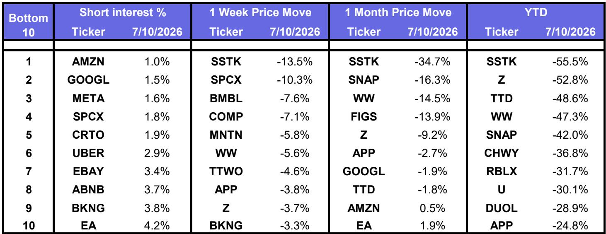
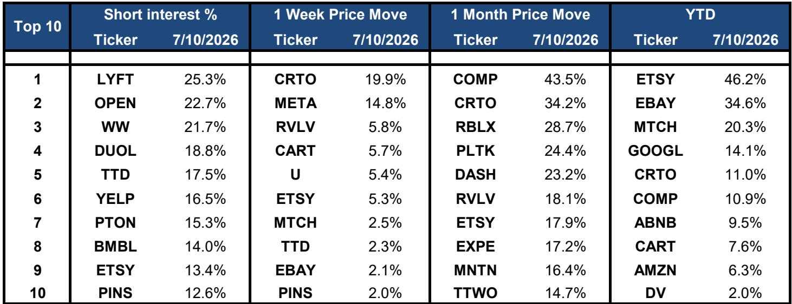
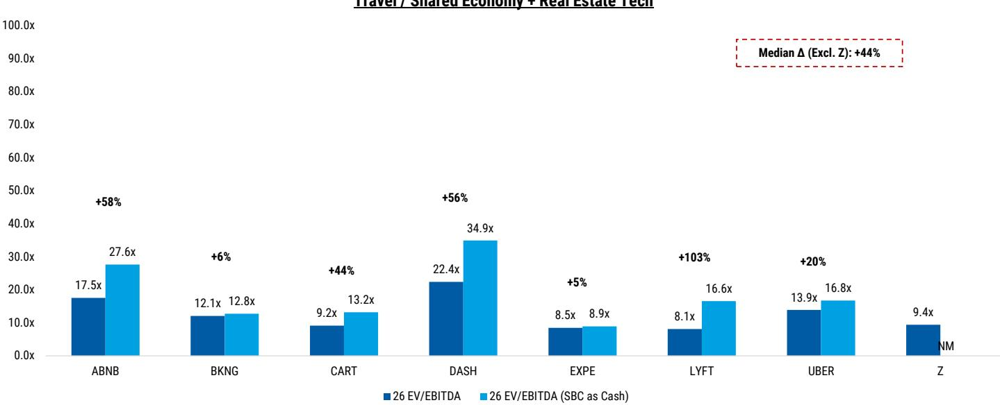

# MS：EPS与AI与ROICWhereAreWe

一份来自MS的北美互联网板块估值快照，在财报季前夕发布，核心信号清晰：市场正在用AI投入回报率重新给公司定价。截至7月10日，META单周上涨14.8%，而GOOGL下跌0.8%，两者2026年预期市盈率分别为20倍和24倍，均低于各自过去12个月均值。这份报告不是宏观展望，而是一张定价对比表——它揭示的规律是，资本开支转化为收入的能力，正在取代用户增长成为估值锚点。

报告覆盖了数字广告、电商、共享宏观环境、游戏、旅行和房地产科技六个子板块，共40余家公司。最值得关注的不是单个公司的涨跌，而是板块间的定价差异：数字广告板块市值加权周涨幅3.6%，旅行板块下跌1.7%，电商板块仅涨1.1%。这种分化背后，是市场对AI资本开支转化效率的预期差。

## 1. META与GOOGL的估值差，反映的是AI货币化路径的清晰度差异

两家公司同属数字广告巨头，但市场给出的定价逻辑截然不同。META当前20倍2026年预期市盈率，较其过去12个月均值折价15%；GOOGL 24倍，折价8%。报告没有直接解释原因，但从估值压缩幅度看，市场对META的AI投入回报预期更为乐观。META的AI工具在广告定向和内容提到上的应用已产生可量化的收入增量，而GOOGL的AI货币化仍更多停留在搜索体验改善层面，尚未转化为明确的广告收入加速信号。

> **KC评论：** 估值折价幅度本身就是一个信号。META折价更深，意味着市场认为其AI投入的回报确定性更高，因此愿意给予更低的“不确定性折价”。GOOGL折价较浅，说明市场仍在等待其AI货币化的具体证据。

## 2. 旅行板块的估值压缩，提示AI叙事尚未渗透到线下服务型平台

旅行板块三家公司——ABNB、BKNG、EXPE——市值加权周跌幅1.7%，是相对少见整体下跌的子板块。BKNG单周下跌3.3%，其2026年预期市盈率17.3倍，在板块中处于中位。这类平台的核心资产是供应链关系和用户习惯，AI对其运营效率的提升更多体现在后台（动态定价、客服自动化），而非直接驱动收入增长的新产品。市场目前对这类“AI间接受益者”的定价，尚未给予溢价。

## 3. 共享宏观环境板块的估值中位数，揭示了一个被忽视的观察框架

共享宏观环境板块（UBER、DASH、CART、LYFT）的市值加权周涨幅仅0.4%，但板块中位数估值（2026年预期EV/EBITDA为11.5倍）显著低于数字广告（9.5倍）和电商（10.7倍）。这组对比值得注意：共享宏观环境平台的单位宏观环境模型正在改善，但市场仍按“高资本消耗”逻辑定价。报告中的估值表显示，UBER和DASH的2027年预期EV/EBITDA分别为11.1倍和16.6倍，压缩幅度大于同行。这意味着，如果这些公司能在即将发布的财报中证明自由现金流持续改善，估值重估的空间可能比数字广告公司更大。

## 4. 短期利率数据指向一个被低估的不确定性：高做空比例集中在中小市值公司

报告列出了各公司的做空比例。LYFT以25.3%居首，DUOL 18.8%，TTD 17.5%，PINS 12.6%。这些公司市值普遍在100亿至500亿美元之间，属于中型互联网公司。高做空比例本身不是不确定性信号，但它意味着这些公司的报价对财报超预期或低于预期的敏感度更高。在AI投入回报率成为核心叙事的环境下，中小市值公司一旦无法证明其AI投入的转化效率，做空不确定性可能迅速放大。

> **KC评论：** 做空比例是市场分歧的量化表达。高做空比例的公司，财报后报价波动幅度通常更大。对于关注这些公司的读者，需要同时关注其AI投入的披露细节和自由现金流的实际走向，而非仅看收入增速。

这份报告的价值不在于给出研究交流，而在于提供了一套可复用的观察框架：用估值折价幅度、板块间定价差异和做空比例三个维度，交叉验证市场对AI投入回报率的预期。财报季即将到来，这些数据将成为检验预期是否合理的标尺。

For informational purposes only. Portions may be generated,translated,summarized,or edited with AI assistance based on source materials and may contain omissions or errors. Please verify independently. This is not investment,legal,tax,accounting,or other professional advice.

For informational purposes only. Portions may be generated,translated,summarized,or edited with AI assistance based on source materials and may contain omissions or errors. Please verify independently. This is not investment,legal,tax,accounting,or other professional advice.

