July 14, 2026 04:01 PM GMT

Asia Economics | Asia Pacific

# The Viewpoint: 10 questions about BoJ policy outlook

Most observers expect a faster pace of adjustments to a higher terminal rate, citing inflation concerns. However, we believe inflation has been driven by FX and supply-side issues, not demand. While the economy is recovering, a more measured pace of rate adjustments is still needed to nurture the reflation run.

Unpacking the BoJ policy debate: The BoJ policy outlook remains front and center in our debate with observers. We expect the BoJ to adjust next in December 2026, followed by another adjustment in June 2027, bringing the policy rate to 1.5%. This compares with the market pricing of almost 1.75% by December 2027. Moreover, we get the impression from our conversations that many macro observers expect a terminal rate of 2% or higher.

In contrast, our policy rate forecasts through this cycle have been and remain lower than what the market has been pricing in. The main reason is our belief that inflation in Japan so far has been driven mainly by FX and supply-side issues. While demand is improving, we don't see it generating enough inflationary pressures that warrant the faster pace of adjustments that observers are expecting.

In this report, we explain our thoughts on Japan's monetary policy outlook, our framework on how to assess Japan's inflation data, the BoJ's reaction function, and the roadmap of what will make BoJ adjust more/less vs. our forecasts. We do so by addressing the following top 10 questions we have been getting from observers:

MS ASIA LIMITED

Chetan Ahya
Chief Asia Economist
Chetan.Ahya@morganstanley.com +852 2239-7812

MS MUFG SECURITIES CO., LTD.
Takeshi Yamaguchi
Chief Japan Economist
Takeshi.Yamaguchi@morganstanleymufg.com +81 3 6836-5404

Masayuki Inui
Economist
Masayuki.Inui@morganstanleymufg.com +81 3 6836-5407

MS ASIA (SINGAPORE) PTE.
Derrick Y Kam
Asia Economist
Derrick.Kam@morganstanley.com +65 6834-8272

Jonathan Cheung
Economist
Jonathan.Cheung@morganstanley.com +852 2848-5652

Kelly Wang
Economist
Kelly.Wang@morganstanley.com +852 3963-0891

Sudhanshu Agarwal
Economist
Sudhanshu.Agarwal@morganstanley.com +91 22 6995-4568

Asia Summer School 2026

  
MS | RESEARCH

Preface

Observers expect faster and more rate adjustments than we do: We expect the BoJ to adjust next in December 2026, followed by another adjustment in June 2027, bringing the policy rate to 1.5% (see BoJ Watch: Change to Our BoJ Call, July 8, 2026). Markets have now almost fully priced in the December rate adjustment this year, as well as close to 90% of an additional two adjustments in 2027, to 1.75%. Moreover, from our conversations with observers, the impression that we get is that many macro observers expect a faster pace of rate adjustments and a terminal rate of 2% or higher – they believe that inflation has been persistently above target, warranting a more aggressive policy tightening.

We will walk through the top 10 questions we have been receiving from observers. Through them, we will address why we have a more cautious policy outlook than what the market is pricing in.

## 1. What explains our BoJ view?

Reasons why we expect two rate adjustments from here vs. the three that are priced in by markets: We believe that several factors support a more cautious view on the pace of rate adjustments vs. market pricing:

## 1. We are not yet convinced that underlying inflation is as strong as the BoJ argues:

I. We are not yet convinced that underlying inflation is as strong as the BoJ argues: The BoJ has flagged "a risk of underlying CPI inflation deviating upward to a level above the price stability target of 2 percent." However, we are not quite convinced – the following metrics paint a picture of still below target inflation. US-style core CPI – which strips out food and energy – has remained below 2% for an extended period and was at just 1.1%Y in May. This inflation metric has been decelerating in recent months, with more CPI components showing price declines (excluding volatile fresh food), with the share rising from 15.9% in November 2025 to 23.4% in May. The BoJ's own "underlying inflation" measures excluding institutional factors also show a more moderate picture than headline figures suggest. At the same time, core services CPI – which is most tied to wage pass-through to inflation – has also remained sluggish at 1.1%Y in May. On the inflation outlook, while Japan-style core CPI (ex-fresh food) is likely to temporarily exceed 3% in 2H 2026, we expect this inflationary wave to be smaller in scale than those seen in 2022 and 2025. In the near term, as inflation picks up, it will weigh on real wage growth and act as a headwind to private consumption.

2. Impact from rate adjustments will only be observable with a lag: Our economics team for Japan flags a possibility that lending rates linked to banks' short-term prime rates and corporate bond funding costs could rise with some lag after increases in short- and medium-term interest rates – meaning that the effects of higher interest rates on the economy may only gradually become more visible from next year onward. For instance, it is important to consider there is a high share of Japanese households with variable-rate mortgages.

3. BoJ board changes: Given the replacement of two policy board members year-to-date, and taking into account the replacement of two additional members in July 2027, we believe the hurdle for further BoJ rate adjustments is likely to rise gradually.

Exhibit 1: US-style core CPI has been decelerating in recent months and was at just 1.1%Y in May  
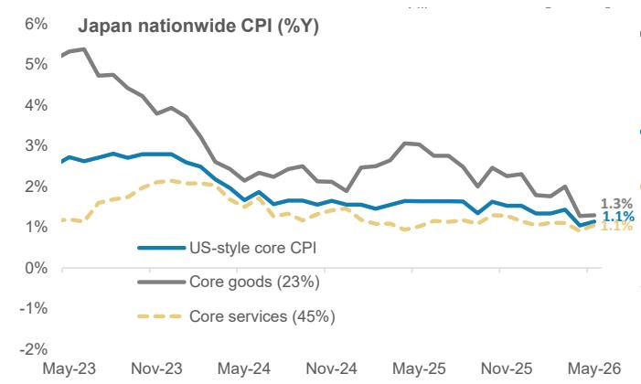  
Source: Haver, MS

Exhibit 2: The share of CPI components showing price declines has risen to 23.4% in May 2026 from 15.9% in November 2025  
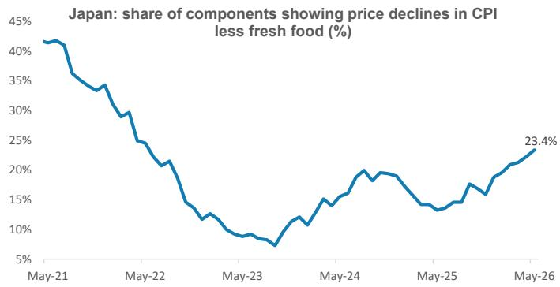  
Source: Haver, MS

# 2. Some macro observers argue that Japan's core inflation adjusted for institutional factors is already elevated at 2.7%Y – does that mean the BoJ is behind the curve?

No, we don't think so: While some observers point to inflation adjusted for institutional factors running at around $2.7\%$ YoY, we think this overstates the strength of underlying inflation. At $2.7\%$ Y in May, Japan-style core CPI excludes only fresh food items, meaning that it includes both non-fresh food and energy components and does not properly reflect underlying inflation. Both core-core inflation (excluding fresh food and energy) and US-style core inflation have moderated in a manner consistent with that signal.

We also note that the BoJ's own measure of US-style core CPI, excluding institutional factors, has recently been running at around 1.5% (1.4% in May), well below the 2.7% figure cited by some observers. More broadly, the BoJ's latest estimates of other underlying inflation (such as trend inflation) suggest that underlying inflation has risen, but several measures remain below 2%.

Exhibit 3: Japan-style core CPI includes both non-fresh food and energy components and does not properly reflect underlying inflation  
  
Source: MIC, MS

Exhibit 4: We expect US-style core CPI (ex food and energy) to average 1.5-1.6% through the next 4-5 quarters  
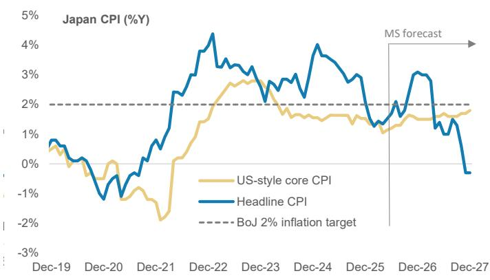  
Source: Haver, MS forecasts

# 3. What has been the key driver of Japan's persistent headline inflation in the last three years?

Currency depreciation and higher import prices have been key drivers: In our view, Japan's inflation has not been demand-driven, as reflected in the fact that real private consumption has only just recovered to pre-Covid levels after seven years. Instead, a large part of Japan's inflation story so far is tied to currency depreciation and higher import prices. More recently, the sharp rise in rice prices has provided an additional boost to headline inflation.

However, we expect these effects to fade gradually over time and therefore do not view it as the primary driver of Japan's underlying inflation trend. Real wage growth remained negative for much of the past three years, and private consumption only recently started to recover. We believe that domestic demand has had a limited role in explaining Japan's inflation experience in recent years. As a case in point, the semi-annual price revisions that were implemented in April were more modest than the BoJ had initially expected.

Analysis from the BoJ's January outlook report showed that the pass-through from exchange rate depreciation and higher import prices to CPI has risen in recent years. This reflects both higher import penetration ratios, as well as more active wage- and pricesetting behaviors of firms. The BoJ estimates that a 5% yen depreciation leads to a 0.5-0.8ppt rise in CPI in the third year.

The Bol's research also suggests that currency depreciation affects inflation not only through import-price pass-through but also through a kind of second round effect, which potentially leads to higher wages, stronger services inflation, and rising corporate profit margins. In this sense, yen depreciation has increased its importance in the recent underlying inflation trend.

Reflecting this, we believe that the BoJ's underlying rationale for rate adjustments has shifted its focus from the wage-price mechanism towards the pass-through from the Corporate Goods Price Index (CGPI) to CPI, highlighting the key driver of inflation.

We expect inflation to moderate over time: We think imported inflationary pressures in the near term will still lift headline inflation to a peak of 3.1%Y by December 2026. Import price growth in yen terms has already accelerated to 30%Y in June 2026, while the corporate goods prices (CGPI or producer price index) for June rose 7.1%Y.

But as the effects of past yen depreciation and the surge in rice prices gradually fade, inflation should increasingly reflect underlying domestic demand conditions – which in our view remain more moderate than headline inflation suggests. We expect headline inflation to eventually moderate to an average of 1.3%Y by 2Q27 while underlying (US style core) inflation will remain range-bound, averaging 1.5-1.6% for the next 4-5 quarters (see Japan Economics: Weaker Headwinds than Previously Expected: CPI Outlook (after June Prelim. Tokyo CPI), June 26, 2026).

Exhibit 5: Currency depreciation and higher import prices have been key drivers of Japan's persistent headline inflation  
The BoJ's Updated Research Views on Effects of FX  
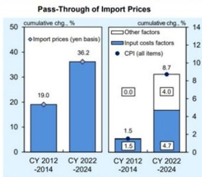  
Sources: Cabinet Office; Ministry of Internal Affairs and Communications; Bank of Japan. Note: "Input costs factors" refers to the contribution of changes in intermediate inputs to changes in the output deflator for the nonmanufacturing sector (excluding "construction" and "finance and insurance") in the SNA. "Other factors" is calculated as the residual. Figures are staff estimates and exclude the effects of the consumption tax hike.  
Source: BoJ, MS

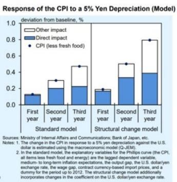  
Sources: Ministry of Internal Affairs and Communications; Bank of Japan, etc.
Notes: 1. The change in the CPI in response to a 5% yen depreciation against the U.S. dollar is estimated using the macroeconomic model (Q-JEM).
2. In the standard model, the explanatory variables for the Phillips curve (the CPI, all items less fresh food and energy) are the lagged dependent variable, medium- to long-term inflation expectations, the output gap, the U.S. dollar/yen exchange rate, the wage gap, contract currency-based import prices, and a dummy for the period up to 2012. The structural change model additionally incorporates changes in the coefficient on the U.S. dollar/yen exchange rate.

Exhibit 6: Japan's import prices and PPI have accelerated  
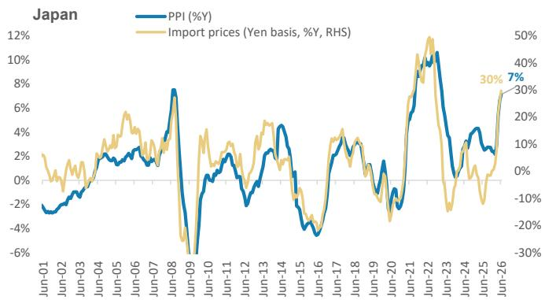  
Source: BoJ, MS

## 4. What is the progress on Shunto wage negotiations? What is the outlook on wage growth? Where are we on the wage pass-through to inflation?

Wage negotiation outcomes have kept wage growth strong: The final tally showed an average wage increase of 5.12%, including the seniority portion, while base-pay increases came in at 3.5%. This marks the third consecutive year of strong wage hike outcome. Importantly, wage increases have broadened beyond large corporations to SMEs, supported by labor shortages, elevated inflation, and resilient corporate profits. We expect nominal wage growth to remain around 3% in 2026. Wage growth has remained firm, and real wages have recently returned to positive territory as nominal wage growth has begun to outpace inflation.

But transmission to prices have not been particularly strong: The key question for the BoJ is how much of this wage growth will ultimately be passed through to consumer prices. So far, the pass-through has been gradual. While firms have continued to raise prices, recent price revisions have not been particularly strong, suggesting that the transmission from higher wages to services inflation remains incomplete. In our view, the wage-price pass-through is strengthening compared to the past, but the process is proceeding more gradually than some market participants anticipate.

Exhibit 7: The final tally of the 2026 Shunto wage negotiations showed the average wage increase at 5.12%, while base pay increases came in at 3.5%  
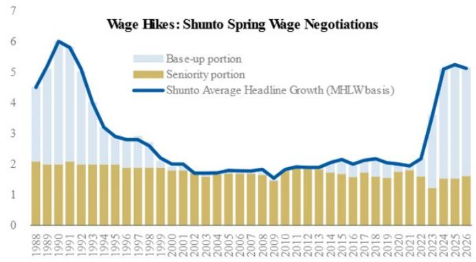  
Source: MHLW, Rengo, MS

Exhibit 8: Real wage growth has recently returned to positive territory as nominal wage growth has begun to outpace inflation  
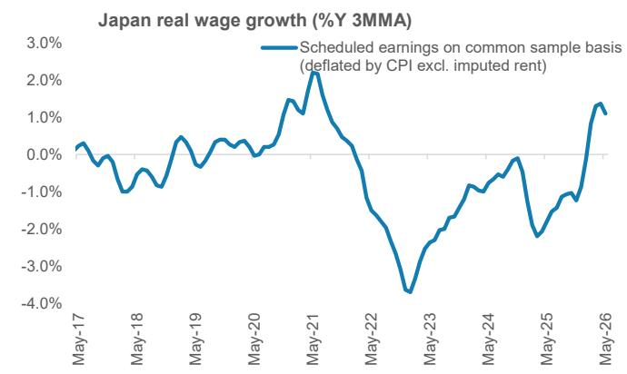  
Source: Haver, MS

# 5. Real consumer spending has been rising, alongside a rise in real wage growth. Is this a sustainable recovery? Does the BoJ need to react to this?

Improving consumption momentum reinforces observers' perception of faster BoJ rate adjustments: In recent months, private consumption momentum has started to show signs of improvement. The BoJ's real consumption activity index accelerated to 2.7%Y in May, a 39-month high. Against this backdrop, observers are asking if this means demand-pull inflation pressure will intensify and mean that the BoJ is at risk of "falling further behind the curve."

While the acceleration in private consumption growth is a positive development, we have to view it in this context:

1. On a seasonally adjusted basis, the private consumption index has only just risen above pre-Covid level, the first time after seven years.

2. Real wage growth, which has turned positively recently, is likely to dip back into negative territory, even if temporarily.

3. The biggest contributor to the improved momentum is consumer durables. We believe that there may have been some front-loading of purchases. For instance, stricter environmental standards for air conditioners are kicking in from 2027 and rising memory prices are expected to lead to price increases in durable goods. This has contributed to some front-loading of demand, which may imply some payback in coming months around durable goods consumption.

In sum, we think consumption demand is not strong enough to lead to demand-side pressures in the near term, such that the BoJ needs to react with a faster and sharper pace of rate adjustments.

Exhibit 9: Real consumption growth has improved, but we see a few caveats to the recent strength  
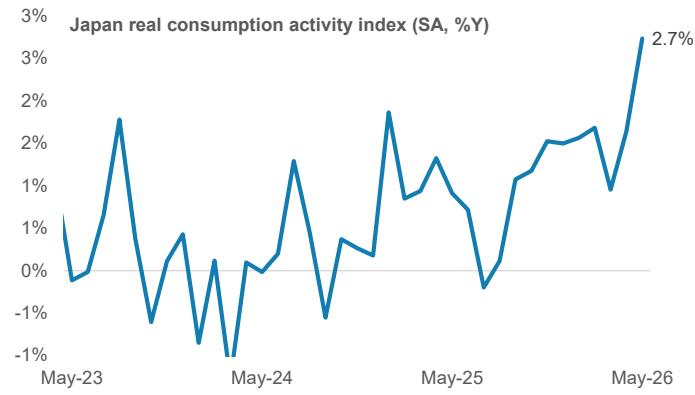  
Source: Haver, MS

Exhibit 10: Real consumption activity has only just returned to above pre-Covid level  
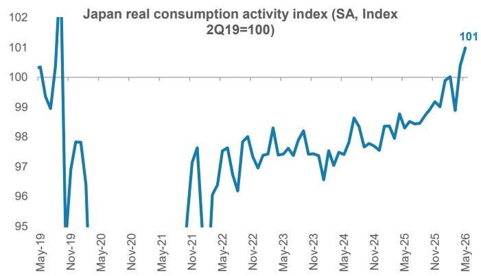  
Source: Haver, MS

Exhibit 11: Stricter environmental standards for air conditioners from 2027 and rising memory prices are expected to lead to price increases in durable goods, generating front-loaded demand  
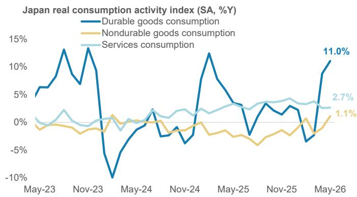  
Source: Haver, MS

Exhibit 12: This implies some potential payback in the coming months for durable goods consumption  
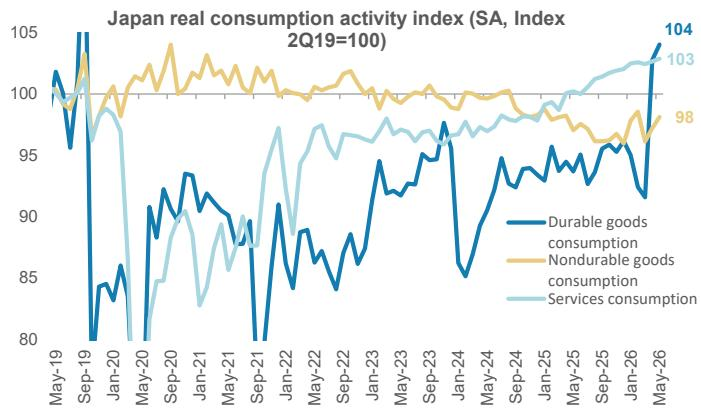  
Source: Haver, MS

## 6. How should we read the BoJ's range of neutral rate estimates?

Nominal neutral rate of 1.5-2% is the reasonable benchmark: The BoJ's updated estimates of the real neutral rate suggest that the range has not changed materially. The estimate at the lower bound was raised slightly from -1.0% to -0.9%, while the upper-bound estimate remains unchanged at +0.5%. Adding the 2% inflation target would imply a nominal neutral rate range of +1.1% at the lower bound and +2.5% at the upper bound. Three of the six models – Holston, Laubach and Williams (2023); Imakubo, Kojima and Nakajima (2015); and Del Negro et al. (2017) – have converged around -0.5% in real terms (see Exhibit 13).

From the BoJ's perspective, the review paper explicitly noted a possible downward bias in the lower-bound estimates. This suggests that policymakers may be increasingly attentive to upside rather than downside risks to these estimates. Our impression is that the Monetary Affairs Department may increasingly view $1.5\% - 2.0\%$ as the nominal neutral-rate range. Having said that, the BoJ has also indicated it does not intend to predefine a specific level as the neutral rate and will not use the estimate as a main communication tool.

We believe a nominal policy rate of +1.5% serves as a reasonable benchmark for the nominal neutral rate – in line with our current 1.5% terminal policy rate forecast by end-2027 (see BoJ Watch: Our Take on BoJ's Recent Communications: Underlying Inflation, Neutral Rate, Summary of Opinions, and Other, 31 March 2026).

Exhibit 13: BoJ estimates of the real neutral rate  
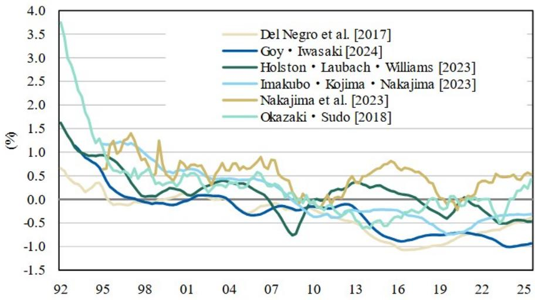  
Source: BoJ, MS

# 7. How expansionary will the new fiscal spending plan be? Will it push domestic demand growth in a way that will lead to a response from the BoJ?

Caution over large headline figures and fiscal concerns: The government has presented the public-private investment plan under its growth strategy, with cumulative total investment in 17 strategic sectors of over ¥370 trillion by F2040. As the headline figure includes a substantial portion of projected private-sector investment, it should be discounted when assessing the actual expansion in fiscal spending (see Japan Economics: Strategic-Sector Investment: First Take on Fiscal Projections, June 25, 2026).

Thoughts on the latest medium-term fiscal projections: The government also published latest projections around the medium-term fiscal deficit and government debt to GDP ratios. These projections provisionally assume additional fiscal spending of ¥10trn in F2027, rising thereafter in line with inflation and wage growth, similar to non-social security expenditure. Of this amount, ¥3.9trn comprises national resilience (¥2.1trn for the central government and ¥1.3trn for local governments) and defense buildup (¥0.5trn). The projections indicate that the debt-to-GDP ratio may not stabilize depending on growth assumptions. Thus, we think it is highly likely that additional spending excluding national resilience and defense will be well below ¥6trn per year.

More broadly, some observers argue that there are concerns regarding the efficiency of government-led investment, as well as the potential rise in long-term interest rates and further depreciation of the yen against the backdrop of fiscal expansion. On this, we have also previously highlighted that Japan's fiscal situation has been on a structural improvement trend amid stronger nominal GDP growth and tax revenue growth. On a flow of funds basis, the fiscal deficit stands at $1.8\%$ of GDP in 1Q26.

Exhibit 14: On a flow of funds basis, the fiscal deficit is at 1.8% of GDP in 1Q26  
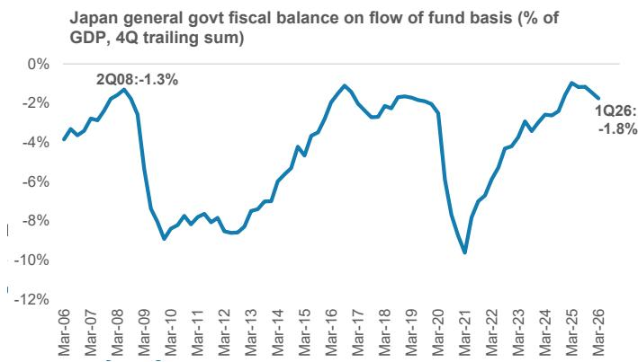  
Source: CEIC, Haver, MS

Exhibit 15: Tax revenue has risen sharply alongside nominal GDP  
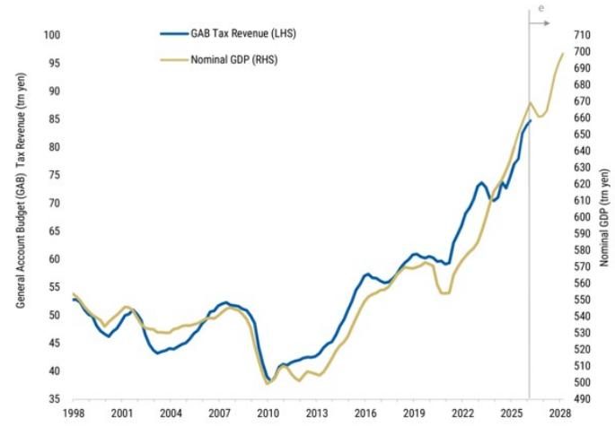  
Source: Ministry of Finance, Cabinet Office, MS

From the BoJ's perspective, the key question is whether the package materially changes the outlook for underlying inflation: While the package is directionally supportive for growth, we do not expect it to materially change the BoJ's reaction function.

## 8. What would be the implications for the BoJ's policy outlook if markets price in more Fed rate adjustments?

The risks lie towards more/faster pace of BoJ rate adjustments in such a scenario: If markets price in more Fed rate adjustments, the implication for the BoJ would be the potential effect of FX depreciation on underlying inflation. As mentioned earlier, the BoJ's own analysis confirmed that weaker JPY drives Japan-style core CPI while generating second round effects on underlying inflation.

In this sense, our FX and rates Strategist for Japan, Koichi Sugisaki, notes that the USD/JPY exchange rate tends to depend heavily on three factors:

1. Market pricing of the US terminal rate;

2. Japan's terms of trade; and

3. Global risk sentiment.

If markets are pricing in a more aggressive Fed rate increases, it would likely keep USD/JPY elevated or push it higher, which would:

\- Worsen Japan's terms of trade via higher import costs;

\- Increase second-round inflationary effects in Japan via yen depreciation; and

\- Raise the risk that the BoJ is perceived as further behind the curve, potentially increasing risk of earlier or more adjustments.

## 9. What are the key data points to watch to confirm our BoJ rate adjustment path? What could make the BoJ adjust faster with a higher cycle peak rate, and what could make the BoJ adjust at a slower pace with a lower cycle peak rate?

## We will watch the following key data points

Various inflation metrics – particularly PPI, as well as US-style core CPI and core services CPI: The BoJ appears to be placing increasing emphasis on the upside risk to underlying inflation arising from pass-through from PPI to consumer prices. Since the pass-through from producer prices to consumer prices is generally thought to occur with a lag of around six months, data released from summer through early autumn will be particularly important. Many food manufacturers have also announced price hikes effective from July onwards. The focus will be on the pace at which nationwide CPI, Tokyo CPI, and PPI accelerate in August and September.

BoJ Tankan: At the same time, it will be important to monitor the September Tankan to assess whether higher interest rates are having any meaningful tightening effects on lending activity or corporate financing conditions.

Wage data (Monthly Labour Survey): Momentum in scheduled cash earnings on a common-sample basis and real wages.

Consumption activity index: If consumption slows amid weaker real wage growth outlook and payback from front-loaded demand, reducing concerns about demand-pull inflationary pressures.

## What could make the BoJ adjust faster with a higher cycle peak rate?

This will depend on how strongly the factors discussed above reinforce the Bol's conviction that upside risks to underlying inflation are materializing:

\- An important factor would be if there was sustained, sharp JPY depreciation triggering second-round inflationary effects (through PPI with pass-through to CPI) and forcing the BoJ's hand, driven possibly by markets pricing in more Fed rate adjustments.

\- If underlying inflation (particularly wage-driven services inflation) surprises persistently to the upside. A strong global capex super-cycle keeps Japanese corporate profits and wage momentum intact, intensifying upward wage-price dynamics. Expansionary fiscal policy boosts domestic demand and intensifies demand-pull inflationary pressures.

We see a risk scenario of an earlier rate adjustment in October – especially if inflation data for the July-September period surprises to the upside. Against this backdrop, the Monetary Affairs Department staff would potentially place greater emphasis on inflation upside

risks in briefings to the Policy Board. Multiple board members may vote in favor of a rate adjustment at the September Monetary Policy Meeting, or if policymakers' speeches – including, for example, Governor Ueda such as in his address in Osaka in early October – could be signals of an earlier move.

## What could make the BoJ adjust at a slower pace with a lower cycle peak rate?

\- Re-escalation of Middle East tensions, leading to a global growth slowdown and recession risks for Japan, causing a pause in the tightening path.

\- US growth slows materially and markets increasingly price in Fed rate cuts, leading to lower USD/JPY. This reduces cost-push inflation, with US-style core CPI remaining subdued and wage-to-price pass-through staying limited.

\- The effects of higher interest rates becoming more visible via variable-rate mortgages and corporate bond funding costs, dampening consumption and investment.

# 10. Will Japan's Government Pension Investment Fund (GPIF) asset reallocation support Japan's FX and rates?

Comments serve as verbal intervention: Finance Minister Katayama had mentioned in a post-Cabinet press conference that she is “pursuing measures to encourage pension funds, including GPIF, to invest more in Japanese financial assets.” While this is seen as a possible policy push for pension funds to sell foreign assets and raise domestic asset exposure, thereby supporting Japan FX and rates markets, Koichi Sugisaki believes that in practice, the key institutional constraint is that public pension funds must be managed solely for the benefit of insured persons and, from a long-term perspective, safely and efficiently and not to pursue macro policy objectives (see here). This means that actual policy changes may be more medium-term, and that the comments may instead function mainly as a form of verbal intervention (see Japan Rates Strategy: Will Pension Funds Accelerate Repatriation?, July 10, 2026 for more details). He also estimates that each 1ppt increase in the domestic bond allocation would mechanically imply \~JPY0.66tn of buying in 7-11y JGBs and around JPY0.8tn in JGBs beyond 11 years.

View on JPY rates and FX: Sugisaki believes that the recent rise in USD/JPY has primarily been driven by a broad USD strength story. The pair looks close to fair value, supported by Fed pricing, risk sentiment, and terms of trade. He continues to see USD/JPY range-bound around 160. For JPY rates, Sugisaki expects a steeper JGB curve, with our BoJ view meaning lower yields at the front end, with pressure on longer-dated yields reflecting higher term premium linked to potential fiscal expansion and Japan's growth strategy (see Japan Economics, Macro, and Equity Strategy: What Does USD/JPY > 160 Mean for Japan's Economy and Equity Markets? July 8, 2026 and Japan Rates Strategy: Fading Inflation Risk but Chasing Fiscal Risk, July 3, 2026).

Exhibit 16: Possible measure to enhance domestic financial assets investment by pension funds

<table><tr><td>Measure</td><td>Feasibility</td><td>Specific Measures</td><td>Market Implications</td></tr><tr><td>(1) Revision of the Basic Portfolio</td><td>Low-Medium</td><td>Increase the allocation to domestic assets and reduce the allocation to foreign assets</td><td>Large market impact, but legal procedures and political costs are high</td></tr><tr><td>(2) Asymmetric Rebalancing Bands</td><td>Medium</td><td>Keep the basic portfolio unchanged, but make rebalancing more tilted toward domestic assets within the threshold depending on market conditions</td><td>Stronger JPY, support for Japanese equities and JGB purchases; however, the immediate impact would likely be limited</td></tr><tr><td>(3) Strengthening Asset Owner Reform</td><td>High</td><td>Require GPIF, mutual aid associations, corporate pensions, university endowments, and other institutional investors to enhance governance, risk management, manager selection, and disclosure standards</td><td>Mainly supportive of medium-term capital inflows into Japanese equities, corporate bonds, and alternative assets</td></tr><tr><td>(4) Expansion of Alternative Investments</td><td>High</td><td>Increase investment in domestic infrastructure, real estate, private equity, venture capital, GX, AI, semiconductors, and related sectors</td><td>More favorable for domestic risk assets than for JGBs, benefiting infrastructure, REITs, and private funds</td></tr><tr><td>(5) Strengthening Stewardship Activities</td><td>High</td><td>Improve corporate governance among Japanese companies and expand the NISA program</td><td>Improves the investment appeal of Japanese equities</td></tr></table>

Source: Bloomberg, Reuters, Nikkei, Cabinet Office, MS

## Disclosure Section

Information and opinions in MS were prepared or are disseminated by one or more of the following, which accept responsibility for its contents: MS Asia Limited, and/or MS Asia (Singapore) Pte. (Registration number 199206298Z) and/or MS Asia (Singapore) Securities Pte Ltd (Registration number 200008434H), regulated by the Monetary Authority of Singapore (which accepts legal responsibility for its contents and should be contacted with respect to any matters arising from, or in connection with, MS), and/or MS Taiwan Limited and/or MS & Co International plc, Seoul Branch, and/or MS Australia Limited (A.B.N. 67 003 734 576, holder of Australian financial services license No. 233742), and/or MS Wealth Management Australia Pty Ltd (A.B.N. 19 009 145 555, holder of Australian financial services license No. 240813, and/or MS India Company Private Limited having Corporate Identification No (CIN) U22990MH1998PTC115305, regulated by the Securities and Exchange Board of India ("SEBI") and holder of licenses as a Research Analyst (SEBI Registration No. INH000001105), Stock Broker (SEBI Stock Broker Registration No. INZ000244438), Merchant Banker (SEBI Registration No. INM000011203), and depository participant with National Securities Depository Limited (SEBI Registration No. IN-DP-NSDL-567-2021) having registered office at Altimus, Level 39 & 40, Pandurang Budhkar Marg, Worli, Mumbai 400018, India; Telephone no. +91-22-61181000; Compliance Officer Details: Mr. Tejarshi Hardas, Tel. No.: +91-22-61181000 or Email: tejarshi.hardas@morganstanley.com; Grievance officer details: Mr. Tejarshi Hardas, Tel. No.: +91-22-61181000 or Email: msic-compliance@morganstanley.com which accepts the responsibility for its contents and should be contacted with respect to any matters arising from, or in connection with, MS and their affiliates (collectively, "MS"). MS India Company Private Limited (MSICPL) may use AI tools in providing research services. All recommendations contained herein are made by the duly qualified research analysts; For important disclosures, stock price charts and equity rating histories regarding companies that are the subject of this report, please see the MS Disclosure Website at www.morganstanley.com/eqr/disclosures/webapp/generalresearch, or contact your investment representative or MS at 1585 Broadway, (Attention: Research Management), New York, NY, 10036 USA.

For valuation methodology and risks associated with any recommendation, rating or price target referenced in this research report, please contact the Client Support Team as follows: US/Canada +1 800 303-2495; Hong Kong +852 2848-5999; Latin America +1 718 754-5444 (U.S.); London +44 (0)20-7425-8169; Singapore +65 6834-6860; Sydney +61 (0)2-9770-1505; Tokyo +81 (0)3-6836-9000. Alternatively you may contact your investment representative or MS at 1585 Broadway, (Attention: Research Management), New York, NY 10036 USA.

## Global Research Conflict Management Policy

MS has been published in accordance with our conflict management policy, which is available at www.morganstanley.com/institutional/research/conflictpolicies. A Portuguese version of the policy can be found at www.morganstanley.com.br

## Important Disclosures

MS is not acting as a municipal advisor and the opinions or views contained herein are not intended to be, and do not constitute, advice within the meaning of Section 975 of the Dodd-Frank Wall Street Reform and Consumer Protection Act.

MS does not provide individually tailored investment advice. MS has been prepared without regard to the circumstances and objectives of those who receive it. MS recommends that investors independently evaluate particular investments and strategies, and encourages investors to seek the advice of a financial adviser. The appropriateness of an investment or strategy will depend on an investor's circumstances and objectives. The securities, instruments, or strategies discussed in MS may not be suitable for all investors, and certain investors may not be eligible to purchase or participate in some or all of them. MS is not an offer to buy or sell or the solicitation of an offer to buy or sell any security/instrument or to participate in any particular trading strategy. The value of and income from your investments may vary because of changes in interest rates, foreign exchange rates, default rates, prepayment rates, securities/instruments prices, market indexes, operational or financial conditions of companies or other factors. There may be time limitations on the exercise of options or other rights in securities/instruments transactions. Past performance is not necessarily a guide to future performance. Estimates of future performance are based on assumptions that may not be realized. If provided, and unless otherwise stated, the closing price on the cover page is that of the primary exchange for the subject company's securities/instruments.

The fixed income research analysts, strategists or economists principally responsible for the preparation of MS have received compensation based upon various factors, including quality, accuracy and value of research, firm profitability or revenues (which include fixed income trading and capital markets profitability or revenues), client feedback and competitive factors. Fixed Income Research analysts', strategists' or economists' compensation is not linked to investment banking or capital markets transactions performed by MS or the profitability or revenues of particular trading desks.

With the exception of information regarding MS, MS is based on public information. MS makes every effort to use reliable, comprehensive information, but we make no representation that it is accurate or complete. We have no obligation to tell you when opinions or information in MS change apart from when we intend to discontinue equity research coverage of a subject company. Facts and views presented in MS have not been reviewed by, and may not reflect information known to, professionals in other MS business areas, including investment banking personnel.

MS may make investment decisions that are inconsistent with the recommendations or views in this report.

To our readers based in Taiwan or trading in Taiwan securities/instruments: Information on securities/instruments that trade in Taiwan is distributed by MS Taiwan Limited ("MSTL"). Such information is for your reference only. The reader should independently evaluate the investment risks and is solely responsible for their investment decisions. MS may not be distributed to the public media or quoted or used by the public media without the express written consent of MS. Any non-customer reader within the scope of Article 7-1 of the Taiwan Stock Exchange Recommendation Regulations accessing and/or receiving MS is not permitted to provide MS to any third party (including but not limited to related parties, affiliated companies and any other third parties) or engage in any activities regarding MS which may create or give the
