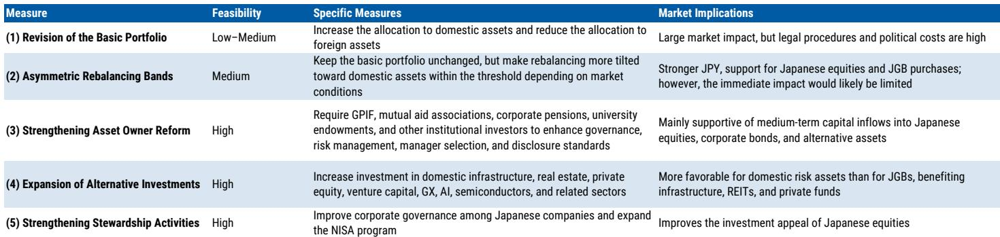
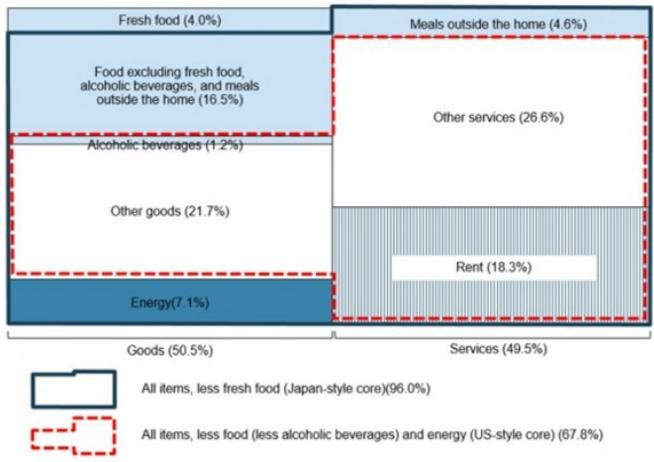

# Japan's Inflation Is Supply-Driven, Not Demand-Driven: Why The BoJ Will Adjust More Slowly Than The Market Expects

The Bank of Japan is expected to deliver only two more rate adjustments—one in December 2026 and another in June 2027—bringing the policy rate to 1.5%, not the nearly 1.75% that markets have priced in by December 2027. This gap matters because the entire architecture of Japan-focused strategies—from yen positioning to JGB duration to equity sector allocation—rests on how aggressively the BoJ tightens. The dominant market narrative assumes that persistent above-target inflation forces the BoJ's hand toward a terminal rate of 2% or higher. That narrative may be worth reexamining.

The core tension in Japan's monetary policy discussion is not about whether inflation exists. It is about what is causing it. If inflation is demand-driven, then the BoJ must adjust aggressively to cool an overheating economy. But if inflation is driven by currency depreciation, import prices, and supply-side distortions, then tightening prematurely risks disrupting a reflation cycle that has taken seven years to return private consumption to pre-Covid levels. The evidence points decisively toward the second interpretation. US-style core CPI, which strips out food and energy, has been decelerating and stood at just 1.1% year-on-year in May 2026. The share of CPI components showing price declines has risen from 15.9% in November 2025 to 23.4% in May 2026. Core services CPI, the metric most tied to wage pass-through, remains sluggish at 1.1%. These are not the signatures of an economy running hot.

Observers who assume the BoJ is behind the curve may be misreading the inflation data. The widely cited figure of 2.7% year-on-year for Japan-style core CPI excludes only fresh food, not energy. That measure includes volatile commodity prices and does not reflect underlying inflationary pressure. The BoJ's own US-style core CPI, adjusted for institutional factors, ran at just 1.4% in May. The gap between what headline inflation looks like and what underlying inflation actually is stands at the center of the policy disagreement between the BoJ and the market. Resolving that disagreement requires understanding the true drivers of Japan's price dynamics and the lag structure through which rate adjustments affect the real economy.

## The BoJ's Inflation Challenge Is Imported, Not Homegrown, And The Transmission Mechanism Is Weakening

Currency depreciation and higher import prices have been the dominant drivers of Japan's persistent headline inflation over the past three years, not domestic demand. The evidence is straightforward: real private consumption only recently recovered to pre-Covid levels after seven years of stagnation. Real wage growth remained negative for most of the past three years. The semi-annual price revisions implemented in April 2026 were more modest than the BoJ had initially expected. If domestic demand were generating inflation, consumption and wages would have shown sustained strength earlier and price-setting behavior would have been more aggressive.

The BoJ's own research quantifies the exchange rate channel precisely. A 5% yen depreciation leads to a 0.5 to 0.8 percentage point rise in CPI by the third year. Import price growth in yen terms accelerated to 30% year-on-year in June 2026, while the Corporate Goods Price Index rose 7.1%. But crucially, the BoJ's research also shows that yen depreciation affects inflation not only through direct import-price pass-through but also through second-round effects on wages, services inflation, and corporate profit margins. This means the BoJ's underlying rationale for rate adjustments has shifted from the traditional wage-price mechanism toward the pass-through from producer prices to consumer prices. That shift is analytically correct, but it also implies that as yen depreciation stabilizes or reverses, the primary engine of inflation will fade.

The outlook for headline inflation confirms this trajectory. Near-term import pressures will lift headline CPI to a peak of 3.1% by December 2026. But as the effects of past yen depreciation and the surge in rice prices gradually fade, headline inflation should moderate to an average of 1.3% by the second quarter of 2027. Underlying US-style core inflation will remain range-bound at 1.5 to 1.6% over the next four to five quarters. The BoJ is not facing a structural inflation problem. It is managing the aftershocks of a currency shock and a commodity price spike. The market is extrapolating the peak rather than the trend.

## The Wage-Price Pass-Through Is Real But Incomplete, And The Consumption Recovery Has Structural Caveats

The 2026 Shunto wage negotiations delivered a third consecutive year of strong outcomes, with average wage increases of 5.12% and base-pay increases of 3.5%. Wage growth has broadened beyond large corporations to SMEs, supported by labor shortages, elevated inflation, and resilient corporate profits. Real wages have recently returned to positive territory. On the surface, this looks like the virtuous cycle the BoJ has been waiting for: higher wages leading to higher prices, leading to sustainable inflation.

But the transmission from wages to consumer prices has been gradual and incomplete. Firms have continued to raise prices, but recent price revisions have not been particularly strong. The pass-through from higher wages to services inflation remains incomplete. This is not surprising. In an economy where private consumption only just returned to pre-Covid levels after seven years, firms face significant demand constraints on their pricing power. The wage-price pass-through is strengthening compared to the past, but the process is proceeding more gradually than many market participants anticipate. The BoJ's own data shows that core services CPI, the metric most directly tied to wage pass-through, remains at 1.1% year-on-year. The mechanism is working, but it is not working fast enough to justify the aggressive tightening path that markets have priced.

The recent improvement in private consumption momentum requires careful interpretation. The BoJ's real consumption activity index accelerated to 2.7% year-on-year in May, a 39-month high. But on a seasonally adjusted basis, the private consumption index has only just risen above pre-Covid levels for the first time in seven years. The biggest contributor to the improved momentum is consumer durables, and there is strong evidence of front-loading. Stricter environmental standards for air conditioners take effect in 2027, and rising memory prices are expected to lead to price increases in durable goods. This has generated a pull-forward of demand that implies potential payback in coming months. Real wage growth, which has turned positive recently, is likely to dip back into negative territory, even if temporarily, as headline inflation peaks in the second half of 2026. Consumption demand is not strong enough to generate the demand-side pressures that would require the BoJ to react with faster and sharper rate adjustments.

## The Natural Rate Debate Provides A Ceiling, Not A Floor, For The Terminal Policy Rate

The BoJ's updated estimates of the real natural rate provide a critical benchmark for understanding where the policy rate is headed. The lower-bound estimate was raised slightly from -1.0% to -0.9%, while the upper-bound estimate remains unchanged at +0.5%. Adding the 2% inflation target implies a nominal natural rate range of 1.1% at the lower bound and 2.5% at the upper bound. Three of the six models used by the BoJ have converged around -0.5% in real terms, which translates to a nominal rate of approximately 1.5%.

The BoJ's review paper explicitly noted a possible downward bias in the lower-bound estimates, suggesting that policymakers may be increasingly attentive to upside rather than downside risks. Our reading is that the Monetary Affairs Department may increasingly view 1.5% to 2.0% as the nominal natural-rate range. However, the BoJ has also indicated it does not intend to predefine a specific level as the natural rate and will not use the estimate as a main communication tool.

A nominal policy rate of 1.5% serves as a reasonable benchmark for the nominal natural rate. This is exactly the terminal rate implied by our forecast of two more adjustments. The market's pricing of a terminal rate near 1.75% or higher implies that the economy will be operating above natural, which would require sustained demand-pull inflation. The evidence does not support that scenario. If underlying inflation remains below 2% and the natural rate is approximately 1.5%, then adjusting beyond that level would be contractionary, not preemptive. The market is pricing in a tightening cycle that the inflation data does not warrant.

## A Decision Framework For Positioning Around BoJ Policy: Three Conditions That Would Change The Outlook

For those constructing portfolios around Japan's monetary policy trajectory, the key question is not whether the BoJ will adjust, but what would cause it to deviate from the measured path we expect. Three conditions would need to be met for the BoJ to accelerate the pace of adjustments or raise the terminal rate above 1.5%.

First, US-style core CPI would need to break above 2% on a sustained basis and show signs of accelerating rather than decelerating. Currently at 1.1% and falling, this metric would need to reverse its trajectory and demonstrate that domestic demand is generating genuine inflationary pressure. The BoJ's own underlying inflation measures would need to converge above 2% rather than remaining below it. This is the single most important indicator to monitor because it directly tests the thesis that Japan's inflation is supply-driven.

Second, the wage-price pass-through would need to intensify significantly. Core services CPI would need to move decisively above 1.5% and show momentum toward 2%. This would require not just strong wage negotiations but evidence that firms are actually passing those wage costs through to consumer prices at a faster rate than we have seen. The April 2026 price revisions were more modest than expected, which suggests that the pass-through mechanism faces structural constraints that are not easily overcome.

Third, the consumption recovery would need to become self-sustaining rather than driven by front-loading. Private consumption would need to show sustained growth above pre-Covid trends without the artificial boost from durable goods purchases ahead of regulatory changes. Real wage growth would need to remain positive even as headline inflation moderates. If consumption growth is genuine and durable, it would eventually generate demand-pull inflation that would force the BoJ's hand. But the current evidence suggests that the recovery is fragile and partly artificial.

If none of these three conditions materialize, the BoJ will likely follow the path we have outlined: a December 2026 adjustment to 1.25%, a June 2027 adjustment to 1.5%, and then a prolonged pause. The BoJ board changes, with two members replaced year-to-date and two more in July 2027, will gradually raise the hurdle for further adjustments. The lagged effects of past rate increases on variable-rate mortgages and corporate funding costs will become more visible from 2027 onward. The inflation impulse from yen depreciation will fade. The policy path is clear. The market is pricing a different reality than the data supports.

*For informational purposes only. Portions may be generated, translated, summarized, or edited with AI assistance based on source materials and may contain omissions or errors. Please verify independently. This is not professional advice.*

For informational purposes only. Portions may be generated, translated, summarized, or edited with AI assistance based on source materials and may contain omissions or errors. Please verify independently. This is not professional advice.

