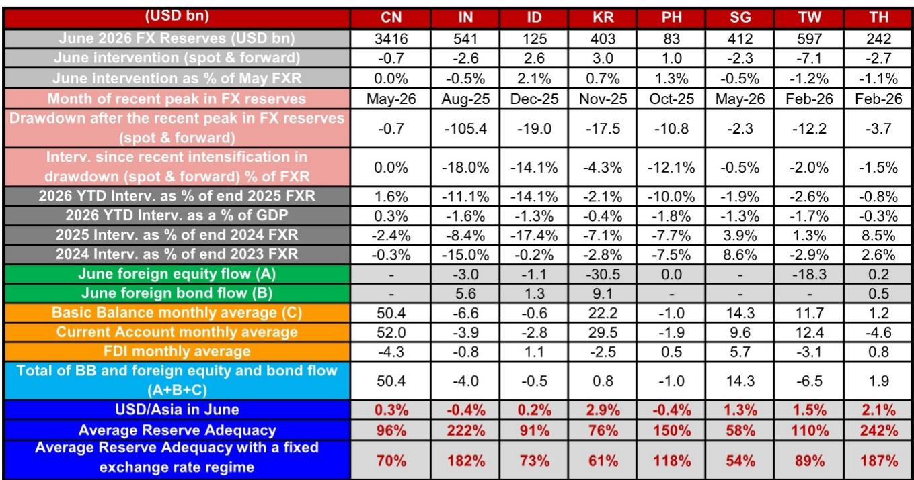

# 亚洲货币管理策略的分化：各央行储备操作呈现不同路径

2026年6月亚洲（除日本外）各央行的外汇市场操作数据显示出明显的策略分化。八家主要央行上月均在外汇市场有所行动，但其操作方向、规模和可持续性呈现出根本性差异。韩国央行和印尼央行在本币走弱的同时增加了储备，而印度储备银行、泰国央行和中国人民银行则通过出售美元来应对本币汇率变化。这并非对美元走势的统一应对，而是储备管理策略的分化，反映出各经济体政策可信度的差异以及部分经济体正在消耗其最后防线。

美联储6月会议的表态成为近期催化剂，但各央行行为的差异揭示了更深层次的结构性特征。一些央行利用当前时机重建消耗的储备，另一些则继续消耗年初以来已减少两位数的外汇储备。其差异归结为一个变量：通过货币政策可信度和有针对性的金融工具吸引资金流入的能力，而非仅依赖储备出售。

对于管理亚洲敞口的读者和企业财务管理者而言，其含义是明确的。隐性汇率挂钩和管理的稳定性模式正在让位于一个由储备充足程度（而非干预意图）决定货币走向的格局。那些能够在维护本币的同时积累储备的央行，是具备干预能力的机构；而那些无法做到这一点的机构，可能面临管理策略的调整。

## 部分经济体储备消耗达到关键水平，反映结构性特征

多个亚洲经济体的储备消耗规模已不再是周期性调整，而是政策缓冲的结构性变化，需要重新评估货币风险。印度储备银行自2025年8月峰值以来，即期和远期储备估计减少约1054亿美元，占其外汇储备的18%。印尼自2025年12月以来减少190亿美元，占储备的14.1%。菲律宾自2025年10月以来减少108亿美元，相当于其储备存量的12.1%。

这些并非边际调整。今年以来的操作数据进一步印证了这一模式。印度在2026年上半年估计出售了其2025年底储备的11.1%。印尼出售了14.1%。菲律宾出售了10%。以占GDP比重衡量，印度投入了年度经济产出的1.6%，印尼投入了1.3%，菲律宾投入了1.8%用于货币管理。

6月数据显示出售步伐有所放缓。印度6月估计出售约26亿美元的即期储备，不到5月57亿美元的一半。美伊临时协议（降低了油价）以及印度储备银行宣布通过FCNR(B)存款和外部商业借款吸引资金流入的措施，促成了这一放缓。但印度储备银行的净短期远期头寸在5月扩大了114亿美元，达到创纪录的1067亿美元，其中包括5月26日进行的50亿美元外汇掉期。随着印度储备银行与银行进行优惠外汇掉期以促进FCNR(B)和ECB资金流入，远期头寸预计将进一步扩大。

这是需要关注的关键机制。当央行出售即期储备时，会从银行体系抽走流动性并收紧金融条件。当其扩大短期远期头寸时，则将结算义务推迟到未来日期，从而产生隐性负债，最终需要展期或清偿。印度创纪录的远期头寸意味着报告的头寸储备5410亿美元夸大了可用的防御能力。真实的净储备头寸要低得多，远期义务带来的再融资风险随着持续的压力而逐月累积。

## 货币政策可信度决定哪些央行仍能积累美元，而非储备存量

6月操作估计中最具启示意义的数据点是，两家央行在本币走弱的情况下净积累了美元。韩国央行6月估计购买了约30亿美元的即期储备，尽管韩元是亚洲表现最弱的货币，美元/韩元上涨约2.9%，6月5日一度升至1562.2。印尼央行估计积累了约26亿美元的即期和远期储备，约占5月储备的2.1%，尽管印尼盾走弱。

这些结果看似有违直觉。为何央行会在本币下跌时买入美元？答案在于即期积累与总干预之间的区别。韩国央行的即期购买可能被远期出售所抵消，正如2025年10月和11月发生的情况，当时韩国央行分别积累了77亿美元和4亿美元的即期储备，但随后的远期头寸数据显示这两个月分别减少了73亿美元和70亿美元。6月的远期数据尚未公布，但这一模式表明韩国央行正在利用远期市场放缓韩元贬值步伐，同时重建报告的头寸储备。

更重要的因素是美元的来源。韩国央行的新闻稿将报告储备的小幅增加归因于“包括金融机构外币存款增加等因素”，增加了9亿美元。当地媒体报道称，韩国政府6月要求大型企业将其外汇持有转换为韩元。这是一种道义劝告形式，有效地将私营部门的美元持有动员到官方储备池中，而无需央行消耗自身储备。

印尼央行的积累更具启示意义。印尼央行在5月和6月连续加息25个基点，并实施了吸引债券流入的措施。结果可量化：6月印尼政府债券流入13亿美元，上半月SRBI流入12亿美元。这些资本流入使印尼央行有能力买入美元并增强其薄弱的储备头寸，即使印尼盾面临压力。印尼央行的声明指出，储备的小幅增加“主要归因于税收和服务收入”，但背后的驱动力是加息创造的政策可信度，使印尼资产对外国读者更具吸引力。

与印度和泰国的对比再明显不过。印度加息力度较小，依赖行政措施吸引资金流入，而泰国央行更不愿加息。结果是，印尼央行和韩国央行即使在美元走强期间也能积累储备，而印度储备银行和泰国央行则不得不消耗储备。

## 泰国央行与中国人民银行呈现两种不同的储备消耗模式

泰国和中国6月都出售了储备，但机制和影响根本不同。泰国央行6月净出售约27亿美元的即期和远期储备，约占5月储备的1.1%。泰铢兑美元贬值2.1%，成为仅次于韩元的亚洲表现第二弱货币。泰国央行对泰铢表现的担忧正在加剧。在6月19日至24日举行的6月货币政策委员会会议纪要中，部分委员对泰铢的稳定性提出了疑问。7月8日，当美元/泰铢即期汇率跌破33.5时，泰国央行表示正在密切监测泰铢，并准备干预。

泰国的储备充足指标乍看之下令人安心。固定汇率制度下的储备充足率估计为187%，在样本中仅次于印度。但泰国的经常账户处于赤字状态，月均赤字46亿美元，而结合经常账户和外国直接投资的国际收支基本余额仅为12亿美元顺差。泰国央行正在出售储备以应对同时来自贸易流动和资本外流的压力，2420亿美元的储备存量虽然相对于GDP规模较大，但消耗速度无法无限期持续，除非采取政策回应或更大幅度的调整。

中国则呈现相反情况。中国人民银行6月估计出售约7亿美元的即期储备，相对于其3.4万亿美元的储备存量而言微不足道。在岸-离岸价差保持可控，美元/离岸人民币当月仅上涨0.3%。关键观察点是，国有银行的外汇存款积累（3月至5月月均131亿美元）在6月因美元需求环境而停滞。中国人民银行并未通过大规模干预积极管理人民币汇率。它允许货币在窄幅区间内调整，同时将其庞大的储备存量用作后盾而非主要工具。

自近期峰值以来的储备消耗差异凸显了这种分化。中国自2026年5月峰值以来仅消耗了7亿美元，占储备比例几乎为零。泰国自2026年2月峰值以来消耗了37亿美元，占储备的1.5%。中国人民银行拥有耐心的优势，因为其储备存量比其他任何央行都大一个数量级，而且资本管制为其提供了泰国不具备的工具。泰国央行没有这种优势，7月8日的口头干预表明其已接近对进一步贬值的容忍极限。

## 评估货币风险的框架：储备充足性、远期负债与资金流入能力

6月的操作数据为结构化框架提供了原始输入，可用于评估哪些亚洲货币面临较高的无序调整风险。三个变量决定了央行的有效防御能力，每个变量都必须同时评估。

第一个变量是经远期负债调整后的储备充足性。央行报告的头寸储备数据具有误导性，因为它们包含总储备而未扣除短期远期头寸。印度在固定汇率制度下222%的储备充足率看似令人安心，但创纪录的1067亿美元短期远期头寸意味着净储备头寸要低得多。当远期义务到期时，印度储备银行必须交付美元或以可能更不利的利率展期头寸。远期头寸是一种递延的干预成本，将在未来时期作为储备消耗而显现。

第二个变量是国际收支基本余额的可持续性，它结合了经常账户和外国直接投资流动。印度的基本余额每月赤字66亿美元，意味着该经济体通过贸易和长期投资赚取的外汇少于其消耗。泰国的基本余额仅为12亿美元，勉强为正。印尼为负6亿美元。这些经济体在结构上依赖组合投资流入来平衡其外部账户，而组合投资是资本账户中最不稳定和可逆的组成部分。当全球风险偏好转变时，这些流动的逆转速度快于经常账户赤字的调整速度。

第三个变量是央行通过政策行动而非储备出售吸引资金流入的能力。印尼央行在6月证明，连续加息可以吸引13亿美元的政府债券流入和12亿美元的SRBI流入，提供了即使在贬值期间也能积累储备所需的美元。韩国央行证明，对大型企业的道义劝告可以动员私营部门的美元持有。印度储备银行试图通过FCNR(B)和ECB措施吸引资金流入，但6月持续的即期出售表明这些措施不足以弥合缺口。

将这一框架应用于6月数据，可以得出清晰的层级。印尼和韩国拥有较强的防御能力，因为它们可以通过加息和行政措施吸引资金流入，即使本币走弱。中国拥有较强的储备缓冲，但选择不积极使用。印度和泰国的防御能力最弱，因为它们存在基本余额赤字，通过政策吸引资金流入的能力有限，并且以不可持续的速度消耗储备。菲律宾处于类似位置，每月基本余额赤字10亿美元，年初至今储备消耗达10%。

## 印度远期头寸扩张是亚洲外汇市场最被低估的风险因素

印度净短期远期头寸扩大至创纪录的1067亿美元值得单独关注，因为它代表了一种未在头寸储备充足指标中体现的或有负债。印度储备银行于5月26日进行了50亿美元的外汇掉期，随着央行与银行进行优惠掉期以促进FCNR(B)和ECB资金流入，远期头寸预计将进一步扩大。

其机制很简单。当印度储备银行建立短期远期头寸时，它同意在未来日期以预定汇率卖出美元。如果卢比在交易日和结算日之间贬值，印度储备银行必须以比现行即期汇率更有利的汇率交付美元，实际上补贴了交易对手的货币敞口。这种补贴的成本在远期合约结算时由储备存量承担。

1067亿美元的短期远期头寸约占印度头寸储备的19.7%。即使这些头寸中的一小部分需要在卢比面临压力时结算，储备消耗也可能急剧加速。印度储备银行实际上是在利用远期市场掩盖储备消耗的真实速度，将干预成本推至未来时期。这是一种合法的政策工具，但它创造了随时间累积的再融资风险。每多一个月的压力都会增加展期头寸的成本，而每笔以优惠利率进行的新掉期都会增加或有负债。

对于持有印度卢比敞口的读者而言，远期头寸数据比头寸储备数字更重要。印度储备银行6月可能仅出售了26亿美元的即期储备，但远期头寸的扩张意味着有效干预规模更大。问题不在于印度储备银行是否有足够的储备来管理卢比，而在于印度储备银行在考虑到未来几个月到期的远期义务后，是否有足够的储备来管理卢比。

亚洲（除日本外）各央行6月的操作数据揭示了一个不再统一管理货币走势的地区。一些央行正在利用当前阶段通过政策可信度和资本流入吸引来重建储备。另一些则以不可持续的速度消耗储备，同时积累将限制未来政策选择的远期负债。这种分化并非随机。它反映了货币政策可信度、外部平衡可持续性以及动员私营部门美元持有能力的根本差异。将亚洲货币视为同质资产类别的观察者，正在错过数据中最重要的信号：储备管理策略的分化正在创造赢家和输家，随着美元周期的持续，这一点将日益明显。

*仅供参考。部分内容可能基于源材料通过AI辅助生成、翻译、总结或编辑，可能存在遗漏或错误。请独立核实。本文不构成专业建议。*

仅供参考。部分内容可能基于源材料通过AI辅助生成、翻译、总结或编辑，可能存在遗漏或错误。请独立核实。本文不构成专业建议。

