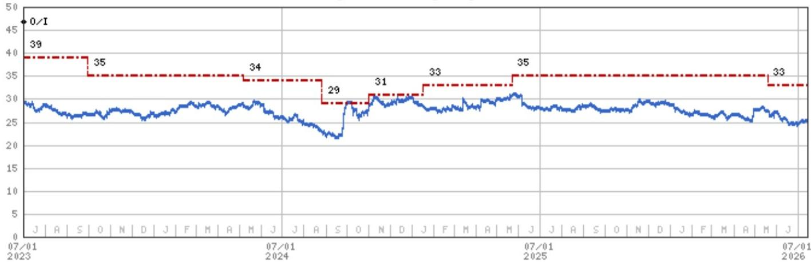
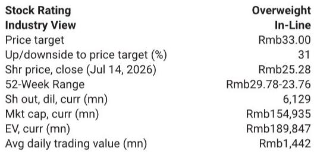

# 中国乳业龙头已过周期低谷：伊利复苏或标志行业结构性转折点

过去两年，原奶供应过剩压缩了利润空间，并引发了整个中国乳制品行业非理性的价格竞争，如今这一局面已明显接近尾声。根据近期与伊利股份的读者交流，公司管理层预计2026年原奶价格同比将基本保持稳定，下半年有望温和回升。这并非一次微小的投入成本变动，而是整个中国乳业价值链最重要的结构性催化剂。作为市场领导者，伊利有望在利润回升中占据最大份额。

这一转折点的意义常被低估。在2024年和2025年的大部分时间里，中国乳制品加工企业处于原材料通缩的环境中，迫使它们大力促销以消化过剩产量。这种动态压低了品类盈利能力，并掩盖了潜在需求的真实状况。伊利2026年上半年的业绩表现揭示出，需求基础比噪音所暗示的更为健康。公司全年收入增长目标（中个位数）保持不变，上半年业绩符合预期。对于观察者而言，问题不再是周期是否正在转变，而是如何在复苏过程中进行资源配置。

## 常温奶销量增长而非提价驱动，证明消费需求真实

此次交流中最具说服力的数据点是，伊利常温奶业务在2026年上半年实现了同比正增长，且完全由销量而非提价驱动。这与促销战的表现截然相反。当一个品类靠打折支撑时，销量可能上升，但每升收入会下降。伊利的常温奶增长是销量驱动且定价稳定，这意味着消费者正以标准零售价购买更多牛奶。高端子品牌金典的表现优于基础常温奶，表明液态奶的升级趋势依然活跃，而非停滞。

这一点之所以重要，是因为常温奶是中国液态奶市场中规模最大、最商品化的细分领域。如果在此领域无需降价需求就能增强，则表明乳制品消费的大环境正在有机改善。第二季度同比表现持平归因于季节性因素，且符合管理层计划。渠道库存保持健康，消除了今年晚些时候出现去库存冲击的风险。对于观察者而言，这意味着收入基础稳固，任何来自促销支出减少的利润扩张都将主要流向最终盈利。

## 鲜奶的悖论：今日亏损，明日领先

伊利鲜奶业务在2026年上半年延续了强劲增长势头，但仍处于亏损状态。这是一个典型的战略性投入模式，观察者需要正确理解。鲜奶是比常温奶利润率更高、门槛更高的品类，因为它需要冷链物流、更短的保质期和更广泛的零售分销。伊利有意接受短期亏损，以建设基础设施和品牌组合，从而在未来十年主导这一领域。

关键在于，随着原奶价格回升，鲜奶的价格竞争应会缓解。当原奶便宜时，每个生产商都能以折扣鲜奶充斥市场。随着投入成本上升，较弱的参与者将失去价格竞争能力，优势转向拥有卓越供应链和规模的企业。伊利正利用其冷链网络和多品牌策略锁定长期领先地位。亏损是有限且战略性的；市场份额的获取是持久的。这是一个公司利用周期性低谷构建结构性竞争优势的典型范例。

## 婴幼儿配方奶粉与成人营养：不依赖原奶周期的增长引擎

虽然原奶价格回升将提振伊利核心乳制品业务的利润，但公司的增长越来越多地由与原奶价格周期脱钩的品类驱动。婴幼儿配方奶粉业务有望实现中个位数至高个位数的销售增长，并正在获得1至2个百分点的市场份额。在出生率下降的环境中，这是一项出色的表现。它反映了伊利从缺乏本地分销和监管经验的小型国内企业及国际品牌手中夺取份额的能力。

更令人印象深刻的是成人营养业务，在礼品场景和功能性产品的支持下实现了两位数增长。这是一个与中国人口老龄化和健康意识提升相关的结构性增长故事。与婴幼儿配方奶粉不同，成人营养拥有更长的增长周期和更低的渗透率。伊利冰淇淋和奶酪业务在2026年上半年也保持了稳健增长，进一步使收入基础多元化，减少对液态奶的依赖。综合来看，这些非核心业务为原奶市场的任何残余波动提供了缓冲，并给予管理层维持中个位数收入增长目标的信心。

## 观察框架：2026年下半年需关注的三个信号

对于关注中国消费领域的读者而言，伊利的故事提供了一个有用的框架。复苏是真实的，但并非均匀分布。以下是未来两个季度需追踪的三个具体信号。

首先，关注促销支出的轨迹。管理层明确表示，随着原奶成本上升，促销压力应会缓解。利润回升的第一个迹象将是常温奶和鲜奶价格促销频率和力度的减少。如果伊利能够在保持销量增长的同时改善毛利率，盈利修正周期将加速。当前的一致预期已包含一些改善，但如果促销回撤速度快于预期，上行空间可能更大。

其次，关注鲜奶业务实现盈亏平衡的路径。公司正在为领先地位进行投入，但市场最终会要求一个实现盈利的时间表。任何表明亏损收窄速度快于预期的迹象都将是一个强有力的积极信号。反之，如果鲜奶亏损持续到2027年之后，观察者将需要重新评估资源配置的权衡。

第三，关注海外业务表现。伊利的国际业务，包括在新西兰的乳品原料业务、在东南亚的冰淇淋和含乳饮料业务以及澳优业务，在2026年上半年继续实现两位数的收入增长和利润率改善。这是投资组合中虽小但不断增长的部分，并为国内竞争提供了对冲。如果海外利润率持续改善，将为研究逻辑增添超越中国复苏叙事的新维度。

## 资本配置确认管理层对周期的信心

伊利重申了2025-2027年期间分红率不低于75%的承诺。在低增长环境中，这是一个有意义的信号。它告诉观察者，管理层认为无需为困难时期囤积现金，因为困难时期即将结束。原奶市场复苏、多元化增长引擎以及股东友好的资本配置政策相结合，创造了具有吸引力的风险回报特征。

仍在审议中的潜在税收变化是一个已知的未知因素，但管理层预计对核心利润无重大影响。这与以下观点一致：监管环境虽然并非完全可预测，但不太可能破坏潜在的盈利复苏。公司股票交易价格约为远期收益的13倍，股息率超过6%，如果复苏如预期实现，下行空间有限；如果复苏加速，则存在显著上行空间。

结论很明确。中国乳业周期已经转变，伊利是捕捉复苏的最佳定位企业。公司2026年上半年的业绩证实了需求是真实的，原奶供需平衡正在改善，管理层正在多个增长方向上执行连贯的战略。观察者应关注利润拐点、鲜奶业务投入逻辑以及非乳品增长引擎。2026年下半年将决定这是一次温和复苏，还是多年盈利升级周期的开始。

*仅供参考。部分内容可能基于源材料通过AI辅助生成、翻译、总结或编辑，可能存在遗漏或错误。请独立核实。本文不构成任何专业建议。*

仅供参考。部分内容可能基于源材料通过AI辅助生成、翻译、总结或编辑，可能存在遗漏或错误。请独立核实。本文不构成任何专业建议。

