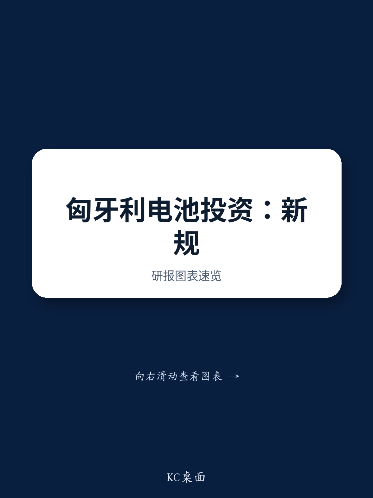

# 匈牙利与欧盟政策协调将重塑中国电池供应链格局，而非打破它

对于关注中国电池供应链的观察者而言，一个关键事实是：匈牙利新一届政府预计将在投资激励方面拥有更少的自由裁量权，并将更紧密地与欧盟整体政策框架保持一致。这并非征收或强制退出的二元风险，而是运营环境的结构性调整，将根据投资阶段的不同，对中国电池及材料公司产生差异化影响。现有的全资设施面临的运营中断有限。但对于新产能而言，快速审批和慷慨补贴的时代正在结束。对观察者来说，战略问题不再是匈牙利是否仍然开放，而是开放的新条件是什么，以及针对价值链的哪些环节。

风险很高。匈牙利已成为中国电池产业在欧洲最重要的枢纽，吸引了来自电池制造商、隔膜生产商和正极材料制造商的投资。该国提供了欧盟市场准入、低企业税率和政府支持，这一组合在欧洲其他地方无与伦比。如今，这一组合正在被重新校准。欧盟议会已指出，匈牙利违反法治的行为威胁到欧洲价值观，并涉及滥用欧盟资金。其结果是，布达佩斯在预算分配上的自由度将降低，必须更紧密地遵循欧盟政策方向。这改变了每一家宣布扩张计划的公司的考量。

对现有读者而言，好消息是强制撤资或股权重组的风险似乎较低。专家评估表明，任何对现有所有权结构的强制性变更都将面临相关公司和个别欧盟成员国的阻力。全资投资模式仍然被允许。但坏消息是，新产能的推进将面临更高的成本、更长的周期，以及更严格的环境和补贴审查。项目执行的容错空间已经收窄。

## 现有中国电池材料项目在环境问题解决后，运营中断有限

对于持有匈牙利中国电池材料公司敞口的观察者而言，最直接的关切是现有工厂能否继续运营。答案是肯定的，但有一个重要前提。例如，云南能源在德布勒森的隔膜厂曾面临环境合规问题，但专家预计这些问题可以通过标准的补救流程解决。一旦满足必要的环保要求，生产应能恢复。这不是结构性障碍，而是遵循既定程序的监管流程。

这一点的重要性常被低估。环境合规延迟并非中国公司在匈牙利的特有问题，而是所有工业读者在欧盟监管环境中都会遇到的情况。关键在于，外资所有权的法律基础并未改变。全资子公司结构在法律上仍然被允许。专家认为，任何强制改变现有股权的尝试都将面临公司和成员国的抵制，这一观点与欧盟内部市场规则一致，该规则赋予成员国在投资政策上相当大的自主权。因此，现有设施不存在被国有化或违背所有者意愿进行重组的风险。

对观察者而言，这意味着这些资产的账面价值不会仅因政治风险而受损。运营风险集中在环境审批的时间线上，而非基本的运营权上。已经通过环境许可并开始生产的公司风险最低。那些仍在等待审批的公司面临的是延迟，而非否决。这一区别对于在估值模型中为匈牙利地缘政治风险设置高折价的假设很重要。证据表明，折价应适用于新项目，而非已落地的资产。

## 电池制造商产能扩张将放缓，因补贴减少和审批周期延长

投资环境中最实质性的变化涉及电池电芯制造商。专家预计，匈牙利与欧盟政策的协调将减缓电池制造商的资本支出，尤其是第二和第三期工厂的扩建。原因很简单：这些后期投资的前提是欧尔班时代政府补贴和快速行政审批的延续。现在，这两者都存疑。

欧盟对匈牙利预算分配的审查意味着，政府用于提供吸引初始投资的慷慨激励方案的财政空间变小。快速审批流程使公司能够绕过某些监管障碍，但这一流程在向欧盟规范靠拢后不太可能继续存在。其结果是，新电池工厂将面临更高的资本成本、更长的建设周期和更大的监管不确定性。对于一个时间成本是关键竞争优势的资本密集型行业而言，这些变化并非微不足道。它们可能使一个项目的净现值发生数亿美元的变化。

这对电池设备制造商尤其不利。他们的收入流依赖于新工厂的建设速度。如果第二、三期扩建被推迟或取消，设备订单将被延期或丢失。设备供应链是全球性的，但中国电池投资在匈牙利的集中意味着，那里的放缓对中国设备制造商的影响尤为显著。观察者应预期，对欧洲电池项目敞口较大的公司，其订单预测将被下调。

电池制造商现在的决策框架是在三个选项之间进行选择。第一，以不太有利的条件继续在匈牙利扩张，接受较低的回报和更长的回收期。第二，将产能转移到其他欧洲地点，如德国或法国，那里可能有补贴，但劳动力和能源成本更高。第三，放缓欧洲扩张的整体步伐，专注于国内或东南亚市场。专家的评估表明，对于第二、三期项目，第三种选择可能性最大，至少在匈牙利新的监管环境变得明朗之前是如此。对观察者而言，这意味着未来三年欧洲电池产能预测应下调20%至30%。

## 欧盟对插电式混合动力车的关税行动将遵循2027年时间表，为产能重新配置创造窗口期

专家预计，欧盟对插电式混合动力车的行动将遵循《工业加速法案》的进展，最可能的实施日期是2027年。这一时间表对供应链规划至关重要。这意味着，目前服务于欧盟市场的泰国现有产能短期内仍然可行，因为存在豁免的可能性。但随着欧洲本地产能的建立，这些豁免可能会减少。

其战略含义是，中国汽车制造商和电池供应商在PHEV关税生效前，大约有两到三年的时间窗口来重新配置其欧洲供应链。对于一个需要18到24个月才能建成新工厂的行业来说，这个窗口并不长。这一时间表实际上迫使公司做出决定：要么在关税制度收紧之前，现在就加速欧洲产能投资；要么接受泰国生产路线将变得不那么可行的事实。

专家还指出，关税措施可能伴随着知识产权转让的激励措施和本地合资企业的要求。这是从纯粹贸易保护主义的有意义升级。这表明欧盟不仅试图阻止中国进口，还在积极寻求获取技术和制造能力。对中国公司而言，考量变得更加复杂。将知识产权转让给欧洲合作伙伴的合资结构，可能是维持市场准入的代价。对观察者来说，关键变量是哪些公司拥有难以复制的专有技术。那些拥有可防御知识产权地位的公司可能拥有更大的谈判筹码。那些依赖标准制造流程的公司将面临更大压力，不得不接受苛刻的条件。

关税时间表也对电池材料供应链产生二阶效应。如果PHEV生产从泰国转移到欧洲，对电池材料的需求也将在地理上转移。欧洲本土的材料生产商受益，而服务于泰国出口路线的亚洲供应商则面临需求萎缩。专家的评估表明，这种转变将是渐进的，但方向明确。投资欧洲电池材料产能的机会窗口就在现在，在关税制度完全锁定之前。

## 评估匈牙利中国电池供应链敞口的决策框架

观察者需要一种结构化的方法来评估中国电池供应链的哪些部分受匈牙利与欧盟政策协调的影响最Daiwa最小。一个三因素框架提供了清晰度：投资阶段、产品类型和所有权结构。

第一个因素是投资阶段。现有运营设施风险最低。专家明确指出，一旦环境问题解决，生产可以恢复，所有权没有迫在眉睫的威胁。已宣布但尚未建设的项目面临中等风险，因为补贴和审批环境已经恶化。现有设施的第二、三期扩建面临最高风险，因为它们最依赖于现在正在被撤销的有利条件。

第二个因素是产品类型。电池材料，如隔膜和正极前驱体，面临的监管风险低于电池电芯制造。材料工厂资本密集度较低，建设周期较短，政治可见度较低。电池电芯工厂需要数十亿美元的投资，占地面积大，会吸引更多审查，更容易受到补贴政策和审批时间表变化的影响。

第三个因素是所有权结构。全资子公司目前是被允许的，且不太可能被迫重组。与欧洲合作伙伴的合资企业可能面临较少的监管摩擦，但在知识产权保护和利润分配方面引入了复杂性。专家认为，随着欧盟寻求技术转让，合资企业可能会变得更加普遍，但条款将不如欧尔班时代那么有利。

应用此框架，风险最高的敞口是计划在匈牙利以全资结构进行第二期扩建的电池电芯制造商。风险最低的敞口是拥有已通过环境许可的现有运营工厂的材料生产商。在这两个极端之间，大多数投资属于灰色地带，回报将降低但不会消失。关键见解是，风险在整个供应链中并非均匀分布。将所有匈牙利敞口视为同等风险的观察者，忽略了决定实际结果的细微差别。

更广泛的影响是，中国电池供应链的欧洲战略必须从单一国家枢纽模式转向多国网络。匈牙利仍将重要，但不再是新产能的默认地点。能够在德国、法国、西班牙以及波兰或罗马尼亚等东欧国家实现多元化的公司，将对任何单一司法管辖区的政策变化更具韧性。这种多元化的代价是更高的复杂性和更低的规模经济。但好处是减少了对现已显现的匈牙利政治风险的敞口。

对观察者而言，结论是明确的。匈牙利的电池故事并未结束，但已进入一个新阶段：回报更低、周期更长、执行风险更高。赢家将是那些已拥有运营资产并能适应更严格监管环境的公司。输家将是那些押注于新产能的持续补贴和快速审批的公司。每个拥有中国电池敞口的投资组合面临的战略问题，不是是否退出匈牙利，而是如何根据新现实在供应链内部重新调整权重。

*仅供参考。部分内容可能基于源材料通过AI辅助生成、翻译、总结或编辑，可能存在遗漏或错误。请独立核实。本文不构成专业建议。*
