# 中国化工新材料行业：价格调整或成为MLCC/电子气体/湿电子化学品在H226的潜在催化剂

## 更高的预测和估值主要反映了潜在的价格调整

我们认为，MLCC和电子特种气体公司的报价今年以来已上涨超过一倍，反映了市场对AI服务器需求增长以及存储及相关产品价格上行的预期。在近期报价回调后，我们更倾向于价格调整可见性更强的产品。我们预计高容MLCC的供需在H2仍将偏紧，因为钨粉出口减少可能限制WF6供应，而电子级HF、H2SO4以及Mo/In靶材的价格可能受到原材料成本支撑。我们将价格调整的可见性从高到低排序为：MLCC材料（离型膜等）> MLCC > WF6 > 半导体湿化学品（电子级HF/H2SO4）> 氦气。

## MLCC分销商仍持乐观态度；关注上游材料价格趋势

国巨近期通知客户，MLCC价格将于7月1日起调整（详见新闻报道），涉及多个下游领域，包括AI服务器、消费电子、汽车和工业。此外，分销商对H2的MLCC价格调整仍持乐观态度。虽然我们预计高容MLCC的供需将持续偏紧，但消费电子需求仍存在不确定性。MLCC材料订单依然强劲，产能利用率维持高位，我们认为这为H2 MLCC价格的进一步上行提供了空间。

## 电子化学品价格可能受益于供应减少和成本支撑

今年以来，WF6（5N级）的市场价格已弹性较高至1,800元/公斤，主要原因是国内钨粉（WF6的原材料）出口大幅下降。我们估计日本和韩国目前占全球产能的46%。如果H2钨粉出口仍处于低位，WF6价格可能进一步攀升。与此同时，我们预计在成本和需求支撑下，H2电子级HF价格将有所调整（详见我们的报告）。此外，电子级H2SO4/H2O2价格呈上涨趋势。我们建议关注下游半导体需求增长和原材料成本波动。

## 我们关注洁美科技、广钢气体、新宙邦和东岳集团

我们上调了相关公司的目标价和盈利预测，以反映潜在的价格调整（图1）。在MLCC产业链中，我们更关注价格调整可见性更高、估值更低的公司；因此，我们推荐洁美科技和三环集团。在电子化学品领域，广钢气体H126的初步业绩超出我们的预期，我们认为新获项目可能支撑其在2027-29年实现40%的净利润复合年增长率。在报价回调后，我们看好新宙邦和东岳集团，其主营业务有望复苏，电子材料业务也有上行空间。

图1：盈利预测和目标价调整

<table><tr><td rowspan="2">2026年7月13日</td><td rowspan="2">评级</td><td colspan="2">目标价（本币）</td><td rowspan="2">报价 本币</td><td rowspan="2">上行空间 %</td><td colspan="3">每股盈利变化 %</td><td colspan="3">市盈率（倍）</td><td rowspan="2">每股盈利复合年增长率 26-28E</td><td rowspan="2">市盈增长比率（倍） 26E</td><td colspan="3">2026E收入对...的敞口</td></tr><tr><td>当前</td><td>旧</td><td>26E</td><td>27E</td><td>28E</td><td>26E</td><td>27E</td><td>28E</td><td>价格有上行空间的产品</td><td>电子</td></tr><tr><td>广钢气体</td><td>买入</td><td>66.00</td><td>42.00</td><td>44.27</td><td>49%</td><td>15%</td><td>6%</td><td>14%</td><td>116</td><td>79</td><td>51</td><td>52%</td><td>2.2</td><td>氦气</td><td>25%</td><td>70%</td></tr><tr><td>金宏气体</td><td>买入</td><td>53.00</td><td>37.00</td><td>37.48</td><td>41%</td><td>-2%</td><td>10%</td><td>15%</td><td>60</td><td>40</td><td>32</td><td>36%</td><td>1.7</td><td>氦气</td><td>30%</td><td>50%</td></tr><tr><td>三环集团</td><td>买入</td><td>160.00</td><td>159.00</td><td>111.80</td><td>43%</td><td>1%</td><td>1%</td><td>1%</td><td>56</td><td>41</td><td>32</td><td>33%</td><td>1.7</td><td>MLCC</td><td>40%</td><td>50%</td></tr><tr><td>洁美科技</td><td>买入</td><td>104.00</td><td>86.00</td><td>72.58</td><td>43%</td><td>2%</td><td>3%</td><td>3%</td><td>71</td><td>49</td><td>38</td><td>37%</td><td>1.9</td><td>MLCC离型膜</td><td>25%</td><td>90%</td></tr><tr><td>国瓷材料</td><td>买入</td><td>93.00</td><td>65.00</td><td>64.01</td><td>45%</td><td>8%</td><td>9%</td><td>15%</td><td>80</td><td>57</td><td>45</td><td>33%</td><td>2.4</td><td>陶瓷粉</td><td>25%</td><td>25%</td></tr><tr><td>隆华科技</td><td>买入</td><td>17.00</td><td>14.20</td><td>11.87</td><td>43%</td><td>6%</td><td>17%</td><td>17%</td><td>44</td><td>32</td><td>26</td><td>29%</td><td>1.5</td><td>钼靶材 &amp; ITO靶材</td><td>30%</td><td>30%</td></tr></table>

来源：Wind，UBS估算。注：报价数据截至2026年7月13日。

中国
化工

郭一凡
分析师
amily.guo@ubs.com
+86-105-832 8845

李理查
分析师
S1460121090003
richard-ze.li@ubs.com
+86-21-3866 8802

林杰
分析师
S1460525070001
jay.lin@ubs.com
+86-105-832 8044

温雪儿
分析师
S1460525030002
cheryl.wen@ubs.com
+86-21-3866 8916

唐伊森
分析师
eason.tang@ubs.com
+852-3712 3883

## MLCC：分销商仍持乐观态度；高容MLCC供需在H2将持续偏紧

分销商仍持乐观态度；国巨近期宣布价格调整。据Trendforce报道，国巨近期通知客户，其电容器产品价格将于7月1日起调整，涵盖MLCC、铝电解电容器、钽电容器等。本轮价格调整主要受地缘政治、能源和原材料价格上涨导致制造成本上升驱动。价格调整涉及产品范围广泛，下游领域包括AI服务器、消费电子、汽车和工业。

2026年5月22日，我们举办了一场线上MLCC讨论会（详见报告），并邀请了一家华南分销商参加。该分销商也对H2的MLCC价格调整持乐观态度，原因在于：1）AI服务器对高容MLCC的需求正在挤占大量MLCC产能，导致整体MLCC产能偏紧；2）分销商和终端用户库存仍处于低位，约一个月左右，国内主要MLCC制造商接近满产；3）制造商正在收紧低价MLCC的供应，并缩减优惠定价政策。

图2：日本MLCC产量和出口价格趋势  
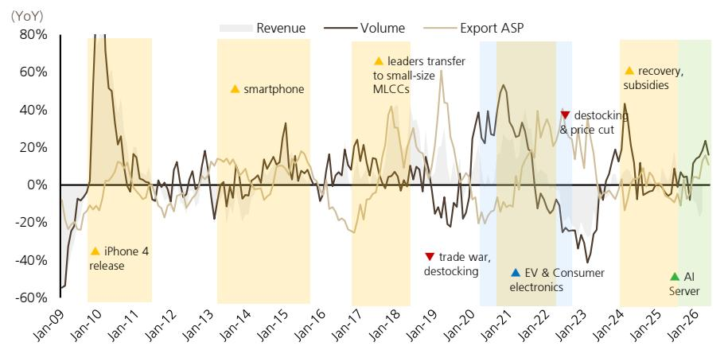  
来源：METI，UBS

我们预计高容MLCC供需在H226仍将偏紧，并建议关注上游材料价格调整的实现情况。据Crypto Briefing报道，三星电机近期获得了一笔4540亿韩元的MLCC订单，市场预期该订单可能来自一家领先的云服务提供商供应商。与此同时，根据UBSEvidence Lab（>访问数据集），截至6月13日，MLCC分销商的单位库存较5月8日下降3%，而库存价值上升1%；因此，我们预计MLCC供需在H226仍将偏紧。我们近期的行业调研显示，MLCC材料供应商的产能利用率较高；如果H2 MLCC需求持续改善，上游材料价格将有显著上行空间。

图3：MLCC分销商库存价值指数  
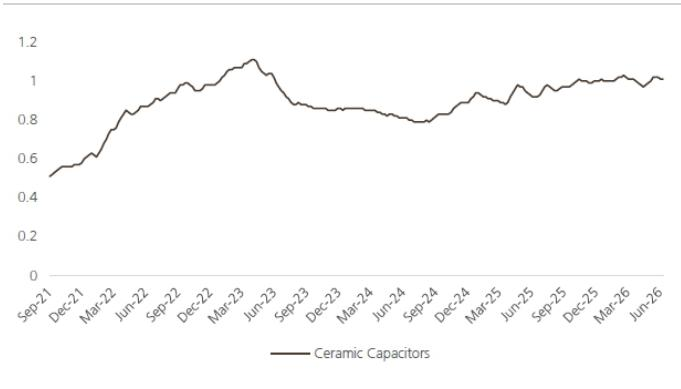  
来源：UBSEvidence Lab（>访问数据集）；注：标准化美元库存。

图4：MLCC分销商库存价值指数（按制造商）  
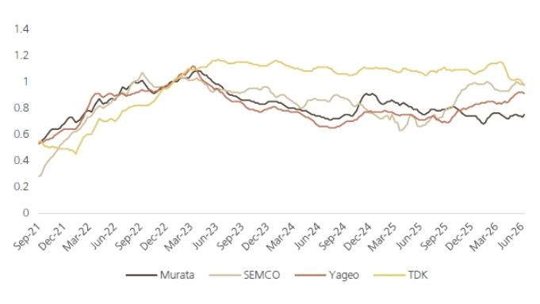  
来源：UBSEvidence Lab（>访问数据集）；注：标准化美元库存。

## 电子特种气体：关注WF6原材料出口；氦气价格小幅回升

六氟化钨（WF6）是半导体制造化学气相沉积（CVD）工艺中使用的一种前驱体材料，主要用于在晶圆表面沉积金属钨薄膜，广泛应用于存储和逻辑芯片制造。今年以来，WF6（5N级）的市场价格从945元/公斤飙升至1,800元/公斤，主要原因是自1月以来，国内月度钨粉（WF6的原材料）出口大幅下降。根据USGS数据，2025年国内钨矿产量占全球近80%，同时也是电子级钨粉的主要生产国。因此，出口减少导致日本和韩国的WF6产能面临原材料短缺。

图5：国内月度钨粉出口量（吨）  
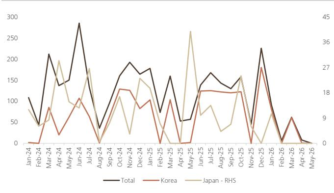  
来源：海关总署

图6：WF6（5N）和钨粉价格趋势（元/公斤）  
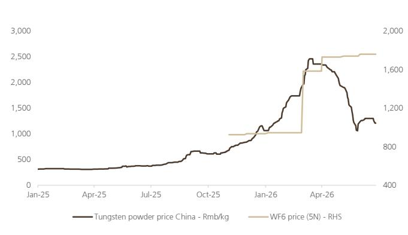  
来源：Wind，隆众资讯

根据中船特气的招股说明书，2025年日本约占全球WF6产能的22%，韩国约占24%。在国内生产商中，中船特气的产能最大，而博瑞中硝、昊华科技和南大光电各拥有600-700吨的WF6产能。

图7：主要WF6产能汇总（2025年）

<table><tr><td>海外</td><td>产能（吨）</td><td>国家</td><td>备注</td></tr><tr><td>SK Materials</td><td>1,800</td><td>韩国</td><td></td></tr><tr><td>关东电化</td><td>1,400</td><td>日本</td><td></td></tr><tr><td>Foosung</td><td>900</td><td>韩国</td><td>南通400吨</td></tr><tr><td>Central Glass</td><td>700</td><td>日本</td><td></td></tr><tr><td>默克</td><td>600</td><td>德国</td><td></td></tr><tr><td>中船特气</td><td>2,230</td><td>中国</td><td>1,000吨新产能将于H127投产</td></tr><tr><td>博瑞中硝</td><td>600</td><td>中国</td><td>与Central Glass的合资企业</td></tr><tr><td>昊华科技</td><td>700</td><td>中国</td><td></td></tr><tr><td>南大光电</td><td>600</td><td>中国</td><td></td></tr></table>

来源：公司数据，UBS

我们认为WF6价格的上行空间取决于钨粉出口。国内市场钨粉均价从1,065元/公斤升至4M26的2,000元+/公斤，但自5月以来已大幅回落至1,200元/公斤以下。WF6（5N）价格的上涨趋势自5月以来也明显放缓。因此，我们认为成本支撑和钨粉供应是WF6价格波动的主要驱动因素。如果国内钨粉出口仍处于低位，WF6价格仍有上行空间。

图8：全球钨产量按国家划分 – 2025年  
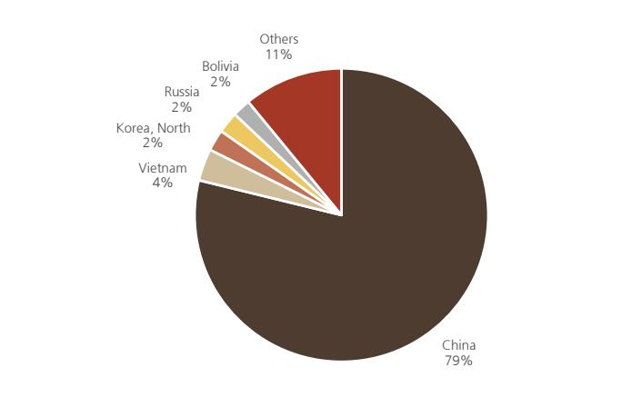  
来源：USGS  
图9：国内钨消费按终端用途划分 – 2023年

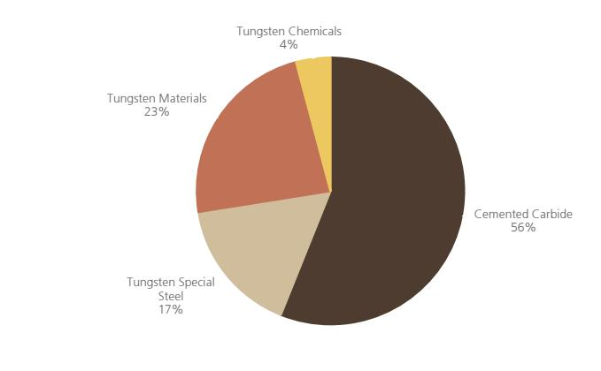  
来源：安泰科

氦气价格近期略有回升，我们预计H226整体将保持稳定。卡塔尔氦气设施3月停产以及俄罗斯4月实施氦气出口管制，导致国内氦气零售价格在4月飙升至约500元/立方米，但5-6月价格回落至约250元/立方米，主要原因是市场预期俄罗斯的供应限制将有所缓解。近期地缘政治风险加剧，氦气价格温和回升。我们预计H226氦气价格的上行和下行风险均有限，预计国内市场价格将维持在200-300元/立方米左右（详见报告）。

图10：国内氦气价格趋势（元/瓶）  
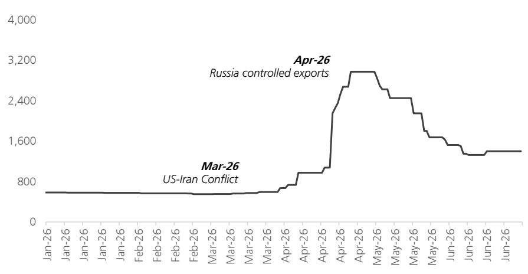  
来源：Wind。注：一瓶约含6立方米氦气。

## 电子湿化学品：原材料成本上涨和需求增长将推动价格调整

电子级氢氟酸（EG-HF）是一种关键的湿电子化学品。它是由无水氟化氢纯化后吸收到超纯水中制备的水溶液。2025年国内市场规模约为42.5亿元，EG-HF的潜在市场受下游产能扩张（如半导体和显示面板）以及国产替代的推动（见我们的报告：氟化工：AI驱动新机遇的受益者）。

我们预计，在原材料价格上涨和需求增长的背景下，EG-HF价格将持续上行。原材料方面，国内无水氟化氢价格今年以来上涨19%，主要受中东冲突导致硫磺价格上涨的推动。除UPSSS级EG-HF外，其他等级EG-HF的国内市场价格今年以来上涨2-22%。我们认为UPSSS级EG-HF的国内价格主要受订单周期影响，成本上涨压力可能得以传导。据多氟多称，半导体级氢氟酸的市场价格已上涨约20-30%。

图11：国内无水氟化氢价格  
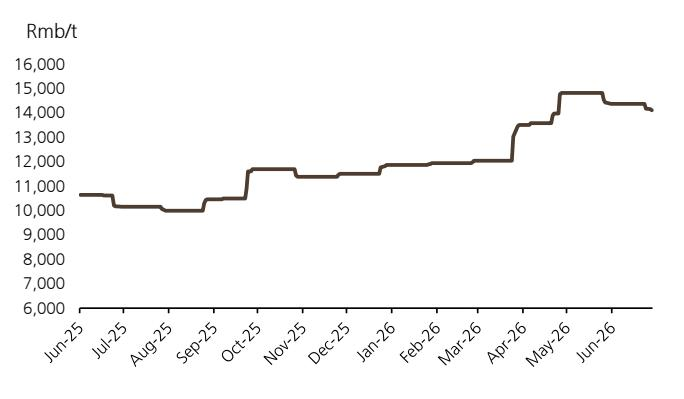  
来源：Wind

图12：国内硫磺价格  
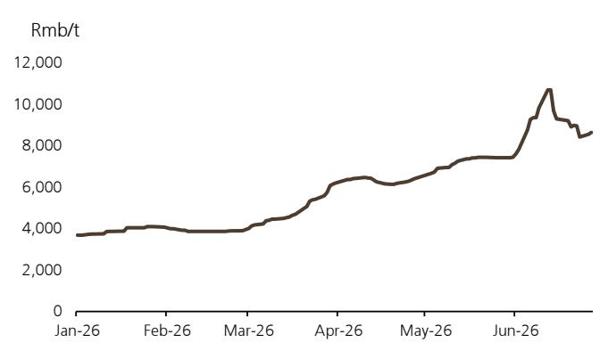  
来源：Wind

图13：国内EG-HF（不含UPSSS级）价格今年以来上涨  
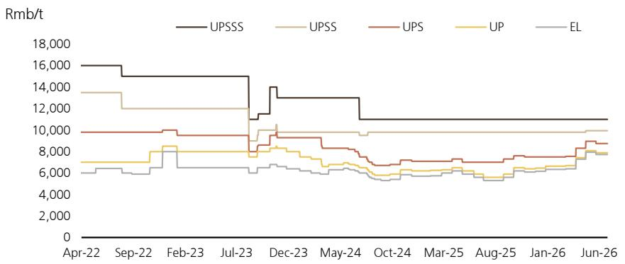  
来源：Wind

据报道，海外晶圆厂正在积极采购EG-HF。出口方面，国内EG-HF出口在5M26同比增长33%，5月均价环比上涨19%，显示出强劲的海外需求。从产品盈利角度看，据多氟多称，下游客户更看重供应稳定性和质量一致性，因为EG-HF在芯片总成本中占比有限。因此，在成本驱动的价格调整中，企业盈利能力得到了良好支撑。在H226，我们建议关注：1）硫磺价格趋势及其对无水氟化氢价格的影响；2）国内EG-HF生产商向海外半导体客户供应/认证的进展。

图14：国内EG-HF出口在5M26同比增长33%  
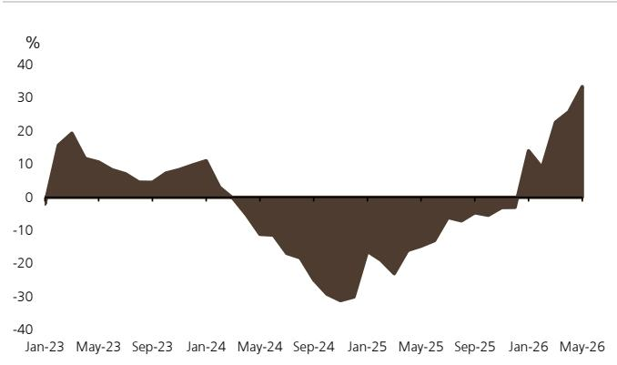  
来源：Wind，海关数据

图15：国内EG-HF出口均价在2026年5月环比上涨19%  
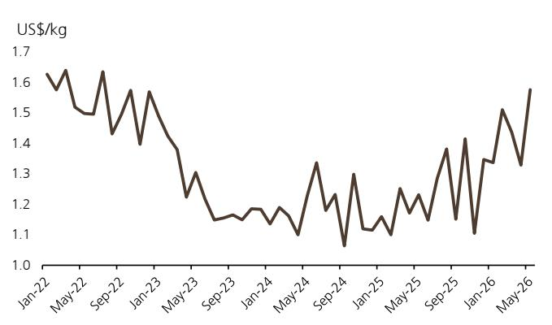  
来源：Wind，海关数据

高纯硫酸/氧化铟锡（ITO）靶材的价格可能受到原材料成本的支撑。硫磺价格今年以来上涨超过一倍，而铟/钼等金属价格分别上涨70%/30%，可能为部分电子化学材料提供成本支撑。与此同时，在下游存储需求的推动下，行业基本面可能触底。我们注意到，高纯硫酸/双氧水的价格自3月以来持续上涨，我们预计钼/ITO靶材的价格将调整以传导原材料成本。

图16：国内高纯双氧水价格趋势  
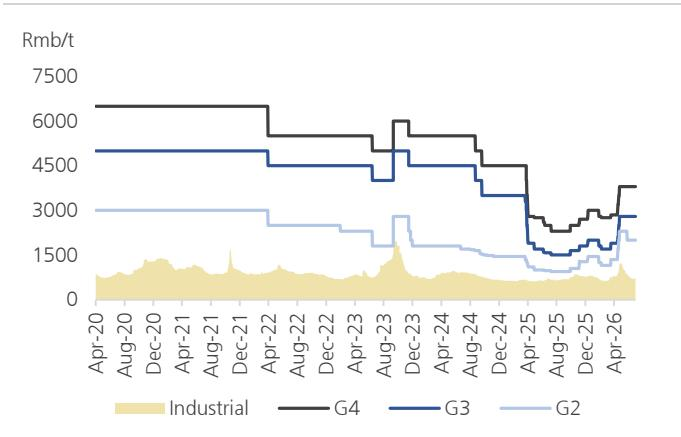  
来源：Wind

图17：国内高纯硫酸价格趋势  
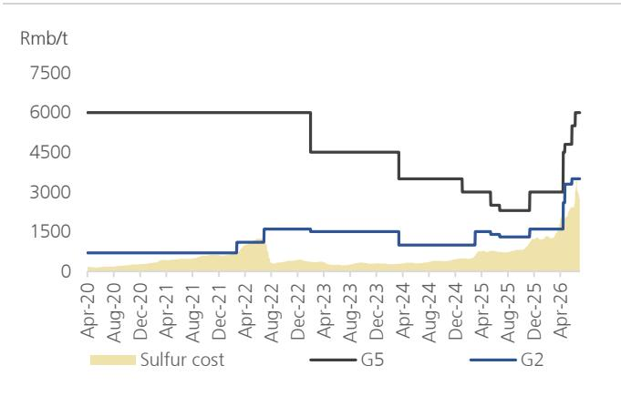  
来源：Wind

图18：国内铟价格趋势  
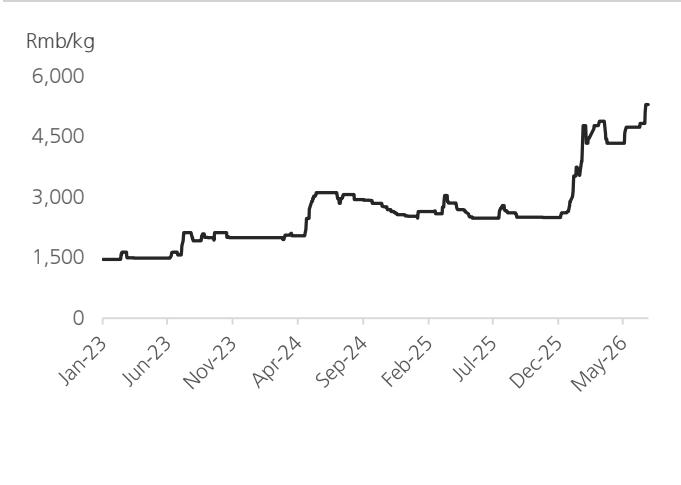  
来源：Wind

图19：国内钼粉价格趋势  
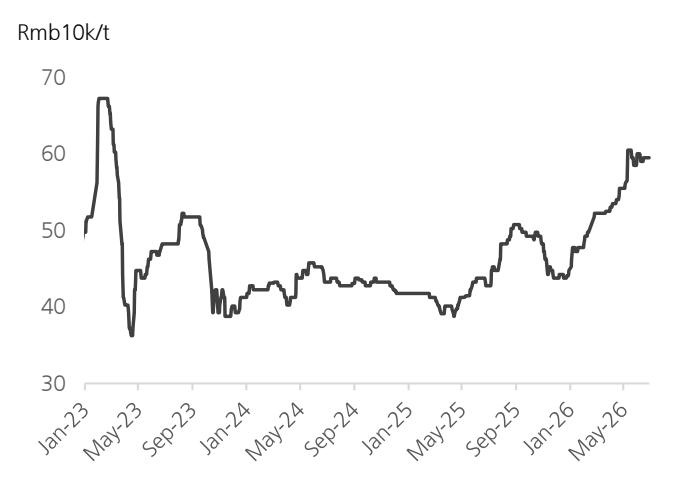  
来源：安泰科

## 个股选择与目标价调整

ESG/MLCC价值链同业的估值已重新定价至2026E市盈增长比率的3.3/2.3倍。ESG/MLCC价值链公司的报价整体今年以来上涨超过一倍，主要原因是市场预期AI服务器/下游存储需求将推动销售和价格上涨。我们认为，当前估值能否在H226维持取决于：1）市场对部分MLCC价值链/电子化学品价格调整的持续预期（我们的可能性排序：MLCC材料 > MLCC > WF6 > 半导体湿化学品 > 氦气；我们建议关注其在H226的演变）。2）市场对AI资本支出预期的变化。

图20：MLCC价值链公司估值比较

<table><tr><td rowspan="2">2026年7月13日</td><td rowspan="2">报价 本币</td><td rowspan="2">市值 人民币十亿</td><td colspan="3">市盈率（倍）</td><td colspan="3">市净率（倍）</td><td colspan="3">净资产回报表现（%）</td><td rowspan="2">每股盈利复合年增长率 26-28E</td><td rowspan="2">市盈增长比率 2026E</td></tr><tr><td>2026E</td><td>2027E</td><td>2028E</td><td>2026E</td><td>2027E</td><td>2028E</td><td>2026E</td><td>2027E</td><td>2028E</td></tr><tr><td colspan="14">MLCC - 中国大陆</td></tr><tr><td>潮州三环*</td><td>111.8</td><td>214.3</td><td>56倍</td><td>41倍</td><td>32倍</td><td>8.7倍</td><td>7.4倍</td><td>6.3倍</td><td>16%</td><td>20%</td><td>21%</td><td>33%</td><td>1.70</td></tr><tr><td>风华高科</td><td>54.0</td><td>62.5</td><td>102倍</td><td>83倍</td><td>70倍</td><td>4.9倍</td><td>4.7倍</td><td>4.5倍</td><td>5%</td><td>6%</td><td>7%</td><td>21%</td><td>4.84</td></tr><tr><td>平均</td><td></td><td></td><td>79倍</td><td>62倍</td><td>51倍</td><td>6.8倍</td><td>6.1倍</td><td>5.4倍</td><td>11%</td><td>13%</td><td>14%</td><td>27%</td><td>3.27</td></tr><tr><td colspan="14">MLCC保护膜</td></tr><tr><td>EM Technology*</td><td>49.5</td><td>50.0</td><td>64倍</td><td>37倍</td><td>27倍</td><td>7.8倍</td><td>7.0倍</td><td>6.2倍</td><td>13%</td><td>20%</td><td>24%</td><td>53%</td><td>1.21</td></tr><tr><td>洁美科技*</td><td>72.6</td><td>31.3</td><td>71倍</td><td>49倍</td><td>38倍</td><td>9.1倍</td><td>8.1倍</td><td>7.0倍</td><td>13%</td><td>17%</td><td>20%</td><td>37%</td><td>1.93</td></tr><tr><td>SDK</td><td>77.5</td><td>35.1</td><td>150倍</td><td>76倍</td><td>52倍</td><td>13.6倍</td><td>11.1倍</td><td>8.7倍</td><td>9%</td><td>15%</td><td>18%</td><td>70%</td><td>2.15</td></tr><tr><td>平均</td><td></td><td></td><td>95倍</td><td>54倍</td><td>39倍</td><td>10.2倍</td><td>8.7倍</td><td>7.3倍</td><td>12%</td><td>18%</td><td>21%</td><td>53%</td><td>1.76</td></tr><tr><td colspan="14">MLCC粉体</td></tr><tr><td>国瓷材料*</td><td>64.0</td><td>63.8</td><td>80倍</td><td>57倍</td><td>45倍</td><td>8.2倍</td><td>7.3倍</td><td>6.4倍</td><td>11%</td><td>13%</td><td>15%</td><td>33%</td><td>2.43</td></tr><tr><td>江苏博迁*</td><td>184.0</td><td>48.1</td><td>92倍</td><td>63倍</td><td>45倍</td><td>23.1倍</td><td>18.4倍</td><td>14.3倍</td><td>28%</td><td>33%</td><td>36%</td><td>43%</td><td>2.12</td></tr><tr><td>平均</td><td></td><td></td><td>86倍</td><td>60倍</td><td>45倍</td><td>15.7倍</td><td>12.8倍</td><td>10.3倍</td><td>19%</td><td>23%</td><td>25%</td><td>38%</td><td>2.28</td></tr><tr><td>MLCC价值链平均</td><td></td><td></td><td>88倍</td><td>58倍</td><td>44倍</td><td>10.8倍</td><td>9.1倍</td><td>7.6倍</td><td>14%</td><td>18%</td><td>20%</td><td>41%</td><td>2.34</td></tr></table>

来源：Wind，UBS估算。\*UBS覆盖的公司；对于未覆盖的公司，我们使用Wind一致预期。注：价格截至2026年7月13日。

图21：半导体材料供应商估值比较

<table><tr><td rowspan="2">2026年7月13日</td><td rowspan="2">报价 本币</td><td rowspan="2">市值 十亿美元</td><td colspan="3">市盈率（倍）</td><td colspan="3">市净率（倍）</td><td colspan="3">净资产回报表现（%）</td><td rowspan="2">每股盈利复合年增长率 2026-28E</td><td rowspan="2">市盈增长比率 2026E</td></tr><tr><td>2026E</td><td>2027E</td><td>2028E</td><td>2026E</td><td>2027E</td><td>2028E</td><td>2026E</td><td>2027E</td><td>2028E</td></tr><tr><td colspan="14">光刻胶</td></tr><tr><td>晶瑞电材*</td><td>16.7</td><td>2.6</td><td>119倍</td><td>73倍</td><td>60倍</td><td>6.5倍</td><td>6.1倍</td><td>5.7倍</td><td>6%</td><td>9%</td><td>10%</td><td>40%</td><td>2.95</td></tr><tr><td>彤程新材</td><td>79.6</td><td>7.4</td><td>68倍</td><td>55倍</td><td>51倍</td><td>12.3倍</td><td>11.5倍</td><td>9.3倍</td><td>18%</td><td>21%</td><td>17%</td><td>16%</td><td>4.23</td></tr><tr><td>南大光电</td><td>70.2</td><td>7.3</td><td>111倍</td><td>91倍</td><td>77倍</td><td>13.0倍</td><td>12.0倍</td><td>11.0倍</td><td>12%</td><td>13%</td><td>14%</td><td>20%</td><td>5.62</td></tr><tr><td>平均</td><td></td><td></td><td>99倍</td><td>73倍</td><td>63倍</td><td>10.6倍</td><td>9.8倍</td><td>8.6倍</td><td>12%</td><td>14%</td><td>14%</td><td>25%</td><td>4.27</td></tr><tr><td colspan="14">电子特种气体</td></tr><tr><td>华特气体*</td><td>208.1</td><td>3.7</td><td>124倍</td><td>80倍</td><td>65倍</td><td>11.7倍</td><td>10.7倍</td><td>9.6倍</td><td>10%</td><td>14%</td><td>16%</td><td>39%</td><td>3.21</td></tr><tr><td>金宏气体*</td><td>37.5</td><td>2.7</td><td>60倍</td><td>40倍</td><td>32倍</td><td>5.5倍</td><td>5.2倍</td><td>4.8倍</td><td>9%</td><td>13%</td><td>15%</td><td>36%</td><td>1.66</td></tr><tr><td>昊华科技</td><td>54.6</td><td>10.6</td><td>33倍</td><td>28倍</td><td>25倍</td><td>3.6倍</td><td>3.3倍</td><td>3.0倍</td><td>11%</td><td>12%</td><td>12%</td><td>17%</td><td>2.01</td></tr><tr><td>中船特气</td><td>244.5</td><td>19.4</td><td>259倍</td><td>204倍</td><td>159倍</td><td>不适用</td><td>不适用</td><td>不适用</td><td>8%</td><td>10%</td><td>11%</td><td>28%</td><td>9.37</td></tr><tr><td>广钢气体*</td><td>44.3</td><td>8.6</td><td>116倍</td><td>79倍</td><td>51倍</td><td>9.2倍</td><td>8.5倍</td><td>7.6倍</td><td>8%</td><td>11%</td><td>16%</td><td>52%</td><td>2.25</td></tr><tr><td>雅克科技</td><td>189.0</td><td>13.5</td><td>67倍</td><td>54倍</td><td>14倍</td><td>10.0倍</td><td>8.8倍</td><td>2.0倍</td><td>15%</td><td>16%</td><td>14%</td><td>23%</td><td>2.89</td></tr><tr><td>平均</td><td></td><td></td><td>110倍</td><td>81倍</td><td>58倍</td><td>8.0倍</td><td>7.3倍</td><td>5.4倍</td><td>10%</td><td>13%</td><td>14%</td><td>32%</td><td>3.56</td></tr><tr><td colspan="14">湿电子化学品</td></tr><tr><td>上海新阳</td><td>113.4</td><td>5.3</td><td>84倍</td><td>60倍</td><td>49倍</td><td>6.8倍</td><td>6.2倍</td><td>5.5倍</td><td>8%</td><td>11%</td><td>12%</td><td>31%</td><td>2.73</td></tr><tr><td>江化微</td><td>41.9</td><td>2.4</td><td>114倍</td><td>86倍</td><td>66倍</td><td>不适用</td><td>不适用</td><td>不适用</td><td>7%</td><td>9%</td><td>10%</td><td>31%</td><td>3.63</td></tr><tr><td>新宙邦*</td><td>67.4</td><td>7.5</td><td>25倍</td><td>20倍</td><td>18倍</td><td>4.0倍</td><td>3.5倍</td><td>3.1倍</td><td>18%</td><td>19%</td><td>18%</td><td>18%</td><td>1.42</td></tr><tr><td>兴福电子</td><td>105.4</td><td>5.7</td><td>121倍</td><td>81倍</td><td>60倍</td><td>12.1倍</td><td>11.2倍</td><td>10.1倍</td><td>10%</td><td>13%</td><td>16%</td><td>42%</td><td>2.91</td></tr><tr><td>平均</td><td></td><td></td><td>76倍</td><td>54倍</td><td>42倍</td><td>7.6倍</td><td>7.0倍</td><td>6.2倍</td><td>12%</td><td>14%</td><td>15%</td><td>30%</td><td>2.35</td></tr><tr><td colspan="14">CMP</td></tr><tr><td>安集科技</td><td>297.6</td><td>10.1</td><td>63倍</td><td>47倍</td><td>38倍</td><td>15.2倍</td><td>11.9倍</td><td>9.4倍</td><td>24%</td><td>25%</td><td>25%</td><td>30%</td><td>2.13</td></tr><tr><td>
