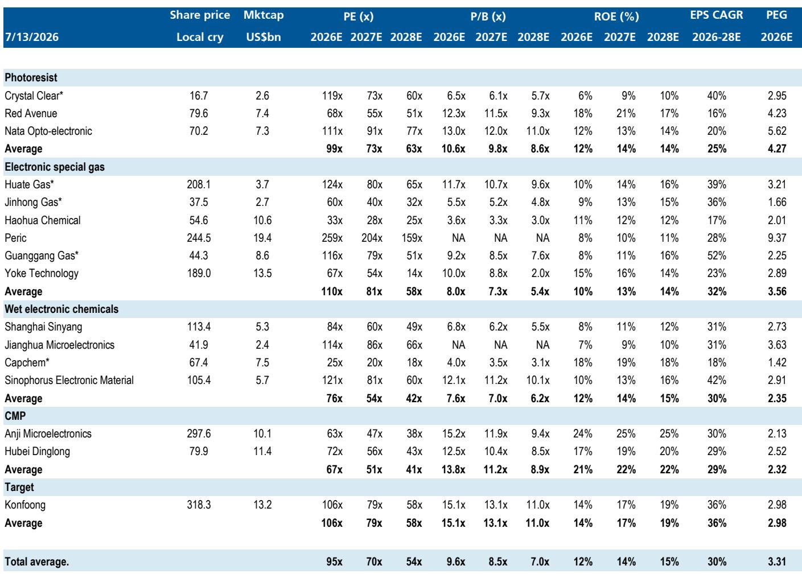
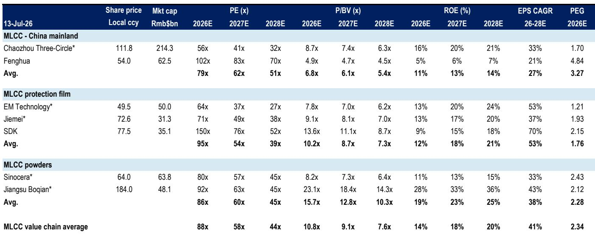
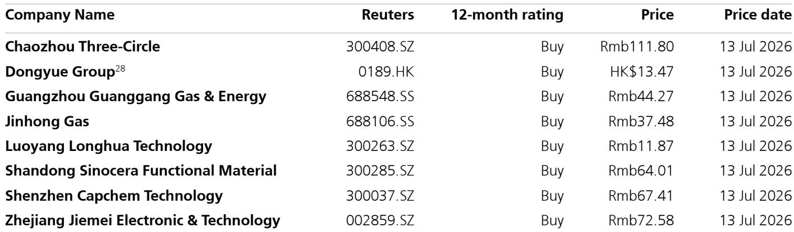

# 价格调整，而非仅仅是AI热潮，将决定中国化工新材料领域下一阶段的表现

中国MLCC和电子特气公司的报价今年以来已弹性较高有余，这一变动最初看似是对AI服务器需求的直接押注。然而，这一涨势近期有所回调，揭示了一个更为微妙的现实：市场正在计入第二个更具体的催化剂，它将区分领先者与落后者。这个催化剂就是产品价格调整。在AI驱动需求增长的初期热潮过后，该领域下一阶段的表现将取决于哪些公司能够成功转嫁成本上涨并收紧供需关系以改善利润空间。证据已经清晰可见。国巨已通知客户，自7月1日起上调MLCC价格，涵盖AI服务器、消费电子、汽车和工业领域。六氟化钨（WF6），一种关键的CVD前驱体，今年以来价格已弹性较高至每公斤1800元人民币，其驱动因素不仅是需求，还有中国钨粉出口的显著下降。电子级氢氟酸（EG-HF）各等级价格已上涨2-22%，这得益于无水氟化氢成本上升19%，而后者又与中东局势导致的硫磺价格飙升有关。对于观察者而言，战略问题不再是“AI在增长吗？”，而是“哪些产品链具备结构性条件，能够在2026年下半年维持价格上调？”

答案在于一个价格上调可见性的层级结构，从上游的MLCC材料（最高），到MLCC和WF6，再到湿电子化学品和氦气（最低）。这一排序并非随意。它反映了三种力量的相互作用：原材料成本传导、独立于需求的供给约束，以及生产者相对于客户的定价能力。处于这三种力量交汇点的公司——例如MLCC离型膜生产商洁美科技和三环集团，或电子气体供应商如广钢气体——提供了最可靠的盈利上调基础。那些仅依赖AI需求动能，而没有结构性供给或成本催化剂的公司，若AI资本开支预期降温，则面临更大的估值压缩风险。2026年下半年将是该领域内分化而非趋同的时期。

## 高容MLCC供需在下半年将保持紧张，但上游材料提供更优的价格上调可见性

MLCC价值链是检验价格上调论点的最透明案例。分销商保持乐观，国巨7月1日的涨价公告是一个具体信号，表明制造商相信他们具备提价的筹码。理由很直接。AI服务器对高容MLCC的需求正在挤占大量产能，留给消费电子和汽车订单的空间减少。分销商和终端用户的库存约为一个月，处于较低水平。国内主要MLCC制造商接近满负荷运转，并正在缩减优惠定价政策。根据UBS证据实验室数据，MLCC分销商的单位库存在5月8日至6月13日期间实际下降了3%，即使库存价值上升了1%，这是供应趋紧的典型迹象。

然而，最引人注目的机会在于上游一步。MLCC材料供应商的产能利用率很高，如果MLCC需求持续改善，这些上游材料价格有显著的上涨潜力。其逻辑是结构性的。MLCC制造商在面临成本上升和强劲需求时，可以将价格上涨转嫁给客户。但他们自身的投入成本——特别是离型膜、陶瓷粉末和其他特种材料——也在上升。供应这些投入品的公司拥有更强的定价能力，因为它们处于更集中的市场。例如，洁美科技2026年预计收入的90%来自电子领域，其中25%专门来自MLCC离型膜，这是一种替代品很少的产品。三环集团有40%的MLCC业务敞口和50%的电子收入，受益于同样的动态。这些公司的PEG比率——洁美科技2026年预期盈利的1.9倍，三环集团的1.7倍——反映了市场对这种定价能力的认可，但下半年的价格上调仍有空间。

## 六氟化钨价格取决于中国的出口政策，而非仅仅是半导体需求

WF6市场展示了一种不同的、更具地缘政治驱动力的价格机制。今年以来，WF6（5N级）已从每公斤945元人民币弹性较高至每公斤1800元人民币。主要驱动力并非芯片制造需求的激增，而是自1月以来中国钨粉月出口量的急剧下降。2025年，中国占全球钨矿产量的近80%，并且是电子级钨粉的主要生产国。当中国出口下降时，日本和韩国的WF6生产商——它们合计约占全球产能的46%——面临原材料短缺。华特气体作为国内最大的生产商，拥有2230吨产能，另有1000吨预计在2027年上半年投产，处于有利位置以获取这种定价能力。

这里的细微之处在于，自5月以来，国内WF6价格已有所缓和，这与国内钨粉价格从每公斤2000元人民币以上回落至每公斤1200元人民币以下的走势一致。这种相关性意味着，WF6价格上调的可持续性完全取决于中国钨粉出口是否保持低位。如果出口保持低位，WF6价格有进一步上涨空间。如果出口恢复正常，价格催化剂就会减弱。对于观察者而言，这创造了一个在MLCC链条中不存在的二元风险。像洁美科技和三环集团这样的公司受益于需求驱动的收紧。WF6的受益者，包括华特气体和昊华科技，则与一个政策变量挂钩。这就是为什么WF6在价格上调可见性层级中排在MLCC材料之下。上涨潜力是真实的，但它取决于公司无法控制的因素。

## 电子湿化学品受益于成本推动和海外需求，但利润扩张更为渐进

电子湿化学品领域——特别是电子级氢氟酸（EG-HF）和高纯硫酸——遵循不同的定价逻辑。在这里，价格驱动力主要是成本推动而非供应紧张。EG-HF的关键原材料无水氟化氢的价格今年以来已上涨19%，这得益于中东局势导致的硫磺价格飙升。硫磺价格今年以来已弹性较高有余。这一成本上涨正在被传导。除最高纯度的UPSSS等级外，国内EG-HF价格今年以来已上涨2-22%，半导级氢氟酸价格已上涨20-30%。

使这一领域有趣的是，海外晶圆厂正在主动采购中国的EG-HF。2026年前五个月，中国EG-HF出口同比增长33%，5月出口均价环比上涨19%。这表明，即使成本上升，国际半导体制造商也愿意为供应稳定性和质量一致性支付溢价。由于EG-HF在芯片总成本中占比有限，下游客户对价格不那么敏感，这支撑了生产商的盈利能力。对于像天赐材料、东岳集团这样既有主营业务复苏又有电子材料增长空间的公司，这创造了一个稳定、复合的盈利轨迹，而非剧烈波动。广钢气体和金宏气体到2028年的复合年增长率估计分别为52%和36%，反映了这种结构性增长，但各自2.2倍和1.7倍的PEG比率表明，市场尚未对这种可预测性赋予高估值。

## 2026年下半年价格上调周期的定位决策框架

这些细分领域之间价格上调可见性的差异，为观察者创造了一个清晰的决策框架。第一个维度是价格催化剂的性质。它是需求驱动、成本推动还是供给约束？需求驱动的价格上调，如MLCC材料所见，最为可持续，因为它们反映了真实终端市场的拉动。成本推动的上调，如EG-HF，更为脆弱，因为它们依赖于可能逆转的原材料价格。供给约束的上调，如WF6，最为二元化，因为它们依赖于一个政策变量。

第二个维度是公司对价格敏感产品的敞口。洁美科技25%的收入来自MLCC离型膜，加上90%的电子业务敞口，使其成为一个高确信度的选择，因为价格上调催化剂直接驱动了大部分盈利。三环集团40%的MLCC敞口同样直接。相比之下，一家公司即使氦气价格上升，如果只有25%的氦气业务敞口，其盈利影响也会更为稀释。PEG比率强化了这一点。洁美科技的2026年预期PEG为1.9倍，而MLCC保护膜行业平均为1.76倍。对于到2028年每股收益复合年增长率达37-53%的公司来说，这些倍数并不昂贵。

第三个维度是估值缓冲。在最近的报价回调之后，一些标的在电子气体领域提供了最具吸引力的机会。金宏气体有41%的上涨空间和1.7倍PEG，紧随其后。在MLCC链条中，三环集团有43%的上涨空间和1.7倍PEG，洁美科技有43%的上涨空间和1.9倍PEG，提供了类似的风险回报。这一框架的关键风险是AI资本开支预期的降温，这将压缩整体估值倍数。但在该领域内，那些价格上调可见性较强、PEG比率最低的公司提供了最大的下行保护。

2026年下半年将区分出那些能够执行价格上调的公司和那些仅仅是搭乘AI浪潮的公司。证据指向洁美科技、三环集团、广钢气体、天赐材料和东岳集团，它们最有可能实现这一论点。它们的盈利修正并非依赖于单一催化剂，而是依赖于需求、供给和定价能力的结构性对齐。对于愿意超越表面AI叙事的观察者而言，这才是真正价值所在。

*仅供参考。部分内容可能基于源材料通过AI辅助生成、翻译、总结或编辑，可能存在遗漏或错误。请独立核实。本文不构成任何专业建议。*

仅供参考。部分内容可能基于源材料通过AI辅助生成、翻译、总结或编辑，可能存在遗漏或错误。请独立核实。本文不构成任何专业建议。

