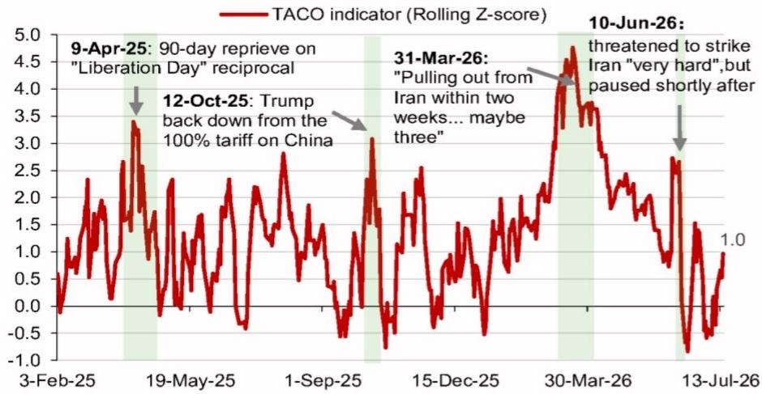

# 宏观环境观察 - 全球视角

## 关于美元走势的思考

我们关注几个关键观察点，以判断美元是否接近一个转折阶段。

- 美国6月CPI数据低于预期，这为美元空方观点提供了一定支撑，也与我们中期内美元偏弱的看法一致。
- 我们可能正接近美元的转折点，但在做出更明确的判断之前，还需要观察和确认几个关键因素。
- 从数据时间来看，这些因素包括即将公布的美国6月PPI、7月FOMC会议、6月核心PCE、7月非农就业数据，甚至可能包括下一次7月CPI报告。
- 另一个关注点是相关地区的地缘局势，以及近期事态的演变是否会走向长期缓和。
- 我们还将关注持续强劲的外资流入美国市场的趋势是否会延续或放缓。

美国6月核心CPI（环比0%，市场预期0.2%）低于预期，这在一定程度上抑制了市场对美元的短期看多情绪。这份偏温和的通胀报告也进一步支持了我们中期内美元偏弱的观点，驱动因素包括：a) 我们的研究团队认为美国增速相对于其他主要经济体可能放缓，同时美联储将维持观望而其他主要央行（如欧央行和日央行）可能继续调整政策；b) 部分大型机构计划降低对美国资产的配置比例；c) 对央行独立性的关注；d) 美国资产的多头持仓以及当前强劲的资产流入的可持续性，需考虑宏观环境、政策风险以及相关产业投入增加带来的担忧（例如美国双赤字融资风险上升）；e) 若美元开始走弱，可能触发的外汇对冲性卖出。

然而，尽管我们可能正接近美元走弱的节点，短期内仍有几个关键观察点需要关注和确认，才能做出更明确的判断。这些包括：

1. 未来几周的美国数据，例如：
   a. 6月PPI（7月15日），我们的研究团队认为，与PCE相关的PPI数据可能对6月PCE有一定正向贡献。
   b. FOMC会议（美东时间7月29日），市场将借此判断在6月CPI数据偏软后，FOMC对通胀的看法是否有所变化，且届时美联储主席可能已知悉6月核心PCE数据（核心PCE于7月30日公布）。
   c. FOMC会议后，市场将利用7月非农就业数据（8月7日）来评估劳动力市场/经济的相对表现。
   d. 我们的研究团队指出，6月CPI的走软可能部分受到一些“一次性因素”的影响，例如住宿价格的大幅下降，这使得下一次CPI报告（8月12日）的重要性进一步提升，以判断6月核心CPI环比持平是否为异常值。

2. 相关地区的地缘局势，以及近期事态是否会很快转向缓和。我们在7月10日的报告中提到，对于相关军事行动的演变持谨慎态度。关键原因在于霍尔木兹海峡的航运近乎停滞，如果这种情况持续，可能会进一步推高能源价格。我们的相关指标显示，目前相关方受到的压力有所增加，但尚未达到历史高位，因此似乎并非迫在眉睫（约1个标准差；图1）。此外，最新消息显示相关行动可能将继续，除非各方回到谈判桌。即使相关方暂时后退并宣布重返谈判，只要在霍尔木兹海峡通行费及核材料等关键问题上未达成协议，局势再次升级的风险依然存在。

3. 外资持续流入美国市场。我们对流入美国相关基金（即美国ETF和共同基金）的外资衡量指标显示，7月至今（截至7月14日）外资持续稳定流入美国市场。目前的流入速度与2026年6月（也是一个外资强劲流入美国市场的月份）以及2024年美国市场表现突出时期（图2）的水平相似。虽然较低的通胀读数、较低的政策利率预期以及相对强劲的美国增长背景可能在短期内推动美国市场表现突出的主题回归，但我们的中期展望则不那么乐观。我们的研究团队预测未来几个季度美国经济可能有所放缓，我们仍将关注任何可能对市场产生负面冲击的因素（例如，目前市场对相关产业投入周期、相关领域信贷等存在一些担忧）。

图1：相关指标

来源：彭博、CEIC、相关机构。

图2：美国相关基金资金流向与美元指数

注：2026年7月数据截至7月14日。
来源：彭博、CEIC、相关机构。
