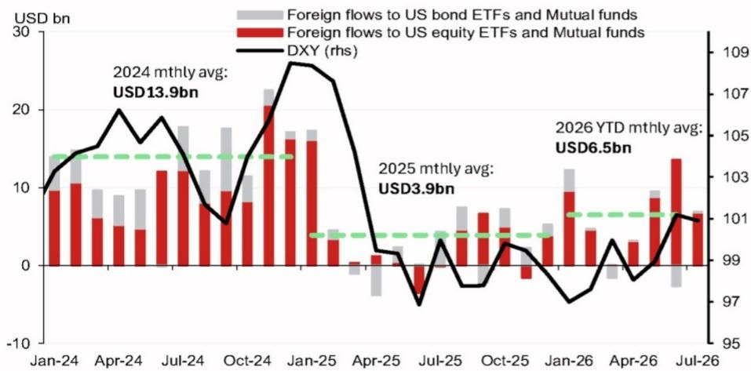

# NOM：宏观观察笔记

一份低于预期的美国6月核心CPI（环比0%，市场预期0.2%）让市场开始讨论美元是否已经触顶。NOM宏观策略团队在最新报告中明确表示，他们中期看弱美元的观点得到数据支撑，但“接近拐点”不等于“已经确认拐点”。报告列出了三个必须观察的变量，这些变量将决定美元是就此走弱，还是经历短暂回调后重新走强。

NOM看弱美元的中期逻辑建立在五个支柱上：美国宏观环境增长相对其他主要地区节奏变化、美联储按兵不动而欧日央行继续加息、部分大型读者计划降低美国资产配置、美联储独立性担忧、以及长期美国资产持仓和持续强劲的资本流入能否维持。6月CPI数据为这五个支柱中的第一个提供了即时证据，但报告认为，仅凭一个月的通胀数据还不足以做出结论性判断。

## 1. 未来四周的数据密度，决定了市场能否确认通胀趋势

NOM特别强调了接下来一系列数据的时间顺序和相互验证关系。7月15日的6月PPI将影响核心PCE的测算；7月29日的FOMC会议将检验美联储官员对通胀看法的变化——届时6月核心PCE数据（7月30日发布）已在会议期间被主席知晓；8月7日的7月非农数据将提供劳动力市场的最新信号；而8月12日的下一次CPI报告，则直接回答6月核心CPI环比零增长是否只是“一次性因素”所致——报告特别指出，6月数据中“住宿-离家价格”的急剧下降可能放大了通胀节奏变化幅度。

> **KC评论：** 市场往往对单月数据反应过度。NOM的策略是让数据自己说话——他们不是在赌方向，而是在等四个数据点形成一致性信号。对于关注美元走势的读者，未来四周的每个数据发布日都可能成为短期波动触发点，但真正的趋势确认可能需要等到8月中旬。

## 2. 美伊冲突的演变路径，比通胀数据更难预测

报告引用了NOM自有的TACO指标来评估特朗普在美伊冲突中“退缩”的概率。截至7月15日，该指标显示特朗普退缩的不确定性有所上升，但仍处于约一个标准差的位置，远未达到历史高位。更重要的是，特朗普在7月15日的公开表态中明确表示，对伊朗的攻击将继续，并计划扩大至“发电厂、桥梁”等基础设施，除非伊朗回到谈判桌。

NOM指出，即使特朗普最终宣布回到谈判桌，只要霍尔木兹海峡的航运近乎停滞的状态持续，以及伊朗浓缩核材料的问题未解决，冲突再次升级的不确定性就不会消失。这条线索的演变将直接影响油价，进而通过通胀预期传导至美元定价。

## 3. 美国资产流入的持续性，是美元最容易被忽视的支撑

报告展示了一个关键图表：截至7月14日，7月流入美国公司ETF和共同产品的资金规模，与2026年6月（另一个强劲流入月）以及2024年美国“例外论”时期的流入速度相当。这意味着，尽管市场对AI资本开支周期和私人信贷不确定性存在担忧，但资金仍在持续涌入美国资产。

NOM的中期观点认为，美国宏观环境将在未来几个季度节奏变化，这种流入速度难以持续。但短期内，较低的通胀读数、较低的美联储加息预期以及相对强劲的增长背景，反而可能重新点燃“美国例外论”交易。换句话说，美元走弱的前提，是这些资金流入出现实质性节奏变化——而目前的数据还没有显示这个信号。

这份报告的价值不在于给出一个确定的方向判断，而在于提供了一个清晰的观察框架：美元是否真正转向，取决于通胀数据能否形成趋势、地缘不确定性是否可控、以及资本流入是否开始减速。三个变量中任何一个出现意外，都可能改变美元的中期路径。

For informational purposes only. Portions may be generated,translated,summarized,or edited with AI assistance based on source materials and may contain omissions or errors. Please verify independently. This is not investment,legal,tax,accounting,or other professional advice.

For informational purposes only. Portions may be generated,translated,summarized,or edited with AI assistance based on source materials and may contain omissions or errors. Please verify independently. This is not investment,legal,tax,accounting,or other professional advice.

