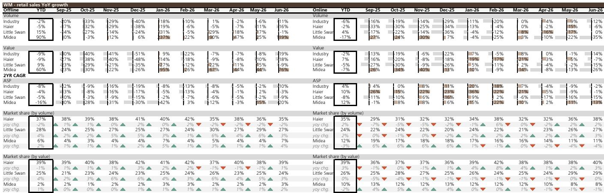
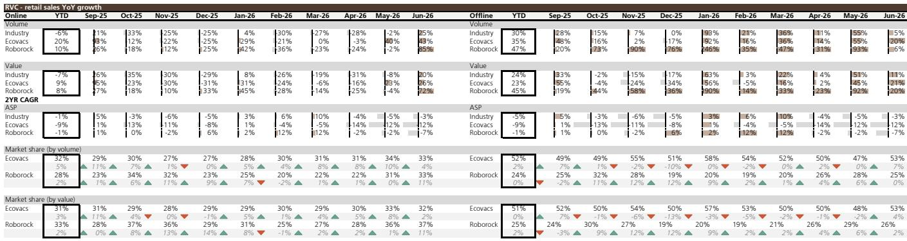
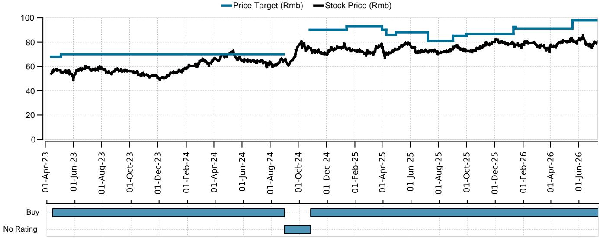

# China's Appliance Sector Faces a Sharp Demand Correction,But the Recovery Case Is Already Taking Shape

June 2026 delivered a stark reality check for China's consumer appliance market. According to AVC 报告观点-through data,omni-channel white goods retail sales in June collapsed by 11% to 28% year-on-year,with the overall first-half decline reaching between 6% and 21% across major categories. The culprit is not a sudden loss of consumer confidence,but a predictable hangover from the subsidy-driven boom and aggressive 618 promotional activity in 2025,which created a punishingly high base for comparison. For investors who have grown accustomed to the sector's post-pandemic resilience,the June numbers are a necessary,if uncomfortable,recalibration.

The headline figures obscure a more nuanced picture. The robot vacuum cleaner (RVC) segment,for instance,posted a 20% year-on-year increase in online sales during June,driven by 25% volume growth. This divergence is the first signal that the appliance market is not experiencing a uniform downturn. It is fragmenting along lines of product maturity,subsidy exposure,and consumer willingness to trade up. The strategic question for investors is not whether the sector is weak,but which pockets of weakness are cyclical and which are structural,and where the next wave of demand will originate.

The data from the first half of 2026 tells a story of subsidy withdrawal symptoms. The government's consumption stimulus programs,which turbocharged replacement cycles in 2024 and 2025,have largely run their course. The resulting high base means that even stable unit volumes translate into negative year-on-year growth rates. This is a mechanical effect,not evidence of a broken market. The real risk lies in the possibility that the subsidy pull-forward has permanently borrowed demand from future periods. The evidence so far suggests otherwise:the correction is sharp but concentrated,and several leading indicators point toward stabilization in the second half of the year.

For serious investors,the current environment demands a shift in analytical lens. The easy gains from beta exposure to the Chinese consumer recovery are gone. What remains is a stock-picker's market where brand strength,product mix,and channel strategy determine outcomes. The June data provides a rich set of signals for identifying which companies are gaining structural share and which are merely riding a fading tide.

## Haier Is Executing a Silent Share Grab in White Goods While Xiaomi's Momentum Fades

The most consequential competitive dynamic in China's major appliance market during the first half of 2026 is Haier's steady,multi-category share gains,particularly online. In washing machines and refrigerators,Haier's online market share increased by 3 and 7 percentage points year-on-year respectively in June. Offline,the gains were more modest but still positive:1 percentage point in washing machines and 2 percentage points in refrigerators. This is not a flash in the pan. It is the culmination of years of investment in direct-to-consumer channels,supply chain digitization,and brand positioning that resonates with quality-conscious middle-class households.

The contrast with Xiaomi is instructive. Xiaomi's online share in white goods continued to erode in June,declining by 2 percentage points in air conditioners,3 percentage points in washing machines,and 2 percentage points in refrigerators. Xiaomi's model of driving volume through aggressive pricing and ecosystem cross-selling appears to be losing its edge as the market matures. Consumers,when faced with a softer demand environment and fewer promotional lures,are gravitating toward brands with established reliability and service networks. Haier's offline strength,particularly its after-sales service infrastructure,becomes a competitive moat precisely when the market is not growing.

Midea's position is more mixed and therefore more revealing. In air conditioners,Midea lost 2 percentage points of online share year-on-year in June,but gained 1 percentage point offline. The sub-brand WAHIN held steady. This suggests that Midea's online promotional intensity,which historically drove volume,is encountering diminishing returns. The company may be deliberately ceding share in the most price-sensitive online segments to protect margins. The fact that Midea remains the top pick in the white goods sector for the research team behind this data indicates that this is a calculated trade-off,not a weakness.

The strategic implication is clear:the white goods market is transitioning from a volume game to a value game. Companies that can command a price premium through brand trust and product differentiation will 报告观点those that rely on price-induced volume spikes. Haier's current trajectory suggests it understands this better than most of its peers.

## The RVC Market Is Undergoing a Structural Shift Toward Premium Consolidation,Not a Cyclical Slowdown

While white goods suffered from base effects,the robot vacuum cleaner market told a fundamentally different story. Online RVC sales value grew 20% year-on-year in June,driven by 25% volume growth. The first-half online sales value declined only 7% year-on-year,a far milder contraction than the double-digit drops seen in air conditioners and washing machines. More importantly,the May-June period,which encompasses the 618 festival,saw online RVC sales value increase 4% year-on-year,confirming that the category retains genuine demand momentum.

The competitive dynamics within RVC are even more instructive than the aggregate numbers. Roborock's online share surged to 37% in June,an 11 percentage point increase year-on-year. Ecovacs held steady at 32%,gaining 2 percentage points. Dreame,by contrast,lost 4 percentage points,falling to 10%. DJI,the drone company,entered the RVC market in May and captured 5% online share by June,up from 1% sequentially.

This is a market undergoing rapid consolidation around a leader. Roborock's gains are not coming from a rising tide;they are coming from direct share capture at the expense of Dreame and other second-tier players. The wet-dry vacuum cleaner segment tells a similar story. Roborock's online sales in this sub-category grew 62% year-on-year in June,against a market average of 12%. Its value share reached 30%,just 2 percentage points behind the category leader Tineco at 32%.

The so-what for investors is that the RVC market is evolving from a fragmented,feature-competitive space into a brand-consolidation story. The winners will be those with the strongest R&D pipelines,the most effective channel partnerships,and the ability to command premium pricing. Roborock's performance suggests it is executing on all three fronts. The entry of DJI,with its engineering pedigree and brand recognition,adds a new variable,but DJI's initial 5% share is more likely to come from category expansion than from direct cannibalization of Roborock's core customer base. The RVC market is not yet saturated;penetration in Chinese households remains well below 20%. The current dynamic is a positive-sum competition,not a zero-sum one.

## Small Kitchen Appliances Reveal a Structural Demand Ceiling That No Subsidy Can Break

The small kitchen appliance category,spanning rice cookers,pressure cookers,induction cookers,soymilk machines,and food processors,posted uniformly weak results in the first half of 2026. Offline and online sales declined between 3% and 23% year-on-year across most sub-categories. The only exceptions were online pressure cookers and soymilk machines,which grew 5% and 6% year-on-year respectively. Even these bright spots are modest.

This weakness is not a base-effect story. Small kitchen appliances were not major beneficiaries of the 2024-2025 subsidy programs,and their base comparisons are therefore less distorted. The softness reflects a structural saturation of the Chinese kitchen appliance market. Most urban households already own the core small appliance categories. Replacement cycles are long,and innovation has been incremental rather than transformative. The pandemic-era cooking boom,which drove a surge in demand for air fryers,bread makers,and multi-function cookers,has fully normalized.

The strategic takeaway is that small kitchen appliances are unlikely to be a growth engine for the sector in the foreseeable future. Companies with exposure to this segment need to focus on margin protection,SKU rationalization,and export markets rather than domestic volume growth. The data suggests that the market has reached a demand ceiling that no amount of promotional activity or product iteration will meaningfully raise.

## A Decision Framework for Investors Navigating the Post-Subsidy Correction

The June data provides the inputs for a structured investment framework. The first dimension is category exposure:prioritize categories with structural demand drivers and low subsidy dependency. RVC and wet-dry vacuum cleaners pass this test. Major white goods,particularly air conditioners,are more vulnerable to cyclical swings and base effects. The second dimension is market share trajectory:favor companies that are gaining share in their core categories,especially if those gains are driven by brand strength and product differentiation rather than price cuts. Haier in washing machines and refrigerators,and Roborock in RVC,fit this profile. The third dimension is channel mix:companies with strong offline service networks and premium online positioning are better insulated from the price wars that characterize the mass-market online segments. Midea's offline AC share gain,despite online share loss,exemplifies this dynamic.

The fourth dimension,and perhaps the most forward-looking,is international demand. The app download data for Anker,which primarily serves portable power storage and balcony solar and storage markets outside China,shows global downloads growing 90% year-on-year in the second quarter of 2026,with US downloads up 231%. European downloads,while down from a peak,remain elevated at 30% year-on-year growth in June. The eufy brand,focused on security cameras and RVC,saw app downloads accelerate to 55% year-on-year in the second quarter,up from 42% in the first quarter. Insta360's global app downloads rose 51% year-on-year in the same period.

These numbers signal that Chinese consumer electronics companies with strong product design and brand-building capabilities are capturing meaningful share in international markets. For investors,this creates a dual narrative:domestic stabilization in the second half of 2026,combined with sustained international growth. The companies that can execute on both fronts will emerge from the current correction with stronger competitive positions than they entered it.

The recovery case for the second half of 2026 rests on three pillars. First,the high base from the first half of 2025 will fade,making year-on-year comparisons easier. Second,the government may introduce targeted stimulus measures for specific categories,particularly those with high domestic supply chain content. Third,the inventory destocking that occurred in the first half,as retailers and distributors adjusted to the post-subsidy environment,should normalize. None of these factors guarantee a sharp V-shaped recovery. But they do suggest that the worst of the demand correction is behind the sector,and that the companies with the strongest competitive positions are already beginning to pull away from the pack.

*For informational purposes only. Portions may be generated,translated,summarized,or edited with AI assistance based on source materials and may contain omissions or errors. Please verify independently. This is not investment,legal,tax,accounting,or other professional advice.*

For informational purposes only. Portions may be generated,translated,summarized,or edited with AI assistance based on source materials and may contain omissions or errors. Please verify independently. This is not investment,legal,tax,accounting,or other professional advice.
