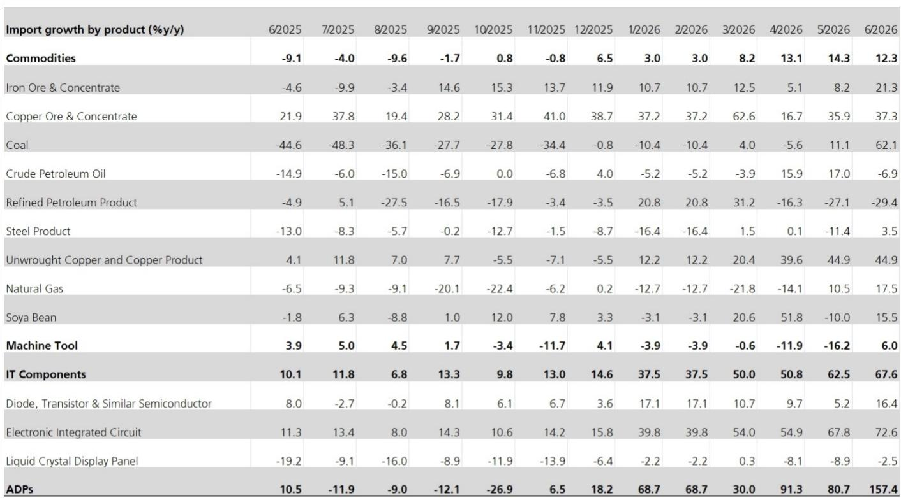
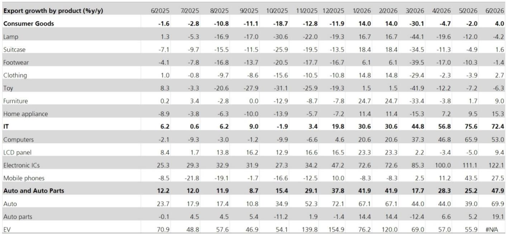
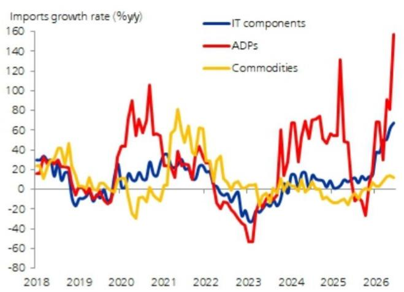

# UBS：中国出口再超预期，1H26强劲增长

6月出口同比增速从5月的19.4%进一步跃升至27.0%，超出市场预期的19.0%。这已是2026年以来出口数据连续多次超出预期。UBS在最新研报中指出，经季节调整后，6月出口环比增长约6.0%，创下一年多来最快月度增速。整个二季度出口环比增长约8.0%，略快于一季度。上半年出口累计同比增长17.6%，大幅高于2025年全年5.8%的增速。

更值得关注的是增长动力的结构性变化。报告认为，价格因素固然有贡献，但技术类产品在出口增长中的主导地位持续上升，使得对出口量的估算变得更加复杂。这意味着，中国出口的竞争力正在从传统制造业向更高附加值的领域迁移。

## 1. 对美出口量继续调整，但欧盟与“一带一路”地区提供了增量支撑

从目的地来看，6月对美出口量仍在下降，但由于去年互征关税造成的低基数，同比增速仍录得两位数增长。真正提供边际增量的，是欧盟和“一带一路”地区。报告显示，这两个区域的出口在经历了前几个月的疲软后，6月出现了强劲的环比反弹。与此同时，对东盟的出口增速有所节奏变化，UBS认为这可能反映了供应链中断的缓解——能源供应改善减少了对相关中间品的需求。对北亚的出口则继续扩张，尽管增速从高位略有回落，但仍是整体出口增长的最大贡献者。

> **KC评论：** 这张图的关键不在于对美出口的同比数字，而在于“量”的持续调整。低基数效应会随时间消退，届时对美出口的真实不确定性才会完全暴露。欧盟和“一带一路”地区的反弹，才是当前出口韧性中更具持续性的部分。

## 2. 非科技类出口提供了边际推力，汽车出口在二季度逐月回升

6月科技类出口篮子同比增速从5月的76.0%小幅回落至72.4%，但仍处于历史高位。其中，集成电路出口同比飙升122%，是近年来罕见的增速。手机和电脑出口增速有所节奏变化，对整体表现略有影响。但从环比看，科技产品的出货量仍在扩张。

真正提供边际增量的，是非科技类出口。汽车出口在经历了一季度的小幅停滞后，二季度每个月都在环比增长，6月再次跳升。UBS认为，这可能反映了在全球能源价格不确定性加剧的背景下，对中国新能源汽车的需求增强。消费品出口同比增长4%，结束了此前持续调整的局面。家具和家电出口增速明显加快，报告推测可能与多个市场遭遇热浪有关。

## 3. IT组件进口激增，原油进口量跌至近年低位

6月进口同比增速从5月的27.4%进一步加速至36.0%，远超市场预期的26.0%。月度贸易顺差因此扩大至超过1250亿美元。IT相关进口仍是主要驱动力：IT组件进口增速加快至68%，集成电路进口继续领涨。自动数据处理设备（ADP）进口同比飙升157%，这一前所未有的增速指向AI数据中心相关产品的需求正在快速扩张。

大宗商品进口增速则有所节奏变化。UBS估算显示，原油进口量进一步跌至近年来的最低水平之一。考虑到霍尔木兹海峡航运条件已改善，原油进口下降可能更多反映了企业补库存意愿不强，而其他地区则可能利用停火期补充了库存。铁矿石和铜矿石进口量在连续数月调整后，出现了企稳迹象。

## 4. 强劲外部表现提振信心，7月政治局会议仍是政策调整窗口

6月的出口数据延续了2026年以来出口持续超预期的态势。中国已是区域内最大的出口国，上半年仍实现了17.6%的同比增速，跑赢了多数新兴亚洲地区乃至全球大部分地区。

UBS认为，出口增长动力的结构性转变——越来越向AI相关产品和其他技术产品集中——表明中国正在更深层次地融入全球供应链中更具活力的环节。汽车出口的持续扩张，也意味着在全球能源供应不确定性背景下，中国新能源汽车正在获得更多市场份额。

强劲的出口数据、中国相对于其他地区的优异表现，以及出口结构日益技术密集化，这些因素共同构成了对中国制造业竞争力和生产能力的正面信号。但报告同时指出，考虑到4月和5月国内活动指标出现的疲软，7月底的政治局会议仍是政策调整的重要窗口。

> **KC评论：** 出口数据本身已经足够亮眼，但真正值得跟踪的，是进口端ADP设备157%的同比增速。这个数字背后，是AI数据中心建设对硬件设备的真实需求，而非简单的库存周期。它比出口数据更能反映中国在AI产业链中的参与深度。

For informational purposes only. Portions may be generated,translated,summarized,or edited with AI assistance based on source materials and may contain omissions or errors. Please verify independently. This is not investment,legal,tax,accounting,or other professional advice.

For informational purposes only. Portions may be generated,translated,summarized,or edited with AI assistance based on source materials and may contain omissions or errors. Please verify independently. This is not investment,legal,tax,accounting,or other professional advice.
