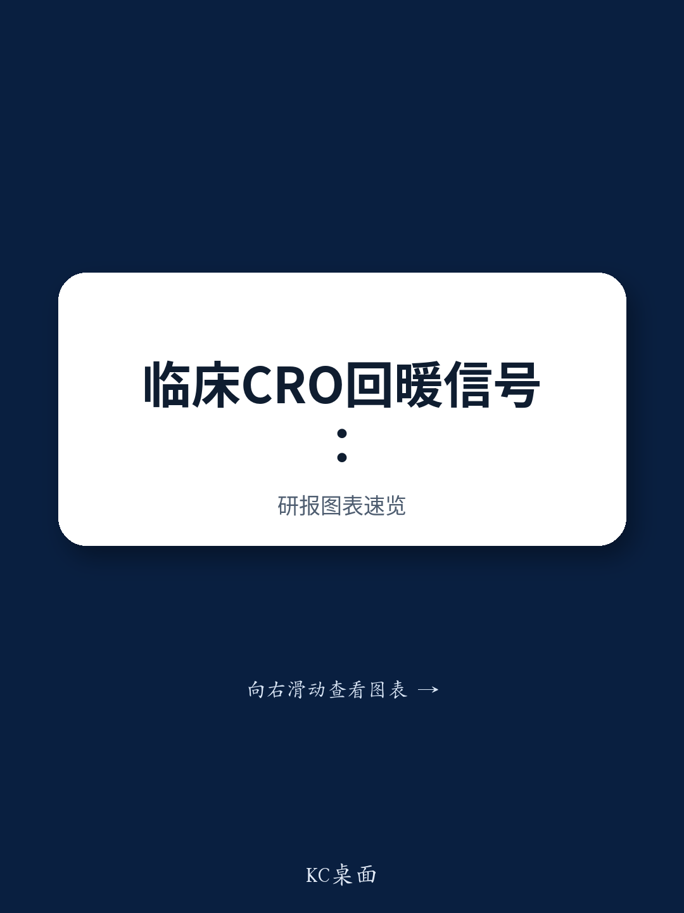

# UBS：中国临床CRO在Q226的订单修复与价格温和回升

一份来自UBS的专家调研纪要，给出了一个相对清晰的信号：中国临床CRO行业在2026年上半年已进入订单量的修复通道，但价格端的回暖仍处于“局部、温和”的阶段。这份与国内一家民营临床CRO高管的交流，提供了几个值得关注的细节。

订单量的增长是明确的。专家指出，2026年上半年整体订单量同比增长约20%至30%，驱动力来自创新药临床试验数量的增加、小型生物科技公司外包需求的上升，以及中小型CRO退出后竞争格局的改善。其中，SMO（临床试验现场管理组织）的恢复最为显著，已中标合同的服务费和毛利均实现了约5%至10%的回升。

但价格端并未同步大幅反弹。专家表示，二季度整体报价没有显著变化，仅在数据管理和临床服务等部分订单中出现了3%至5%的温和提价。低价的生物等效性（BE）试验订单已明显减少，这更多是行业出清后的自然结果，而非需求驱动的全面涨价。UBS的这份调研暗示，2026年下半年订单量增长仍将快于价格增长，价格可能维持温和的个位数增幅。

## 1. 地缘政治的实际影响有限，全球研发联系反而更紧密

市场对地缘政治不确定性的担忧，并未改变中国临床CRO行业出海的轨迹。专家认为，关于限制美国监管机构接受海外临床数据的提案，能否落地仍有很大不确定性，目前仅有少数公司因不确定性偏好而有所顾虑。

一个反直觉的观察是，全球制药公司与国内CRO及药企的联系实际上在加强。一方面，跨国药企开始将部分中国项目外包给规模更大、质量更高的本土CRO。经过多年发展，国内CRO在规模和临床试验质量上已与跨国CRO相当，且价格优势明显，在维护研究机构和主要研究者（PI）关系方面更具竞争力。另一方面，国内创新药企的出海授权仍在推进，2025年交易额接近1400亿美元，2026年上半年交易额已超过2025年同期，CRO也随之跟进海外布局。这意味着，地缘政治讨论并未打断产业层面的实际合作，反而可能加速了本土CRO在全球研发网络中的嵌入。

> **KC评论：** 专家提到的“跨国药企开始将中国项目外包给本土CRO”是一个值得跟踪的信号。这不同于过去本土CRO主要服务国内小型生物科技公司的格局，如果这一趋势持续，将改变国内CRO的客户结构和项目质量。

## 2. AI正在提升效率，但短期内不会改变行业定价或商业模式

AI已成为临床CRO提升效率的关键工具，但专家强调，目前更多是工作流程的升级，而非商业模式的革命性变化。国内CRO在AI上的投入相对有限，通常占收入的1%至2%，主要用于开发内部工具。

效率提升的案例是具体的。在统计编程环节，原本需要20至30小时的SDTM/ADaM映射任务，借助AI可缩短至不到一小时。数据管理、生物统计、药物警戒、医学写作和医学翻译被认为是首批受益领域。跨国CRO与外部供应商合作开发AI平台，部分流程效率可提升30%至50%。

但专家也指出了限制：AI对利润率的提升是正向的，但短期内不太可能显著推高行业定价。同时，避免结果偏差和加强人工质量控制仍是实施中的挑战。而CRA（临床监查员）和CRC（临床协调员）等需要与研究机构现场沟通的岗位，未来五年内仍不太可能被根本替代。这意味着，AI对CRO行业的改造是渐进式的，它首先优化的是后台数据处理环节，而非前台执行能力。

## 3. 一个可复用的观察框架：从订单结构看行业修复的成色

这份调研提供了一个判断行业修复质量的框架，核心是区分“量”的恢复和“价”的恢复。

第一层看订单量。2026年上半年20%至30%的同比增长，主要由创新药临床试验数量增加（2025年同比增长约18%）和小型CRO退出后的份额再分配驱动。这是行业景气度回升的基础信号。

第二层看订单结构。价格回升并非普涨，而是集中在数据管理、统计服务等环节，以及SMO领域。低利润的BE试验订单被主动放弃，说明CRO公司开始有选择性地接单，而非为了规模牺牲利润。这是行业竞争格局改善的体现。

第三层看客户结构。国内CRO的主要客户仍是小型生物科技公司，其现金流状况不如大型药企和成熟生物科技公司。但跨国药企开始外包中国项目给本土CRO，这是一个增量变化。如果这一趋势能持续，将提升国内CRO的客户质量和项目稳定性。

第四层看成本端。除了价格回升，利润率改善的另一驱动力是成本优化。专家提到，劳动力利用率提升了约15%至20%，AI也贡献了部分效率。这意味着，即使价格仅温和上涨，CRO公司仍可通过内部运营改善来修复利润。

综合来看，这份调研描绘的图景是：中国临床CRO行业已走出最困难的阶段，订单量恢复明确，竞争格局优化，但价格端的全面回升仍需等待更强劲的需求驱动。对于观察者而言，下一阶段的关注点应从“订单是否增长”转向“增长来自哪些客户、哪些项目、哪些环节”。

For informational purposes only. Portions may be generated,translated,summarized,or edited with AI assistance based on source materials and may contain omissions or errors. Please verify independently. This is not investment,legal,tax,accounting,or other professional advice.

For informational purposes only. Portions may be generated,translated,summarized,or edited with AI assistance based on source materials and may contain omissions or errors. Please verify independently. This is not investment,legal,tax,accounting,or other professional advice.
