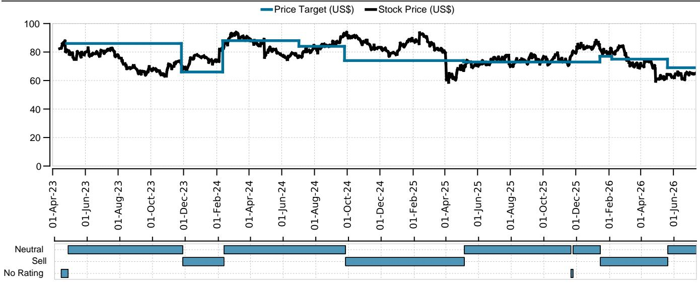
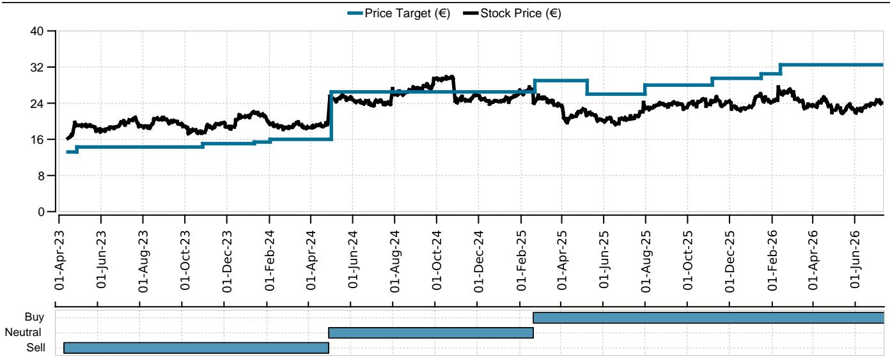
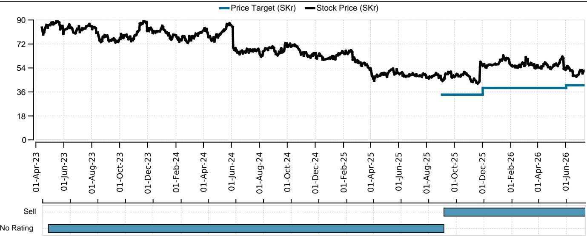

# UBS：欧洲医疗设备-龙临城下，新VBP提案加剧中国不确定性

中国国家卫健委联合另外两个监管机构，于近日发布了一份关于在公立医疗机构进一步推行医疗设备集中带量采购的通知。这份文件最值得关注的信号是：集采范围将首次明确扩展至大型医疗设备，尤其是此前基本被排除在外的资本设备。UBS研究团队在第一时间发布的报告中判断，这一变化可能对西方放疗和影像设备厂商的定价与市场份额构成新一轮不确定性。

通知提出的三层集采框架是核心变量。国家层面集采将覆盖A类大型设备，包括部分放疗设备和单价超过5000万元人民币的首台（套）医疗设备。省级集采则纳入PET-CT、PET-MR、腔镜手术机器人以及常规放疗设备，并计划逐步扩展至其他高值设备。市级集采覆盖上述范围之外的医疗设备，所有省份须在2026年底前完成至少一轮集采。此外，通知还提出建立高值医疗设备全国备案数据库以提高价格透明度，并明确评标将综合考虑产品质量、服务和价格，同时纳入耗材与维护成本。

> **KC评论：** 这份通知的关键不在于集采本身是否首次出现，而在于它把集采的逻辑从耗材正式延伸到了大型设备。对于依赖设备销售和售后服务的西方厂商，这意味着定价逻辑和竞争格局可能都需要重新评估。

## 1. 放疗领域：Elekta的中国战略面临最直接挑战

在放疗设备厂商中，UBS认为Elekta的暴露程度最高。中国贡献了Elekta集团约13%的收入，管理层此前将“扩大在华业务”列为FY26-FY29的关键战略支柱，并预期中国区实现中个位数收入增长。但新规下，国家集采覆盖了Elekta的MR-linac Unity设备——尽管该领域目前缺乏有力的本土竞争对手，但报告担心，参照此前省级集采中其他大型设备高达45%的价格降幅，Unity的高利润率可能被大幅侵蚀。更关键的是，省级集采覆盖了Elekta大部分其余产品线，包括Evo，而这一领域面临联影等本土厂商的激烈竞争。Elekta目前在中国常规放疗市场拥有约40%的份额，报告认为它很可能是份额流失的主要对象。

西门子医疗旗下的瓦里安受影响相对中性偏谨慎。中国占瓦里安部门收入不到10%，其旗舰平台Truebeam和Halcyon可能落入省级集采范围，但报告指出，瓦里安过去几年的增长主要来自美国市场，这一趋势预计将持续。

## 2. 影像设备：GE医疗收入敞口最大，西门子靠创新缓冲

对于影像设备厂商，UBS认为不确定性在于集采可能从省级或市级层面进一步扩展至大部分影像设备。过去12个月，集采已在CT、MRI和超声领域有所渗透，但主要限于低端设备。新规可能将这一不确定性扩散至更广泛的产品组合。

GE医疗被认为暴露程度最高，原因有二：中国在其收入中的占比更高，且其产品组合与联影、迈瑞等本土厂商的可比性更强。西门子医疗次之，但其创新力提供了一定缓冲。飞利浦虽然也在超声领域与迈瑞、联影直接竞争，但中国收入敞口最小，且其影像产品在图像引导治疗等方面存在差异化。

> **KC评论：** 这份报告对几家厂商的排序逻辑值得注意——它不只看中国收入占比，还看产品线与本土竞品的重叠程度。GE医疗之所以被排在不确定性首位，恰恰是因为其产品组合与本土厂商的“可替代性”较强。

## 3. 一个可复用的观察框架：从收入敞口到可替代性

UBS的分析框架实际上提供了一个评估政策不确定性的通用思路：第一步，看中国收入占比和增长预期；第二步，看具体产品线是否被纳入集采范围以及面临的本土竞争强度；第三步，看产品差异化程度能否提供定价缓冲。对于Elekta，前两步的谨慎因素叠加，使其中国战略的可行性受到根本性质疑。对于GE医疗，则是收入敞口与可替代性双重暴露。对于西门子医疗和飞利浦，差异化在一定程度上降低了不确定性，但并非免疫。

这份通知的落地节奏和具体执行细则仍有待观察，但方向已经明确：中国医疗设备市场的定价逻辑正在从“厂商定价”向“集采定价”迁移，对于依赖中国市场的西方厂商，这不再是远期不确定性，而是正在发生的结构性变化。

For informational purposes only. Portions may be generated,translated,summarized,or edited with AI assistance based on source materials and may contain omissions or errors. Please verify independently. This is not investment,legal,tax,accounting,or other professional advice.

For informational purposes only. Portions may be generated,translated,summarized,or edited with AI assistance based on source materials and may contain omissions or errors. Please verify independently. This is not investment,legal,tax,accounting,or other professional advice.
