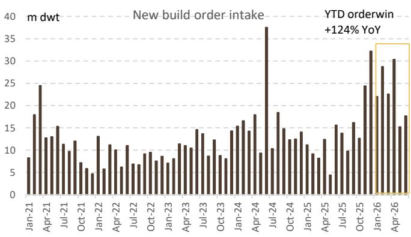
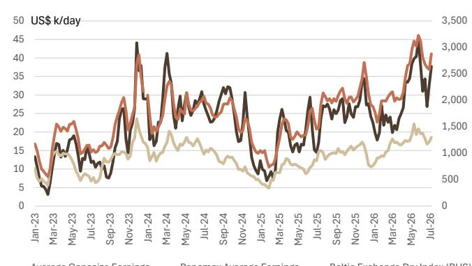
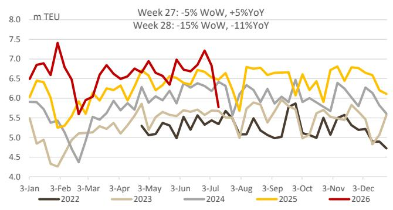

# UBS：UBS中国工业航运供应链周报，贸易流、运费与霍尔木兹更新

全球航运市场正在经历一条分叉的曲线。UBS最新一周高频数据追踪报告显示，霍尔木兹海峡的油轮日均通行量已从7月初的45艘降至上周的30艘，7月8日之后东向离港的油轮数量出现明显下降。与此同时，中国主要港口集装箱吞吐量受台风影响环比下滑15%，上海出口集装箱运价指数（SCFI）在触及年内高点后回落4%。两条线索指向同一个判断：地缘供给冲击仍在，但需求端的边际变化已经开始改写运价走势。

这份报告覆盖油轮、干散货、集装箱和造船四个细分市场，数据来源包括UBSEvidence Lab、交通运输部和克拉克森。报告没有给出方向性预测，但高频数据本身已经呈现出清晰的阶段性信号——供给侧的紧张并未消失，但需求侧的不确定性正在从集装箱市场向外传导。

## 1. 霍尔木兹的通行量下降尚未演化为运价全面飙升

霍尔木兹海峡的通行数据是本周最受关注的变量。报告显示，日均通行量从45艘降至30艘，油轮东向离港量在7月8日后明显减少。但运价反应并不对称：中东/西非至中国的VLCC（超大型油轮）等价期租租金（TCE）较冲突前水平上涨65%，而西非至中国航线持平，美湾至中国航线反而下跌14%。这说明供给冲击的传导路径并非线性——不同航线的运力配置、替代路径的可用性以及货主提前锁舱的行为，都在稀释单一地缘事件的定价权。

> **KC评论：** 霍尔木兹通行量下降是事实，但VLCC运价分化表明市场已经在通过航线切换和运力再分配来消化冲击。真正需要关注的不是通行量本身，而是这种再分配是否可持续。

## 2. 集装箱运价见顶回落，需求端的信号比供给端更值得追踪

集装箱市场的变化可能更具前瞻意义。SCFI在连续多周上涨后首次回落，上海至欧洲航线运价环比下降3%，跨太平洋航线下降2%至6%。更关键的是，从亚洲发往美国的新增集装箱量上周明显减少，洛杉矶港的进口量在7月第4周预计同比增长14%，但第3周已同比下降3%。UBS报告没有直接给出“需求见顶”的判断，但数据本身已经构成一个值得警惕的拐点信号——如果亚洲出口量持续走弱，此前因红海绕航和旺季备货共同推高的运价将失去支撑。

## 3. 干散货和造船市场仍在高位，但支撑逻辑不同

与集装箱市场的降温形成对比，干散货市场本周再度走强，好望角型船平均收益环比上涨15%，主要受太平洋地区需求支撑。造船市场的新船价格指数继续上行，中国新造船价格指数（CNPI）在6月创下历史新高，油轮和散货船订单持续涌入。这两个市场的共同特征是供给端约束更强——干散货受益于矿商发货节奏和港口拥堵，造船则受限于船台排期和产能扩张的物理上限。它们的强势更多反映的是供给侧的结构性紧张，而非需求的全面复苏。

## 4. 红海绕航仍在高位，但边际影响正在递减

报告数据显示，绕行好望角的集装箱船数量仍比去年同期高出2%至5%，红海航线的恢复尚无时间表。但一个容易被忽略的细节是：绕航比例已经连续数周维持在高位窄幅波动，而非继续攀升。这意味着绕航对运价的边际推升效应正在递减——市场已经将这一成本纳入定价，后续运价的走向将更多取决于需求端的变化，而非绕航本身。

这份报告的价值不在于给出一个确定的结论，而在于用高频数据勾勒出当前航运市场的真实状态：地缘不确定性仍在，但市场已经学会与之共存；运价高位运行，但需求端的裂缝正在出现。对于关注供应链和贸易流的读者而言，接下来的观察重点应该从“供给是否中断”转向“需求是否持续”。

For informational purposes only. Portions may be generated,translated,summarized,or edited with AI assistance based on source materials and may contain omissions or errors. Please verify independently. This is not investment,legal,tax,accounting,or other professional advice.
