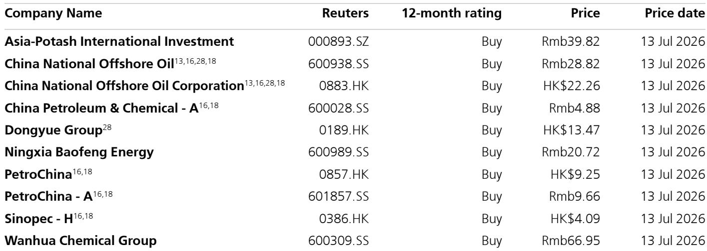
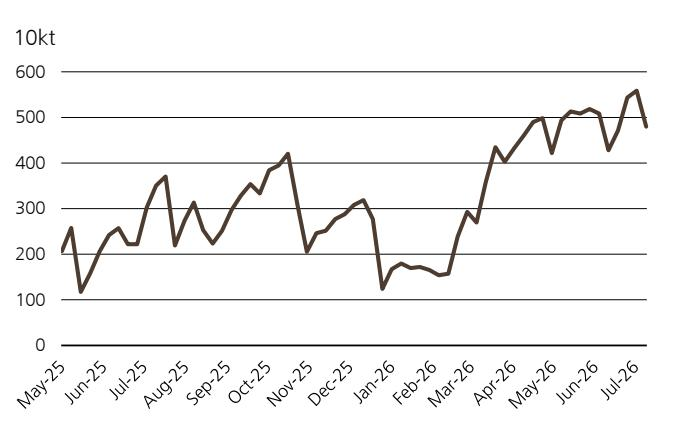
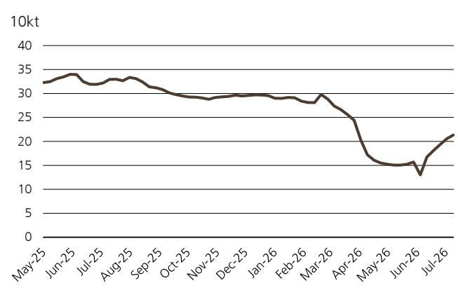

# UBS：PP与PVC与PFY中国OilGas和Chemi

这份UBS周度跟踪报告传递了一个清晰信号：中国化工市场正在经历一轮结构性分化。化学股指数自6月以来已下跌9%，但并非所有环节都在同步调整。报告数据显示，6月中国化工价格指数（CCPI）环比下降6%，与原油价格回落同步。但在这轮调整中，芳烃链的PTA价差环比扩张了302%，成为少数逆势走强的品种。

报告认为，PTA价差大幅走阔的核心原因在于供给端调整。PTA生产商集中检修叠加持续去库存，导致供应偏紧，而PX和聚酯长丝的供给调整幅度相对较小，这种不对称调整推高了PTA的加工利润。与此同时，聚酯POY价差环比仅增长4%，说明下游需求并未同步走强，利润更多留在了PTA环节。

## 1. 地炼开工率回升，但整体原油加工量仍在下降

报告显示，上周中国主营炼厂平均开工率环比微降0.12个百分点至67.8%，而地炼开工率则环比回升3.6个百分点至46.58%。地炼复工的主要驱动力是炼油利润改善。但整体来看，中国原油加工量环比下降23.6万桶/天至1183.3万桶/天，说明总供给仍在调整。Kpler数据显示，中国原油库存由前一周的下降转为增加，截至本周一总库存约12.88亿桶。

> **KC评论：** 地炼开工率回升与主营炼厂开工率下降形成对比，说明利润驱动的复产正在发生，但总量仍在调整。原油库存由降转增，可能意味着炼厂对后续需求预期偏谨慎，主动补库意愿不强。

## 2. PX开工率骤降7个百分点，芳烃链供给调整最明显

在化工品环节，PX开工率环比下降7个百分点至61%，同比下降19个百分点，是报告监测的所有品种中降幅最大的。PTA开工率环比下降4个百分点至58%，同比下降23个百分点。聚酯长丝开工率环比持平于74%，同比下降15个百分点。乙烯（石脑油路线）开工率环比下降2个百分点至73%，同比下降7个百分点。PVC开工率环比下降3个百分点至65%。

报告认为，PX和PTA的开工率大幅下降是供给端主动调整的结果，这与PTA价差扩张形成因果链条。而聚酯长丝开工率相对稳定，说明下游需求并未出现剧烈调整，这为PTA价差扩张提供了需求侧支撑。

## 3. PP、PVC、聚酯长丝库存环比下降，PE库存意外反弹

库存数据提供了另一个观察维度。报告样本数据显示，PP库存环比下降4%，同比下降30%至40.6万吨。PVC库存环比下降1%，同比下降19%至43.1万吨。聚酯长丝库存环比下降14%，但同比仍增长37%。PE库存环比增长24%，同比下降11%至43.8万吨。钛白粉库存环比增长4%，同比下降35%至21.3万吨。

PP、PVC和聚酯长丝库存的环比下降，与开工率下降形成呼应，说明供给调整正在推动去库存。PE库存环比大幅反弹，可能意味着下游需求对PE的承接能力弱于其他品种。

> **KC评论：** 库存数据需要结合开工率一起看。PP和PVC的库存下降伴随开工率下降，说明去库存更多来自供给端主动调整，而非需求拉动。聚酯长丝库存同比下降但环比下降，说明短期去化在加速，但同比不确定性仍在。

## 4. 制冷剂价格逆势上涨，高温天气支撑检修需求

在整体价格节奏变化的背景下，制冷剂R22和R134a的6月均价分别环比上涨30%和3%。报告认为，高温天气支撑了制冷剂检修需求的持续释放。这一细分品种的逆势表现，说明化工品价格并非全面走弱，部分与季节性需求相关的品种仍有支撑。

对于读者而言，这份报告提供了一个观察框架：在化工指数整体回调9%的背景下，需要区分供给驱动和需求驱动的品种。PTA价差扩张是供给调整的结果，而非需求回暖的信号。制冷剂价格上涨是季节性因素，持续性取决于天气和检修节奏。库存下降的品种中，PP和PVC的去库存质量高于PE，因为前者伴随开工率下降，后者则出现了库存反弹。

For informational purposes only. Portions may be generated,translated,summarized,or edited with AI assistance based on source materials and may contain omissions or errors. Please verify independently. This is not investment,legal,tax,accounting,or other professional advice.

