# 宏观观察：中国大宗商品贸易数据解读（2026年6月）

## 中国6月大宗商品贸易保持活跃

中国6月初步贸易数据显示，实物流动继续保持韧性，但基本面信号日益分化。铁矿石等大宗商品受需求温和及供应增加影响，而铜和铝则继续受益于结构性需求及偏紧的供应条件，不过铝的基本面预计将逐步趋于平衡。

## 要点：铁矿石与工业金属保持活跃

铁矿石进口量回升至1.126亿吨（同比+6%，环比+15%，年初至今+6%），扭转了5月的疲软态势，恢复到2025年末的水平（约1.1-1.2亿吨/月）。年化进口量约13.5亿吨，与2026年来自澳大利亚、巴西的强劲供应、西芒杜项目早期增产及铁品位下降（如BHP、RIO和FMG降低铁品位）的趋势一致。然而，需求信号仍显温和。中国净钢材出口年初至今-5%，铁矿石港口库存处于约1.585亿吨的高位（但低于3月约1.67亿吨的历史高点），且出口发货量持续上升。这种分化表明，进口更多受到充裕供应和库存动态的驱动，而非终端需求。即使现货价格约98美元/吨且处于成本支撑区间内（第95百分位约99-101美元/吨），我们预计随着供应增长（如西芒杜）超过需求，铁矿石价格在2026/27/28年期间将逐步回落至约92美元/吨。

铜精矿进口量基本持平（233万吨；年初至今-1%），反映出上游供应偏紧（低TC/RCs）以及持续的原料竞争。精炼铜进口环比增长5%，但年初至今仍为-5%。精矿短缺（如Grasberg、Cobre Panama停产，以及智利和秘鲁产量总体温和）可能导致精炼铜进口增加以满足需求，而需求在结构上依然强劲（电气化/AIDC）。强劲的基本需求与受限的供应相结合，预计未来1-3年将出现缺口，价格中枢约在6-6.50美元/磅。

铝出口量增至71万吨（同比+45%，环比+12%，年初至今+16%），年化出口量约850万吨，反映出中国以外地区的强劲需求，因中东、Mozal等地约250-300万吨的下游产能停产。这与我们的短期观点一致，即2026年市场存在缺口，且中东供应中断仍在持续。然而，尽管价格受到成本上升、显性库存偏低以及铜铝替代动态（铜铝比>4倍）的支撑，我们预计未来6-12个月紧张状况将有所缓解，因为中东约300万吨的供应将重启，且印尼产能加速增长（推动2026/27年全球供应增长约5%/3%，而需求增长约2.5-3%）。因此，随着市场正常化，近期中国金属出口的强劲势头可能逆转。我们预计市场将在2027-28年重新平衡，而非转为过剩，价格最终将在成本曲线上方重新定价，但上行空间小于当前紧张状况所暗示的水平。

钢材出口6月达到1030万吨（同比+7%，环比持平），净出口为990万吨（同比+7%，年初至今-5%，年化1.18亿吨）。在出口许可证收紧后，出口量已从1/2月的低谷（约740万吨/月）显著恢复，但仍低于2025年末的高点（约1050-1130万吨/月）。出口套利空间仍然存在，钢厂保持盈利，限制了国内需求温和情况下的产量下行空间。进口仍微不足道（约40万吨；年初至今-11%），强化了中国结构性出口盈余的格局。

## 相关方

全球
基础材料

Lachlan Shaw
分析师
lachlan.shaw@ubs.com
+61-3-9242 6387

Annie Zhou
副分析师
annie.zhou@ubs.com
+61-2-9324 2000

Dim Ariyasinghe
分析师
dim.ariyasinghe@ubs.com
+61-3-9242 6385

Fintan Collins
副分析师
fintan.collins@ubs.com
+61-3-9242 6179

Levi Spry
分析师
levi.spry@ubs.com
+61-3-9242 6709

Al Harvey
分析师
al.harvey@ubs.com
+61-3-9242 6071

Ben Wood
分析师
ben.wood@ubs.com
+61-39-242 6709

Thomas Nightingale
副分析师
thomas.nightingale@ubs.com
+61-3-9242 6176

Myles Allsop
分析师
myles.allsop@ubs.com
+44-20-7568 1693

Sharon Ding
分析师
sharon.ding@ubs.com
+852-2971 6284

Daniel Major
分析师
daniel.major@ubs.com
+44-20-7568 3472

煤炭进口量增至4280万吨（同比+30%，环比+29%；年初至今+2%），从4/5月的疲弱期大幅反弹。煤炭进口需求增加可能反映了以下因素的组合：i) 国内供应中断（山西煤矿事故），ii) 季节性电力需求增长强劲，iii) 对动力煤战略储备的关注，以及 iv) 可能的天然气向煤炭转换。

稀土出口6月降至5100吨（同比-34%，环比-7%；年初至今-6%），延续了2025年强劲表现后的近期下行趋势。这一变化主要受政策驱动而非需求主导，对战略材料生产和出口的更严格管控影响了出口量。这强化了稀土贸易流动日益与基本面脱钩、地缘政治和出口管制成为主要驱动因素的观点。

## 市场观察：铜供应偏紧，铁矿石保持韧性，铝趋于平衡

在澳大利亚矿业公司中，我们认为BHP和RIO的风险回报平衡，均给予中性评级，其中BHP相对更受偏好。中国铁矿石进口保持韧性，以及成本曲线支撑；锂的产量和价格杠杆，也使我们给予MIN报告评级。在铜方面，我们给予CSC报告评级，SFR中性评级。

## 中国主要贸易流量

图1：中国主要贸易流量

[表格数据保留，内容为客观数据，未作修改]

来源：Haver, Bloomberg, UBS

## 中国贸易信号

图2：铁矿石进口 - 月度及年化

来源：Haver/UBS

图3：铁矿石进口 - 3个月/3个月及同比
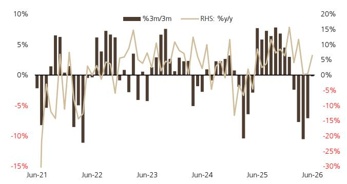
来源：Haver/UBS

图4：铜精矿进口 - 月度及年化
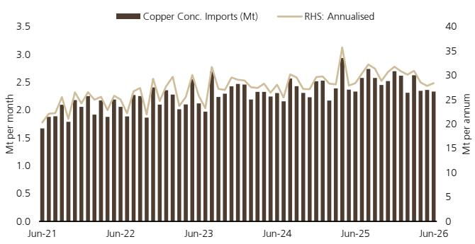
来源：Haver/UBS

图5：铜精矿进口 - 3个月/3个月及同比
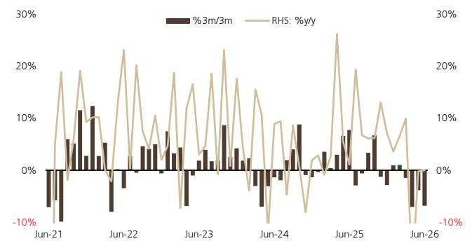
来源：Haver/UBS

图6：精炼铜进口 - 月度及年化

来源：Haver/UBS

图7：精炼铜进口 - 3个月/3个月及同比
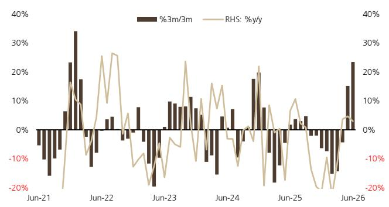
来源：Haver/UBS

图8：铝出口 - 月度及年化
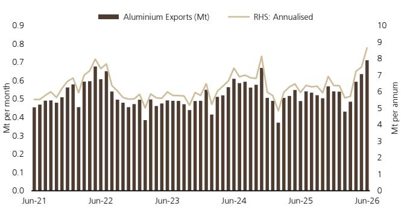
来源：Haver/UBS

图9：铝出口 - 3个月/3个月及同比
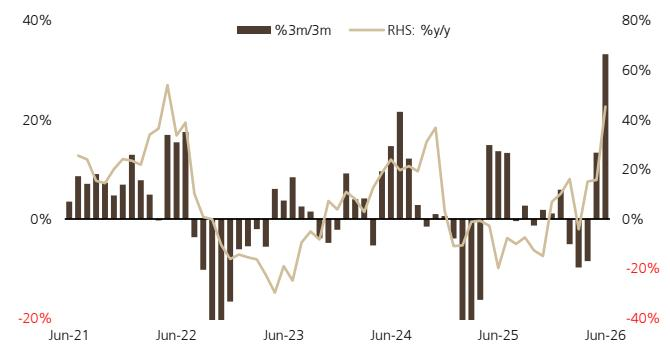
来源：Haver/UBS

图10：净钢材出口 - 月度及年化
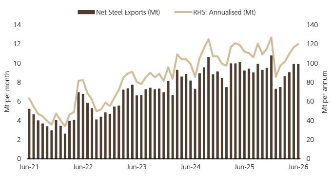
来源：Haver/UBS

图11：净钢材出口 - 3个月/3个月及同比
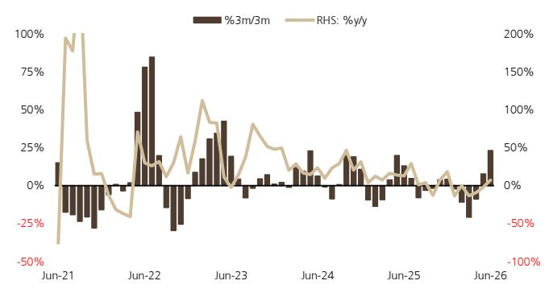
来源：Haver/UBS

图12：煤炭进口 - 月度及年化
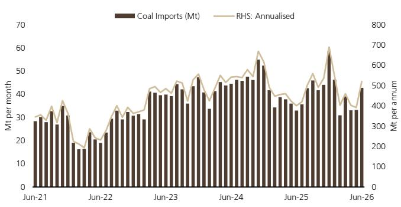
来源：Haver/UBS

图13：煤炭进口 - 3个月/3个月及同比
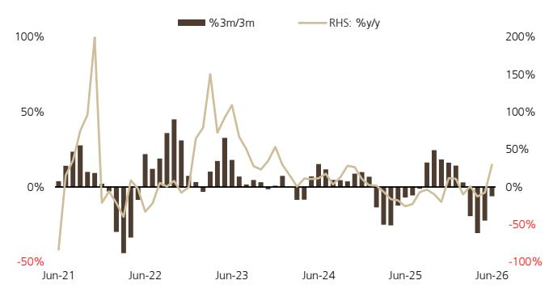
来源：Haver/UBS

图14：稀土出口 - 月度及年化
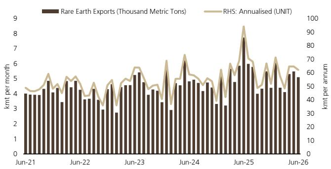
来源：Haver/UBS

图15：稀土出口 - 3个月/3个月及同比
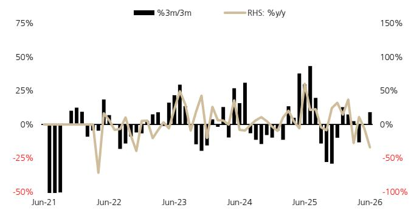
来源：Haver/UBS

我们提醒读者注意采矿业固有的潜在风险，包括但不限于大宗商品价格和货币的波动性，这些可能与预期存在重大差异。此外，该行业面临政治、财务和运营风险，每种风险都有可能对公司/行业表现产生显著影响。

## 估值方法与风险声明

## 必要披露

本文件由UBS Australia Ltd（UBS AG的关联公司）编制。UBS AG及其子公司、分支机构和关联公司，包括前CS AG及其子公司、分支机构和关联公司，在此统称为"UBS"。

有关UBS管理冲突和维护其UBS全球研究产品独立性的方式、历史表现信息、有关UBS全球研究建议的某些额外披露以及研究报告中使用的某些第三方数据的条款和条件，请访问https://www.ubs.com/disclosures。除非另有说明，本报告中的信息和数据基于公司披露，包括但不限于年度、中期、季度报告及其他公司公告。业绩图表中的数字指代过去；过往表现并非未来结果的可靠指标。可根据要求提供更多信息。UBS Co. Limited获中国证券监督管理委员会许可从事证券投资咨询业务。UBS可能作为本报告可能涉及之债务证券（或相关衍生品）的主体进行交易。本建议定稿于：2026年7月14日格林威治标准时间上午11:46。UBS已指定某些UBS全球研究部门成员为衍生品研究分析师，这些部门成员主要发布关于衍生品价格或市场的分析，并提供足够合理的信息以作为进行衍生品交易决策的基础。当衍生品研究分析师与股票研究分析师或经济学家共同撰写研究报告时，衍生品研究分析师负责衍生品的投资观点、预测和/或建议。定量研究回顾：UBS全球研究发布其分析师对某些关于短期因素发生可能性问题的回答的定量评估，该产品称为"定量研究回顾"。本评估中对特定股票的观点仅反映对这些短期因素的看法，其时间框架与本说明中设定的任何股票评级所反映的12个月时间框架不同。有关最新回复，请参阅本报告末尾的定量研究回顾附录（如适用）。对于之前的回复，请参考(i)之前的UBS全球研究报告；以及(ii)如当月未发布适用的研究报告，请参考可在https://neo.ubs.com/quantitative找到的定量研究回顾，或联系您的UBS销售代表以获取报告或通过ubs-quant-answers@ubs.com联系定量研究团队。还提供包含所有回复的综合报告，您应联系您的UBS销售代表以了解详情和定价，或通过上述电子邮件联系定量研究团队。

## 分析师认证：

对本研究报告内容（全部或部分）负主要责任的每位研究分析师证明，就本报告涵盖的每种证券或发行人而言：(1) 所表达的所有观点准确反映了他或她对那些证券或发行人的个人观点，并且是独立准备的，包括对UBS而言；以及 (2) 他或她的薪酬的任何部分过去、现在或将来都未直接或间接与本研究报告中所表达的具体建议或观点相关。

UBS全球研究：全球股票评级定义

[评级定义表格保留]

来源：UBS。评级分配截至2026年6月30日。
1：全球范围内处于12个月评级类别的公司百分比。
2：过去12个月内获得投资银行服务的12个月评级类别中的公司百分比。

关键定义：预测股票回报率定义为未来12个月预期价格涨幅加上总股息回报表现。在某些情况下，此回报表现可能基于应计股息。市场回报假设定义为一年期当地市场利率加5%（作为股权风险溢价的代理指标，而非预测）。待审股票可能被分析师标记为UR，表明该股票的价格目标和/或评级在近期可能发生变化，通常是为了回应可能影响投资案例或估值的事件。股票价格目标的投资期限为12个月。

例外和特殊情况：英国和欧洲投资基金评级和定义如下：买入：对结构、管理、业绩记录、折价等因素持正面看法；中性：对结构、管理、业绩记录、折价等因素持中性看法；卖出：对结构、管理、业绩记录、折价等因素持负面看法。核心区间例外：标准±6%区间的例外可由投资审查委员会批准。IRC考虑的因素包括股票的波动性和相应公司债务的信用利差。因此，被视为非常高或低风险的股票可能适用更高或更低的评级区间。当此类例外适用时，将在相关研究文件中的公司披露表中予以标识。

为本报告做出贡献且受雇于UBS LLC任何非美国关联公司的研究分析师未在FINRA注册/具备研究分析师资格。此类分析师可能不是UBS LLC的关联人士，因此不受FINRA关于与主题公司沟通、公开露面以及研究分析师账户持有证券交易限制的约束。为本报告做出贡献的每家关联公司及受雇于该关联公司的分析师姓名（如有）如下。

UBS AG香港分行：Sharon Ding。UBS AG伦敦分行：Daniel Major, Myles Allsop。UBS Australia Ltd：Al Harvey, Annie Zhou, Ben Wood, Dim Ariyasinghe, Fintan Collins, Lachlan Shaw, Levi Spry, Thomas Nightingale。

## 公司披露

[公司披露表格保留]

来源：UBS全球研究；LSEG Eikon。所有价格均为当地市场收盘价。此表中的评级是本报告发布前最新的已发布评级。它们可能比股票定价日期更近。

除非另有说明，请参阅本报告正文中的估值和风险部分。有关本报告中讨论的公司的完整披露声明，包括估值和风险信息，请联系UBS LLC, 11 Madison Avenue, New York, NY 10010, USA, Attention: Investment Research。
其他价格：Fortescue Metals Group, A\$19.02 (2026年7月14日)；来源：UBS。所有价格均为当地市场收盘价。

[后续法律免责声明部分保留，内容为标准法律文本，未作修改]
