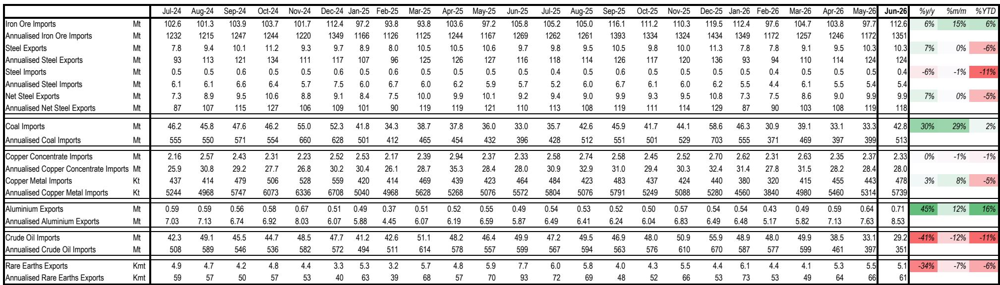
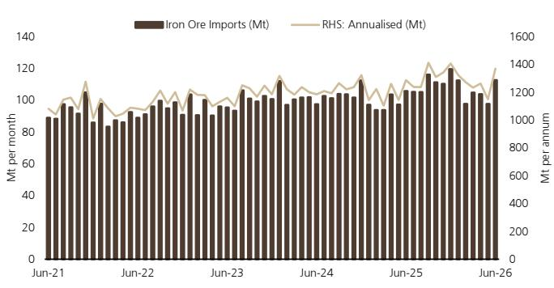
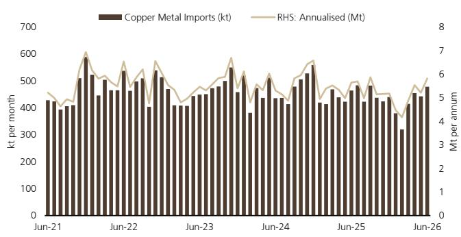

# UBS：中国大宗商品贸易韧性但分化

中国6月初步贸易数据延续了实物流动的韧性，但UBS这份研究揭示了一个关键信号：进口量的强势并非由终端需求驱动，而是由供应端扩张和库存行为主导。铁矿石进口反弹至112.6百万吨，年化运行在约13.5亿吨的高位，但港口库存仍处历史高位，国内钢铁净出口同比下降5%。这种“量强价弱”的背离，暗示着大宗商品市场正在经历一轮由供给侧结构性变化驱动的再定价，而非需求的系统性回暖。

## 1. 铁矿石进口的韧性来自供应而非需求，价格重心可能继续调整

6月铁矿石进口环比增长15%，同比增6%，逆转了5月的状态，回到2025年末的水平。但UBS指出，需求信号依然平淡：港口库存约158.5百万吨，虽低于3月的历史峰值167百万吨，仍处于高位；出口发货量持续上升。进口的强劲更可能来自澳大利亚、巴西的充足供应，以及西芒杜项目早期增产和品位下降带来的额外需求。即使现货价格约98美元/吨已进入成本支撑区间（第95百分位约99-101美元），UBS仍预计铁矿石价格将在2026至2028年间逐步调整至约92美元/吨，因为供应增长（如西芒杜）将超过需求。

> **KC评论：** 这张图的关键不在于6月单月数据，而在于年化进口量已稳定在13.5亿吨附近，而国内需求并未同步扩张。这意味着铁矿石市场正在从“需求定价”转向“供应定价”，成本曲线底部的支撑可能被持续累库打破。

## 2. 铜的供应瓶颈正在从上游传导至精炼环节，结构性缺口支撑价格

铜精矿进口基本持平于2.33百万吨，同比微降1%，反映上游供应持续紧张（低TC/RCs）。UBS注意到，在格拉斯berg、科布雷巴拿马等矿山停产以及智利、秘鲁产量增长仍在调整的背景下，精炼铜进口环比增长5%，但同比仍下降5%。这种“精矿短缺、精炼补位”的格局，意味着市场正在通过增加精炼进口来满足结构性强劲的需求（电气化、AI数据中心）。报告认为，未来1-3年铜市场将持续处于短缺状态，价格锚定在约6-6.5美元/磅区间。

## 3. 铝的出口激增是短期扰动，供需再平衡将在2027-28年到来

6月铝出口飙升至0.71百万吨，同比大增45%，年化运行约850万吨。UBS将这一异常归因于中东地区约250-300万吨下游产能停产以及莫桑比克等地的供应中断。尽管当前市场处于短缺状态，且铜铝比超过4倍支撑了替代需求，但报告认为这种紧张局面将在未来6-12个月内缓解：中东约300万吨产能重启，加上印尼产能加速释放，将推动2026/27年全球供应增长约5%/3%，而需求增速仅约2.5-3%。因此，中国铝出口的强势可能随着市场正常化而调整，市场将在2027-28年重新平衡，而非进入过剩，价格最终将重新锚定在成本曲线上方，但上行空间小于当前紧张局面所暗示的水平。

## 4. 钢铁出口恢复但未创新高，稀土出口受政策主导而非需求驱动

6月钢铁出口1030万吨，环比持平，同比增7%，年化净出口约1.18亿吨。出口量已从1-2月的低点（约740万吨/月）明显恢复，但仍低于2025年末的峰值（约1050-1130万吨/月）。UBS认为，出口套利空间仍然存在，钢厂利润尚可，限制了产量节奏变化，尽管国内需求表现平稳。稀土出口则延续节奏变化趋势，6月仅5100吨，同比大降34%，环比降7%。报告明确指出，这主要是政策驱动而非需求变化——对战略材料生产和出口的更严格管控正在主导贸易流向，稀土市场正日益与基本面脱钩。

这份研究的核心洞察在于：中国大宗商品进口的“韧性”正在被供给侧的结构性变化重新定义。铁矿石和铝的供应扩张将逐步影响价格，铜的供应瓶颈则提供底部支撑，而稀土等战略品种的贸易逻辑已完全转向政策面。对于关注资源品市场的读者而言，区分“真实需求”与“供应驱动的进口”将是未来一个季度判断价格方向的关键。

For informational purposes only. Portions may be generated,translated,summarized,or edited with AI assistance based on source materials and may contain omissions or errors. Please verify independently. This is not investment,legal,tax,accounting,or other professional advice.

