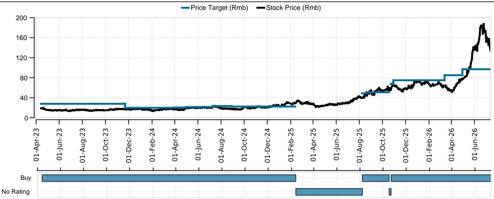
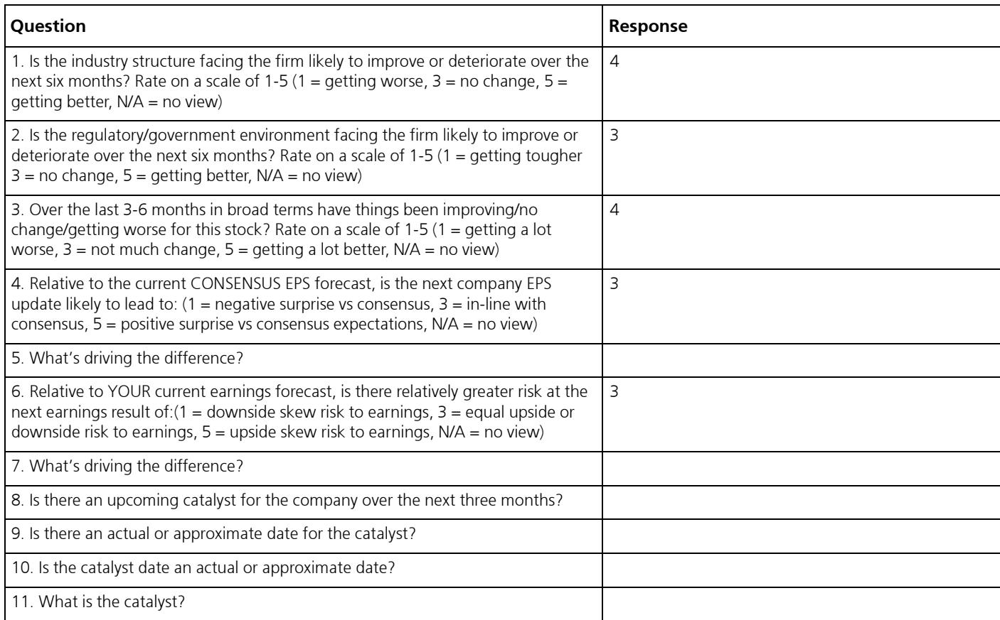
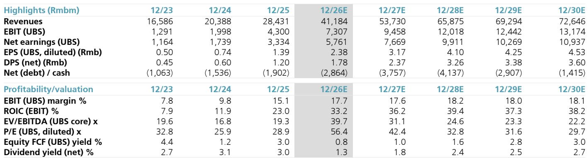

# UBS：CCL与ASP与PCBShengyi科技600183Q226

生益科技发布的2026年上半年业绩预告，让市场看到了覆铜板（CCL）涨价周期对利润的真实拉动。公司预计上半年归母净利润31-33亿元，同比增长117%-131%；其中第二季度单季归母净利润19.4-21.4亿元，同比增幅高达125%-148%，环比增长68%-85%。这一数字比UBS此前预测高出37%-51%，也比路透一致预期高出32%-45%。

超预期的幅度本身就是一个信号：CCL的涨价并非市场此前理解的成本推动型被动传导，而是需求结构升级叠加供给格局改善带来的主动提价周期。生益科技旗下PCB子公司生益电子同期预告上半年营收56-59亿元，同比增长49%-58%，归母净利润10.8-11.4亿元，同比增长104%-114%。第二季度净利润率中位数达到19.7%，环比继续改善。

## 1. 涨价周期的驱动力不是成本，是AI订单的结构性支撑

市场此前对CCL涨价的普遍理解是上游铜箔和玻璃纤维涨价挤压了覆铜板厂商利润，提价只是为了转嫁成本。但生益科技的数据给出了不同的叙事：第二季度利润环比增长近八成，利润率扩张速度远超原材料成本涨幅。

UBS在报告中指出，自2026年上半年以来，以建滔集团和生益科技为代表的一线CCL厂商已多次提价，以应对原材料价格上涨。但真正支撑涨价持续性的，是AI服务器和交换机订单对高端CCL的需求拉动。生益电子第二季度营收同比增长54%，环比增长40%，自2025年第一季度以来连续保持50%以上的同比增速——这种增长节奏很难用成本转嫁来解释。

> **KC评论：** 涨价周期能否持续，关键看下游需求结构。如果涨价只是成本推动，一旦原材料价格回落，利润就会快速回吐。但生益科技的数据显示，AI订单带来的高端CCL需求才是涨价的核心支撑，这意味着这轮涨价有更强的结构性基础。

## 2. PCB业务利润率担忧被证伪，AI产品组合正在改变行业逻辑

市场此前有一个普遍担忧：CCL涨价会挤压PCB厂商的利润空间。逻辑上说得通——覆铜板是PCB的核心原材料，上游涨价必然传导到下游。但生益电子第二季度的数据给出了相反的答案。

生益电子第二季度净利润率中位数达到19.7%，比第一季度的18.6%还高出1.1个百分点。在CCL持续涨价的背景下，PCB业务的利润率不但没有收窄，反而在扩张。UBS认为，AI用CCL的价格基本保持稳定，而AI PCB厂商可以通过提升AI产品组合来对冲成本不确定性。生益电子和深南电路等公司的季度数据，正在为这一判断提供实证支持。

这意味着，市场对“涨价挤压下游”的线性推演可能过于简单。在AI驱动的产业链中，高端PCB厂商的议价能力和产品结构优化，足以消化上游成本变化。

## 3. 产能利用率已接近满载，下半年订单可见度依然强劲

UBS在报告中提到，基于当前订单可见度，预计生益科技的CCL业务在2026年下半年将继续维持满产状态。这是一个值得关注的信号。

满产意味着供给端已经没有太多弹性。如果AI需求继续增长，或者传统需求出现修复，CCL价格可能还有进一步上行的空间。同时，生益电子第二季度营收环比增长40%，是在此前两个季度环比下滑的基础上实现的——这说明新产能的释放正在顺利转化为收入。

从产业链角度看，CCL和PCB的景气度正在形成正反馈：AI订单拉动高端CCL需求，涨价改善CCL厂商利润，同时PCB厂商通过产品组合优化维持利润率。这种正反馈能否持续，取决于AI资本开支的节奏和下游需求的韧性。

生益科技将于8月14日发布完整的第二季度业绩。届时市场将获得更多关于毛利率、产品结构和订单能见度的细节。在此之前，这份业绩预告已经给出了一个清晰的信号：CCL涨价周期不是短期现象，而是AI产业链结构性变化的直接体现。

For informational purposes only. Portions may be generated,translated,summarized,or edited with AI assistance based on source materials and may contain omissions or errors. Please verify independently. This is not investment,legal,tax,accounting,or other professional advice.

