# Korean Shipbuilders Is AI/DC and valuations enough?

## June global orders healthy; But still waiting for higher LNGC prices

June initial global new ship order rose +16% YoY to 17.7m dwt vs YTD up +124% YoY. While June marked the slowest YoY growth YTD, we remain positive considering high base and typical upgrades to initial orders (up 40-66% for Jan-May 2026 orders). June orders were led by tanker (+132% YoY)/LNGC (+27% YoY), offsetting flat bulker/falling containership (-47% YoY) orders. Helped by rising global backlog (+33% YoY, +1% MoM), new build prices continued on a moderate uptrend, up +0.2% MoM in July, narrowing the discount to 2024 peak to 2.4%. Although LNGC prices remain flat, we expect stronger LNGC ordering in H226 to translate into higher pricing.

## SHI leads order YTD, followed by KSOE/HHI but HOC lags

Despite strong global orders, Korean yards global market share (CGT) fell to 12% in June (China 86%) compared to 21% in H126 (China 76%) given China's capacity adds. Notably, China led LNGC orders in June (0.4m dwt) vs Korea (0.2m dwt), although Korea still accounted for 64% of YTD LNGC orders. Still, the top 3 Korean yards' orders by value rose +76% YoY to US\$33bn – SHI led (+284% YoY), achieving 72% of 2026 target helped by 2x FLNG contacts, followed by KSOE (72% of target; HHI at 66%), while HOC lagged.

## Expect AI/DC catalysts ahead while defense pauses

We expect new power engine capacity and orders to be key catalysts ahead for HHI, with disclosure on new capacity adds expected as early as late July considering strong enquiries (c9GW vs current 3GW capacity). We had viewed floating DC (FDC) to be a concept design but now believe orders could materialize earlier in the next 6-12M, with SHI, HMS and HHI as key beneficiaries. But we expect defense theme to take a pause considering CPSP loss (7 Jul), challenges in securing NATO orders and importantly uncertainty over the future of the conflict in the Middle East. Still we expect US NDAA 2027 revision (Senate vs House version) by Q426 to be key for HHI and HOC.

## Valuation: Pricing in less; prefer HHI and SHI over HOC

Korean yards have lagged KOSPI and global peers, trading at 12x 2029E PE (opco only) vs 18x April peak, reflecting a reversal of defense premiums and to a large extent AI/DC positivity as well. We expect mixed Q226E OP (HHI above Street, HOC/HMS in line, SHI below) but view guidance on AI/DC and defense to be more important. We still prefer HHI most (power engine) but following CPSP setback, we now prefer SHI (FDC) over HOC. We are constructive on HMS (power engine MRO, FDC). But we expect greater visibility on US investment required for KSOE NAV discount to narrow in the absence of stronger shareholder returns.

Equities

Asia

Shipbuilding

Yong-Suk Son, CFA

Analyst

yongsuk.son@ubs.com

+82-2-3702 8804

Figure 1: UBS Korean shipyards stock view

<table><tr><td rowspan="2">Ticker</td><td rowspan="2">Company name</td><td rowspan="2">Rating</td><td rowspan="2">Price target (Won)</td><td rowspan="2">Curr Price (Won)</td><td rowspan="2">Mkt cap (US$m)</td><td colspan="4">P/E (x)</td><td colspan="3">P/Book (x)</td><td colspan="4">ROE (%)</td></tr><tr><td>27E</td><td>28E</td><td>29E</td><td>30E</td><td>26E</td><td>27E</td><td>28E</td><td>27E</td><td>28E</td><td>29E</td><td>30E</td></tr><tr><td colspan="17">Shipbuilders</td></tr><tr><td>329180.KS</td><td>HD Hyundai Heavy Industries</td><td>Buy</td><td>830,000</td><td>487,500</td><td>34,260</td><td>13.9</td><td>14.5</td><td>13.1</td><td>11.9</td><td>4.6</td><td>3.8</td><td>3.3</td><td>29.7</td><td>24.3</td><td>23.4</td><td>22.5</td></tr><tr><td>009540.KS</td><td>HD Korea Shipbuilding &amp; Offshore Eng</td><td>Buy</td><td>650,000</td><td>341,500</td><td>16,182</td><td>6.3</td><td>6.8</td><td>6.0</td><td>5.7</td><td>1.6</td><td>1.4</td><td>1.2</td><td>23.2</td><td>18.9</td><td>19.2</td><td>18.2</td></tr><tr><td>042660.KS</td><td>Hanwha Ocean</td><td>Buy</td><td>165,000</td><td>78,800</td><td>16,163</td><td>11.4</td><td>11.7</td><td>10.1</td><td>9.8</td><td>3.1</td><td>2.5</td><td>2.1</td><td>24.2</td><td>19.6</td><td>19.8</td><td>17.8</td></tr><tr><td>010140.KS</td><td>Samsung Heavy Ind.</td><td>Buy</td><td>37,000</td><td>22,050</td><td>12,992</td><td>13.1</td><td>12.6</td><td>11.1</td><td>10.0</td><td>3.7</td><td>2.9</td><td>2.5</td><td>25.0</td><td>21.4</td><td>21.1</td><td>20.3</td></tr><tr><td colspan="17">Ship repair/parts suppliers (Marine MRO)</td></tr><tr><td>443060.KS</td><td>HD Hyundai Marine Solution</td><td>Buy</td><td>320,000</td><td>193,600</td><td>5,762</td><td>22.1</td><td>18.0</td><td>15.1</td><td>13.0</td><td>9.2</td><td>8.0</td><td>6.9</td><td>39.0</td><td>41.8</td><td>42.9</td><td>43.2</td></tr></table>

Source: UBS estimates. Note: Above data priced as at 13 Jul 2026

Figure 2: Global new ship market outlook by ship type

<table><tr><td rowspan="2">DWT mn</td><td colspan="8">New orders</td><td colspan="7">Backlog</td><td colspan="8">Delivery</td></tr><tr><td>Tanker</td><td>Cont</td><td>Bulker</td><td>LNGC</td><td>Others</td><td>Total</td><td>m/m(%)</td><td>y/y(%)</td><td>Tanker</td><td>Cont</td><td>Bulker</td><td>LNGC</td><td>Others</td><td>Total</td><td>m/m(%)</td><td>Tanker</td><td>Cont</td><td>Bulker</td><td>LNGC</td><td>Others</td><td>Total</td><td>m/m(%)</td><td>y/y(%)</td></tr><tr><td colspan="24">Monthly</td></tr><tr><td>Jan-25</td><td>0.9</td><td>5.6</td><td>4.0</td><td>0.1</td><td>0.9</td><td>11.5</td><td>-20%</td><td>-32%</td><td>104.2</td><td>99.1</td><td>131.1</td><td>31.2</td><td>36.0</td><td>401.6</td><td>0%</td><td>2.2</td><td>3.0</td><td>4.3</td><td>0.7</td><td>0.6</td><td>10.8</td><td>77%</td><td>1%</td></tr><tr><td>Feb-25</td><td>1.2</td><td>5.6</td><td>1.4</td><td>0.3</td><td>0.8</td><td>9.3</td><td>-19%</td><td>-45%</td><td>104.6</td><td>103.3</td><td>130.5</td><td>31.1</td><td>36.4</td><td>405.9</td><td>1%</td><td>0.7</td><td>1.5</td><td>2.0</td><td>0.4</td><td>0.3</td><td>4.9</td><td>-55%</td><td>-14%</td></tr><tr><td>Mar-25</td><td>3.4</td><td>2.7</td><td>1.5</td><td>0.0</td><td>0.6</td><td>8.2</td><td>-12%</td><td>-47%</td><td>106.6</td><td>104.0</td><td>128.2</td><td>30.6</td><td>36.3</td><td>405.7</td><td>-0%</td><td>1.3</td><td>2.1</td><td>3.7</td><td>0.6</td><td>0.7</td><td>8.4</td><td>72%</td><td>12%</td></tr><tr><td>Apr-25</td><td>3.3</td><td>7.9</td><td>0.4</td><td>0.1</td><td>0.8</td><td>12.6</td><td>53%</td><td>-31%</td><td>108.3</td><td>109.7</td><td>125.8</td><td>30.3</td><td>36.1</td><td>410.1</td><td>1%</td><td>1.6</td><td>2.4</td><td>2.6</td><td>0.4</td><td>0.8</td><td>7.8</td><td>-7%</td><td>-4%</td></tr><tr><td>May-25</td><td>0.8</td><td>0.9</td><td>2.0</td><td>0.0</td><td>0.5</td><td>4.3</td><td>-66%</td><td>-64%</td><td>108.1</td><td>108.6</td><td>124.9</td><td>29.7</td><td>35.7</td><td>407.0</td><td>-1%</td><td>1.0</td><td>2.2</td><td>2.8</td><td>0.6</td><td>0.7</td><td>7.3</td><td>-6%</td><td>-7%</td></tr><tr><td>Jun-25</td><td>3.5</td><td>4.5</td><td>5.9</td><td>0.4</td><td>0.9</td><td>15.2</td><td>255%</td><td>-62%</td><td>109.6</td><td>110.8</td><td>127.9</td><td>29.4</td><td>35.5</td><td>413.3</td><td>2%</td><td>1.9</td><td>2.4</td><td>3.0</td><td>0.5</td><td>1.0</td><td>8.7</td><td>18%</td><td>11%</td></tr><tr><td>Jul-25</td><td>3.4</td><td>5.4</td><td>4.6</td><td>0.1</td><td>0.4</td><td>13.9</td><td>-8%</td><td>33%</td><td>110.2</td><td>114.7</td><td>129.7</td><td>28.9</td><td>35.3</td><td>418.8</td><td>1%</td><td>2.7</td><td>1.7</td><td>2.7</td><td>0.6</td><td>0.6</td><td>8.4</td><td>-3%</td><td>17%</td></tr><tr><td>Aug-25</td><td>2.0</td><td>6.2</td><td>0.6</td><td>0.7</td><td>0.6</td><td>10.2</td><td>-27%</td><td>-46%</td><td>110.8</td><td>118.7</td><td>127.3</td><td>28.9</td><td>35.1</td><td>420.9</td><td>0%</td><td>1.4</td><td>2.3</td><td>3.0</td><td>0.7</td><td>0.7</td><td>8.1</td><td>-4%</td><td>2%</td></tr><tr><td>Sep-25</td><td>3.6</td><td>7.6</td><td>4.4</td><td>0.2</td><td>0.8</td><td>16.7</td><td>64%</td><td>3%</td><td>112.0</td><td>124.2</td><td>128.3</td><td>28.4</td><td>35.0</td><td>427.8</td><td>2%</td><td>2.3</td><td>2.4</td><td>3.4</td><td>0.7</td><td>0.8</td><td>9.5</td><td>18%</td><td>50%</td></tr><tr><td>Oct-25</td><td>5.4</td><td>2.4</td><td>4.9</td><td>0.0</td><td>0.2</td><td>12.9</td><td>-23%</td><td>1%</td><td>115.7</td><td>124.5</td><td>128.9</td><td>27.7</td><td>34.6</td><td>431.5</td><td>1%</td><td>1.6</td><td>2.0</td><td>3.9</td><td>0.7</td><td>0.7</td><td>9.0</td><td>-6%</td><td>17%</td></tr><tr><td>Nov-25</td><td>12.6</td><td>5.8</td><td>5.4</td><td>0.2</td><td>1.0</td><td>24.9</td><td>93%</td><td>89%</td><td>126.4</td><td>128.7</td><td>131.1</td><td>27.3</td><td>34.7</td><td>448.3</td><td>4%</td><td>1.8</td><td>1.7</td><td>3.2</td><td>0.6</td><td>0.8</td><td>8.2</td><td>-9%</td><td>32%</td></tr><tr><td>Dec-25</td><td>8.4</td><td>5.7</td><td>16.4</td><td>1.4</td><td>0.9</td><td>32.8</td><td>32%</td><td>128%</td><td>133.6</td><td>132.2</td><td>145.6</td><td>27.9</td><td>34.8</td><td>474.1</td><td>6%</td><td>1.0</td><td>2.3</td><td>1.4</td><td>0.8</td><td>0.6</td><td>6.1</td><td>-25%</td><td>0%</td></tr><tr><td>Jan-26</td><td>9.2</td><td>5.5</td><td>3.5</td><td>2.1</td><td>1.7</td><td>22.0</td><td>-33%</td><td>92%</td><td>137.9</td><td>136.7</td><td>143.6</td><td>29.2</td><td>35.1</td><td>482.4</td><td>2%</td><td>4.9</td><td>1.1</td><td>5.4</td><td>0.8</td><td>1.5</td><td>13.7</td><td>123%</td><td>26%</td></tr><tr><td>Feb-26</td><td>17.1</td><td>6.7</td><td>4.2</td><td>0.4</td><td>0.2</td><td>28.7</td><td>30%</td><td>209%</td><td>152.7</td><td>141.8</td><td>145.9</td><td>29.2</td><td>34.9</td><td>504.5</td><td>5%</td><td>2.2</td><td>1.2</td><td>1.9</td><td>0.4</td><td>0.4</td><td>6.2</td><td>-55%</td><td>27%</td></tr><tr><td>Mar-26</td><td>14.2</td><td>1.6</td><td>5.5</td><td>0.7</td><td>0.6</td><td>22.6</td><td>-21%</td><td>175%</td><td>163.0</td><td>142.1</td><td>147.9</td><td>29.3</td><td>34.8</td><td>517.0</td><td>2%</td><td>3.8</td><td>1.3</td><td>3.4</td><td>0.6</td><td>0.8</td><td>10.0</td><td>62%</td><td>19%</td></tr><tr><td>Apr-26</td><td>15.1</td><td>5.4</td><td>7.2</td><td>0.2</td><td>2.4</td><td>30.4</td><td>34%</td><td>141%</td><td>174.7</td><td>146.3</td><td>150.7</td><td>28.5</td><td>36.4</td><td>536.6</td><td>4%</td><td>3.2</td><td>1.2</td><td>4.0</td><td>1.0</td><td>0.8</td><td>10.2</td><td>2%</td><td>31%</td></tr><tr><td>May-26</td><td>7.1</td><td>3.0</td><td>1.9</td><td>1.4</td><td>2.0</td><td>15.2</td><td>-50%</td><td>256%</td><td>179.3</td><td>147.8</td><td>148.1</td><td>29.4</td><td>37.7</td><td>542.3</td><td>1%</td><td>2.4</td><td>1.4</td><td>4.4</td><td>0.5</td><td>0.8</td><td>9.5</td><td>-7%</td><td>29%</td></tr><tr><td>Jun-26</td><td>8.0</td><td>2.4</td><td>5.7</td><td>0.5</td><td>1.1</td><td>17.7</td><td>16%</td><td>16%</td><td>182.6</td><td>148.2</td><td>150.8</td><td>29.4</td><td>37.9</td><td>548.8</td><td>1%</td><td>4.6</td><td>2.2</td><td>3.0</td><td>0.6</td><td>0.7</td><td>11.2</td><td>18%</td><td>29%</td></tr><tr><td>2026YTD</td><td>70.7</td><td>24.6</td><td>27.9</td><td>5.3</td><td>8.0</td><td>136.6</td><td></td><td></td><td>182.6</td><td>148.2</td><td>150.8</td><td>29.4</td><td>37.9</td><td>548.8</td><td></td><td>21.1</td><td>8.5</td><td>22.2</td><td>3.8</td><td>5.1</td><td>60.8</td><td></td><td></td></tr><tr><td>MoM %</td><td>14%</td><td>-19%</td><td>206%</td><td>-64%</td><td>-46%</td><td>16%</td><td></td><td></td><td>2%</td><td>0%</td><td>2%</td><td>-0%</td><td>1%</td><td>1%</td><td></td><td>96%</td><td>60%</td><td>-33%</td><td>22%</td><td>-10%</td><td>18%</td><td></td><td></td></tr><tr><td>YoY %</td><td>132%</td><td>-47%</td><td>-4%</td><td>27%</td><td>21%</td><td>16%</td><td></td><td></td><td>67%</td><td>34%</td><td>18%</td><td>-0%</td><td>7%</td><td>33%</td><td></td><td>150%</td><td>-6%</td><td>-0%</td><td>21%</td><td>-22%</td><td>29%</td><td></td><td></td></tr><tr><td>Ytd %</td><td>442%</td><td>-10%</td><td>83%</td><td>469%</td><td>79%</td><td>124%</td><td></td><td></td><td></td><td></td><td></td><td></td><td></td><td></td><td></td><td>146%</td><td>-38%</td><td>20%</td><td>20%</td><td>26%</td><td>27%</td><td></td><td></td></tr><tr><td colspan="24">Annual</td></tr><tr><td>2020</td><td>25.7</td><td>11.5</td><td>25.6</td><td>4.8</td><td>6.1</td><td>73.8</td><td></td><td>-7%</td><td>57.4</td><td>27.7</td><td>68.4</td><td>13.5</td><td>17.5</td><td>184.5</td><td>-9%</td><td>23.6</td><td>9.5</td><td>49.5</td><td>3.2</td><td>4.5</td><td>90.3</td><td></td><td>-11%</td></tr><tr><td>2021</td><td>22.6</td><td>51.3</td><td>51.9</td><td>6.7</td><td>10.2</td><td>142.8</td><td></td><td>94%</td><td>50.4</td><td>67.0</td><td>79.8</td><td>14.8</td><td>21.6</td><td>233.6</td><td>27%</td><td>25.9</td><td>11.9</td><td>39.3</td><td>5.4</td><td>6.5</td><td>88.9</td><td></td><td>-2%</td></tr><tr><td>2022</td><td>10.4</td><td>32.6</td><td>36.3</td><td>16.4</td><td>9.8</td><td>105.4</td><td></td><td>-26%</td><td>31.3</td><td>86.2</td><td>83.4</td><td>28.3</td><td>23.7</td><td>253.0</td><td>8%</td><td>28.5</td><td>12.4</td><td>32.2</td><td>2.5</td><td>7.8</td><td>83.5</td><td></td><td>-6%</td></tr><tr><td>2023</td><td>38.3</td><td>18.4</td><td>52.5</td><td>6.2</td><td>12.6</td><td>128.0</td><td></td><td>21%</td><td>53.7</td><td>77.6</td><td>99.1</td><td>30.7</td><td>27.9</td><td>288.9</td><td>14%</td><td>14.9</td><td>26.0</td><td>35.4</td><td>3.1</td><td>9.0</td><td>88.4</td><td></td><td>6%</td></tr><tr><td>2024</td><td>61.7</td><td>52.5</td><td>67.1</td><td>8.5</td><td>15.9</td><td>205.7</td><td></td><td>61%</td><td>105.6</td><td>96.5</td><td>131.6</td><td>31.9</td><td>35.7</td><td>401.1</td><td>39%</td><td>7.6</td><td>34.0</td><td>33.8</td><td>5.7</td><td>8.0</td><td>89.2</td><td></td><td>1%</td></tr><tr><td>2025</td><td>48.5</td><td>60.4</td><td>51.5</td><td>3.6</td><td>8.5</td><td>172.5</td><td></td><td>-16%</td><td>133.6</td><td>132.2</td><td>145.6</td><td>27.9</td><td>34.8</td><td>474.1</td><td>18%</td><td>19.5</td><td>26.0</td><td>36.2</td><td>7.3</td><td>8.2</td><td>97.2</td><td></td><td>9%</td></tr><tr><td>2026E</td><td>21.8</td><td>48.3</td><td>24.6</td><td>8.2</td><td>5.8</td><td>108.8</td><td></td><td>-37%</td><td>104.4</td><td>151.6</td><td>93.0</td><td>26.2</td><td>29.1</td><td>404.3</td><td>-15%</td><td>29.0</td><td>21.3</td><td>37.4</td><td>8.8</td><td>10.4</td><td>106.9</td><td></td><td>10%</td></tr><tr><td>2027E</td><td>23.0</td><td>24.7</td><td>22.0</td><td>9.3</td><td>5.3</td><td>84.3</td><td></td><td>-22%</td><td>95.1</td><td>145.5</td><td>86.1</td><td>27.3</td><td>22.6</td><td>376.6</td><td>-7%</td><td>32.3</td><td>30.8</td><td>28.9</td><td>7.9</td><td>11.7</td><td>111.7</td><td></td><td>4%</td></tr><tr><td>2028E</td><td>47.3</td><td>15.3</td><td>28.2</td><td>8.4</td><td>7.4</td><td>106.5</td><td></td><td>26%</td><td>114.3</td><td>120.2</td><td>89.7</td><td>27.8</td><td>20.7</td><td>372.6</td><td>-1%</td><td>28.0</td><td>40.7</td><td>24.6</td><td>7.9</td><td>9.2</td><td>110.4</td><td></td><td>-1%</td></tr><tr><td>2029E</td><td>68.5</td><td>16.2</td><td>58.0</td><td>8.2</td><td>9.9</td><td>160.8</td><td></td><td>51%</td><td>156.8</td><td>97.9</td><td>124.0</td><td>27.5</td><td>24.0</td><td>430.1</td><td>15%</td><td>26.1</td><td>38.5</td><td>23.6</td><td>8.4</td><td>6.7</td><td>103.2</td><td></td><td>-7%</td></tr><tr><td>2030E</td><td>70.3</td><td>17.0</td><td>77.9</td><td>8.2</td><td>10.7</td><td>184.1</td><td></td><td>14%</td><td>193.6</td><td>85.3</td><td>179.0</td><td>26.9</td><td>28.7</td><td>513.4</td><td>19%</td><td>33.4</td><td>29.6</td><td>23.0</td><td>8.6</td><td>6.1</td><td>100.7</td><td></td><td>-2%</td></tr></table>

Source: UBS estimates, Clarksons research

Figure 3: Global new ship market outlook by shipyard location

<table><tr><td rowspan="2">DWT mn</td><td colspan="8">New orders</td><td colspan="7">Backlog</td><td colspan="8">Delivery</td></tr><tr><td>Korea</td><td>China</td><td>Japan</td><td>Europe</td><td>Others</td><td>Total</td><td>m/m(%)</td><td>y/y(%)</td><td>Korea</td><td>China</td><td>Japan</td><td>Europe</td><td>Others</td><td>Total</td><td>m/m(%)</td><td>Korea</td><td>China</td><td>Japan</td><td>Europe</td><td>Others</td><td>Total</td><td>m/m(%)</td><td>y/y(%)</td></tr><tr><td colspan="24">Monthly</td></tr><tr><td>Jan-25</td><td>2.5</td><td>4.2</td><td>3.1</td><td>0.1</td><td>1.6</td><td>11.5</td><td>-20%</td><td>-32%</td><td>67.2</td><td>266.5</td><td>50.9</td><td>4.0</td><td>13.0</td><td>401.6</td><td>0%</td><td>2.5</td><td>6.2</td><td>1.5</td><td>0.1</td><td>0.5</td><td>10.8</td><td>77%</td><td>1%</td></tr><tr><td>Feb-25</td><td>0.7</td><td>8.0</td><td>0.5</td><td>0.1</td><td>0.1</td><td>9.3</td><td>-19%</td><td>-45%</td><td>66.1</td><td>273.1</td><td>50.0</td><td>3.9</td><td>12.8</td><td>405.9</td><td>1%</td><td>1.7</td><td>1.4</td><td>1.4</td><td>0.1</td><td>0.3</td><td>4.9</td><td>-55%</td><td>-14%</td></tr><tr><td>Mar-25</td><td>3.9</td><td>2.9</td><td>0.6</td><td>0.0</td><td>0.8</td><td>8.2</td><td>-12%</td><td>-47%</td><td>67.7</td><td>272.0</td><td>48.7</td><td>3.9</td><td>13.4</td><td>405.7</td><td>-0%</td><td>2.3</td><td>4.0</td><td>1.9</td><td>0.1</td><td>0.1</td><td>8.4</td><td>72%</td><td>12%</td></tr><tr><td>Apr-25</td><td>3.6</td><td>7.7</td><td>1.2</td><td>0.0</td><td>0.0</td><td>12.6</td><td>53%</td><td>-31%</td><td>69.6</td><td>274.5</td><td>49.0</td><td>3.9</td><td>13.2</td><td>410.1</td><td>1%</td><td>1.7</td><td>4.9</td><td>0.9</td><td>0.0</td><td>0.3</td><td>7.8</td><td>-7%</td><td>-4%</td></tr><tr><td>May-25</td><td>0.8</td><td>2.6</td><td>0.6</td><td>0.1</td><td>0.2</td><td>4.3</td><td>-66%</td><td>-64%</td><td>68.3</td><td>273.0</td><td>48.7</td><td>3.9</td><td>13.1</td><td>407.0</td><td>-1%</td><td>2.0</td><td>4.1</td><td>0.9</td><td>0.1</td><td>0.2</td><td>7.3</td><td>-6%</td><td>-7%</td></tr><tr><td>Jun-25</td><td>3.1</td><td>9.7</td><td>2.3</td><td>0.1</td><td>0.1</td><td>15.2</td><td>255%</td><td>-62%</td><td>69.1</td><td>278.3</td><td>49.2</td><td>3.8</td><td>13.0</td><td>413.3</td><td>2%</td><td>2.4</td><td>4.4</td><td>1.7</td><td>0.0</td><td>0.1</td><td>8.7</td><td>18%</td><td>11%</td></tr><tr><td>Jul-25</td><td>1.6</td><td>11.5</td><td>0.5</td><td>0.0</td><td>0.3</td><td>13.9</td><td>-8%</td><td>33%</td><td>68.7</td><td>285.1</td><td>48.4</td><td>3.7</td><td>12.9</td><td>418.8</td><td>1%</td><td>2.0</td><td>4.6</td><td>1.3</td><td>0.1</td><td>0.4</td><td>8.4</td><td>-3%</td><td>17%</td></tr><tr><td>Aug-25</td><td>1.3</td><td>8.0</td><td>0.2</td><td>0.0</td><td>0.6</td><td>10.2</td><td>-27%</td><td>-46%</td><td>67.9</td><td>288.2</td><td>47.5</td><td>3.7</td><td>13.5</td><td>420.9</td><td>0%</td><td>2.0</td><td>4.9</td><td>1.1</td><td>0.0</td><td>0.1</td><td>8.1</td><td>-4%</td><td>2%</td></tr><tr><td>Sep-25</td><td>5.1</td><td>9.9</td><td>1.4</td><td>0.2</td><td>0.0</td><td>16.7</td><td>64%</td><td>3%</td><td>71.4</td><td>291.7</td><td>47.5</td><td>3.9</td><td>13.3</td><td>427.8</td><td>2%</td><td>1.6</td><td>6.3</td><td>1.4</td><td>0.1</td><td>0.2</td><td>9.5</td><td>18%</td><td>50%</td></tr><tr><td>Oct-25</td><td>1.3</td><td>10.8</td><td>0.3</td><td>0.0</td><td>0.5</td><td>12.9</td><td>-23%</td><td>1%</td><td>70.8</td><td>297.4</td><td>46.2</td><td>3.8</td><td>13.3</td><td>431.5</td><td>1%</td><td>2.0</td><td>5.0</td><td>1.7</td><td>0.1</td><td>0.3</td><td>9.0</td><td>-6%</td><td>17%</td></tr><tr><td>Nov-25</td><td>7.6</td><td>17.0</td><td>0.1</td><td>0.1</td><td>0.2</td><td>24.9</td><td>93%</td><td>89%</td><td>76.9</td><td>309.3</td><td>44.9</td><td>3.8</td><td>13.4</td><td>448.3</td><td>4%</td><td>1.5</td><td>5.0</td><td>1.3</td><td>0.1</td><td>0.2</td><td>8.2</td><td>-9%</td><td>32%</td></tr><tr><td>Dec-25</td><td>3.7</td><td>26.8</td><td>2.2</td><td>0.0</td><td>0.1</td><td>32.8</td><td>32%</td><td>128%</td><td>79.5</td><td>331.0</td><td>46.5</td><td>3.7</td><td>13.4</td><td>474.1</td><td>6%</td><td>0.9</td><td>4.4</td><td>0.5</td><td>0.1</td><td>0.1</td><td>6.1</td><td>-25%</td><td>0%</td></tr><tr><td>Jan-26</td><td>3.9</td><td>17.2</td><td>0.2</td><td>0.1</td><td>0.7</td><td>22.0</td><td>-33%</td><td>92%</td><td>80.5</td><td>339.3</td><td>45.2</td><td>3.7</td><td>13.7</td><td>482.4</td><td>2%</td><td>2.9</td><td>8.9</td><td>1.5</td><td>0.0</td><td>0.2</td><td>13.7</td><td>123%</td><td>26%</td></tr><tr><td>Feb-26</td><td>1.9</td><td>26.0</td><td>0.4</td><td>0.0</td><td>0.4</td><td>28.7</td><td>30%</td><td>209%</td><td>80.8</td><td>362.0</td><td>44.3</td><td>3.7</td><td>13.8</td><td>504.5</td><td>5%</td><td>1.1</td><td>3.4</td><td>1.3</td><td>0.1</td><td>0.4</td><td>6.2</td><td>-55%</td><td>27%</td></tr><tr><td>Mar-26</td><td>4.1</td><td>17.5</td><td>0.3</td><td>0.0</td><td>0.7</td><td>22.6</td><td>-21%</td><td>175%</td><td>82.4</td><td>374.0</td><td>42.7</td><td>3.7</td><td>14.3</td><td>517.0</td><td>2%</td><td>2.4</td><td>5.5</td><td>1.9</td><td>0.1</td><td>0.2</td><td>10.0</td><td>62%</td><td>19%</td></tr><tr><td>Apr-26</td><td>3.1</td><td>26.0</td><td>0.3</td><td>0.1</td><td>0.8</td><td>30.4</td><td>34%</td><td>141%</td><td>83.3</td><td>393.7</td><td>41.2</td><td>3.7</td><td>14.7</td><td>536.6</td><td>4%</td><td>2.3</td><td>6.1</td><td>1.4</td><td>0.1</td><td>0.4</td><td>10.2</td><td>2%</td><td>31%</td></tr><tr><td>May-26</td><td>4.2</td><td>8.9</td><td>0.9</td><td>0.0</td><td>1.2</td><td>15.2</td><td>-50%</td><td>256%</td><td>86.0</td><td>396.0</td><td>40.9</td><td>3.7</td><td>15.8</td><td>542.3</td><td>1%</td><td>1.5</td><td>6.6</td><td>1.2</td><td>0.0</td><td>0.1</td><td>9.5</td><td>-7%</td><td>29%</td></tr><tr><td>Jun-26</td><td>2.0</td><td>15.0</td><td>0.3</td><td>0.0</td><td>0.3</td><td>17.7</td><td>16%</td><td>16%</td><td>86.3</td><td>402.6</td><td>40.4</td><td>3.6</td><td>15.9</td><td>548.8</td><td>1%</td><td>1.7</td><td>8.4</td><td>0.8</td><td>0.1</td><td>0.2</td><td>11.2</td><td>18%</td><td>29%</td></tr><tr><td>2026YTD</td><td>19.2</td><td>110.8</td><td>2.3</td><td>0.3</td><td>4.1</td><td>136.6</td><td></td><td></td><td>86.3</td><td>402.6</td><td>40.4</td><td>3.6</td><td>15.9</td><td>548.8</td><td></td><td>11.9</td><td>38.8</td><td>8.1</td><td>0.4</td><td>1.5</td><td>60.8</td><td></td><td></td></tr><tr><td>MoM %</td><td>-52%</td><td>68%</td><td>-62%</td><td>NM</td><td>-74%</td><td>16%</td><td></td><td></td><td>0%</td><td>2%</td><td>-1%</td><td>-3%</td><td>1%</td><td>1%</td><td></td><td>10%</td><td>27%</td><td>-30%</td><td>131%</td><td>27%</td><td>18%</td><td></td><td></td></tr><tr><td>YoY %</td><td>-35%</td><td>55%</td><td>-85%</td><td>NM</td><td>374%</td><td>16%</td><td></td><td></td><td>25%</td><td>45%</td><td>-18%</td><td>-5%</td><td>22%</td><td>33%</td><td></td><td>-30%</td><td>90%</td><td>-53%</td><td>194%</td><td>99%</td><td>29%</td><td></td><td></td></tr><tr><td>Ytd %</td><td>31%</td><td>215%</td><td>-72%</td><td>-14%</td><td>58%</td><td>124%</td><td></td><td></td><td></td><td></td><td></td><td></td><td></td><td></td><td></td><td>-5%</td><td>54%</td><td>-2%</td><td>8%</td><td>-2%</td><td>27%</td><td></td><td></td></tr><tr><td colspan="24">Annual</td></tr><tr><td>2020</td><td>25.5</td><td>34.3</td><td>11.1</td><td>1.3</td><td>1.6</td><td>73.8</td><td></td><td>-7%</td><td>54.7</td><td>85.2</td><td>34.4</td><td>4.8</td><td>5.4</td><td>184.5</td><td>-9%</td><td>25.2</td><td>39.1</td><td>22.6</td><td>0.8</td><td>2.7</td><td>90.3</td><td></td><td>-11%</td></tr><tr><td>2021</td><td>42.4</td><td>75.1</td><td>19.8</td><td>1.2</td><td>4.2</td><td>142.8</td><td></td><td>94%</td><td>69.3</td><td>114.6</td><td>36.8</td><td>5.5</td><td>7.4</td><td>233.6</td><td>27%</td><td>24.7</td><td>44.3</td><td>17.1</td><td>0.6</td><td>2.2</td><td>88.9</td><td></td><td>-2%</td></tr><tr><td>2022</td><td>25.5</td><td>58.3</td><td>17.1</td><td>0.6</td><td>4.7</td><td>105.4</td><td></td><td>-26%</td><td>69.1</td><td>131.1</td><td>38.1</td><td>5.3</td><td>9.3</td><td>253.0</td><td>8%</td><td>24.0</td><td>41.3</td><td>15.7</td><td>0.8</td><td>1.7</td><td>83.5</td><td></td><td>-6%</td></tr><tr><td>2023</td><td>19.8</td><td>83.6</td><td>20.1</td><td>0.6</td><td>3.9</td><td>128.0</td><td></td><td>21%</td><td>65.5</td><td>165.8</td><td>42.6</td><td>4.5</td><td>10.5</td><td>288.9</td><td>14%</td><td>23.0</td><td>46.6</td><td>15.5</td><td>0.6</td><td>2.8</td><td>88.4</td><td></td><td>6%</td></tr><tr><td>2024</td><td>24.2</td><td>154.5</td><td>21.1</td><td>0.9</td><td>4.9</td><td>205.7</td><td></td><td>61%</td><td>67.2</td><td>268.6</td><td>49.4</td><td>4.0</td><td>12.0</td><td>401.1</td><td>39%</td><td>21.0</td><td>50.8</td><td>13.9</td><td>0.5</td><td>2.9</td><td>89.2</td><td></td><td>1%</td></tr><tr><td>2025</td><td>35.2</td><td>119.2</td><td>12.9</td><td>0.7</td><td>4.5</td><td>172.5</td><td></td><td>-16%</td><td>79.5</td><td>331.0</td><td>46.5</td><td>3.7</td><td>13.4</td><td>474.1</td><td>18%</td><td>22.6</td><td>55.3</td><td>15.5</td><td>0.8</td><td>2.9</td><td>97.2</td><td></td><td>9%</td></tr><tr><td>2026E</td><td>25.0</td><td>74.0</td><td>6.5</td><td>0.5</td><td>2.8</td><td>108.8</td><td></td><td>-37%</td><td>85.3</td><td>284.6</td><td>32.2</td><td>2.4</td><td>(0.2)</td><td>404.3</td><td>-15%</td><td>19.0</td><td>62.2</td><td>13.7</td><td>1.1</td><td>10.9</td><td>106.9</td><td></td><td>10%</td></tr><tr><td>2027E</td><td>16.9</td><td>59.0</td><td>5.9</td><td>0.4</td><td>2.1</td><td>84.3</td><td></td><td>-22%</td><td>82.3</td><td>280.9</td><td>27.1</td><td>1.9</td><td>(15.5)</td><td>376.6</td><td>-7%</td><td>19.8</td><td>62.8</td><td>11.0</td><td>0.9</td><td>17.2</td><td>111.7</td><td></td><td>4%</td></tr><tr><td>2028E</td><td>19.2</td><td>76.7</td><td>8.5</td><td>0.5</td><td>1.6</td><td>106.5</td><td></td><td>26%</td><td>81.9</td><td>292.1</td><td>25.6</td><td>1.7</td><td>(28.7)</td><td>372.6</td><td>-1%</td><td>19.6</td><td>65.5</td><td>10.0</td><td>0.7</td><td>14.7</td><td>110.4</td><td></td><td>-1%</td></tr><tr><td>2029E</td><td>38.6</td><td>107.7</td><td>9.6</td><td>0.7</td><td>4.1</td><td>160.8</td><td></td><td>51%</td><td>101.5</td><td>340.9</td><td>26.9</td><td>1.8</td><td>(41.0)</td><td>430.1</td><td>15%</td><td>18.9</td><td>59.0</td><td>8.4</td><td>0.6</td><td>16.4</td><td>103.2</td><td></td><td>-7%</td></tr><tr><td>2030E</td><td>44.2</td><td>123.3</td><td>11.0</td><td>0.9</td><td>4.7</td><td>184.1</td><td></td><td>14%</td><td>126.9</td><td>398.5</td><td>30.0</td><td>2.2</td><td>(44.1)</td><td>513.4</td><td>19%</td><td>18.8</td><td>65.7</td><td>7.9</td><td>0.5</td><td>7.7</td><td>100.7</td><td></td><td>-2%</td></tr></table>

Source: UBS estimates, Clarksons research

Figure 4: New ship price index WoW change  
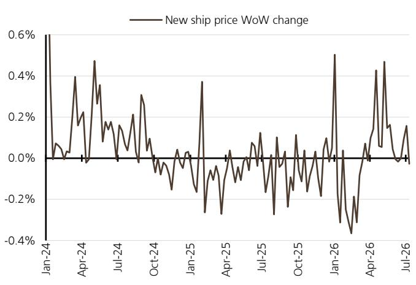  
Source: Clarksons Research

Figure 5: New ship price trend by ship types  
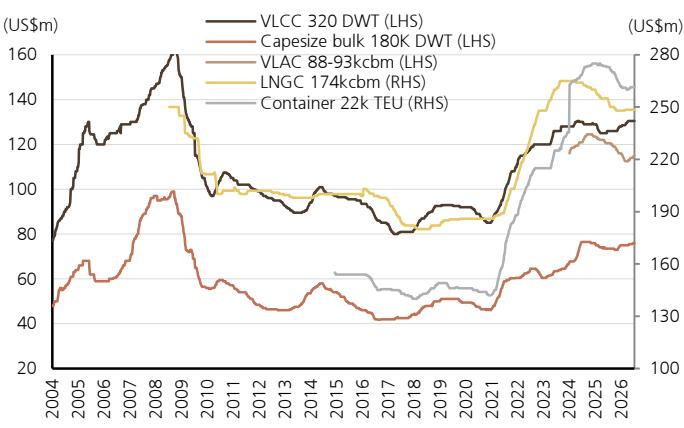  
Source: Clarksons Research

Figure 6: Korea new ship market outlook

<table><tr><td rowspan="2">(US$m)</td><td colspan="4">HD HHI</td><td colspan="4">HD KSOE (consolidated)</td><td colspan="3">SHI</td><td colspan="3">Hanwha Ocean</td><td colspan="4">Korea total</td></tr><tr><td>Ship</td><td>Offshore</td><td>Others</td><td>Total</td><td>HSHI</td><td>HMD</td><td>KSOE</td><td>Total</td><td>Ship</td><td>Offshore</td><td>Total</td><td>Ship</td><td>Offshore</td><td>Total</td><td>Ship</td><td>Offshore</td><td>Total</td><td>YoY</td></tr><tr><td>Q123</td><td>1,465</td><td>17</td><td>1,159</td><td>2,641</td><td>4,943</td><td>912</td><td>-</td><td>8,496</td><td>1,000</td><td>1,500</td><td>2,500</td><td>760</td><td>40</td><td>800</td><td>9,080</td><td>1,557</td><td>11,796</td><td>-23%</td></tr><tr><td>Q223</td><td>2,559</td><td>1,202</td><td>864</td><td>4,625</td><td>923</td><td>1,533</td><td>-</td><td>7,081</td><td>700</td><td>-</td><td>700</td><td>260</td><td>150</td><td>410</td><td>5,975</td><td>1,352</td><td>8,191</td><td>-37%</td></tr><tr><td>Q323</td><td>1,553</td><td>37</td><td>527</td><td>2,117</td><td>21</td><td>977</td><td>-</td><td>3,115</td><td>3,100</td><td>-</td><td>3,100</td><td>260</td><td>-</td><td>260</td><td>5,911</td><td>37</td><td>6,475</td><td>-45%</td></tr><tr><td>Q423</td><td>5,407</td><td>29</td><td>573</td><td>6,009</td><td>810</td><td>226</td><td>-</td><td>7,045</td><td>500</td><td>1,500</td><td>2,000</td><td>740</td><td>1,901</td><td>2,641</td><td>7,683</td><td>3,430</td><td>11,686</td><td>59%</td></tr><tr><td>Q124</td><td>2,465</td><td>1,166</td><td>731</td><td>4,362</td><td>3,097</td><td>2,559</td><td>-</td><td>10,018</td><td>3,800</td><td>-</td><td>3,800</td><td>2,350</td><td>-</td><td>2,350</td><td>14,271</td><td>1,166</td><td>16,168</td><td>37%</td></tr><tr><td>Q224</td><td>1,445</td><td>31</td><td>759</td><td>2,235</td><td>491</td><td>1,891</td><td>-</td><td>4,617</td><td>1,100</td><td>-</td><td>1,100</td><td>2,720</td><td>260</td><td>2,980</td><td>7,647</td><td>291</td><td>8,697</td><td>6%</td></tr><tr><td>Q324</td><td>1,721</td><td>7</td><td>936</td><td>2,664</td><td>2,638</td><td>1,305</td><td>-</td><td>6,607</td><td>500</td><td>-</td><td>500</td><td>410</td><td>360</td><td>770</td><td>6,574</td><td>367</td><td>7,877</td><td>22%</td></tr><tr><td>Q424</td><td>615</td><td>220</td><td>774</td><td>1,703</td><td>1,016</td><td>370</td><td>-</td><td>2,975</td><td>1,900</td><td>-</td><td>1,900</td><td>2,140</td><td>740</td><td>2,880</td><td>6,041</td><td>960</td><td>7,755</td><td>-34%</td></tr><tr><td>Q125</td><td>3,246</td><td>14</td><td>1,463</td><td>4,723</td><td>152</td><td>449</td><td>-</td><td>5,324</td><td>1,900</td><td>-</td><td>1,900</td><td>2,500</td><td>60</td><td>2,560</td><td>8,247</td><td>74</td><td>9,784</td><td>-39%</td></tr><tr><td>Q225</td><td>2,257</td><td>27</td><td>993</td><td>3,277</td><td>3,074</td><td>1,488</td><td>-</td><td>7,839</td><td>700</td><td>-</td><td>700</td><td>630</td><td>30</td><td>660</td><td>8,149</td><td>57</td><td>9,199</td><td>6%</td></tr><tr><td>Q325</td><td>721</td><td>20</td><td>579</td><td>1,320</td><td>1,056</td><td>277</td><td>-</td><td>2,653</td><td>1,700</td><td>700</td><td>2,400</td><td>2,910</td><td>190</td><td>3,100</td><td>6,664</td><td>910</td><td>8,153</td><td>4%</td></tr><tr><td>Q425</td><td>2,920</td><td>72</td><td>381</td><td>3,373</td><td>2,666</td><td>153</td><td>-</td><td>6,192</td><td>2,800</td><td>100</td><td>2,900</td><td>3,510</td><td>220</td><td>3,730</td><td>12,049</td><td>392</td><td>12,822</td><td>65%</td></tr><tr><td>Q126</td><td>4,919</td><td>91</td><td>1,109</td><td>6,119</td><td>947</td><td>-</td><td>606</td><td>7,672</td><td>2,714</td><td>400</td><td>3,114</td><td>1,910</td><td>540</td><td>2,450</td><td>11,096</td><td>1,031</td><td>13,236</td><td>35%</td></tr><tr><td>Q226</td><td>6,305</td><td>17</td><td>951</td><td>7,273</td><td>3,081</td><td>-</td><td>1,059</td><td>11,413</td><td>2,868</td><td>4,000</td><td>6,868</td><td>1,880</td><td>-</td><td>1,880</td><td>15,194</td><td>4,017</td><td>20,162</td><td>119%</td></tr><tr><td>6M25</td><td>5,503</td><td>41</td><td>2,456</td><td>8,000</td><td>3,226</td><td>1,937</td><td>-</td><td>13,163</td><td>2,600</td><td>-</td><td>2,600</td><td>3,130</td><td>90</td><td>3,220</td><td>16,396</td><td>131</td><td>18,983</td><td></td></tr><tr><td>6M26E</td><td>11,224</td><td>108</td><td>2,060</td><td>13,392</td><td>4,028</td><td>-</td><td>1,665</td><td>19,085</td><td>5,583</td><td>4,400</td><td>9,983</td><td>3,790</td><td>540</td><td>4,330</td><td>26,290</td><td>5,048</td><td>33,398</td><td></td></tr><tr><td>YoY change</td><td>104%</td><td>163%</td><td>-16%</td><td>67%</td><td>25%</td><td>NM</td><td>NM</td><td>45%</td><td>115%</td><td>NM</td><td>284%</td><td>21%</td><td>500%</td><td>34%</td><td>60%</td><td>3753%</td><td>76%</td><td></td></tr><tr><td>2025 guidance</td><td>7,867</td><td>1,884</td><td>2,826</td><td>12,577</td><td>4,571</td><td>3,800</td><td>NA</td><td>20,948</td><td>5,800</td><td>4,000</td><td>9,800</td><td>NA</td><td>NA</td><td>NA</td><td>NA</td><td>NA</td><td>NA</td><td>NM</td></tr><tr><td>% achieved</td><td>116%</td><td>7%</td><td>121%</td><td>101%</td><td>152%</td><td>62%</td><td>NM</td><td>105%</td><td>122%</td><td>20%</td><td>81%</td><td>NM</td><td>NM</td><td>NM</td><td>NM</td><td>NM</td><td>NM</td><td></td></tr><tr><td>2026 guidance</td><td>14,486</td><td>3,259</td><td>2,675</td><td>20,420</td><td>5,048</td><td></td><td>1,365</td><td>26,833</td><td>5,700</td><td>8,200</td><td>13,900</td><td>NA</td><td>NA</td><td>NA</td><td>NA</td><td>NA</td><td>NA</td><td>NM</td></tr><tr><td>% YoY</td><td>26%</td><td>2350%</td><td>-22%</td><td>36%</td><td>-27%</td><td></td><td>NM</td><td>22%</td><td>-20%</td><td>925%</td><td>76%</td><td>NM</td><td>NM</td><td>NM</td><td>NM</td><td>NM</td><td>NM</td><td></td></tr><tr><td>% achieved</td><td>77%</td><td>3%</td><td>77%</td><td>66%</td><td>80%</td><td>NM</td><td>122%</td><td>71%</td><td>98%</td><td>54%</td><td>72%</td><td>NM</td><td>NM</td><td>NM</td><td>NM</td><td>NM</td><td>NM</td><td>NM</td></tr><tr><td>2015</td><td>5,984</td><td>1,572</td><td>6,982</td><td>14,538</td><td>3,643</td><td>2,790</td><td>-</td><td>20,971</td><td>3,900</td><td>6,100</td><td>10,000</td><td>4,440</td><td>-</td><td>4,470</td><td>20,757</td><td>7,672</td><td>35,441</td><td>-24%</td></tr><tr><td>2016</td><td>3,877</td><td>395</td><td>4,874</td><td>9,146</td><td>1,124</td><td>913</td><td>-</td><td>11,183</td><td>500</td><td>-</td><td>500</td><td>1,110</td><td>-</td><td>1,540</td><td>7,524</td><td>395</td><td>13,223</td><td>-63%</td></tr><tr><td>2017</td><td>4,702</td><td>264</td><td>1,035</td><td>6,001</td><td>2,826</td><td>2,324</td><td>-</td><td>11,151</td><td>3,100</td><td>3,800</td><td>6,900</td><td>2,690</td><td>-</td><td>2,970</td><td>15,642</td><td>4,064</td><td>21,021</td><td>59%</td></tr><tr><td>2018</td><td>6,872</td><td>718</td><td>1,503</td><td>9,093</td><td>4,644</td><td>2,455</td><td>-</td><td>16,192</td><td>6,300</td><td>-</td><td>6,300</td><td>5,260</td><td>1,070</td><td>6,330</td><td>25,531</td><td>1,788</td><td>28,822</td><td>37%</td></tr><tr><td>2019</td><td>6,128</td><td>58</td><td>1,586</td><td>7,772</td><td>4,167</td><td>2,706</td><td>-</td><td>14,645</td><td>6,000</td><td>1,100</td><td>7,100</td><td>4,460</td><td>2,415</td><td>6,875</td><td>23,461</td><td>3,573</td><td>28,620</td><td>-1%</td></tr><tr><td>2020</td><td>3,477</td><td>256</td><td>954</td><td>4,687</td><td>3,484</td><td>2,316</td><td>-</td><td>10,487</td><td>5,500</td><td>-</td><td>5,500</td><td>5,410</td><td>230</td><td>5,640</td><td>20,187</td><td>486</td><td>21,627</td><td>-24%</td></tr><tr><td>2021</td><td>10,845</td><td>1,793</td><td>2,105</td><td>14,743</td><td>5,553</td><td>4,789</td><td>-</td><td>25,085</td><td>12,200</td><td>-</td><td>12,200</td><td>7,630</td><td>3,230</td><td>10,860</td><td>41,017</td><td>5,023</td><td>48,145</td><td>123%</td></tr><tr><td>2022</td><td>11,615</td><td>19</td><td>3,363</td><td>14,997</td><td>8,682</td><td>3,787</td><td>-</td><td>27,466</td><td>9,400</td><td>-</td><td>9,400</td><td>9,500</td><td>980</td><td>10,480</td><td>42,984</td><td>999</td><td>47,346</td><td>-2%</td></tr><tr><td>2023</td><td>10,984</td><td>1,285</td><td>3,123</td><td>15,392</td><td>6,697</td><td>3,648</td><td>-</td><td>25,737</td><td>5,300</td><td>3,000</td><td>8,300</td><td>2,020</td><td>2,091</td><td>4,111</td><td>28,649</td><td>6,376</td><td>38,148</td><td>-19%</td></tr><tr><td>2024</td><td>6,246</td><td>1,424</td><td>3,294</td><td>10,964</td><td>7,242</td><td>6,125</td><td>-</td><td>24,331</td><td>7,300</td><td>-</td><td>7,300</td><td>7,620</td><td>1,360</td><td>8,980</td><td>34,533</td><td>2,784</td><td>40,611</td><td>6%</td></tr><tr><td>2025</td><td>9,144</td><td>133</td><td>3,416</td><td>12,693</td><td>6,948</td><td>2,367</td><td>-</td><td>22,008</td><td>7,100</td><td>800</td><td>7,900</td><td>9,550</td><td>500</td><td>10,050</td><td>35,109</td><td>1,433</td><td>39,958</td><td>-2%</td></tr><tr><td>2026E</td><td>13,344</td><td>1,450</td><td>3,577</td><td>18,371</td><td>6,597</td><td>NA</td><td>NA</td><td>24,968</td><td>9,089</td><td>5,627</td><td>14,715</td><td>9,371</td><td>3,439</td><td>12,810</td><td>38,400</td><td>10,516</td><td>52,493</td><td>31%</td></tr><tr><td>2027E</td><td>14,426</td><td>1,200</td><td>3,315</td><td>18,941</td><td>6,180</td><td>NA</td><td>NA</td><td>25,121</td><td>10,047</td><td>4,300</td><td>14,347</td><td>9,185</td><td>5,373</td><td>14,557</td><td>39,839</td><td>10,873</td><td>54,026</td><td>3%</td></tr><tr><td>2028E</td><td>14,154</td><td>1,200</td><td>3,255</td><td>18,609</td><td>4,991</td><td>NA</td><td>NA</td><td>23,600</td><td>9,030</td><td>2,800</td><td>11,830</td><td>7,523</td><td>4,986</td><td>12,508</td><td>35,698</td><td>8,986</td><td>47,938</td><td>-11%</td></tr></table>

Source: Company data, Clarksons Research, UBS estimates. Latest month's new orders are based on UBS estimates

Figure 7: HOC 3 year forward PE  
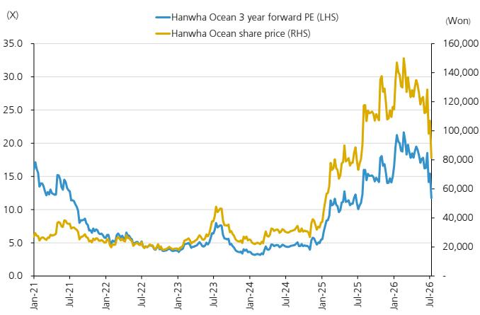  
Source: Company data, UBS estimates

Figure 8: HHI 3 year forward PE  
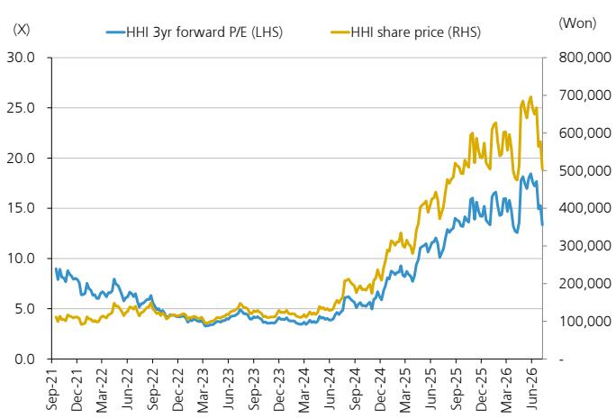  
Source: Company data, UBS estimates

Figure 9: SHI 3 year forward PE  
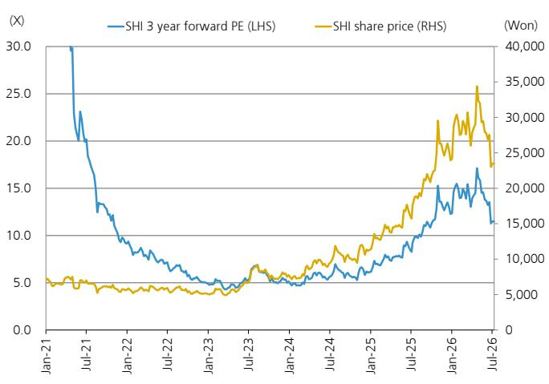  
Source: Company data, UBS estimates

Figure 10: KSOE 3 year forward PE  
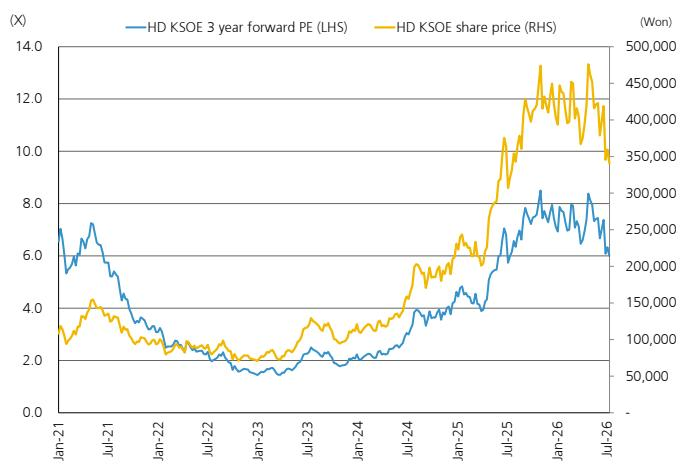  
Source: Company data, UBS estimates

Figure 11: NAV discount for KSOE  
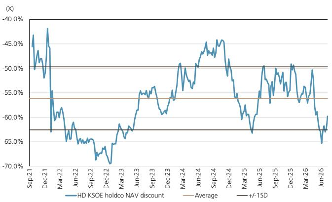  
Source: Company data, UBS estimates

Figure 12: HMS NTM PE discount to global peers  
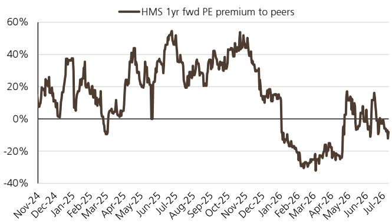  
Source: Company data, UBS estimates

Figure 13: HOC Q226 earnings preview

<table><tr><td>(Won bn)</td><td>Q226 UBS est.</td><td>Q226 Consensus</td><td>UBS vs. consensus</td><td>Q225 Actual</td><td>YoY (%)</td><td>Q126 Actual</td><td>QoQ (%)</td></tr><tr><td>Revenue</td><td>3,501</td><td>3,492</td><td>0%</td><td>3,294</td><td>6%</td><td>3,210</td><td>9%</td></tr><tr><td>Operating profit</td><td>455</td><td>501</td><td>-9%</td><td>372</td><td>22%</td><td>441</td><td>3%</td></tr><tr><td>Pre-tax profit</td><td>389</td><td>471</td><td>-17%</td><td>151</td><td>158%</td><td>506</td><td>-23%</td></tr><tr><td>Net profit</td><td>380</td><td>373</td><td>2%</td><td>148</td><td>156%</td><td>500</td><td>-24%</td></tr><tr><td>Operating margin</td><td>13.0%</td><td>14.4%</td><td></td><td>11.3%</td><td></td><td>13.7%</td><td></td></tr><tr><td>Pre-tax margin</td><td>11.1%</td><td>13.5%</td><td></td><td>4.6%</td><td></td><td>15.8%</td><td></td></tr><tr><td>Net margin</td><td>10.9%</td><td>10.7%</td><td></td><td>4.5%</td><td></td><td>15.6%</td><td></td></tr></table>

Source: Company data, Bloomberg consensus, UBS estimates

Figure 14: HHI Q226 earnings preview

<table><tr><td>(Won bn)</td><td>Q226 UBS est.</td><td>Q226 Consensus</td><td>UBS vs. consensus</td><td>Q225 Actual</td><td>YoY (%)</td><td>Q126 Actual</td><td>QoQ (%)</td></tr><tr><td>Revenue</td><td>6,221</td><td>6,339</td><td>-2%</td><td>4,147</td><td>50%</td><td>5,916</td><td>5%</td></tr><tr><td>Operating profit</td><td>1,046</td><td>979</td><td>7%</td><td>471</td><td>122%</td><td>905</td><td>16%</td></tr><tr><td>Pre-tax profit</td><td>1,029</td><td>986</td><td>4%</td><td>280</td><td>267%</td><td>1,056</td><td>-3%</td></tr><tr><td>Net profit</td><td>792</td><td>758</td><td>5%</td><td>211</td><td>275%</td><td>774</td><td>2%</td></tr><tr><td>Operating margin</td><td>16.8%</td><td>15.4%</td><td></td><td>11.4%</td><td></td><td>15.3%</td><td></td></tr><tr><td>Pre-tax margin</td><td>16.5%</td><td>15.6%</td><td></td><td>6.8%</td><td></td><td>17.9%</td><td></td></tr><tr><td>Net margin</td><td>12.7%</td><td>12.0%</td><td></td><td>5.1%</td><td></td><td>13.1%</td><td></td></tr></table>

Source: Company data, Bloomberg consensus, UBS estimates

Figure 15: SHI Q226 earnings preview

<table><tr><td>(Won bn)</td><td>Q226 UBS est.</td><td>Q226 Consensus</td><td>UBS vs. consensus</td><td>Q225 Actual</td><td>YoY (%)</td><td>Q126 Actual</td><td>QoQ (%)</td></tr><tr><td>Revenue</td><td>3,356</td><td>3,282</td><td>2%</td><td>2,683</td><td>25%</td><td>2,902</td><td>16%</td></tr><tr><td>Operating profit</td><td>372</td><td>403</td><td>-8%</td><td>205</td><td>82%</td><td>273</td><td>36%</td></tr><tr><td>Pre-tax profit</td><td>358</td><td>373</td><td>-4%</td><td>215</td><td>67%</td><td>130</td><td>176%</td></tr><tr><td>Net profit</td><td>273</td><td>292</td><td>-7%</td><td>214</td><td>28%</td><td>102</td><td>169%</td></tr><tr><td>Operating margin</td><td>11.1%</td><td>12.3%</td><td></td><td>7.6%</td><td></td><td>9.4%</td><td></td></tr><tr><td>Pre-tax margin</td><td>10.7%</td><td>11.4%</td><td></td><td>8.0%</td><td></td><td>4.5%</td><td></td></tr><tr><td>Net margin</td><td>8.1%</td><td>8.9%</td><td></td><td>8.0%</td><td></td><td>3.5%</td><td></td></tr></table>

Source: Company data, Bloomberg consensus, UBS estimates

Figure 16: KSOE Q226 earnings preview

<table><tr><td>(Won bn)</td><td>Q226 UBS est.</td><td>Q226 Consensus</td><td>UBS vs. consensus</td><td>Q225 Actual</td><td>YoY (%)</td><td>Q126 Actual</td><td>QoQ (%)</td></tr><tr><td>Revenue</td><td>8,889</td><td>8,594</td><td>3%</td><td>7,428</td><td>20%</td><td>8,141</td><td>9%</td></tr><tr><td>Operating profit</td><td>1,463</td><td>1,396</td><td>5%</td><td>954</td><td>53%</td><td>1,356</td><td>8%</td></tr><tr><td>Pre-tax profit</td><td>1,510</td><td>1,408</td><td>7%</td><td>546</td><td>177%</td><td>1,568</td><td>-4%</td></tr><tr><td>Net profit</td><td>805</td><td>840</td><td>-4%</td><td>356</td><td>126%</td><td>844</td><td>-5%</td></tr><tr><td>Operating margin</td><td>16.5%</td><td>16.2%</td><td></td><td>12.8%</td><td></td><td>16.7%</td><td></td></tr><tr><td>Pre-tax margin</td><td>17.0%</td><td>16.4%</td><td></td><td>7.3%</td><td></td><td>19.3%</td><td></td></tr><tr><td>Net margin</td><td>9.1%</td><td>9.8%</td><td></td><td>4.8%</td><td></td><td>10.4%</td><td></td></tr></table>

Source: Company data, Bloomberg consensus, UBS estimates

Figure 17: HMS Q226 earnings preview

<table><tr><td>(Won bn)</td><td>Q226 UBS est.</td><td>Q226 Consensus</td><td>UBS vs. consensus</td><td>Q225 Actual</td><td>YoY (%)</td><td>Q126 Actual</td><td>QoQ (%)</td></tr><tr><td>Revenue</td><td>543</td><td>609</td><td>-11%</td><td>468</td><td>16%</td><td>575</td><td>-6%</td></tr><tr><td>Operating profit</td><td>102</td><td>108</td><td>-6%</td><td>83</td><td>23%</td><td>93</td><td>9%</td></tr><tr><td>Pre-tax profit</td><td>106</td><td>112</td><td>-6%</td><td>68</td><td>55%</td><td>120</td><td>-11%</td></tr><tr><td>Net profit</td><td>81</td><td>86</td><td>-6%</td><td>53</td><td>52%</td><td>98</td><td>-18%</td></tr><tr><td>Operating margin</td><td>18.8%</td><td>17.7%</td><td></td><td>17.7%</td><td></td><td>16.3%</td><td></td></tr><tr><td>Pre-tax margin</td><td>19.5%</td><td>18.5%</td><td></td><td>14.6%</td><td></td><td>20.8%</td><td></td></tr><tr><td>Net margin</td><td>14.8%</td><td>14.1%</td><td></td><td>11.3%</td><td></td><td>17.1%</td><td></td></tr></table>

Source: Company data, Bloomberg consensus, UBS estimates

Figure 18: Performance comparison - shipyards

<table><tr><td rowspan="2">Ticker</td><td rowspan="2">Company name</td><td rowspan="2">Price (LC)10-Jul-26</td><td rowspan="2">Mkt cap(US$m)</td><td rowspan="2">Rating</td><td colspan="6">Absolute performance</td><td colspan="6">Relative performance</td><td rowspan="2">Price high sinceJan-2010</td><td rowspan="2">Price low sinceJan-2010</td><td rowspan="2">Off fromhigh sinceJan-2010</td><td rowspan="2">Up fromlow sinceJan-2010</td></tr><tr><td>1W</td><td>1M</td><td>3M</td><td>6M</td><td>12M</td><td>YTD</td><td>1W</td><td>1M</td><td>3M</td><td>6M</td><td>12M</td><td>YTD</td></tr><tr><td colspan="21">Shipbuilders</td></tr><tr><td colspan="21">Korea</td></tr><tr><td>329180.KS</td><td>HD Hyundai Heavy Industries</td><td>504,000</td><td>35,164</td><td>Buy</td><td>-12.7</td><td>-21.4</td><td>6.1</td><td>-17.2</td><td>25.8</td><td>-1.0</td><td>-5.5</td><td>-18.7</td><td>-16.8</td><td>-49.2</td><td>-46.4</td><td>-44.2</td><td>745,000</td><td>91,500</td><td>-32%</td><td>451%</td></tr><tr><td>009540.KS</td><td>HD Korea Shipbuilding &amp; Offshore Eng</td><td>340,500</td><td>16,018</td><td>Buy</td><td>-5.3</td><td>-11.7</td><td>-13.6</td><td>-23.8</td><td>3.5</td><td>-16.3</td><td>2.5</td><td>-8.7</td><td>-32.3</td><td>-53.3</td><td>-55.9</td><td>-52.8</td><td>516,206</td><td>66,300</td><td>-34%</td><td>414%</td></tr><tr><td>042660.KS</td><td>Hanwha Ocean</td><td>81,300</td><td>16,555</td><td>Buy</td><td>-23.9</td><td>-26.2</td><td>-34.1</td><td>-39.5</td><td>4.0</td><td>-28.4</td><td>-17.7</td><td>-23.7</td><td>-48.4</td><td>-62.9</td><td>-55.7</td><td>-59.7</td><td>478,500</td><td>11,200</td><td>-83%</td><td>626%</td></tr><tr><td>010140.KS</td><td>Samsung Heavy Ind.</td><td>22,350</td><td>13,074</td><td>Buy</td><td>-4.9</td><td>-14.0</td><td>-21.7</td><td>-22.0</td><td>25.0</td><td>-7.3</td><td>2.9</td><td>-11.1</td><td>-38.6</td><td>-52.1</td><td>-46.8</td><td>-47.7</td><td>35,812</td><td>2,918</td><td>-38%</td><td>666%</td></tr><tr><td></td><td>Korea average</td><td></td><td></td><td></td><td>-11.7</td><td>-18.3</td><td>-15.8</td><td>-25.6</td><td>14.6</td><td>-13.3</td><td>-4.5</td><td>-15.5</td><td>-34.0</td><td>-54.4</td><td>-51.2</td><td>-51.1</td><td></td><td></td><td>-47%</td><td>539%</td></tr><tr><td colspan="21">China</td></tr><tr><td>600150.SS</td><td>China CSSC Holdings</td><td>37.04</td><td>41,130</td><td>Buy</td><td>-0.3</td><td>5.6</td><td>13.4</td><td>3.6</td><td>14.4</td><td>11.4</td><td>0.9</td><td>5.6</td><td>13.2</td><td>6.8</td><td>0.5</td><td>10.6</td><td>69.29</td><td>9.27</td><td>-47%</td><td>300%</td></tr><tr><td>YAZG.SI</td><td>Yangzijiang Shipbuilding</td><td>3.61</td><td>11,109</td><td>Buy</td><td>1.4</td><td>7.1</td><td>-10.2</td><td>-0.3</td><td>58.3</td><td>3.7</td><td>-2.8</td><td>-2.9</td><td>-18.1</td><td>-13.5</td><td>18.0</td><td>-11.9</td><td>4.50</td><td>0.72</td><td>-20%</td><td>401%</td></tr><tr><td></td><td>China average</td><td></td><td></td><td></td><td>0.6</td><td>6.4</td><td>1.6</td><td>1.6</td><td>36.4</td><td>7.6</td><td>-0.9</td><td>1.3</td><td>-2.5</td><td>-3.4</td><td>9.2</td><td>-0.6</td><td></td><td></td><td>-33%</td><td>350%</td></tr><tr><td colspan="21">Other Asia</td></tr><tr><td>SCMN.SI</td><td>Seatrium</td><td>2.00</td><td>5,282</td><td>Not Rated</td><td>1.0</td><td>1.5</td><td>-18.7</td><td>-9.1</td><td>-5.7</td><td>-7.4</td><td>1.0</td><td>-8.0</td><td>-25.8</td><td>-21.1</td><td>-29.7</td><td>-21.3</td><td>65.85</td><td>1.38</td><td>-97%</td><td>45%</td></tr><tr><td></td><td>Singapore average</td><td></td><td></td><td></td><td>1.0</td><td>1.5</td><td>-18.7</td><td>-9.1</td><td>-5.7</td><td>-7.4</td><td>1.0</td><td>-8.0</td><td>-25.8</td><td>-21.1</td><td>-29.7</td><td>-21.3</td><td></td><td></td><td>-97%</td><td>45%</td></tr><tr><td colspan="21">Japan</td></tr><tr><td>7011.T</td><td>Mitsubishi Heavy Industries</td><td>3,818</td><td>79,662</td><td>Neutral</td><td>0.7</td><td>6.7</td><td>-19.5</td><td>-10.5</td><td>17.5</td><td>-0.6</td><td>1.4</td><td>1.7</td><td>-25.4</td><td>-22.1</td><td>-18.1</td><td>-16.0</td><td>5,195.0</td><td>219.2</td><td>-27%</td><td>1642%</td></tr><tr><td>7012.T</td><td>Kawasaki Heavy Industries</td><td>2,780</td><td>14,433</td><td>Buy</td><td>-1.4</td><td>-2.8</td><td>-17.8</td><td>12.3</td><td>37.9</td><td>33.9</td><td>-0.7</td><td>-7.3</td><td>-23.8</td><td>-2.2</td><td>-3.9</td><td>13.1</td><td>3,675.0</td><td>248.0</td><td>-24%</td><td>1021%</td></tr><tr><td>6269.T</td><td>MODEC</td><td>9,871</td><td>4,172</td><td>Buy</td><td>5.5</td><td>2.8</td><td>-29.3</td><td>-30.9</td><td>46.0</td><td>-17.1</td><td>6.3</td><td>-2.0</td><td>-34.5</td><td>-39.9</td><td>1.7</td><td>-29.9</td><td>16,130.0</td><td>1,043.0</td><td>-39%</td><td>846%</td></tr><tr><td>7003.T</td><td>Mitsui Engineering &amp; Shipbuilding</td><td>4,579</td><td>2,920</td><td>Not Rated</td><td>3.8</td><td>17.4</td><td>-23.6</td><td>-29.2</td><td>67.7</td><td>-17.6</td><td>4.5</td><td>12.0</td><td>-29.2</td><td>-38.4</td><td>16.9</td><td>-30.4</td><td>8,129.0</td><td>315.0</td><td>-44%</td><td>1354%</td></tr><tr><td>7004.T</td><td>Hitachi Zosen</td><td>1,236</td><td>1,301</td><td>Not Rated</td><td>-6.6</td><td>-3.4</td><td>1.9</td><td>23.4</td><td>24.8</td><td>30.1</td><td>-5.9</td><td>-7.9</td><td>-5.6</td><td>7.4</td><td>-13.0</td><td>9.9</td><td>1,453.0</td><td>301.0</td><td>-15%</td><td>311%</td></tr><tr><td>7014.T</td><td>Namura Shipbuilding</td><td>3,800</td><td>1,633</td><td>Not Rated</td><td>4.4</td><td>11.3</td><td>-6.6</td><td>-8.3</td><td>25.4</td><td>7.3</td><td>5.1</td><td>6.1</td><td>-13.5</td><td>-20.2</td><td>-12.6</td><td>-9.3</td><td>5,730.0</td><td>147.0</td><td>-34%</td><td>2485%</td></tr><tr><td></td><td>Japan average</td><td></td><td></td><td></td><td>1.1</td><td>5.3</td><td>-15.8</td><td>-7.2</td><td>36.6</td><td>6.0</td><td>1.8</td><td>0.4</td><td>-22.0</td><td>-19.2</td><td>-4.8</td><td>-10.5</td><td></td><td></td><td>-30%</td><td>1276%</td></tr><tr><td colspan="21">United States</td></tr><tr><td>GD.N</td><td>General Dynamics Corp</td><td>375.06</td><td>102,804</td><td>Neutral</td><td>0.4</td><td>10.0</td><td>11.9</td><td>6.0</td><td>23.6</td><td>11.4</td><td>-0.8</td><td>5.5</td><td>0.7</td><td>-2.5</td><td>2.5</td><td>0.7</td><td>376.88</td><td>55.67</td><td>0%</td><td>574%</td></tr><tr><td>HII.N</td><td>Huntington Ingalls Industries Inc</td><td>286.09</td><td>11,441</td><td>Not Rated</td><td>-1.9</td><td>-1.1</td><td>-27.5</td><td>-26.1</td><td>10.8</td><td>-15.9</td><td>-1.9</td><td>-5.1</td><td>-34.7</td><td>-32.0</td><td>-8.1</td><td>-24.0</td><td>453.73</td><td>22.85</td><td>-37%</td><td>1152%</td></tr><tr><td></td><td>US average</td><td></td><td></td><td></td><td>-0.7</td><td>4.5</td><td>-7.8</td><td>-10.0</td><td>17.2</td><td>-2.2</td><td>-1.3</td><td>0.2</td><td>-17.0</td><td>-17.3</td><td>-2.8</td><td>-11.7</td><td></td><td></td><td>-19%</td><td>863%</td></tr><tr><td></td><td>Total shipbuilders average</td><td></td><td></td><td></td><td>-2.6</td><td>-1.2</td><td>-12.6</td><td>-11.5</td><td>25.3</td><td>-0.9</td><td>-0.7</td><td>-4.3</td><td>-22.2</td><td>-26.3</td><td>-16.7</td><td>-20.9</td><td></td><td></td><td>-38%</td><td>819%</td></tr><tr><td colspan="21">Europe</td></tr><tr><td>ALFA.ST</td><td>Alfa Laval</td><td>560.00</td><td>23,951</td><td>Neutral</td><td>-4.9</td><td>5.6</td><td>2.1</td><td>13.8</td><td>32.3</td><td>20.2</td><td>-2.9</td><td>2.6</td><td>0.3</td><td>10.9</td><td>18.7</td><td>14.4</td><td>588.80</td><td>96.00</td><td>-5%</td><td>483%</td></tr><tr><td>WRT1V.HE</td><td>Wartsila</td><td>30.24</td><td>20,422</td><td>Neutral</td><td>-7.4</td><td>-7.8</td><td>-15.2</td><td>-6.2</td><td>50.7</td><td>-0.5</td><td>-5.5</td><td>-6.5</td><td>-16.2</td><td>-12.2</td><td>21.1</td><td>-8.4</td><td>39.63</td><td>4.77</td><td>-24%</td><td>533%</td></tr><tr><td></td><td>Europe average</td><td></td><td></td><td></td><td>-6.2</td><td>-1.1</td><td>-6.6</td><td>3.8</td><td>41.5</td><td>9.9</td><td>-4.2</td><td>-1.9</td><td>-7.9</td><td>-0.6</td><td>19.9</td><td>3.0</td><td></td><td></td><td>-14%</td><td>508%</td></tr><tr><td></td><td>Global ship marine MRO average</td><td></td><td></td><td></td><td>-7.0</td><td>-5.4</td><td>-2.4</td><td>3.4</td><td>28.3</td><td>7.2</td><td>-3.2</td><td>-4.9</td><td>-11.0</td><td>-12.8</td><td>-5.6</td><td>-12.2</td><td></td><td></td><td>-19%</td><td>384%</td></tr></table>

Source: Thomson Reuters, Bloomberg for Not Rated companies

Figure 19: Valuation comparison – shipyards

<table><tr><td rowspan="2">Ticker</td><td rowspan="2">Company name</td><td rowspan="2">Localcurr.</td><td rowspan="2">Price10-Jul-26</td><td rowspan="2">Mkt cap(US$m)</td><td rowspan="2">Rating</td><td colspan="4">P/E (x)</td><td colspan="3">EV/EBITDA (x)</td><td colspan="4">P/Book (x)</td><td colspan="4">ROE (%)</td><td rowspan="2">EBITDAmargin27E</td><td rowspan="2">Div.yield27E</td><td rowspan="2">Div.yield28E</td><td rowspan="2">Net debt/Equity27E</td></tr><tr><td>27E</td><td>28E</td><td>29E</td><td>30E</td><td>27E</td><td>28E</td><td>29E</td><td>26E</td><td>27E</td><td>28E</td><td>29E</td><td>27E</td><td>28E</td><td>29E</td><td>30E</td></tr><tr><td colspan="25">Shipbuilders</td></tr><tr><td colspan="25">Korea</td></tr><tr><td>329180.KS</td><td>HD Hyundai Heavy Industries</td><td>KRW</td><td>504,000</td><td>35,164</td><td>Buy</td><td>14.4</td><td>15.0</td><td>13.5</td><td>12.3</td><td>9.7</td><td>9.7</td><td>8.5</td><td>4.7</td><td>3.9</td><td>3.4</td><td>3.0</td><td>29.7</td><td>24.3</td><td>23.4</td><td>22.5</td><td>19.0%</td><td>2.8%</td><td>2.7%</td><td>-37%</td></tr><tr><td>009540.KS</td><td>HD Korea Shipbuilding &amp; Offshore Eng</td><td>KRW</td><td>340,500</td><td>16,018</td><td>Buy</td><td>6.3</td><td>6.8</td><td>6.0</td><td>5.7</td><td>3.4</td><td>3.5</td><td>3.1</td><td>1.6</td><td>1.4</td><td>1.2</td><td>1.1</td><td>23.2</td><td>18.9</td><td>19.2</td><td>18.2</td><td>20.1%</td><td>6.4%</td><td>5.9%</td><td>-27%</td></tr><tr><td>042660.KS</td><td>Hanwha Ocean</td><td>KRW</td><td>81,300</td><td>16,555</td><td>Buy</td><td>11.7</td><td>12.1</td><td>10.4</td><td>10.1</td><td>9.9</td><td>8.9</td><td>7.8</td><td>3.2</td><td>2.5</td><td>2.2</td><td>1.9</td><td>24.2</td><td>19.6</td><td>19.8</td><td>17.8</td><td>16.9%</td><td>0.0%</td><td>2.5%</td><td>37%</td></tr><tr><td>010140.KS</td><td>Samsung Heavy Ind.</td><td>KRW</td><td>22,350</td><td>13,074</td><td>Buy</td><td>13.3</td><td>12.8</td><td>11.3</td><td>10.1</td><td>8.6</td><td>7.7</td><td>6.5</td><td>3.8</td><td>2.9</td><td>2.6</td><td>2.2</td><td>25.0</td><td>21.4</td><td>21.1</td><td>20.3</td><td>15.4%</td><td>0.0%</td><td>0.0%</td><td>-25%</td></tr><tr><td></td><td>Korea average</td><td></td><td></td><td></td><td></td><td>11.4</td><td>11.7</td><td>10.3</td><td>9.5</td><td>7.9</td><td>7.4</td><td>6.5</td><td>3.3</td><td>2.7</td><td>2.3</td><td>2.0</td><td>25.5</td><td>21.0</td><td>20.9</td><td>19.7</td><td>17.8%</td><td>2.3%</td><td>2.8%</td><td>-13%</td></tr><tr><td colspan="25">China</td></tr><tr><td>600150.SS</td><td>China CSSC Holdings</td><td>CNY</td><td>37.04</td><td>41,130</td><td>Buy</td><td>11.2</td><td>10.3</td><td>10.1</td><td>9.9</td><td>4.1</td><td>3.2</td><td>2.5</td><td>1.7</td><td>1.6</td><td>1.4</td><td>1.3</td><td>14.7</td><td>14.4</td><td>13.4</td><td>12.5</td><td>13.7%</td><td>3.1%</td><td>3.4%</td><td>-76%</td></tr><tr><td>YAZG.SI</td><td>Yangzijiang Shipbuilding</td><td>SGD</td><td>3.61</td><td>11,109</td><td>Buy</td><td>6.2</td><td>6.1</td><td>6.0</td><td>5.8</td><td>3.4</td><td>3.0</td><td>2.5</td><td>1.9</td><td>1.7</td><td>1.5</td><td>1.3</td><td>28.8</td><td>25.3</td><td>23.0</td><td>21.1</td><td>34.1%</td><td>8.1%</td><td>8.2%</td><td>-62%</td></tr><tr><td></td><td>China average</td><td></td><td></td><td></td><td></td><td>8.7</td><td>8.2</td><td>8.0</td><td>7.9</td><td>3.7</td><td>3.1</td><td>2.5</td><td>1.8</td><td>1.6</td><td>1.4</td><td>1.3</td><td>21.8</td><td>19.9</td><td>18.2</td><td>16.8</td><td>23.9%</td><td>5.6%</td><td>5.8%</td><td>-69%</td></tr><tr><td colspan="25">Other Asia</td></tr><tr><td>SCMN.SI</td><td>Seatrium</td><td>SGD</td><td>2.00</td><td>5,282</td><td>Not Rated</td><td>12.0</td><td>11.3</td><td>9.3</td><td>10.8</td><td>7.4</td><td>7.1</td><td>6.9</td><td>0.9</td><td>0.9</td><td>0.8</td><td>0.8</td><td>7.4</td><td>7.4</td><td>8.9</td><td>9.1</td><td>10.5%</td><td>2.4%</td><td>2.8%</td><td>-5.4%</td></tr><tr><td></td><td>Singapore average</td><td></td><td></td><td></td><td></td><td>15.3</td><td>14.3</td><td>13.2</td><td>13.6</td><td>13.1</td><td>12.6</td><td>10.6</td><td>1.4</td><td>1.4</td><td>1.3</td><td>0.8</td><td>8.8</td><td>9.0</td><td>9.4</td><td>9.6</td><td>16.7%</td><td>3.1%</td><td>3.4%</td><td>40%</td></tr><tr><td colspan="25">Japan</td></tr><tr><td>7011.T</td><td>Mitsubishi Heavy Industries</td><td>JPY</td><td>3,818</td><td>79,662</td><td>Neutral</td><td>31.4</td><td>26.5</td><td>22.9</td><td>18.2</td><td>16.9</td><td>14.7</td><td>12.8</td><td>4.9</td><td>3.9</td><td>3.5</td><td>3.1</td><td>13.0</td><td>14.0</td><td>14.5</td><td>15.6</td><td>13.3%</td><td>0.8%</td><td>0.9%</td><td>-10.6%</td></tr><tr><td>7012.T</td><td>Kawasaki Heavy Industries</td><td>JPY</td><td>2,780</td><td>14,433</td><td>Buy</td><td>20.3</td><td>16.7</td><td>14.6</td><td>12.6</td><td>10.1</td><td>8.8</td><td>7.9</td><td>3.0</td><td>2.5</td><td>2.2</td><td>2.1</td><td>12.8</td><td>14.1</td><td>14.9</td><td>14.9</td><td>11.0%</td><td>1.5%</td><td>1.6%</td><td>72.2%</td></tr><tr><td>6269.T</td><td>MODEC</td><td>JPY</td><td>9,871</td><td>4,172</td><td>Buy</td><td>10.4</td><td>10.1</td><td>10.0</td><td>9.8</td><td>8.7</td><td>8.5</td><td>8.4</td><td>2.5</td><td>2.1</td><td>1.8</td><td>1.6</td><td>21.7</td><td>19.2</td><td>16.9</td><td>15.4</td><td>11.8%</td><td>2.4%</td><td>2.6%</td><td>31.0%</td></tr><tr><td></td><td>Japan average</td><td></td><td></td><td></td><td></td><td>20.7</td><td>17.8</td><td>15.8</td><td>13.5</td><td>11.9</td><td>10.7</td><td>9.7</td><td>3.5</td><td>2.8</td><td>2.5</td><td>2.3</td><td>15.8</td><td>15.8</td><td>15.4</td><td>15.3</td><td>12.1%</td><td>1.6%</td><td>1.7%</td><td>31%</td></tr><tr><td colspan="25">United States</td></tr><tr><td>GD.N</td><td>General Dynamics Corp</td><td>USD</td><td>375.06</td><td>102,804</td><td>Neutral</td><td>20.5</td><td>19.0</td><td>17.7</td><td>16.9</td><td>14.5</td><td>13.6</td><td>13.1</td><td>3.6</td><td>3.4</td><td>3.2</td><td>2.8</td><td>17.5</td><td>17.7</td><td>17.2</td><td>16.8</td><td>12.6%</td><td>1.8%</td><td>1.9%</td><td>2.7%</td></tr><tr><td>HII.N</td><td>Huntington Ingalls Industries Inc</td><td>USD</td><td>286.09</td><td>11,441</td><td>Not Rated</td><td>14.1</td><td>12.1</td><td>11.1</td><td>9.9</td><td>12.3</td><td>11.0</td><td>9.5</td><td>2.0</td><td>1.9</td><td>1.8</td><td>1.5</td><td>13.9</td><td>14.7</td><td>15.7</td><td>16.0</td><td>8.1%</td><td>2.0%</td><td>2.2%</td><td>18.9%</td></tr><tr><td></td><td>US average</td><td></td><td></td><td></td><td></td><td>17.3</td><td>15.5</td><td>14.4</td><td>13.4</td><td>13.4</td><td>12.3</td><td>11.3</td><td>2.8</td><td>2.7</td><td>2.5</td><td>2.2</td><td>15.7</td><td>16.2</td><td>16.5</td><td>16.4</td><td>10.4%</td><td>1.9%</td><td>2.0%</td><td>11%</td></tr><tr><td></td><td>Regional shipbuilders average</td><td></td><td></td><td></td><td></td><td>14.7</td><td>13.5</td><td>12.3</td><td>11.4</td><td>9.8</td><td>9.1</td><td>8.0</td><td>2.8</td><td>2.4</td><td>2.1</td><td>1.9</td><td>18.6</td><td>17.1</td><td>16.8</td><td>16.2</td><td>16.1%</td><td>2.7%</td><td>3.0%</td><td>0%</td></tr><tr><td colspan="25">Ship repair/parts suppliers (Marine MRO)</td></tr><tr><td colspan="25">Korea</td></tr><tr><td>443060.KS</td><td>HD Hyundai Marine Solution</td><td>KRW</td><td>197,200</td><td>5,827</td><td>Buy</td><td>22.5</td><td>18.3</td><td>15.4</td><td>13.2</td><td>16.1</td><td>13.0</td><td>10.9</td><td>9.4</td><td>8.2</td><td>7.1</td><td>6.1</td><td>39.0</td><td>41.8</td><td>42.9</td><td>43.2</td><td>20.3%</td><td>2.9%</td><td>3.6%</td><td>-23%</td></tr><tr><td></td><td>Korea average</td><td></td><td></td><td></td><td></td><td>22.5</td><td>18.3</td><td>15.4</td><td>13.2</td><td>16.1</td><td>13.0</td><td>10.9</td><td>9.4</td><td>8.2</td><td>7.1</td><td>6.1</td><td>39.0</td><td>41.8</td><td>42.9</td><td>43.2</td><td>20.3%</td><td>2.9%</td><td>3.6%</td><td>-23%</td></tr><tr><td colspan="25">Europe</td></tr><tr><td>ALFA.ST</td><td>Alfa Laval</td><td>SEK</td><td>560.00</td><td>23,951</td><td>Neutral</td><td>22.4</td><td>21.1</td><td>20.2</td><td>19.3</td><td>14.8</td><td>13.6</td><td>12.8</td><td>4.7</td><td>4.2</td><td>3.8</td><td>3.4</td><td>19.9</td><td>18.8</td><td>17.6</td><td>16.6</td><td>21.9%</td><td>1.9%</td><td>2.0%</td><td>7%</td></tr><tr><td>WRT1V.HE</td><td>Wartsila</td><td>EUR</td><td>30.24</td><td>20,422</td><td>Neutral</td><td>23.2</td><td>20.0</td><td>17.7</td><td>17.0</td><td>13.7</td><td>11.8</td><td>10.3</td><td>6.7</td><td>5.8</td><td>5.0</td><td>4.4</td><td>26.9</td><td>27.0</td><td>26.4</td><td>24.2</td><td>16.1%</td><td>2.3%</td><td>2.6%</td><td>-57%</td></tr><tr><td></td><td>Europe average</td><td></td><td></td><td></td><td></td><td>22.8</td><td>20.5</td><td>18.9</td><td>18.1</td><td>14.3</td><td>12.7</td><td>11.5</td><td>5.7</td><td>5.0</td><td>4.4</td><td>3.9</td><td>23.4</td><td>22.9</td><td>22.0</td><td>20.4</td><td>19.0%</td><td>2.1%</td><td>2.3%</td><td>-25%</td></tr><tr><td></td><td>Global ship marine MRO average</td><td></td><td></td><td></td><td></td><td>22.7</td><td>19.8</td><td>17.8</td><td>16.5</td><td>14.9</td><td>12.8</td><td>11.3</td><td>6.9</td><td>6.1</td><td>5.3</td><td>4.6</td><td>28.6</td><td>29.2</td><td>29.0</td><td>28.0</td><td>19.4%</td><td>2.4%</td><td>2.7%</td><td>-25%</td></tr></table>

Source: Thomson Reuters, Bloomberg for Not Rated companies

## Valuation Method and Risk Statement

We use P/B–ROE to derive our price targets for HD Hyundai Heavy Industries (HD HHI) and Samsung Heavy Industries (SHI), sum-of-the-parts (SOTP) valuation for Hanwha Ocean and HD Korea Shipbuilding & Offshore Engineering (HD KSOE), and DCF for HD Hyundai Marine Solution (HMS). Valuations are benchmarked against historical trading ranges and global peer averages as a sanity check.

Common key risks across Korean shipbuilders include: 1) A slowdown in new orders, particularly for LNG carriers and tankers; 2) Intensifying price competition driven by global shipbuilding capacity expansion, leading to lower newbuild prices; and 3) A potential decline in replacement demand for aging fleets due to delays in IMO regulations.

For Hanwha Ocean, HD HHI, and HD KSOE, which have high exposure to defense, key risks include: 1) Order delays stemming from regulatory constraints related to U.S. naval projects; 2) Operational inefficiencies and cost overruns during the U.S. investment and localization process; and 3) Failure to secure major global submarine and naval vessel contracts. For SHI, a particularly important risk is the deferral or suspension of FLNG projects, while for HMS, a key risk lies in a potential decline in HD HHI's market share in the marine engine market.

## Required Disclosures

This document has been prepared by UBS Pte. Ltd., Seoul Branch, an affiliate of UBS AG. UBS AG, its subsidiaries, branches and affiliates, including former CS AG and its subsidiaries, branches and affiliates are referred to herein as "UBS".

For information on the ways in which UBS manages conflicts and maintains independence of its UBS Global Research product; historical performance information; certain additional disclosures concerning UBS Global Research recommendations; and terms and conditions for certain third party data used in research report, please visit https://www.ubs.com/disclosures. Unless otherwise indicated, information and data in this report are based on company disclosures including but not limited to annual, interim, quarterly reports and other company announcements. The figures contained in performance charts refer to the past; past performance is not a reliable indicator of future results. Additional information will be made available upon request. UBS Co. Limited is licensed to conduct securities investment consultancy businesses by the China Securities Regulatory Commission. UBS acts or may act as principal in the debt securities (or in related derivatives) that may be the subject of this report. This recommendation was finalized on: 13 July 2026 06:23 PM GMT. UBS has designated certain UBS Global Research department members as Derivatives Research Analysts where those department members publish research principally on the analysis of the price or market for a derivative, and provide information reasonably sufficient upon which to base a decision to enter into a derivatives transaction. Where Derivatives Research Analysts co-author research reports with Equity Research Analysts or Economists, the Derivatives Research Analyst is responsible for the derivatives investment views, forecasts, and/or recommendations. Quantitative Research Review: UBS Global Research publishes a quantitative assessment of its analysts' responses to certain questions about the likelihood of an occurrence of a number of short term factors in a product known as the 'Quantitative Research Review'. Views contained in this assessment on a particular stock reflect only the views on those short term factors which are a different timeframe to the 12-month timeframe reflected in any equity rating set out in this note. For the latest responses, please see the Quantitative Research Review Addendum at the back of this report, where applicable. For previous responses please make reference to (i) previous UBS Global Research reports; and (ii) where no applicable research report was published that month, the Quantitative Research Review which can be found at https://neo.ubs.com/quantitative, or contact your UBS sales representative for access to the report or the Quantitative Research Team on ubs-quant-answers@ubs.com. A consolidated report which contains all responses is also available and again you should contact your UBS sales representative for details and pricing or the Quantitative Research team on the email above.

## Analyst Certification:

Each research analyst primarily responsible for the content of this research report, in whole or in part, certifies that with respect to each security or issuer that the analyst covered in this report: (1) all of the views expressed accurately reflect his or her personal views about those securities or issuers and were prepared in an independent manner, including with respect to UBS, and (2) no part of his or her compensation was, is, or will be, directly or indirectly, related to the specific recommendations or views expressed by that research analyst in the research report.

UBS Global Research: Global Equity Rating Definitions

<table><tr><td>12-Month Rating</td><td>Definition</td><td>Coverage $^{1}$ </td><td>IB Services $^{2}$ </td></tr><tr><td>Buy</td><td>FSR is &gt; 6% above the MRA.</td><td>55%</td><td>24%</td></tr><tr><td>Neutral</td><td>FSR is between -6% and 6% of the MRA.</td><td>40%</td><td>21%</td></tr><tr><td>Sell</td><td>FSR is &gt; 6% below the MRA.</td><td>6%</td><td>21%</td></tr></table>

Source: UBS. Rating allocations are as of 30 June 2026.  
1: Percentage of companies under coverage globally within the 12-month rating category.

2: Percentage of companies within the 12-month rating category for which investment banking (IB) services were provided within the past 12 months.

KEY DEFINITIONS: Forecast Stock Return (FSR) is defined as expected percentage price appreciation plus gross dividend yield over the next 12 months. In some cases, this yield may be based on accrued dividends. Market Return Assumption (MRA) is defined as the one-year local market interest rate plus 5% (a proxy for, and not a forecast of, the equity risk premium). Under Review (UR) Stocks may be flagged as UR by the analyst, indicating that the stock's price target and/or rating are subject to possible change in the near term, usually in response to an event that may affect the investment case or valuation. Equity Price Targets have an investment horizon of 12 months.

EXCEPTIONS AND SPECIAL CASES:UK and European Investment Fund ratings and definitions are: Buy: Positive on factors such as structure, management, performance record, discount; Neutral: Neutral on factors such as structure, management, performance record, discount; Sell: Negative on factors such as structure, management, performance record, discount. Core Banding Exceptions (CBE): Exceptions to the standard +/-6% bands may be granted by the Investment Review Consultation (IRC). Factors considered by the IRC include the stock's volatility and the credit spread of the respective company's debt. As a result, stocks deemed to be very high or low risk may be subject to higher or lower bands as they relate to the rating. When such exceptions apply, they will be identified in the Company Disclosures table in the relevant research piece.

Research analysts contributing to this report who are employed by any non-US affiliate of UBS LLC are not registered/qualified as research analysts with FINRA. Such analysts may not be associated persons of UBS LLC and therefore are not subject to the FINRA restrictions on communications with a subject company, public appearances, and trading securities held by a research analyst account. The name of each affiliate and analyst employed by that affiliate contributing to this report, if any, follows.

## UBS Pte. Ltd., Seoul Branch: Yong-Suk Son, CFA.

Company Disclosures

<table><tr><td>Company Name</td><td>Reuters</td><td>12-month rating</td><td>Price</td><td>Price date</td></tr><tr><td>HD Hyundai Heavy Industries4,18</td><td>329180.KS</td><td>Buy</td><td>Won487,500</td><td>13 Jul 2026</td></tr><tr><td>HD Hyundai Marine Solution2,4,6</td><td>443060.KS</td><td>Buy</td><td>Won193,600</td><td>13 Jul 2026</td></tr><tr><td>HD Korea Shipbuilding &amp; Offshore Eng2,4,5,6,28</td><td>009540.KS</td><td>Buy</td><td>Won341,500</td><td>13 Jul 2026</td></tr><tr><td>Hanwha Ocean</td><td>042660.KS</td><td>Buy</td><td>Won78,800</td><td>13 Jul 2026</td></tr><tr><td>Samsung Heavy Ind.28</td><td>010140.KS</td><td>Buy</td><td>Won22,050</td><td>13 Jul 2026</td></tr></table>

Source: UBS Global Research; LSEG Eikon. All prices as of local market close. Ratings in this table are the most current  
published ratings prior to this report. They may be more recent than the stock pricing date.  
2. UBS has acted as manager/co-manager in the underwriting or placement of securities of this company/entity or one of its affiliates within the past 12 months.  
4. Within the past 12 months, UBS has received compensation for investment banking services from this company/entity or one of its affiliates.  
5. UBS expects to receive or intend to seek compensation for investment banking services from this company/entity within the next three months.  
6. This company/entity is, or within the past 12 months has been, a client of UBS LLC and/or its affiliates, and investment banking services are being, or have been, provided.  
18. This company/entity is, or within the past 12 months has been, a client of UBS LLC and/or its affiliates, and investment banking services are being, or have been, provided.  
28. UBS holds a long position of 0.5% or more of the listed shares of this company.

Unless otherwise indicated, please refer to the Valuation and Risk sections within the body of this report. For a complete set of disclosure statements associated with the companies discussed in this report, including information on valuation and risk, please contact UBS LLC, 11 Madison Avenue, New York, NY 10010, USA, Attention: Investment Research.

HD Hyundai Heavy Industries (Won)  
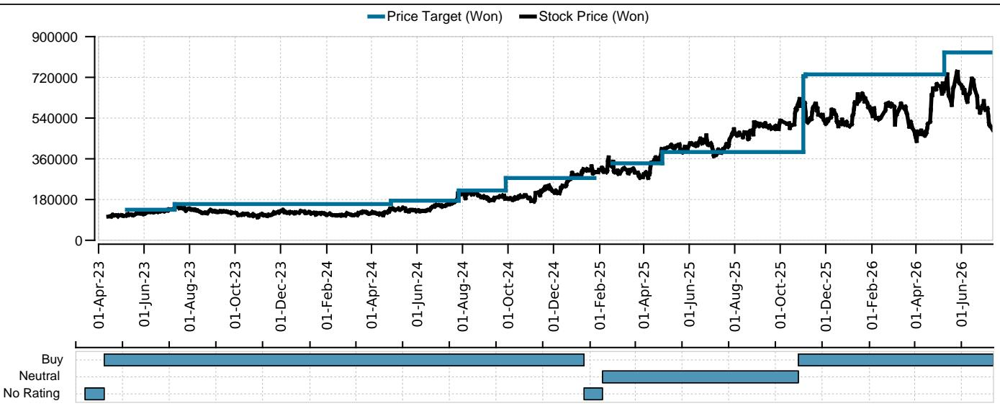

<table><tr><td>Date</td><td>Stock Price (Won)</td><td>Price Target (Won)</td><td>Rating</td></tr><tr><td>2023-04-13</td><td>101300</td><td>-</td><td>No Rating</td></tr><tr><td>2023-05-08</td><td>108900</td><td>135000</td><td>Buy</td></tr><tr><td>2023-07-11</td><td>140000</td><td>160000</td><td>Buy</td></tr><tr><td>2024-04-26</td><td>139500</td><td>175000</td><td>Buy</td></tr><tr><td>2024-07-26</td><td>207500</td><td>220000</td><td>Buy</td></tr><tr><td>2024-09-27</td><td>183500</td><td>275000</td><td>Buy</td></tr><tr><td>2025-01-24</td><td>301500</td><td>-</td><td>No Rating</td></tr><tr><td>2025-02-17</td><td>326500</td><td>340000</td><td>Neutral</td></tr><tr><td>2025-04-25</td><td>403000</td><td>390000</td><td>Neutral</td></tr><tr><td>2025-10-31</td><td>600000</td><td>725000</td><td>Buy</td></tr><tr><td>2025-11-03</td><td>607000</td><td>733000</td><td>Buy</td></tr><tr><td>2026-05-08</td><td>658000</td><td>830000</td><td>Buy</td></tr></table>

Source: UBS Global Research; LSEG Eikon as of 13-Jul-2026. All prices as of local market close. Ratings as of date shown.

Samsung Heavy Ind. (Won)  
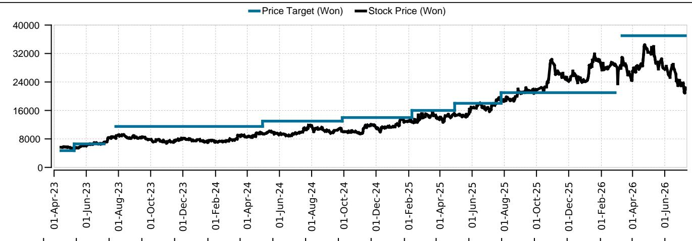

<table><tr><td>Date</td><td>Stock Price (Won)</td><td>Price Target (Won)</td><td>Rating</td></tr><tr><td>2023-04-13</td><td>5470</td><td>4700</td><td>Sell</td></tr><tr><td>2023-05-08</td><td>5430</td><td>6600</td><td>Buy</td></tr><tr><td>2023-07-04</td><td>6940</td><td>-</td><td>No Rating</td></tr><tr><td>2023-07-26</td><td>8370</td><td>11500</td><td>Buy</td></tr><tr><td>2024-04-29</td><td>9600</td><td>13000</td><td>Buy</td></tr><tr><td>2024-09-27</td><td>10180</td><td>14000</td><td>Buy</td></tr><tr><td>2025-02-06</td><td>12950</td><td>16000</td><td>Buy</td></tr><tr><td>2025-04-28</td><td>15150</td><td>18000</td><td>Buy</td></tr><tr><td>2025-07-25</td><td>18870</td><td>21000</td><td>Neutral</td></tr><tr><td>2026-02-26</td><td>28700</td><td>-</td><td>No Rating</td></tr><tr><td>2026-03-11</td><td>28800</td><td>37000</td><td>Buy</td></tr></table>

Source: UBS Global Research; LSEG Eikon as of 13-Jul-2026. All prices as of local market close. Ratings as of date shown.

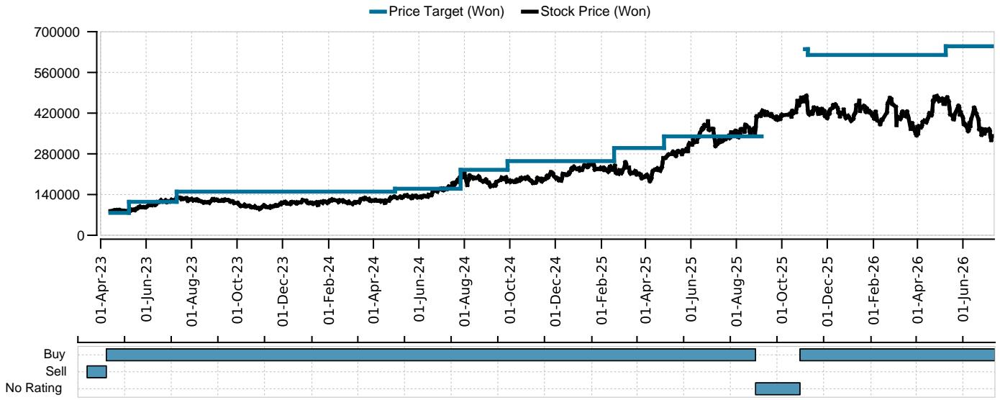

<table><tr><td>Date</td><td>Stock Price (Won)</td><td>Price Target (Won)</td><td>Rating</td></tr><tr><td>2023-04-13</td><td>80500</td><td>77000</td><td>Sell</td></tr><tr><td>2023-05-08</td><td>84100</td><td>115000</td><td>Buy</td></tr><tr><td>2023-07-11</td><td>124000</td><td>150000</td><td>Buy</td></tr><tr><td>2024-04-29</td><td>132700</td><td>160000</td><td>Buy</td></tr><tr><td>2024-07-26</td><td>198800</td><td>225000</td><td>Buy</td></tr><tr><td>2024-09-27</td><td>184500</td><td>255000</td><td>Buy</td></tr><tr><td>2025-02-17</td><td>225500</td><td>300000</td><td>Buy</td></tr><tr><td>2025-04-25</td><td>265500</td><td>340000</td><td>Buy</td></tr><tr><td>2025-09-03</td><td>411000</td><td>-</td><td>No Rating</td></tr><tr><td>2025-10-31</td><td>474000</td><td>640000</td><td>Buy</td></tr><tr><td>2025-11-04</td><td>457500</td><td>620000</td><td>Buy</td></tr><tr><td>2026-05-08</td><td>452000</td><td>650000</td><td>Buy</td></tr></table>

Source: UBS Global Research; LSEG Eikon as of 13-Jul-2026. All prices as of local market close. Ratings as of date shown.

HD Hyundai Marine Solution (Won)  

<table><tr><td>Date</td><td>Stock Price (Won)</td><td>Price Target (Won)</td><td>Rating</td></tr><tr><td>2023-04-13</td><td>NaN</td><td>-</td><td>No Rating</td></tr><tr><td>2024-06-18</td><td>144300</td><td>155000</td><td>Neutral</td></tr><tr><td>2024-10-25</td><td>134200</td><td>170000</td><td>Buy</td></tr><tr><td>2025-02-04</td><td>174000</td><td>215000</td><td>Buy</td></tr><tr><td>2025-07-24</td><td>185200</td><td>240000</td><td>Buy</td></tr><tr><td>2025-10-31</td><td>240500</td><td>320000</td><td>Buy</td></tr><tr><td>2026-01-15</td><td>195400</td><td>300000</td><td>Buy</td></tr><tr><td>2026-02-05</td><td>166600</td><td>250000</td><td>Buy</td></tr><tr><td>2026-04-25</td><td>253500</td><td>320000</td><td>Buy</td></tr></table>

Source: UBS Global Research; LSEG Eikon as of 13-Jul-2026. All prices as of local market close. Ratings as of date shown.

## Hanwha Ocean (Won)

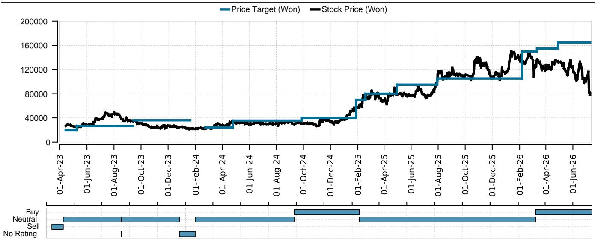

<table><tr><td>Date</td><td>Stock Price (Won)</td><td>Price Target (Won)</td><td>Rating</td></tr><tr><td>2023-04-13</td><td>26300</td><td>20000</td><td>Sell</td></tr><tr><td>2023-05-08</td><td>25400</td><td>26500</td><td>Neutral</td></tr><tr><td>2023-09-12</td><td>34850</td><td>-</td><td>No Rating</td></tr><tr><td>2023-09-13</td><td>34600</td><td>36000</td><td>Neutral</td></tr><tr><td>2024-01-19</td><td>22400</td><td>-</td><td>No Rating</td></tr><tr><td>2024-02-22</td><td>21750</td><td>24000</td><td>Neutral</td></tr><tr><td>2024-04-24</td><td>34450</td><td>35500</td><td>Neutral</td></tr><tr><td>2024-09-27</td><td>30550</td><td>40000</td><td>Buy</td></tr><tr><td>2025-01-27</td><td>56700</td><td>70000</td><td>Buy</td></tr><tr><td>2025-02-17</td><td>77900</td><td>80000</td><td>Neutral</td></tr><tr><td>2025-04-29</td><td>78500</td><td>95000</td><td>Neutral</td></tr><tr><td>2025-07-29</td><td>96800</td><td>105000</td><td>Neutral</td></tr><tr><td>2026-02-05</td><td>135600</td><td>150000</td><td>Neutral</td></tr><tr><td>2026-03-11</td><td>133600</td><td>155000</td><td>Buy</td></tr><tr><td>2026-04-28</td><td>133900</td><td>165000</td><td>Buy</td></tr></table>

Source: UBS Global Research; LSEG Eikon as of 13-Jul-2026. All prices as of local market close. Ratings as of date shown.

The Disclaimer relevant to Global Wealth Management clients follows the Global Research Disclaimer. The Disclaimer relevant to CS Wealth Management follows the Global Wealth Management Disclaimer.

## UBS Global Research Disclaimer

This document has been prepared by UBS Pte. Ltd., Seoul Branch, an affiliate of UBS AG. UBS AG, its subsidiaries, branches and affiliates, including former CS AG and its subsidiaries, branches and affiliates are referred to herein as "UBS".

Any opinions expressed in this document may change without notice and are only current as of the date of publication. Different areas, groups, and personnel within UBS may produce and distribute separate research products independently of each other. For example, research publications from UBS CIO are produced by UBS Global Wealth Management. UBS Global Research is produced by UBS Investment Bank. Research methodologies and rating systems of each separate research organization may differ, for example, in terms of investment recommendations, investment horizon, model assumptions, and valuation methods. As a consequence, except for certain economic forecasts (for which UBS CIO and UBS Global Research may collaborate), investment recommendations, ratings, price targets, and valuations provided by each of the separate research organizations may be different, or inconsistent. You should refer to each relevant research product for the details as to their methodologies and rating system. Not all clients may have access to all products from every organization. Each research product is subject to the policies and procedures of the organization that produces it.

This document is provided solely to recipients who are expressly authorized by UBS to receive it. If you are not so authorized you must immediately destroy the document.

UBS Global Research is provided to our clients through UBS Neo, and in certain instances, UBS.com and any other system or distribution method specifically identified in one or more communications distributed through UBS Neo or UBS.com (each a system) as an approved means for distributing UBS Global Research. It may also be made available through third party vendors and distributed by UBS and/or third parties via e-mail or alternative electronic means.

All UBS Global Research is available on UBS Neo. Please contact your UBS sales representative if you wish to discuss your access to UBS Neo. Where UBS Global Research refers to "UBS Evidence Lab Inside" or has made use of data provided by UBS Evidence Lab and you would like to access that data please contact your UBS sales representative. UBS Evidence Lab data is available on UBS Neo. The level and types of services provided by UBS Global Research and UBS Evidence Lab to a client may vary depending upon various factors such as a client's individual preferences as to the frequency and manner of receiving communications, a client's risk profile and investment focus and perspective (e.g., market wide, sector specific, long-term, short-term, etc.), the size and scope of the overall client relationship with UBS Global Research and UBS Evidence Lab and legal and regulatory constraints. UBS HOLT and UBS Pharma Values are offerings of UBS Global Research. HOLT Lens is a corporate performance platform offering that provides an objective accounting-led framework for comparing and valuing companies and is available to clients of UBS Global Research; for further details and pricing please contact your UBS Sales representative. In particular, HOLT has a variety of warranted prices based on the scenario chosen; please mail UBS LLC, 11 Madison Avenue, New York, NY 10010, USA, Attention: Investment Research, if you are interested in the warranted price on a particular company, again subject to commercial considerations. UBS Pharma Values is an analytical tool that involves the creation of a number of individual product net present value calculations, based on published forecasts of sales for pharmaceuticals, and is available to clients of UBS Global Research; for further details and pricing please contact your UBS Sales representative. For all other specific disclaimers, please see https://www.ubs.com/disclosures.

When you receive UBS Global Research through a system, your access and/or use of such UBS Global Research is subject to this UBS Global Research Disclaimer and to the UBS Neo Platform Use Agreement (the "Neo Terms") together with any other relevant terms of use governing the applicable System.

When you receive UBS Global Research via a third party vendor, e-mail or other electronic means, you agree that use shall be subject to this UBS Global Research Disclaimer, the Neo Terms and where applicable the UBS Investment Bank terms of business (https://www.ubs.com/global/en/investment-bank/regulatory.html) and to UBS's Terms of Use/Disclaimer (https://www.ubs.com/global/en/legalinfo2/disclaimer.html). In addition, you consent to UBS processing your personal data and using cookies in accordance with our Privacy Statement (https://www.ubs.com/global/en/legalinfo2/privacy.html) and cookie notice (https://www.ubs.com/global/en/legal/privacy/users.html).

If you receive UBS Global Research, whether through a System or by any other means, you agree that you shall not copy, revise, amend, create a derivative work, provide to any third party, or in any way commercially exploit any UBS provided via UBS Global Research or otherwise, and that you shall not extract data from any research or estimates provided to you via UBS Global Research or otherwise, without the prior written consent of UBS. You agree not to use UBS Global Research in any artificial intelligence system, without the prior written consent of UBS.

In certain circumstances you may receive UBS Global Research otherwise than in the capacity of a client of UBS and you understand and agree that under these circumstances (i) the UBS Global Research is provided to you for information purposes only; (ii) for the purposes of receiving it you are not intended to be and will not be treated as a “client” of UBS for any legal or regulatory purpose; (iii) the UBS Global Research must not be relied on or acted upon for any purpose; and (iv) such content is subject to the relevant disclaimers that follow.

This document is for distribution only as may be permitted by law. It is not directed to, or intended for distribution to or use by, any person or entity who is a citizen or resident of or located in any locality, state, country or other jurisdiction where such distribution, publication, availability or use would be contrary to law or regulation or would subject UBS to any registration or licensing requirement within such jurisdiction.

This document is a general communication and is educational in nature; it is not an advertisement nor is it a solicitation or an offer to buy or sell any financial instruments or to participate in any particular trading strategy. Nothing in this document constitutes a representation that any investment strategy or recommendation is suitable or appropriate to an investor's individual circumstances or otherwise constitutes a personal recommendation. By providing this document, none of UBS or its representatives has any responsibility or authority to provide or have provided investment advice in a fiduciary capacity or otherwise. Investments involve risks, and investors should exercise prudence and their own judgment in making their investment decisions. None of UBS or its representatives is suggesting that the recipient or any other person take a specific course of action or any action at all. The recipient should carefully read this document in its entirety and not draw inferences or conclusions from the rating alone. By receiving this document, the recipient acknowledges and agrees with the intended purpose described above and further disclaims any expectation or belief that the information constitutes investment advice to the recipient or otherwise purports to meet the investment objectives of the recipient. The financial instruments described in the document may not be eligible for sale in all jurisdictions or to certain categories of investors.

Options, structured derivative products and futures (including OTC derivatives) are not suitable for all investors. Trading in these instruments is considered risky and may be appropriate only for sophisticated investors. Prior to buying or selling an option, and for the complete risks relating to options, you must receive a copy of "The Characteristics and Risks of Standardized Options." You may read the document at https://www.theocc.com/publications/risks/riskchap1.jsp or ask your salesperson for a copy. Various theoretical explanations of the risks associated with these instruments have been published. Supporting documentation for any claims, comparisons, recommendations, statistics or other technical data will be supplied upon request. Past performance is not necessarily indicative of future results. Transaction costs may be significant in option strategies calling for multiple purchases and sales of options, such as spreads and straddles. Because of the importance of tax considerations to many options transactions, the investor considering options should consult with his/her tax advisor as to how taxes affect the outcome of contemplated options transactions.

Mortgage and asset-backed securities may involve a high degree of risk and may be highly volatile in response to fluctuations in interest rates or other market conditions. Foreign currency rates of exchange may adversely affect the value, price or income of any security or related instrument referred to in the document. For investment advice, trade execution or other enquiries, clients should contact their local sales representative.

UBS notes that no globally accepted framework or definition (legal, regulatory or otherwise) currently exists, nor is there a market consensus as to what constitutes an “ESG” (Environmental, Social or Governance) or an equivalent-label, or as to what precise attributes are required for the Information (as defined below) to be defined as ESG or equivalently-labelled. Any information, data or other content including from a third party source contained, referred to herein or used for whatsoever purpose by UBS or a third party (“Information”), in relation to any actual or potential ESG objective, issue or consideration is not intended to be relied upon for ESG classification, regulatory regime or industry initiative purposes (“ESG Regimes”). Nothing in these materials is intended to convey, suggest or indicate that UBS considers or represents any product, service, person or body mentioned in these materials as meeting or qualifying for any ESG classification, labelling or similar standards that may exist under the ESG Regimes. UBS has not conducted any assessment of compliance with ESG Regimes. Parties are reminded to make their own assessments for these purposes.

The value of any investment or income may go down as well as up, and investors may not get back the full (or any) amount invested. Past performance is not necessarily a guide to future performance. Neither UBS nor any of its directors, employees or agents accepts any liability for any loss (including investment loss) or damage arising out of the use of all or any of the Information.

Prior to making any investment or financial decisions, any recipient of this document or the information should take steps to understand the risk and return of the investment and seek individualized advice from his or her personal financial, legal, tax and other professional advisors that takes into account all the particular facts and circumstances of his or her investment objectives.

Any prices stated in this document are for information purposes only and do not represent valuations for individual securities or other financial instruments. There is no representation that any transaction can or could have been effected at those prices, and any prices do not necessarily reflect UBS's internal books and records or theoretical model-based valuations and may be based on certain assumptions. Different assumptions by UBS or any other source may yield substantially different results.

No representation or warranty, either expressed or implied, is provided in relation to the accuracy, completeness or reliability of the information contained in any materials to which this document relates (the "Information"), except with respect to Information concerning UBS. The Information is not intended to be a complete statement or summary of the securities, markets or developments referred to in the document. UBS does not undertake to update or keep current the Information. Any statements contained in this report attributed to a third party represent UBS's interpretation of the data, information and/or opinions provided by that third party either publicly or through a subscription service, and such use and interpretation have not been reviewed by the third party. In no circumstances may this document or any of the Information (including any forecast, value, index or other calculated amount ("Values")) be used for any of the following purposes:

(i) valuation or accounting purposes;

(ii) to determine the amounts due or payable, the price or the value of any financial instrument or financial contract; or

(iii) to measure the performance of any financial instrument including, without limitation, for the purpose of tracking the return or performance of any Value or of defining the asset allocation of portfolio or of computing performance fees.

By receiving this document and the Information you will be deemed to represent and warrant to UBS that you will not use this document or any of the Information for any of the above purposes or otherwise rely upon this document or any of the Information.

UBS has policies and procedures, which include, without limitation, independence policies and permanent information barriers, that are intended, and upon which UBS relies, to manage potential conflicts of interest and control the flow of information within divisions of UBS and among its subsidiaries, branches and affiliates. UBS does and seeks to do business with companies covered in its research reports. As a result, investors should be aware that the firm may have a conflict of interest that could affect the objectivity of this report. Investors should consider this report as only a single factor in making their investment decision. For further information on the ways in which UBS Global Research manages conflicts and maintains independence of its research products, historical performance information and certain additional disclosures concerning UBS Global Research recommendations, please visit https://www.ubs.com/disclosures.

UBS Global Research will initiate, update and cease coverage solely at the discretion of UBS Global Research Management, which will also have sole discretion on the timing and frequency of any published research product. The analysis contained in this document is based on numerous assumptions. All material information in relation to published research reports, such as valuation methodology, risk statements, underlying assumptions (including sensitivity analysis of those assumptions), ratings history etc. as required by the Market Abuse Regulation, can be found on UBS Neo. Different assumptions could result in materially different results.

UBS Global Research may utilise artificial intelligence tools (“AI Tools”) in the preparation of this document. Notwithstanding any such use of AI Tools, this document has undergone human review.

The analyst(s) responsible for the preparation of this document may interact with trading desk personnel, sales personnel and other parties for the purpose of gathering, applying and interpreting market information. UBS relies on information barriers to control the flow of information contained in one or more areas within UBS into other areas, units, groups or affiliates of UBS. The compensation of the analyst who prepared this document is determined exclusively by UBS Global Research management and senior management (not including investment banking). Analyst compensation is not based on investment banking revenues; however, compensation may relate to the revenues of UBS and/or its divisions as a whole, of which investment banking, sales and trading are a part, and UBS as a whole.

For financial instruments admitted to trading on an EU regulated market: UBS (excluding UBS LLC) acts as a market maker or liquidity provider (in accordance with the interpretation of these terms under English law or, if not carried out by UBS in the UK the law of the relevant jurisdiction in which UBS determines it carries out the activity) in the financial instruments of the issuer save that where the activity of liquidity provider is carried out in accordance with the definition given to it by the laws and regulations of any other EU jurisdictions, such information is separately disclosed in this document. For financial instruments admitted to trading on a non-EU regulated market: UBS may act as a market maker save that where this activity is carried out in the US in accordance with the definition given to it by the relevant laws and regulations, such activity will be specifically disclosed in this document. UBS may have issued a warrant the value of which is based on one or more of the financial instruments referred to in the document. UBS and its affiliates and employees may have long or short positions, trade as principal and buy and sell in instruments or derivatives identified herein; such transactions or positions may be inconsistent with the opinions expressed in this document.

Within the past 12 months UBS may have received or provided investment services and activities or ancillary services as per MiFID II which may have given rise to a payment or promise of a payment in relation to these services from or to this company.

Please note that all transactions conducted by UBS are consistent with sanctions regulations imposed by Switzerland, the European Union, the United Nations, the United Kingdom and the United States, per UBS' global sanctions policy. UBS opinion as to future investment worthiness assumes no new sanctions are imposed.

US persons are prohibited from purchasing or selling securities of certain companies designated as being associated with the Chinese Military in accordance with the amended US Presidential Executive Order 13959.

United Kingdom: This material is distributed by UBS AG, London Branch to persons who are eligible counterparties or professional clients. UBS AG, London Branch is authorised by the Prudential Regulation Authority and subject to regulation by the Financial Conduct Authority and limited regulation by the Prudential Regulation Authority. Europe: Except as otherwise specified herein, these materials are distributed by UBS Europe SE, a subsidiary of UBS AG, to persons who are eligible counterparties or professional clients (as detailed in the Bundesanstalt für Finanzdienstleistungsaufsicht (BaFin) Rules and according to MIFID) and are only available to such persons. The information does not apply to, and should not be relied upon by, retail clients. UBS Europe SE is authorised by the European Central Bank (ECB) and regulated by the BaFin and the ECB. Germany, Luxembourg, the Netherlands, Belgium and Ireland: Where an analyst of UBS Europe SE has contributed to this document, the document is also deemed to have been prepared by UBS Europe SE. In all cases it is distributed by UBS Europe SE and UBS AG, London Branch. Turkey: Distributed by UBS AG, London Branch. No information in this document is provided for the purpose of offering, marketing and sale by any means of any capital market instruments and services in the Republic of Turkey. Therefore, this document may not be considered as an offer made or to be made to residents of the Republic of Turkey. UBS AG, London Branch is not licensed by the Turkish Capital Market Board under the provisions of the Capital Market Law (Law No. 6362). Accordingly, neither this document nor any other offering material related to the instruments/services may be utilized in connection with providing any capital market services to persons within the Republic of Turkey without the prior approval of the Capital Market Board. However, according to article 15 (d) (ii) of the Decree No. 32, there is no restriction on the purchase or sale of the securities abroad by residents of the Republic of Turkey. Poland: Distributed by UBS Europe SE (spolka z ograniczona odpowiedzialnoscia) Oddzial w Polsce. Where an analyst of UBS Europe SE (spolka z ograniczona odpowiedzialnoscia) Oddzial w Polsce has contributed to this document, the document is also deemed to have been prepared by UBS Europe SE (spolka z ograniczona odpowiedzialnoscia) Oddzial w Polsce. Russia: Prepared and distributed by UBS Bank (OOO). Should not be construed as an individual Investment Recommendation for the purpose of the Russian Law - Federal Law #39-FZ ON THE SECURITIES MARKET Articles 6.1-6.2. Switzerland: Distributed by UBS AG to persons who are institutional investors only. UBS AG is regulated by the Swiss Financial Market Supervisory Authority (FINMA). Italy: Prepared by UBS Europe SE and distributed by UBS Europe SE and UBS Europe SE, Italy Branch. Where an analyst of UBS Europe SE, Italy Branch has contributed to this document, the document is also deemed to have been prepared by UBS Europe SE, Italy Branch. France: Prepared by UBS Europe SE and distributed by UBS Europe SE and UBS Europe SE, France Branch. Where an analyst of UBS Europe SE, France Branch has contributed to this document, the document is also deemed to have been prepared by UBS Europe SE, France Branch. Spain: Prepared by UBS Europe SE and distributed by UBS Europe SE and UBS Europe SE, Spain Branch. Where an analyst of UBS Europe SE, Spain Branch has contributed to this document, the document is also deemed to have been prepared by UBS Europe SE, Spain Branch. Sweden: Prepared by UBS Europe SE and distributed by UBS Europe SE and UBS Europe SE, Sweden Branch. Where an analyst of UBS Europe SE, Sweden Branch has contributed to this document, the document is also deemed to have been prepared by UBS Europe SE, Sweden Branch. South Africa: Distributed by UBS South Africa (Pty) Limited (Registration No. 1995/011140/07), an authorised user of the JSE and an authorised Financial Services Provider (FSP 7328). Saudi Arabia: This document has been issued by UBS AG (and/or any of its subsidiaries, branches or affiliates), a public company limited by shares, incorporated in Switzerland with its registered offices at Aeschenvorstadt 1, CH-4051 Basel and Bahnhofstrasse 45, CH-8001 Zurich. This publication has been approved by UBS Saudi Arabia (a subsidiary of UBS AG), a Saudi closed joint stock company incorporated in the Kingdom of Saudi Arabia under commercial register number 1010257812 having its registered office at Tatweer Towers, P.O. Box 75724, Riyadh 11588, Kingdom of Saudi Arabia. UBS Saudi Arabia is authorized and regulated by the Capital Market Authority to conduct securities business under license number 08113-37. UAE / Dubai: The information distributed by UBS AG Dubai Branch is only intended for Professional Clients and/or Market Counterparties, as classified under the DFSA rulebook. No other person should act upon this material/communication. The information is not for further distribution within the United Arab Emirates. UBS AG Dubai Branch is regulated by the DFSA in the DIFC. UBS is not licensed to provide banking services in the UAE by the Central Bank of the UAE, nor is it licensed by the UAE Securities and Commodities Authority. Israel: This Material is distributed by UBS AG, London Branch. UBS Israel Ltd is a licensed Investment Marketer that is supervised by the Israel Securities Authority (ISA). UBS AG, London Branch and its affiliates incorporated outside Israel are not licensed under the Israeli Advisory Law. UBS may engage among others in issuance of Financial Assets or in distribution of Financial Assets of other issuers for fees or other benefits. UBS AG, London Branch and its affiliates may prefer various Financial Assets to which they have or may have an Affiliation (as such term is defined under the Israeli Advisory Law). Nothing in this Material should be considered as investment advice under the Israeli Advisory Law. This Material is being issued only to and/or is directed only at persons who are Eligible Clients within the meaning of the Israeli Advisory Law, and this Material must not be furnished to, relied on or acted upon by any other persons. United States: Distributed to US persons by either UBS LLC or by UBS Financial Services Inc., subsidiaries of UBS AG; or by a group, subsidiary or affiliate of UBS AG that is not registered as a US broker-dealer (a 'non-US affiliate') to major US institutional investors only. UBS LLC or UBS Financial Services Inc. accepts responsibility for the content of a report prepared by another non-US affiliate when distributed to US persons by UBS LLC or UBS Financial Services Inc. All transactions by a US person in the securities mentioned in this report must be effected through UBS LLC or UBS Financial Services Inc., and not through a non-US affiliate. UBS LLC is not acting as a municipal advisor to any municipal entity or obligated person within the meaning of

Section 15B of the Securities Exchange Act (the "Municipal Advisor Rule"), and the opinions or views contained herein are not intended to be, and do not constitute, advice within the meaning of the Municipal Advisor Rule. Canada: Distributed by UBS Canada Inc., a registered investment dealer in Canada and a Member-Canadian Investor Protection Fund, or by another affiliate of UBS AG that is registered to conduct business in Canada or is otherwise exempt from registration. Brazil: Except as otherwise specified herein, this Material is prepared by UBS BB Corretora de Câmbio, Títulos e Valores Mobiliários S.A. (UBS BB CCTV) to persons who are eligible investors residing in Brazil, which are considered to be Professional Investors (Investidores Profissionais), as designated by the applicable regulation, mainly the CVM Resolution No. 30 from the 11th of May 2021 (determines the duty to verify the suitability of products, services and transactions with regards to the client's profile). UBS BB CCTV is a subsidiary of UBS BB Servicos de Assessoria Financeira e Participacoes S.A. ("UBS BB"). UBS BB is an association between UBS AG and Banco do Brasil (through its subsidiary BB – Banco de Investimentos S.A.), of which UBS AG is the majority owner and which provides investment banking services and coverage in Brazil, Argentina, Chile, Paraguay, Peru and Uruguay. UBS BB CCTV is regulated by the Comissao de Valores Mobiliarios (CVM) and by the Central Bank of Brazil. Ombudsman: 0800-940-0266/ https://www.ubs.com/br/pt/ubsbb-investment-bank/ombudsman.html. UBS may hold relevant financial and commercial interest in relation to the company subject to this Research report. Hong Kong: Distributed by UBS Asia Limited. Please contact local licensed persons of UBS Asia Limited in respect of any matters arising from, or in connection with, the analysis or document Singapore: Distributed by UBS Pte. Ltd. [Co. Reg. No.: 198500648C] or UBS AG, Singapore Branch. Please contact UBS Pte. Ltd., an exempt financial adviser under the Singapore Financial Advisers Act (Cap. 110); or UBS AG, Singapore Branch, an exempt financial adviser under the Singapore Financial Advisers Act (Cap. 110) and a wholesale bank licensed under the Singapore Banking Act (Cap. 19) regulated by the Monetary Authority of Singapore, in respect of any matters arising from, or in connection with, the analysis or document. The recipients of this document represent and warrant that they are accredited and institutional investors as defined in the Securities and Futures Act (Cap. 289). Japan: Distributed by UBS Japan Co., Ltd. to professional investors (except as otherwise permitted). Where this report has been prepared by UBS Japan Co., Ltd., UBS Japan Co., Ltd. is the author, publisher and distributor of the report. Distributed by UBS AG, Tokyo Branch to Professional Investors (except as otherwise permitted) in relation to foreign exchange and other banking businesses when relevant. Australia: Clients of UBS AG: Distributed by UBS AG (ABN 47 088 129 613 and holder of Australian Financial Services License No. 231087). For all other recipients: Distributed by UBS Australia Ltd (ABN 62 008 586 481 and holder of Australian Financial Services License No. 231098). This document contains general information and/or general advice only and does not constitute personal financial product advice. As such, the Information in this document has been prepared without taking into account any investor's objectives, financial situation or needs, and investors should, before acting on the Information, consider the appropriateness of the Information, having regard to their objectives, financial situation and needs. If the Information contained in this document relates to the acquisition, or potential acquisition of a particular financial product by a 'Retail' client as defined by section 761G of the Corporations Act 2001 where a Product Disclosure Statement would be required, the retail client should obtain and consider the Product Disclosure Statement relating to the product before making any decision about whether to acquire the product. New Zealand: Distributed by UBS New Zealand Ltd. UBS New Zealand Ltd is not a registered bank in New Zealand. You are being provided with this publication or material because you have indicated to UBS that you are a "wholesale client" within the meaning of clause 4 of schedule 5 of the Financial Markets Conduct Act 2013 of New Zealand (Permitted Client). This publication or material is not intended for clients who are not Permitted Clients (non-permitted Clients). If you are a non-permitted Client you must not rely on this publication or material. If despite this warning you nevertheless rely on this publication or material, you hereby (i) acknowledge that you may not rely on the content of this publication or material and that any recommendations or opinions in such this publication or material are not made or provided to you, and (ii) to the maximum extent permitted by law (a) indemnify UBS and its associates or related entities (and their respective Directors, officers, agents and Advisors) (each a 'Relevant Person') for any loss, damage, liability or claim any of them may incur or suffer as a result of, or in connection with, your unauthorised reliance on this publication or material and (b) waive any rights or remedies you may have against any Relevant Person for (or in respect of) any loss, damage, liability or claim you may incur or suffer as a result of, or in connection with, your unauthorised reliance on this publication or material. Korea: Distributed in Korea by UBS Pte. Ltd., Seoul Branch. This report may have been edited or contributed to from time to time by affiliates of UBS Pte. Ltd., Seoul Branch. This material is intended for professional/institutional clients only and not for distribution to any retail clients. Malaysia: This material is authorized to be distributed in Malaysia by UBS Malaysia Sdn. Bhd (Capital Markets Services License No.: CMSL/A0063/2007). This material is intended for professional/institutional clients only and not for distribution to any retail clients. India: Distributed by UBS India Private Ltd. (Corporate Identity Number U67120MH1996PTC097299) Unit 2901, Level 29 Altimus, Pandurang Budhkar Road, Worli, Mumbai – 400 018. It provides brokerage services bearing SEBI Registration Number: INZ000259830; Merchant Banking services bearing SEBI Registration Number: INM000013101; and Research Analyst services bearing SEBI Registration Number: INH000001204. Name of Compliance Officer Mr. Parameshwaran Shivaramakrishnan, Phone : +912261556151, Email : parameshwaran.s@ubs.com, Name of Grievance Officer Parameshwaran Shivaramakrishnan, Phone : +912261556151, Email: ol-ubs-sec-compliance@ubs.com Registration granted by SEBI, and certification from NISM in no way guarantee performance of the intermediary or provide any assurance of returns to investors. UBS may have debt holdings or positions in the subject Indian company/companies. UBS may have financial interests (e.g. loan/derivative products, rights to or interests in investments, etc.) in the subject Indian company / companies from time to time. Within the past 12 months, UBS may have received compensation for non-investment banking securities-related services and/or non-securities services from the subject Indian company/companies. The subject company/companies may have been a client/clients of UBS during the 12 months preceding the date of distribution of the research report with respect to investment banking and/or non-investment banking securities-related services and/or non-securities services. With regard to information on associates, please refer to the Annual Report at: https://www.ubs.com/global/en/about\_ubs/investor\_relations/annualreporting.html The Research Annual Compliance Report for UBS India Private Limited is available on www.ubs.com/ubssi under Research tab. Taiwan: Except as otherwise specified herein, this material may not be distributed in Taiwan. Information and material on securities/instruments that are traded in a Taiwan organized exchange is deemed to be issued and distributed by UBS Pte. LTD., Taipei Branch to professional institutional investors and/or persons permitted under applicable regulation. Unless permitted by applicable Taiwan laws and regulations, this material is for reference and information only and should not constitute "recommendation" to clients or recipients in Taiwan for the covered companies or any companies mentioned in this document. No portion of the document may be reprinted, reproduced or quoted by the press or any other person without authorisation from UBS. Indonesia: This report is being distributed by PT UBS Sekuritas Indonesia and is delivered by its licensed employee(s), including marketing/sales person, to its client. PT UBS Sekuritas Indonesia, having its registered office at Sequis Tower Level 22 unit 22-1,Jl.Jend. Sudirman, kav.71, SCBD lot 11B, Jakarta 12190. Indonesia, is a subsidiary company of UBS AG and licensed under Capital Market Law no. 8 year 1995, a holder of broker-dealer and underwriter licenses issued by the Capital Market and Financial Institution Supervisory Agency (now Otoritas Jasa Keuangan/OJK). PT UBS Sekuritas Indonesia is also a member of Indonesia Stock Exchange and supervised by Otoritas Jasa Keuangan (OJK). Neither this report nor any copy hereof may be distributed in Indonesia or to any Indonesian citizens except in compliance with applicable Indonesian capital market laws and regulations. This report is not an offer of securities in Indonesia and may not be distributed within the territory of the Republic of Indonesia or to Indonesian citizens in circumstance which constitutes an offering within the meaning of Indonesian capital market laws and regulations.

The disclosures contained in research documents produced by UBS AG, London Branch or UBS Europe SE shall be governed by and construed in accordance with English law. T

UBS specifically prohibits the redistribution of this document in whole or in part without the written permission of UBS and in any event UBS accepts no liability whatsoever for any redistribution of this document or its contents or the actions of third parties in this respect. Images may depict objects or elements that are protected by third party copyright, trademarks and other intellectual property rights. © UBS 2026. The key symbol and UBS are among the registered and unregistered trademarks of UBS. All rights reserved.

## Global Wealth Management Disclaimer

You receive this document in your capacity as a client of UBS Global Wealth Management. This publication has been distributed to you by UBS Switzerland AG (regulated by FINMA in Switzerland) or its affiliates ("UBS") with whom you have a banking relationship with. The full name of the distributing affiliate and its competent authority can be found in the country-specific disclaimer at the end of this document. UBS may utilise artificial intelligence tools ("AI Tools") in the preparation of this document. Notwithstanding any such use of AI Tools, this document has undergone human review.

The date and time of the first dissemination of this publication is the same as the date and time of its publication.

## Risk information:

You agree that you shall not copy, revise, amend, create a derivative work, provide to any third party, or in any way commercially exploit any UBS, and that you shall not extract data from any research or estimates, without the prior written consent of UBS.

This document is for distribution only as may be permitted by law. It is not directed to, or intended for distribution to or use by, any person or entity who is a citizen or resident of or located in any locality, state, country or other jurisdiction where such distribution, publication, availability or use would be contrary to law or regulation or would subject UBS to any registration or licensing requirement within such jurisdiction.

This document is for your information only; it is not an advertisement nor is it a solicitation or an offer to buy or sell any financial instruments or to participate in any particular trading strategy. Nothing in this document constitutes a representation that any investment strategy or recommendation is suitable or appropriate to an investor's individual circumstances or otherwise constitutes a personal recommendation. By providing this document, none of UBS or its representatives has any responsibility or authority to provide or have provided investment advice in a fiduciary capacity or otherwise. Investments involve risks, and investors should exercise prudence and their own judgment in making their investment decisions. None of UBS or its representatives is suggesting that the recipient or any other person take a specific course of action or any action at all. By receiving this document, the recipient acknowledges and agrees with the intended purpose described above and further disclaims any expectation or belief that the information constitutes investment advice to the recipient or otherwise purports to meet the investment objectives of the recipient. The financial instruments described in the document may not be eligible for sale in all jurisdictions or to certain categories of investors.

Options, derivative products and futures are not suitable for all investors, and trading in these instruments is considered risky. Mortgage and asset-backed securities may involve a high degree of risk and may be highly volatile in response to fluctuations in interest rates or other market conditions. Foreign currency rates of exchange may adversely affect the value, price or income of any security or related instrument referred to in the document. For investment advice, trade execution or other enquiries, clients should contact their local sales representative.

The value of any investment or income may go down as well as up, and investors may not get back the full (or any) amount invested. Past performance is not necessarily a guide to future performance. Neither UBS nor any of its directors, employees or agents accepts any liability for any loss (including investment loss) or damage arising out of the use of all or any of the information (as defined below).

Prior to making any investment or financial decisions, any recipient of this document or the information should take steps to understand the risk and return of the investment and seek individualized advice from his or her personal financial, legal, tax and other professional advisors that takes into account all the particular facts and circumstances of his or her investment objectives.

Any prices stated in this document are for information purposes only and do not represent valuations for individual securities or other financial instruments. There is no representation that any transaction can or could have been effected at those prices, and any prices do not necessarily reflect UBS's internal books and records or theoretical model-based valuations and may be based on certain assumptions. Different assumptions by UBS or any other source may yield substantially different results.

No representation or warranty, either expressed or implied, is provided in relation to the accuracy, completeness or reliability of the information contained in any materials to which this document relates (the "Information"), except with respect to Information concerning UBS. The Information is not intended to be a complete statement or summary of the securities, markets or developments referred to in the document. UBS does not undertake to update or keep current the Information. Any opinions expressed in this document may change without notice and may differ or be contrary to opinions expressed by other business areas or groups, personnel or other representative of UBS. Any statements contained in this report attributed to a third party represent UBS's interpretation of the data, information and/or opinions provided by that third party either publicly or through a subscription service, and such use and interpretation have not been reviewed by the third party. In no circumstances may this document or any of the Information (including any forecast, value, index or other calculated amount ("Values")) be used for any of the following purposes: (i) valuation or accounting purposes; (ii) to determine the amounts due or payable, the price or the value of any financial instrument or financial contract; or (iii) to measure the performance of any financial instrument including, without limitation, for the purpose of tracking the return or performance of any Value or of defining the asset allocation of portfolio or of computing performance fees.

By receiving this document and the Information you will be deemed to represent and warrant to UBS that you will not use this document or any of the Information for any of the above purposes or otherwise rely upon this document or any of the Information.

UBS has policies and procedures, which include, without limitation, independence policies and permanent information barriers, that are intended, and upon which UBS relies, to manage potential conflicts of interest and control the flow of information within divisions of UBS (including between Global Wealth Management and UBS Global Research) and among its subsidiaries, branches and affiliates. For further information on the ways in which UBS manages conflicts and maintains independence of its research products, historical performance information and certain additional disclosures concerning UBS recommendations, please visit https://www.ubs.com/research-methodology.

Research will initiate, update and cease coverage solely at the discretion of research management, which will also have sole discretion on the timing and frequency of any published research product. The analysis contained in this document is based on numerous assumptions. Different assumptions could result in materially different results.

The analyst(s) responsible for the preparation of this document may interact with trading desk personnel, sales personnel and other parties for the purpose of gathering, applying and interpreting market information. UBS relies on information barriers to control the flow of information contained in one or more areas within UBS into other areas, units, groups or affiliates of UBS. The compensation of the analyst who prepared this document is determined exclusively by research management and senior management (not including investment banking). Analyst compensation is not based on investment banking revenues; however, compensation may relate to the revenues of UBS and/or its divisions as a whole, of which investment banking, sales and trading are a part, and UBS's subsidiaries, branches and affiliates as a whole.

For financial instruments admitted to trading on an EU regulated market: UBS AG, its affiliates or subsidiaries (excluding UBS LLC) acts as a market maker or liquidity provider (in accordance with the interpretation of these terms in the UK) in the financial instruments of the issuer save that where the activity of liquidity provider is carried out in accordance with the definition given to it by the laws and regulations of any other EU jurisdictions, such information is separately disclosed in this document. For financial instruments admitted to trading on a non-EU regulated market: UBS may act as a market maker save that where this activity is carried out in the US in accordance with the definition given to it by the relevant laws and regulations, such activity will be specifically disclosed in this document. UBS may have issued a warrant the value of which is based on one or more of the financial instruments referred to in the document. UBS and its affiliates and employees may have long or short positions, trade as principal and buy and sell in instruments or derivatives identified herein; such transactions or positions may be inconsistent with the opinions expressed in this document.

Options and futures are not suitable for all investors, and trading in these instruments is considered risky and may be appropriate only for sophisticated investors. Prior to buying or selling an option, and for the complete risks relating to options, you must receive a copy of "Characteristics and Risks of Standardized Options". You may read the document at https://www.theocc.com/about/publications/character-risks.jsp or ask your financial advisor for a copy.

Investing in structured investments involves significant risks. For a detailed discussion of the risks involved in investing in any particular structured investment, you must read the relevant offering materials for that investment. Structured investments are unsecured obligations of a particular issuer with returns linked to the performance of an underlying asset. Depending on the terms of the investment, investors could lose all or a substantial portion of their investment based on the performance of the underlying asset. Investors could also lose their entire investment if the issuer becomes insolvent. UBS does not guarantee in any way the obligations or the financial condition of any issuer or the accuracy of any financial information provided by any issuer. Structured investments are not traditional investments and investing in a structured investment is not equivalent to investing directly in the underlying asset. Structured investments may have limited or no liquidity, and investors should be prepared to hold their investment to maturity. The return of structured investments may be limited by a maximum gain, participation rate or other feature. Structured investments may include call features and, if a structured investment is called early, investors would not earn any further return and may not be able to reinvest in similar investments with similar terms. Structured investments include costs and fees which are generally embedded in the price of the investment. The tax treatment of a structured investment may be complex and may differ from a direct investment in the underlying asset. UBS and its employees do not provide tax advice. Investors should consult their own tax advisor about their own tax situation before investing in any securities.

Important Information About Sustainable Investing Strategies: Sustainable investing strategies aim to consider and incorporate environmental, social and governance (ESG) factors into investment process and portfolio construction. Strategies across geographies approach ESG analysis and incorporate the findings in a variety of ways. Incorporating ESG factors or sustainable investing considerations may inhibit the portfolio manager's ability to participate in certain investment opportunities that otherwise would be consistent with its investment objective and other principal investment strategies. The returns on a portfolio incorporating ESG factors or sustainable investing considerations may be lower or higher than portfolios where ESG factors, exclusions, or other sustainability issues are not considered by the portfolio manager, and the investment opportunities available to such portfolios may differ.

Within the past 12 months UBS Switzerland AG, its affiliates or subsidiaries may have received or provided investment services and activities or ancillary services as per MiFID II which may have given rise to a payment or promise of a payment in relation to these services from or to this company.

Disclosures: If you require detailed information on disclosures of interest or conflict of interest as required by Market Abuse Regulation please contact the mailbox MAR\_disclosure\_twopager@ubs.com. Please note that e-mail communication is unsecured.

External Asset Managers / External Financial Consultants: In case this research or publication is provided to an External Asset Manager or an External Financial Consultant, UBS expressly prohibits that it is redistributed by the External Asset Manager or the External Financial Consultant and is made available to their clients and/or third parties.

Argentina: All securities that will be offered to you by UBS are not authorized by the Argentine Securities and Exchange Commission (CNV) and are not subject to its reporting, periodic information requirements, or oversight. Furthermore, the CNV has not reviewed or endorsed the information provided in any securities offering document, nor the accuracy of any accounting, financial, economic data, or any other information disclosed therein, which remains the sole responsibility of the respective issuer and the other parties involved. Australia: This document is provided by UBS Switzerland AG. UBS Switzerland AG does not hold an Australian Financial Services Licence (AFSL) and relies on an exemption to provide financial services to persons in Australia. This document is intended only for distribution to wholesale clients under the Corporations Act 2001 (Cth). UBS Switzerland AG is a related body corporate of UBS AG, Australia Branch and UBS Australia Limited. This document may be distributed to clients by those entities, but it is provided by UBS Switzerland AG and is not provided under any of the other entities' AFSL. The information in this document is general in nature and is not intended to address the objectives, financial situation or needs of any particular individual or entity. Each recipient should consider their own objectives, financial situation or needs before acting on the advice and obtain the relevant Product Disclosure Statement (if required) before making any decision whether to acquire any product. In Australia, UBS entities, other than UBS AG, Australia Branch, are not authorized deposit-taking institutions for the purposes of the Banking Act 1959 (Cth.) and their obligations do not represent deposits or other liabilities of UBS AG, Australia Branch. UBS AG, Australia Branch does not guarantee or otherwise provide assurance in respect of the obligations of such UBS entities or the funds. An investor is exposed to investment risk including possible delays in repayment and loss of income and principal invested, as relevant. If you do not wish to receive marketing materials from UBS, please contact your UBS representative or the contact details listed in the Australia Privacy Notice: https://www.ubs.com/global/en/legal/privacy.html. Your personal data will be processed in accordance with this notice. Bahrain: This report is being distributed by UBS AG, Bahrain Branch, duly licensed and regulated by the Central Bank of Bahrain (CBB) as an Investment Business Firm - Category 2 (Branch). Related financial services or products are only made available to Accredited Investors, as defined by the CBB, and are not intended for any other persons. UBS AG, Bahrain Branch is a Foreign Branch of UBS AG, Zurich/Switzerland and is located on Level 21, East Tower, Bahrain World Trade Centre, Manama, Kingdom of Bahrain. Brazil: This report is distributed in Brazil by UBS BB Corretora de Câmbio, Títulos e Valores Mobiliários S.A. or its affiliates ("UBS"). Pursuant to CVM Resolution No. 20/2021, of February 25, 2021, the author(s) of the report hereby certify(ies) that the views expressed in this report solely and exclusively reflect their personal opinions and have been prepared independently, including with respect to UBS. Part of the author(s)'s compensation is based on various factors, including the total revenues of the relevant UBS Group entity of which they are in employment of, but no part of the compensation has been, is, or will be related to the specific recommendations or views expressed in this report. In addition, UBS declares that: UBS has provided, and/or may in the future provide investment banking, brokerage, asset management, commercial banking and other financial services to the subject company/companies or its affiliates, for which they have received or may receive customary fees and commissions, and which constituted or may constitute relevant financial or commercial interests in relation to the subject company/companies or the subject securities. Canada: The information contained herein is not, and under no circumstances is to be construed as, a prospectus, an advertisement, a public offering, an offer to sell securities described herein, solicitation of an offer to buy securities described herein, in Canada or any province or territory thereof. Any offer or sale of the securities described herein in Canada will be made only under an exemption from the requirements to file a prospectus with the relevant Canadian securities regulators and only by a dealer properly registered under applicable securities laws or, alternatively, pursuant to an exemption from the dealer registration requirement in the relevant province or territory of Canada in which such offer or sale is made. Under no circumstances is the information contained herein to be construed as investment advice in any province or territory of Canada and is not tailored to the needs of the recipient. To the extent that the information contained herein references securities of an issuer incorporated, formed or created under the laws of Canada or a province or territory of Canada, any trades in such securities must be conducted through a dealer registered in Canada or, alternatively, pursuant to a dealer registration exemption. No securities commission or similar regulatory authority in Canada has reviewed or in any way passed upon these materials, the information contained herein or the merits of the securities described herein and any representation to the contrary is an offence. In Canada, this publication is distributed by UBS Investment Management Canada Inc. China: This report and any offering material such as term sheet, research report, other product or service documentation or any other information (the "Material") sent with this report was done so as a result of a request received by UBS from you and/or persons entitled to make the request on your behalf. Should you have received the material erroneously, UBS asks that you kindly delete it and inform UBS immediately. This report is prepared by UBS Switzerland AG or its offshore subsidiary or affiliate (collectively as "UBS Offshore"). UBS Offshore is an entity incorporated out of China and is not licensed, supervised or regulated in China to carry out banking or securities business. The recipient should not contact the analysts or UBS Offshore which produced this report for advice as they are not licensed to provide securities investment advice in China. UBS Investment Bank (including Research) has its own wholly independent research and views which at times may vary from the views of UBS Global Wealth Management. The recipient should not use this document or otherwise rely on any of the information contained in this report in making investment decisions and UBS takes no responsibility in this regard. Denmark: This publication is not intended to constitute a public offer under Danish law. It is distributed only for information purposes to clients of UBS Europe SE, Denmark Branch, filial af UBS Europe SE, with place of business at Sankt Annae Plads 13, 1250 Copenhagen, Denmark, registered with the Danish Commerce and Companies Agency, under No. 38 17 24 33. UBS Europe SE, Denmark Branch, filial af UBS Europe SE is subject to the joint supervision of the European Central Bank, the German Central Bank (Deutsche Bundesbank), the German Federal Financial Services Supervisory Authority (Bundesanstalt für Finanzdienstleistungsaufsicht, "BaFin"), as well as of the Danish Financial Supervisory Authority (Finanstilsynet), to which this publication has not been submitted for approval. UBS Europe SE is a credit institution constituted under German law in the form of a Societas Europaea, duly authorized by BaFin. Egypt: Securities or other investment products are not being offered or sold by UBS to the public in Egypt and they have not been and will not be registered with the Egyptian Financial Regulatory Authority (FRA). France: This publication is not intended to constitute a public offer under French law, it does not constitute a personal recommendation as it is distributed only for information purposes to clients of UBS Europe SE Succursale de France (a branch of UBS Europe SE), having its registered office at 39, rue du Colisée, 75008 Paris, France, registered with the "Registre du Commerce et des Sociétés" of Paris under N°844 425 629. UBS Europe SE Succursale de France is subject to the joint supervision of the European Central Bank, the German Central Bank (Deutsche Bundesbank), the German Federal Financial Services Supervisory Authority (Bundesanstalt für Finanzdienstleistungsaufsicht, "BaFin"), as well as of the French "Autorité de contrôle prudentiel et de résolution" and "Autorité des marchés financiers", to which this publication has not been submitted for approval. UBS Europe SE is a credit institution constituted under German law in the form of a Societas Europaea, duly authorized by BaFin. Germany: This publication is not intended to constitute a public offer under German law. It is distributed only for information purposes to clients of UBS Europe SE, Germany, with place of business at Bockenheimer Landstrasse 2-4, 60306 Frankfurt am Main. UBS Europe SE is a credit institution constituted under German law in the form of a Societas Europaea, duly authorized by the German Federal Financial Services Supervisory Authority (Bundesanstalt für Finanzdienstleistungsaufsicht, "BaFin") and supervised jointly by the European Central Bank, the German Central Bank (Deutsche Bundesbank) and BaFin, to which this publication has not been submitted for approval. Hong Kong SAR: This publication is distributed to clients of UBS AG Hong Kong Branch by UBS AG Hong Kong Branch, a licensed bank under the Hong Kong Banking Ordinance and a registered institution under the Securities and Futures Ordinance. UBS AG Hong Kong Branch is incorporated in Switzerland with limited liability. The contents of this material have not been reviewed by any regulatory authority in Hong Kong. India: UBS India Private Ltd. (Corporate Identity Number U67120MH1996PTC097299) 2/F, 3 North Avenue, Maker Maxity, Bandra Kurla Complex, Bandra (East), Mumbai (India) 400051. Phone: +912261556000. It provides brokerage services bearing SEBI Registration Number: INZ000259830; Merchant Banking services bearing SEBI Registration Number: INM000013101 and Research Analyst services bearing SEBI Registration Number: INH000001204. Name of Compliance Officer Mr. Parameshwaran Shivaramakrishnan, Phone: +912261556151, Email: parameshwaran.s@ubs.com, Name of Grievance Officer Parameshwaran Shivaramakrishnan, Phone: +912261556151, Email: ol-ubs-sec-compliance@ubs.com. Registration granted by SEBI, and certification from NISM in no way guarantee performance of the intermediary or provide any assurance of returns to investors. UBS AG, its affiliates or subsidiaries may have debt holdings or positions in the subject Indian company/ companies. UBS AG, its affiliates or subsidiaries may have financial interests (e.g. loan/derivative products, rights to or interests in investments, etc.) in the subject Indian company/companies from time to time. Within the past 12 months, UBS AG, its affiliates or subsidiaries may have received compensation for non-investment banking securities-related services and/or non-securities services from the subject Indian company/companies. The subject company/companies may have been a client/clients of UBS AG, its affiliates or subsidiaries during the 12 months preceding the date of distribution of the research report with respect to investment banking and/or non-investment banking securities-related services and/or non-securities services. With regard to information on associates, please refer to the Annual Report at: https://www.ubs.com/ global/en/about\_ubs/investor\_relations/annualreporting.html. The Research Annual Compliance report for UBS India Private Limited is available on www.ubs.com/ ubssi under Research tab. Indonesia: This communication and any offering material term sheet, research report, other product or service documentation or any other information (the "Material") sent with this communication was done so as a result of a request received by UBS from you and/or persons entitled to make the request on your behalf. Should you have received the Material erroneously, UBS asks that you kindly delete/destroy the communication and Material and inform UBS immediately. The Material, where provided, was provided for your information only and is not to be further distributed without the consent of UBS. None of the Material has been registered or filed under the prevailing laws and with any financial or regulatory authority in your jurisdiction. The Material may not have been approved, disapproved, endorsed, registered or filed with any financial or regulatory authority in your jurisdiction. UBS has not, by virtue of the Material, made available, issued any invitation to subscribe for or to purchase any investment (including securities or products or futures contracts). The Material is neither an offer nor a solicitation to enter into any transaction or contract (including futures contracts) nor is it an offer to buy or to sell any securities or products. The relevant investments will be subject to restrictions and obligations on transfer as set forth in the Material, and by receiving the Material you undertake to comply fully with such restrictions and obligations. You should carefully study and ensure that you understand and exercise due care and discretion in considering your investment objective, risk appetite and personal circumstances against the risk of the investment. You are advised to seek independent professional advice in case of doubt. Any and all advice provided on and/or trades executed by UBS pursuant to the Material will only have been provided upon your specific request or executed upon your specific instructions, as the case may be, and may be deemed as such by UBS and you. Israel: UBS is a premier global financial firm offering wealth management, asset management and investment banking services from its headquarters in Switzerland and its operations in over 50 countries worldwide to individual, corporate and institutional investors. This publication is intended for information only and is not intended as an offer to buy or solicitation of an offer. Furthermore, this publication is not intended as an investment advice. Nothing contrary to the above, no action has been, or will be, taken in Israel that would permit an offering of the product(s) mentioned in this document or a distribution of this document to the public in Israel. In particular, this document has not been reviewed or approved by the Israeli Securities Authority. The product(s) mentioned in this document is/are being offered to a limited number of sophisticated investors who qualify as one of the investors listed in the first supplement to the Israeli Securities Law, 5728-1968. This document may not be reproduced or used for any other purpose, nor be furnished to any other person other than those to whom copies have been sent. Anyone who purchases the product(s) mentioned herein shall do so for its own benefit and for its own account and not with the aim or intention of distributing or offering the product(s) to other parties. Anyone who purchases the product(s) shall do so in accordance with its own understanding and discretion and after it has received any relevant financial, legal, business, tax or other advice or opinion required by it in connection with such purchase(s). The word "advice" and/or any of its equivalent terms shall be read and construed in conjunction with the definition of the term "investment marketing" as defined under the Israeli Regulation of Investment Advice, Investment Marketing and Portfolio Management Law. The Swiss laws and regulations require a number of mandatory disclosures to be made in independent financial research reports or recommendations. Pursuant to the Swiss Financial Market Infrastructure Act and the Financial Market Infrastructure Ordinance-FINMA, banks must disclose the percentage of voting rights they hold in companies being researched, if these holdings are equal to or exceed the statutory thresholds. In addition, the Directives on the Independence of Financial Research, issued by the Swiss Bankers Association, mandate a number of disclosures, including the disclosure of potential conflicts of interest, the participation within previous 12 months in any securities issues on behalf of the company being researched, as well as the fact that remuneration paid to the financial analysts is based generally upon the performance of (i) the new issues department or investment banking; or (ii) securities trading performance (including proprietary trading) or sales. Italy: This publication is not intended to constitute a public offer under Italian law. It is distributed only for information purposes to clients of UBS Europe SE, Succursale Italia, with place of business at Via del Vecchio Politecnico, 3-2012 I Milano. UBS Europe SE Succursale Italia is subject to the joint supervision of the European Central Bank, the German Central Bank (Deutsche Bundesbank), the German Federal Financial Services Supervisory Authority (Bundesanstalt für Finanzdienstleistungsaufsicht, "BaFin"), as well as of the Bank of Italy (Banca d'Italia) and the Italian Financial Markets Supervisory Authority (CONSOB - Commissione Nazionale per le Società e la Borsa), to which this publication has not been submitted for approval. UBS Europe SE is a credit institution constituted under German law in the form of a Societas Europaea, duly authorized by BaFin. Japan: This report is solely distributed in Japan by UBS SuMi TRUST Wealth

Management Co., Ltd, Financial Instruments Dealer, Director-General of Kanto Local Finance Bureau (Kinsho) No. 3233, a member of the Japan Securities Dealers Association, Financial Futures Association of Japan, Investment Management Association of Japan. UBS SuMi TRUST Wealth Management Co., Ltd will not distribute or forward this report outside Japan. Jersey: UBS AG, Jersey Branch, is regulated and authorized by the Jersey Financial Services Commission for the conduct of banking, funds and investment business. Where services are provided from outside Jersey, they will not be covered by the Jersey regulatory regime. UBS AG, Jersey Branch is a branch of UBS AG a public company limited by shares, incorporated in Switzerland whose registered offices are at Aeschenvorstadt 1, CH-4051 Basel and Bahnhofstrasse 45, CH 8001 Zurich. UBS AG, Jersey Branch's principal place of business is 1, IFC Jersey, St Helier, Jersey, JE2 3BX Luxembourg: This publication is not intended to constitute a public offer under Luxembourg law. It is distributed only for information purposes to clients of UBS Europe SE, Luxembourg Branch ("UBS Luxembourg"), R.C.S. Luxembourg n° B209123, with registered office at 33A, Avenue J. F. Kennedy, L-1855 Luxembourg. UBS Europe SE is a credit institution constituted under German law in the form of a Societas Europaea (HRB n° 107046), with registered office at Bockenheimer Landstrasse 2-4, D-60306 Frankfurt am Main, Germany, duly authorized by the German Federal Financial Services Supervisory Authority (Bundesanstalt für Finanzdienstleistungsaufsicht, "BaFin") and subject to the joint prudential supervision of BaFin, the European Central Bank and the central bank of Germany (Deutsche Bundesbank). UBS Luxembourg is furthermore supervised by the Luxembourg prudential supervisory authority (Commission de Surveillance du Secteur Financier), in its role as host member state authority. This publication has not been submitted for approval to any public supervisory authority. Malaysia: This communication and any offering material term sheet, research report, other product or service documentation or any other information (the "Material") sent with this communication was done so as a result of a request received by UBS from you and/or persons entitled to make the request on your behalf. Should you have received the Material erroneously, UBS asks that you kindly delete/destroy the communication and Material and inform UBS immediately. The Material, where provided, was provided for your information only and is not to be further distributed in whole or in part in or into your jurisdiction without the consent of UBS. The Material may not have been reviewed, approved, disapproved, endorsed, registered or filed with any financial or regulatory authority in your jurisdiction. UBS has not, by virtue of the Material, made available, issued any invitation to subscribe for or to purchase any investment (including securities or derivatives products). The Material is neither an offer nor a solicitation to enter into any transaction or contract (including future contracts) nor is it an offer to buy or to sell any securities or derivatives products. The relevant investments will be subject to restrictions and obligations on transfer as set forth in the Material, and by receiving the Material you undertake to comply fully with such restrictions and obligations. You should carefully study and ensure that you understand and exercise due care and discretion in considering your investment objective, risk appetite and personal circumstances against the risk of the investment. You are advised to seek independent professional advice in case of doubt. Any and all advice provided on and/or trades executed by UBS pursuant to the Material will only have been provided upon your specific request or executed upon your specific instructions, as the case may be, and may be deemed as such by UBS and you. Mexico: This information is distributed by UBS Assores México, S.A. de C.V. ("UBS Assores"), an affiliate of UBS Switzerland AG, incorporated as a non-independent investment advisor under the Mexican regulation due to the relation with a Foreign Bank. UBS Assores is registered under number 30060-001-(14115)-21/06/2016 and subject to the supervision of the Mexican Banking and Securities Commission ("CNBV") exclusively regarding the rendering of (i) portfolio management services, (ii) securities investment advisory services, analysis and issuance of individual investment recommendations, and (iii) anti-money laundering and terrorism financing matters. This UBS publication or any material related thereto is addressed only to Sophisticated or Institutional Investors located in Mexico. Research reports only reflect the views of the analysts responsible for the report. The compensation of the analyst(s) who prepared this report is determined exclusively by research management and senior management of any entity of UBS Group to which such analyst(s) render(s) services. Monaco: This document is not intended to constitute a public offering or a comparable solicitation under the Principality of Monaco laws, but might be made available for information purposes to clients of UBS (Monaco) S.A., a regulated bank having its registered office at 2 avenue de Grande Bretagne 98000 Monaco operating under a banking license granted by the "Autorité de Contrôle Prudentiel et de Résolution" (ACPR) and the Monegasque government which authorizes the provision of banking services in Monaco. UBS (Monaco) S.A. is also licensed by the "Commission de Contrôle des Activités Financières" (CCAF) to provide investment services in Monaco. The latter has not approved this publication.

Philippines: This communication was done so as a result of a request received by UBS from you and/or persons entitled to make the request on your behalf. Should you have received the Material erroneously, UBS asks that you kindly delete/destroy the communication and Material and inform UBS immediately. The Material, where provided, was provided for your information only and is not to be further distributed in whole or in part in or into your jurisdiction without the consent of UBS. The Material may not have been reviewed; approved, disapproved, endorsed, registered or filed with any financial or regulatory authority in your jurisdiction. UBS has not, by virtue of the Material, made available, issued any invitation to subscribe for or to purchase any investment (including securities or derivatives products). The Material is neither an offer nor a solicitation to enter into any transaction or contract (including future contracts) nor is it an offer to buy or to sell any securities or derivatives products. The relevant investments will be subject to restrictions and obligations on transfer as set forth in the Material, and by receiving the Material you undertake to comply fully with such restrictions and obligations. You should carefully study and ensure that you understand and exercise due care and discretion in considering your investment objective, risk appetite and personal circumstances against the risk of the investment. You are advised to seek independent professional advice in case of doubt. Any and all advice provided on and/or trades executed by UBS pursuant to the Material will only have been provided upon your specific request or executed up your specific instructions, as the case may be, and may be deemed as such by UBS and you.

Portugal: UBS Switzerland AG is not licensed to conduct banking and financial activities in Portugal nor is UBS Switzerland AG supervised by the Portuguese regulators (Bank of Portugal "Banco de Portugal" and Portuguese Securities Exchange Commission "Comissão do Mercado de Valores Mobiliários"). Qatar: UBS Qatar LLC is licensed by the Qatar Financial Centre Authority and authorized by the QFC Regulatory Authority, with QFC no. 01169, and has its registered office at Building No. 36, 4th Floor, Abdulla Bin Thani Street, Doha Design District 1, Msheireb Downtown Doha, State of Qatar. This material is strictly intended for Eligible Counterparties and/or Business Customers only as classified under the QFCRA's Customer and Investor Protection Rules 2019. No other person should act upon this material. Russia: This document or information contained therein is for information purposes only and constitutes neither a public nor a private offering, is not an invitation to make offers, to sell, exchange or otherwise transfer any financial instruments in the Russian Federation to or for the benefit of any Russian person or entity and does not constitute an advertisement or offering of securities in the Russian Federation within the meaning of Russian securities laws. The information contained herein is not an "individual investment recommendation" as defined in Federal Law of 22 April 1996 No 39-FZ "On Securities Market" (as amended) and the financial instruments and operations specified herein may not be suitable for your investment profile or your investment goals or expectations. The determination of whether or not such financial instruments and operations are in your interests or are suitable for your investment goals, investment horizon or the acceptable risk level is your responsibility. We assume no liability for any losses connected with making any such operations or investing into any such financial instruments and we do not recommend to use such information as the only source of information for making an investment decision. Saudi Arabia: This material is for marketing and information purposes by UBS Saudi Arabia only. It has been distributed by UBS Saudi Arabia or reviewed and approved by UBS Saudi Arabia if it was issued by UBS Switzerland AG, by UBS AG, or any of its subsidiaries or branches. UBS Switzerland AG is a public company limited by shares, incorporated in Switzerland with its registered offices at Bahnhofstrasse 45, CH-8001 Zurich. UBS Saudi Arabia (a subsidiary of UBS AG) is a Saudi closed joint stock company incorporated in the Kingdom of Saudi Arabia with a paid capital of 110,000,000 Saudi Riyals under commercial register number 1010257812 having its registered office at Laysen Valley, P.O. Box 75724, Riyadh 11588, Kingdom of Saudi Arabia. UBS Saudi Arabia is authorized and regulated by the Capital Market Authority to conduct securities business under license number 08113-37. This document is distributed only under such circumstances as may be permitted by applicable laws and regulations. The information and – if any - opinions contained in this document have been compiled or arrived at based upon information obtained from sources believed to be reliable and in good faith, but is not guaranteed as being accurate, nor is it a complete statement or summary of the securities, markets or developments referred to in the document. All such information and opinions are subject to changes without notice. Past performance of investments (whether simulated or actual) is not necessarily an indicator of future results. Forward looking data is based on estimates that are subject to changes. Should the currency of a financial product or service not match your reference currency, performance may rise or fall due to currency fluctuations. UBS Switzerland AG and/or other members of the UBS Group may have a position in and may make a purchase and/or sale of any of the securities or other financial instruments mentioned in this document While statements that constitute "forward-looking statements", including, but not limited to, statements relating to our future business development represent UBS judgments and future expectations concerning the development of our business, a number of risks, uncertainties and other important factors could cause actual developments and results to differ materially from our expectations. This document may not be forwarded, reproduced, redistributed or republished for any purpose without the written permission of UBS Saudi Arabia. Source for all data and charts (if not indicated otherwise) is UBS Switzerland AG. Singapore: Where applicable, this material is distributed in Singapore by UBS AG, Singapore Branch, which is licensed by the Monetary Authority of Singapore under the Banking Act 1970 to carry on banking business. UBS AG is incorporated in Switzerland with limited liability. UBS AG has a branch registered in Singapore (UEN S98FC5560C). This material has been prepared and issued for distribution in Singapore to institutional investors, accredited investors and expert investors (each as defined under the Financial Advisers Regulations (the "FAR")) only. By virtue of your status as an institutional investor, accredited investor, or expert investor, UBS AG is exempted from complying with certain requirements under the Financial Advisers Act 2001 (the "FAA"), the FAR and the relevant Notices and Guidelines issued thereunder, in respect of any financial advisory service which UBS AG may provide to you. These include exemptions from complying with: Section 34 of the FAA (pursuant to Regulation 33(1) of the FAR); Section 36 of the FAA (pursuant to Regulation 34(1) of the FAR); and Section 45 of the FAA (pursuant to Regulation 35(1) of the FAR). Singapore recipients and clients of UBS AG, Singapore Branch should contact UBS AG, Singapore Branch for any matters arising from, or in connection with, this material. Where applicable, this communication and any offering material term sheet, research report, other product or service documentation or any other information (the "Material") sent with this communication was done so as a result of a request received by UBS from you and/or persons entitled to make the request on your behalf. Should you have received the Material erroneously, UBS asks that you kindly delete/destroy the communication and Material and inform UBS immediately. The Material, where provided, was provided for your information only and is not too be further distributed in whole or in part in or into your jurisdiction without the consent of UBS. The Material may not have been reviewed, approved, disapproved or endorsed by any financial or regulatory authority in your jurisdiction. UBS has not, by virtue of the Material, made available, issued any invitation to subscribe for or to purchase any investment (including securities or products or futures contracts). The Material is neither an offer nor a solicitation to enter into any transaction or contract (including future contracts) nor is it an offer to buy or to sell any securities or products. The relevant investments will be subject to restrictions and obligations on transfer as set forth in the Material, and by receiving the Material you undertake to comply fully with such restrictions and obligations. You should carefully study and ensure that you understand and exercise due care and discretion in considering your investment objective, risk appetite and personal circumstances against the risk of the investment. You are advised to seek independent professional advice in case of doubt. Any and all advice provided on and/or trades executed by UBS pursuant to the Materials will only have been provided upon your specific request or executed upon your specific instructions, as the case may be, and may be deemed as such by UBS and you.

Spain: This report is distributed in Spain by UBS AG, Sucursal en España authorized under number 1460 in the Register by the Banco de España. Sweden: This publication is not intended to constitute a public offer under Swedish law. It is distributed only for information purposes to clients of UBS Europe SE, Sweden Bankfilial, with place of business at Regeringsgatan 38, 11153 Stockholm, Sweden, registered with the Swedish Companies Registration Office under Reg. No 516406-1011. UBS Europe SE, Sweden Bankfilial is subject to the joint supervision of the European Central Bank, the German Central Bank (Deutsche Bundesbank), the German Federal Financial Services Supervisory Authority (Bundesanstalt für Finanzdienstleistungsaufsicht, "BaFin"), as well as of the Swedish supervisory authority (Finansinspektionen), to which this publication has not been submitted for approval. UBS Europe SE is a credit institution constituted under German law in the form of a Societas Europaea, duly authorized by BaFin. Taiwan: This material is provided by UBS AG, Taipei Branch in accordance with laws of Taiwan, in agreement with or at the request of clients/prospects. Thailand: This communication and any offering material, term sheet, research report, other product or service documentation or any other information (the "Material") sent with this communication were done so as a result of a request received by UBS from you and/or persons entitled to make the request on your behalf. Should you have received the Material erroneously, UBS asks that you kindly delete/destroy the communication and Material and inform UBS immediately. The Material, where provided, was provided for your information only and is not to be further distributed in whole or in part in or into your jurisdiction without the consent of UBS. The Material may not have been reviewed, approved, disapproved, endorsed, registered or filed with any financial or regulatory authority in your jurisdiction. UBS has not, by virtue of the Material, made available, issued any invitation to subscribe for or to purchase any investment (including securities or derivatives products). The Material is neither an offer nor a solicitation to enter into any transaction or contract (including future contracts) nor is it an offer to buy or to sell any securities or derivatives products. The relevant investments will be subject to restrictions and obligations on transfer as set forth in the Material, and by receiving the Material you undertake to comply fully with such restrictions and obligations. You should carefully study and ensure that you understand and exercise due care and discretion in considering your investment objective, risk appetite and personal circumstances against the risk of the investment. You are advised to seek independent professional advice in case of doubt. Any and all advice provided and/or trades executed by UBS pursuant to the Material will only have been provided upon your specific request or executed upon your specific instructions, as the case may be, and may be deemed as such by UBS and you. Türkiye: The information in this document is not provided for the purpose of offering, marketing or sale of any capital market instrument or service in the Republic of Türkiye. Therefore, this document may not be considered as an offer made, or to be made, to residents of the Republic of Türkiye in the Republic of Türkiye. UBS Switzerland AG is not licensed by the Capital Markets Board of Türkiye (the CMB) under the provisions of the Capital Market Law (Law No. 6362). Accordingly, neither this document nor any other offering material related to the instrument/service may be utilized in connection with providing any capital market services to persons within the Republic of Türkiye without the prior approval of the CMB. However, according to article 15 (d) (ii) of the Decree No. 32 residents of the Republic of Türkiye are allowed to purchase or sell the financial instruments traded in financial markets outside of the Republic of Türkiye. Further to this, pursuant to article 9 of the Communiqué on Principles Regarding Investment Services, Activities and Ancillary Services No. III-37.1, investment services provided abroad to residents of the Republic of Türkiye based on their own initiative are not restricted. United Arab Emirates (UAE) / DIFC / Abu Dhabi: UBS is not licensed in the UAE by the Central Bank of the UAE nor by the Emirates' Securities and Commodities Authority and does not undertake banking activities in the UAE. This document is provided for your information only and does not constitute financial advice. DIFC: UBS AG Dubai Branch is regulated by the DFSA in the DIFC. This material is strictly intended for Professional Clients and/or Market Counterparties only as classified under the DFSA rulebook. It should not be distributed to Retail Clients. The Investment Research is provided for information purposes only and is not a recommendation or offer to buy/sell/hold a particular investment. The investment research may be out of date. You should seek investment advice before acting on the basis of the Investment Research. Abu Dhabi: UBS AG Abu Dhabi Branch is licensed and regulated by the Financial Services Regulatory Authority ("FSRA") of the Abu Dhabi Global Market. This material is intended solely for professional clients or market counterparties, as defined in the rules of the FSRA. It is not directed at, nor intended for, retail clients or any person who does not meet the criteria of a professional client or market counterparty. United Kingdom: This document is issued by UBS Wealth Management, a division of UBS AG which is authorised and regulated by the Financial Market Supervisory Authority in Switzerland. In the United Kingdom, UBS AG is authorised by the Prudential Regulation Authority and is subject to regulation by the Financial Conduct Authority and limited regulation by the Prudential Regulation Authority. Details about the extent of regulation by the Prudential Regulation Authority are available from us on request. A member of the London Stock Exchange. This publication is distributed to retail clients of UBS Wealth Management. Ukraine: UBS is a premier global financial services firm offering wealth management services to individual, corporate and institutional investors. UBS is established in Switzerland and operates under Swiss law and in over 50 countries and from all major financial centers. UBS is not registered and licensed as a bank/financial institution under Ukrainian legislation and does not provide banking and other financial services in Ukraine. UBS has not made, and will not make, any offer of the mentioned products to the public in Ukraine. No action has been taken to authorize an offer of the mentioned products to the public in Ukraine and the distribution of this document shall not constitute financial services for the purposes of the Law of Ukraine "On Financial Services and Financial Companies" dated 14 December 2021. Any offer of the mentioned products shall not constitute an investment advice, public offer, circulation, transfer, safekeeping, holding or custody of securities in the territory of Ukraine. Accordingly, nothing in this document or any other document, information or communication related to the mentioned products shall be interpreted as containing an offer, a public offer or invitation to offer or to a public offer, or solicitation of securities in the territory of Ukraine or investment advice under Ukrainian law. Electronic communication must not be considered as an offer to enter into an electronic agreement or other electronic instrument within the meaning of the Law of Ukraine "On Electronic Commerce" dated 3 September 2015. This document is strictly for private use by its holder and may not be passed on to third parties or otherwise publicly distributed. USA: Distributed to US persons only by UBS Financial Services Inc. or UBS LLC, subsidiaries of UBS AG. UBS Switzerland AG, UBS Europe SE, UBS Bank, S.A., UBS BB Corretora de Câmbio, Títulos e Valores Mobiliários S.A., UBS Asesores México, S.A. de C.V., UBS SuMi TRUST Wealth Management Co., Ltd., UBS Wealth Management Israel Ltd. and UBS Menkul Degerler AS are affiliates of UBS AG. UBS Financial Services Inc. accepts responsibility for the content of a report prepared by a non-US affiliate when it distributes reports to US persons. All transactions by a US person in the securities mentioned in this report should be effected through a US-registered broker dealer affiliated with UBS, and not through a non-US affiliate. The contents of this report have not been and will not be approved by any securities or investment authority in the United States or elsewhere. UBS Financial Services Inc. is not acting as a municipal advisor to any municipal entity or obligated person within the meaning of Section 15B of the Securities Exchange Act (the "Municipal Advisor Rule") and the opinions or views contained herein are not intended to be, and do not constitute, advice within the meaning of the Municipal Advisor Rule. For information on the ways in which UBS LLC manages conflicts and maintains independence of its UBS Global Research product; historical performance information; certain additional disclosures concerning UBS Global Research recommendations; and terms and conditions for certain third party data used in research report, please visit https://www.ubs.com/disclosures.

© UBS 2026. The key symbol and UBS are among the registered and unregistered trademarks of UBS. All rights reserved.

