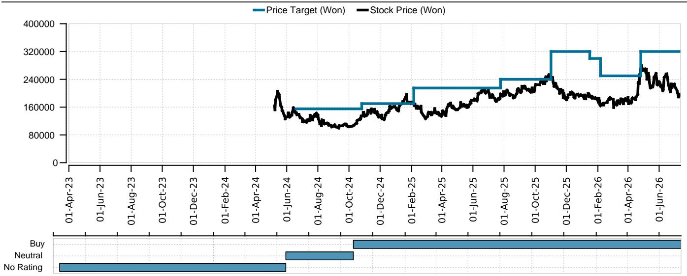

# 韩国造船企业：市场定价中的防御与AI/DC预期尚未兑现

2026年6月全球新船订单同比增长16%，达到1770万载重吨，但这一整体增长掩盖了结构性变化。年初至今订单量较2025年同期增长124%，然而韩国三大造船厂目前交易价格仅为2029年预期收益的12倍，低于2026年4月18倍的峰值。市场已剔除年初短暂推高估值的防御溢价，并开始对人工智能与数据中心（AI/DC）叙事进行折价。核心问题在于，这一折价反映的是健康的怀疑态度，还是未能认识到尚未见顶的盈利周期。

答案取决于哪个催化剂先出现，以及哪家船厂能抓住它。报告识别出两个不同的增长方向：AI/DC基础设施的发电机组产能扩张，以及可能在6至12个月内落地的浮式数据中心（FDC）订单。第三个方向——防御——在近期CPSP失利以及北约采购和中东冲突轨迹不确定性后已停滞。市场已对这些概率重新定价，但个股之间的差异表明，选股远比行业配置重要。

## 韩国船厂市场份额被中国超越，但订单总额呈现不同图景

2026年6月，韩国船厂按修正总吨计算的全球新订单份额仅为12%，而2025年上半年为21%。中国拿下了6月订单的86%。这一侵蚀并非周期性波动。中国船厂已系统性地增加产能，并开始在液化天然气运输船（LNGC）建造领域直接竞争——这是韩国历史上占据主导的细分市场。6月，中国LNGC订单量为40万载重吨，韩国为20万载重吨。

然而，2026年上半年，韩国三大船厂的订单总额同比增长76%，达到330亿美元。三星重工以284%的增幅领先，完成了全年目标的72%，部分得益于两份浮式液化天然气（FLNG）合同。HD韩国造船与海洋工程（KSOE）也达到72%的目标，现代重工（HHI）达到66%。韩华海洋（HOC）则落后。

订单量份额下降与订单额上升之间的明显矛盾，在审视产品组合后得以解释。韩国船厂并未在标准散货船或集装箱船领域与中国竞争——中国在这些领域具有结构性成本优势。它们专注于高价值、复杂船舶：FLNG装置、LNGC和专用海上结构。这一策略压缩了数量，但扩大了单船利润率。这意味着韩国船厂的收入增长将与能源基础设施和技术相关投资的节奏关联更紧密，而非全球造船周期。

## 发电机组产能扩张是近期催化剂，可重塑HHI盈利结构

HHI目前运营约3吉瓦的发电机组产能。报告显示，受强劲询价水平推动，公司正在评估将产能扩大至约9吉瓦。新增产能的披露预计最早在2026年7月下旬。这不仅仅是增量投资。将发电机组产能扩大两倍，将使HHI在能源设备价值链中重新定位，使其成为数据中心建设热潮的直接受益者——该热潮正推动备用发电和电网稳定设备的需求。

战略逻辑清晰。数据中心需要可靠、持续的电力。随着AI工作负载的扩展，对燃气轮机和大型柴油发电机的需求增速快于供应链的吸收能力。HHI现有的发动机制造专长，结合其造船能力，使其拥有差异化定位。公司可以大规模制造发电模块，并可能将其集成到浮式发电驳船或浮式数据中心中，形成竞争对手难以复制的捆绑产品。

市场尚未完全定价这一选择权。HHI交易价格为2027年预期收益的13.9倍，低于2026年4月该板块18倍的市盈率。如果产能扩张得到确认，且公司提供可信的投产时间表，估值重估可能相当可观。风险在于，扩张需要大量资本支出，且可能需要18至24个月才能对盈利产生贡献。读者需权衡稀释风险与盈利提升。

## 浮式数据中心订单可能比市场预期更早落地

浮式数据中心被许多读者视为概念设计，是数据中心主题的投机性延伸，缺乏商业验证。报告明确挑战这一观点，指出FDC订单可能在未来6至12个月内落地。三星重工、HD现代海洋解决方案（HMS）和HHI被确定为关键受益方。

FDC的经济逻辑具有说服力。陆基数据中心面临电力可用性、冷却用水和城市中心房地产成本等日益严峻的约束。在船厂建造并系泊在近海的浮式数据中心，可以绕过所有这三个约束。该船舶可位于海上风电场附近，或连接海底电缆，利用海水进行直接冷却。船厂建造过程是模块化、可重复的，且可能比建造同等陆基容量更快，尤其是在存在许可瓶颈的司法管辖区。

如果SHI、HMS或HHI在未来一年内获得商业FDC订单，将验证当前盈利预估中未包含的新收入来源。报告指出，SHI是FDC主题的首选标的，而HOC则不太受青睐。这种区分很重要，因为FDC订单可能具有不连续性，且集中在具有成熟海上建造专长的船厂。SHI的FLNG业绩记录使其在能源和基础设施客户中具有可信度，这些客户最有可能成为FDC技术的早期采用者。

## 防御催化剂暂停而非消失，但时机高度不确定

2026年初推动韩国造船企业估值走高的防御主题已大幅逆转。7月7日的CPSP失利，加上获得北约订单的挑战以及中东冲突轨迹的不确定性，导致市场解除了防御溢价。报告预计防御主题将进入暂停期。

这并非永久性损害。预计2026年第四季度发布的美国《国防授权法案》（NDAA）2027年修订版，可能为HHI和HOC重新引入采购机会，特别是如果参议院版本的法案包含盟友船厂合作条款。然而，时机过于不确定，无法支撑当前估值。市场已从定价高概率的防御订单转向定价低概率，报告认为防御失望带来的进一步下行空间有限。机会成本在于，本可部署到发电机组或FDC产能的资金，却在等待可能要到2027年才会出现的防御催化剂。

## 韩国造船企业的定位决策框架

以下框架将报告分析转化为机构读者的可操作定位标准。

**HHI** 在大型船厂中提供最不对称的上行空间，前提是发电机组产能扩张得到确认且公司按时间表交付。该股票交易价格较4月峰值和全球同行存在折价，反映了市场对AI/DC机会真实性和HHI执行能力的怀疑。如果7月下旬的产能披露达到或超过预期，估值重估可能迅速发生。防御催化剂是免费期权，而非核心主题。

**SHI** 是FDC主题的首选工具。公司的FLNG合同展示了FDC建造所需的项目管理和海上集成技能。报告指出，SHI提前完成了2026年订单目标的72%，降低了执行风险并提供了盈利可见性。对于一家进入新增长领域的公司而言，13.1倍2027年预期收益的估值是合理的。

**HOC** 是落后者。报告在CPSP挫折后明确偏好SHI而非HOC。HOC缺乏支撑HHI的近期发电机组催化剂，也缺乏支撑SHI的FDC定位。该股票可能需要防御相关事件（如有利的NDAA修订）才能重估，而该事件的时机不确定。

**KSOE** 和 **HMS** 提供不同的风险回报特征。KSOE以该组最低的6.3倍2027年预期收益交易，但报告指出，在缺乏更强股东回报的情况下，需要美国投资的更高可见性才能缩小资产净值折价。HMS作为船舶维修和零部件供应商，受益于发电机组维护、维修和大修（MRO）周期及FDC敞口，但以22.1倍2027年收益的较高市盈率交易，反映了其更高的增长和较低的资本密集度。

关键洞察在于，这些股票不可互换。市场将韩国造船企业视为单一板块，但底层业务模式正在分化。HHI和SHI正成为拥有船厂资产的技术和基础设施公司。HOC仍是等待防御催化剂的传统造船企业。KSOE是一个控股公司折价标的，需要单独的催化剂来缩小折价。

## 盈利周期仍有空间，但盈利构成正在变化

报告预计2026年第二季度营业利润将出现分化：HHI高于共识，HOC和HMS符合预期，SHI低于预期。这种分化与上述战略定位差异一致。但报告强调，关于AI/DC和防御的指引将比季度盈利超预期或不及预期更重要。市场正在超越当前交付周期，试图为下一个周期估值——该周期将由发电机组、浮式数据中心和防御定义。

新造船价格继续温和上涨，2026年7月环比上涨0.2%，与2024年峰值的折价收窄至2.4%。全球手持订单量同比增长33%，提供了多年的收入缓冲。LNGC价格持平，但报告预计2026年下半年更强的LNGC订单将转化为更高定价。这一价格周期支持了韩国船厂即使在中国手中失去数量份额也能维持利润率改善的论点。

报告未完全解决的风险在于，AI/DC叙事可能在订单落地前过度延伸。如果宣布发电机组产能扩张但需求因数据中心投资放缓而减弱，或者FDC订单在未来12个月内仍停留在概念阶段，市场可能将韩国船厂重新评级至历史平均水平。当前2029年预期收益12倍的市盈率提供了一定的安全边际，但并非深度价值入场点。

最重要的结论是，韩国造船企业并非单一板块押注。它们是一系列不同的战略选择，每个都有不同的催化剂时间线、风险特征和估值支撑。将其视为整体的读者将错过分化。那些区分HHI的发电机组产能、SHI的FDC定位和HOC的防御依赖性的读者，将对不对称上行空间所在有更清晰的认识。

---

*仅供参考。部分内容可能基于源材料通过AI辅助生成、翻译、总结或编辑，可能存在遗漏或错误。请独立核实。本文不构成专业建议。*

仅供参考。部分内容可能基于源材料通过AI辅助生成、翻译、总结或编辑，可能存在遗漏或错误。请独立核实。本文不构成专业建议。

