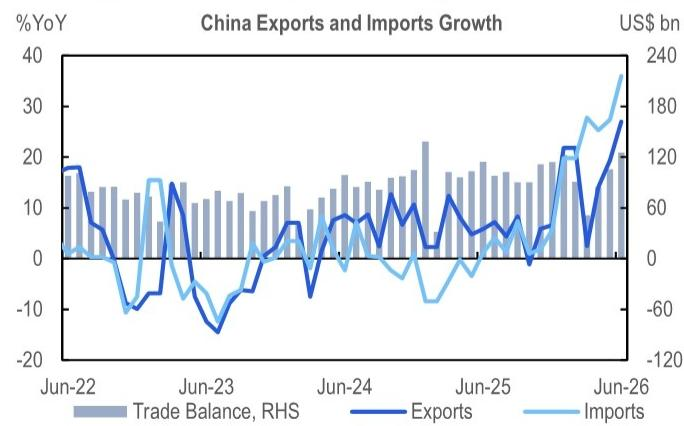
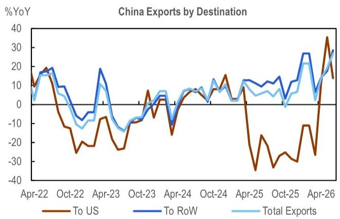
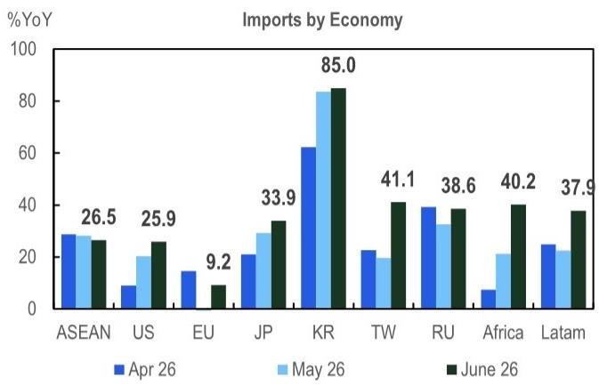
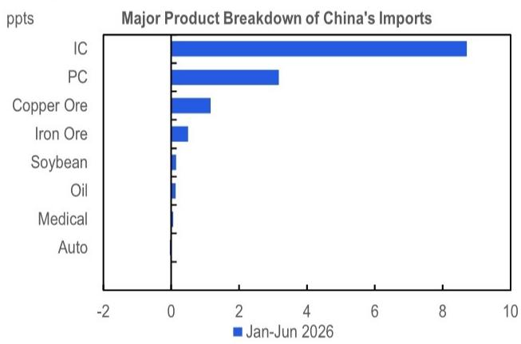

# 宏观环境观察

## AI超级周期推动结构性出口增长

## 研究观点

6月份贸易数据表现超出预期。出口增长主要受到AI硬件需求强劲和半导体价格上涨的推动，同时全球能源转型继续支撑绿色技术产品出口。进口也主要由技术领域带动。6月贸易数据进一步印证了出口增长正呈现结构性特征的观点。展望未来，这些有利因素有望支撑出口在2026年下半年保持稳健增长。贸易保护主义仍是主要风险因素，尤其是与欧盟的贸易关系趋于紧张，而美国相关风险相对可控。相比之下，内需可能保持温和态势。因此，预计政策支持将保持精准和渐进，而非大规模刺激。

## 贸易数据概览

6月出口和进口均显著增强。出口同比增长27.0%，连续第三个月加速。进口同比增长36.0%，同样超出预期。贸易顺差扩大至1256亿美元，为2025年1月以来最高。2026年第二季度出口同比增长20.2%，为18个季度以来最快增速；进口同比增长29.5%，为2021年第三季度以来较强。2026年上半年出口同比增长17.6%，进口同比增长26.6%。由于进口增速快于出口，上半年贸易顺差略有收窄。

## 出口驱动因素

出口增长主要得益于AI硬件需求强劲和半导体价格上涨，同时能源转型需求也支撑了绿色技术产品出口。

## 分地区出口表现

从地区来看，改善范围广泛，东盟贡献最大。对东盟出口增速加快至2023年3月以来最快。对欧盟出口升至四个月高位，其中对德国出口增长显著。对非洲和拉美出口也有所增强。技术密集型目的地需求保持活跃，对韩国出口维持高位，对台湾出口进一步加速。对日本出口温和放缓。对印度出口增长超过一倍，对俄罗斯出口小幅上升。对美国出口增速放缓，主要受基数效应影响。

## 分产品出口表现

从产品来看，出口增长范围广泛。机电产品和高技术产品均升至高位。劳动密集型产品连续第三个月加速。受全球AI超级周期支撑，集成电路出口再创新高。消费电子价格上涨对相关出口产生一定影响。个人电脑出口增长仍保持稳健，手机出口增速有所放缓。汽车出口升至四个月高位，船舶出口也进一步走强。

## 进口分析

受AI硬件和半导体价格上涨推动，进口增速升至五年高位。

## 分地区进口表现

从地区来看，进口增长范围广泛，印尼是主要例外。从韩国进口保持高位，仍是进口增长的最大贡献者。从台湾进口增长超过一倍，从日本进口也有所增强，这与半导体产品进口增长趋势一致。从非洲进口升至2022年3月以来最快增速。从美国进口连续第四个月增长并加速至约五年高位，从欧盟进口恢复增长。从俄罗斯和拉美进口也加快步伐。从东盟进口略有放缓，部分受印尼煤炭供应收紧和战略商品出口集中化影响。

## 分产品进口表现

从产品来看，进口结构更多反映技术需求而非内需全面复苏。高技术产品和机电产品进口均显著增强。个人电脑进口大幅增长，芯片进口进一步加速，两者合计贡献了近一半的进口增长。汽车进口仍处于收缩状态。大宗商品方面，原油进口金额下降，数量降幅更为明显。煤炭进口金额大幅增长，数量也强劲反弹。大豆进口在金额和数量上均显著恢复。

## 结构性展望

6月贸易数据进一步印证了出口增长正呈现结构性特征。这一表现反映了三个关键因素：第一，AI硬件超级周期未见降温迹象，芯片和个人电脑出口在2026年上半年增长67.5%，贡献了7.0个百分点的整体增长；第二，价格回升正在转化为更高的出口价格，支撑名义出口增长；第三，全球能源转型叠加中东地区影响，推动"新三样"出口在上半年增长45.8%。展望未来，这些结构性有利因素有望支撑2026年下半年出口保持稳健增长。贸易保护主义仍是主要风险因素。美国相关风险相对可控，而欧盟风险有所上升。相比之下，内需可能保持温和态势。因此，预计政策支持将保持精准和渐进，而非大规模刺激。

图1. 出口和进口均显著增强，贸易顺差扩大至17个月高位

图2. 6月对美国出口放缓，主要受基数效应影响

图3. 分地区出口改善范围广泛

图4. 分地区进口增长范围广泛，印尼是主要例外

图5. 芯片和个人电脑出口在2026年上半年增长67.5%，贡献7.0个百分点

图6. 上半年进口改善也主要由技术领域带动

