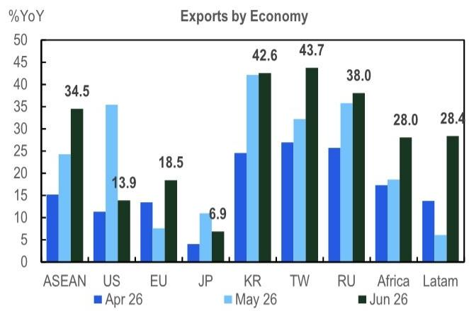
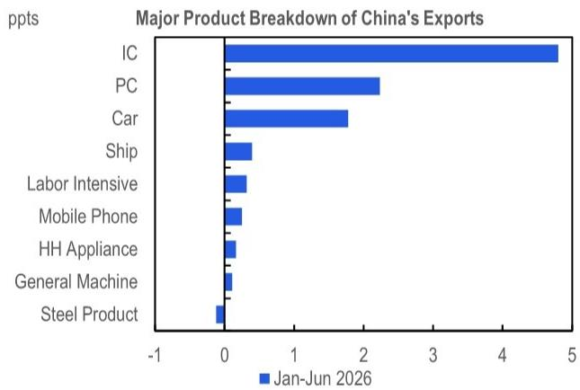

# China’s Export Boom Is No Longer Cyclical: The AI Supercycle Is Rewriting the Trade Narrative

China’s June trade data exceeded expectations. Exports rose 27.0% year-on-year, nearly 8 percentage points above the consensus forecast, while imports increased 36.0%—both accelerating for a third consecutive month. The trade surplus widened to USD 125.6 billion, the largest since January 2025. These are not the numbers of a cyclical rebound. They signal something more consequential: China’s export machine has entered a structurally different phase, powered by three reinforcing forces that show no sign of fading. The global AI hardware supercycle, a sustained reflation in export prices, and the accelerating energy transition have together transformed the composition and durability of China’s trade growth. For observers, the strategic question is no longer whether the upswing will continue, but how to understand a regime that may persist through mid-2027—and what risks could disrupt it.

The most striking feature of June’s data is its breadth. Export growth accelerated across nearly every major destination and product category. Shipments to ASEAN hit their fastest pace since March 2023 at 34.5% year-on-year. Exports to the EU quickened to a four-month high of 18.5%, boosted by surging air-conditioner shipments during Europe’s heatwave. Tech-heavy destinations such as South Korea (42.6%) and Taiwan (43.7%) remained elevated. Even exports to India more than doubled to 39.4%. This is not a story of a single market pulling the rest along. It is a synchronized expansion that reflects deep structural demand, not transient factors.

Yet the composition of imports tells an even more revealing story. High-tech imports surged 57.8% year-on-year, mechanical and electrical imports rose 47.5%, and chip imports accelerated to 72.3%. PC imports jumped an extraordinary 156.7%. Together, chips and PCs contributed nearly half of headline import growth. Meanwhile, crude oil imports plunged 41.3% in volume terms to their lowest level since October 2016, and auto imports remained in contraction as domestic EV brands continued to gain share. The message is unmistakable: China’s import boom is almost entirely tech-led, not a broad-based recovery in domestic consumption. The economy remains deeply K-shaped, with the technology sector running hot while traditional demand stays moderate.

## The AI Hardware Supercycle Has Become the Dominant Driver of China’s Export Growth, Contributing 7 Percentage Points to Headline Expansion in the First Half of 2026

The numbers are stark. Chip and PC exports rose 67.5% year-on-year in the first half of 2026, contributing 7.0 percentage points to headline export growth. Integrated circuit exports alone reached another record high in June, accelerating to 121.9% year-on-year from 110.9% in May. This is not a one-off surge. It reflects the global scaling of AI infrastructure—data centers, training clusters, and edge computing devices—all of which depend on semiconductor supply chains that run through China. The country has become a critical node in the global AI hardware ecosystem, not merely as a manufacturer of finished goods but as a producer of intermediate components that feed into the broader supply chain.

The persistence of this demand is what makes it structural. AI hardware investment cycles typically last three to five years, and we are still in the early innings of the current wave. Hyperscalers continue to raise capital expenditure guidance, and the deployment of AI inference at the edge is only beginning. China’s export performance in chips and PCs is therefore likely to remain elevated through at least the second half of 2027, barring a sudden change in global AI investment. For observers, this means the semiconductor and electronics supply chain in China is no longer a cyclical play. It is a structural growth story with multi-year visibility.

## Export Price Inflation Is Reinforcing Volume Growth, Creating a Rare Dual Tailwind That Amplifies Nominal Trade Expansion

May’s export price index rose 8.9% year-on-year, the fastest pace in 40 months. This is a critical and underappreciated development. China’s export boom is not merely a volume story—it is also a pricing story. Higher semiconductor prices, driven by AI demand and supply constraints, are lifting the unit value of China’s tech exports. This creates a virtuous cycle: rising prices boost nominal export growth even if volumes were to plateau, and the resulting revenue improvement gives Chinese exporters more pricing power and margin flexibility.

The mechanism is straightforward. Global chip shortages and capacity constraints have pushed up average selling prices for memory, logic, and analog semiconductors. China, as a major processor and exporter of these components, captures the upside. The same dynamic applies to PCs and other electronics, where rising component costs are passed through to export prices. This is not a temporary phenomenon. As long as AI-driven demand keeps semiconductor foundries operating near capacity, export price inflation will persist. For observers, this dual tailwind means nominal export growth will remain elevated even if volume growth moderates, providing a buffer against potential demand shifts.

## The Global Energy Transition Has Added a Third Structural Pillar, With “New Three” Exports—EVs, Batteries, and Solar—Rising 45.8% in the First Half of 2026

China’s green-tech exports have become a formidable growth engine in their own right. Auto exports, driven by robust EV shipments, rose to a four-month high of 69.6% year-on-year in June. Ship exports also strengthened further at 42.3%. The “New Three” categories—electric vehicles, lithium-ion batteries, and solar panels—collectively grew 45.8% in the first half of 2026, far outpacing overall export growth.

This is not simply a function of global climate commitments. Middle East disruptions have amplified the urgency of energy diversification, pushing countries to accelerate their transition away from fossil fuels. China is the dominant supplier of the hardware required for this transition—batteries, solar panels, and EVs—and its export capacity is unmatched. The energy transition is a multi-decade structural trend, and China’s position as the low-cost, high-volume producer of green technology is unlikely to be challenged in the near term. This pillar of export growth will therefore remain resilient even if other demand sources moderate.

## The K-Shaped Domestic Economy Means Policy Will Remain Targeted and Incremental, Not Broad-Based, Limiting the Risk of Overheating but Also Constraining Consumption-Led Recovery

The import data reveals a stark divergence. While tech imports are booming, crude oil imports plunged 41.3% in volume terms to their lowest level since October 2016. Auto imports remained in contraction. This is the signature of a K-shaped economy: the technology sector is running hot while traditional industrial and consumer demand is moderate. The government is aware of this imbalance and has responded with targeted, incremental policy support rather than broad-based stimulus.

This approach has two strategic implications. First, it limits the risk of an overheating cycle that would force the central bank to tighten policy prematurely. The export boom is not being fueled by domestic credit expansion or fiscal stimulus; it is being driven by external demand. This makes the upswing more sustainable because it is not dependent on policy accommodation that could be withdrawn. Second, it means domestic consumption will remain a laggard, which could eventually cap the upside for import growth in non-tech categories. For observers, the K-shaped recovery implies that exposure to China should be highly selective: technology and green energy supply chains versus traditional manufacturing and consumer discretionary sectors.

## A Decision Framework for Understanding China’s Structural Export Upswing

The evidence points to a clear strategic conclusion. China’s export growth is now structurally driven by three forces—AI hardware, export price reflation, and the energy transition—that are likely to persist through at least the second half of 2027. The principal risk is not domestic demand, which is already priced in, but protectionism. US-related risks appear relatively contained following the IEEPA ruling and the Trump-Xi summit, but EU risks are rising as Brussels considers tougher trade-defense measures. This asymmetry creates a clear framework for understanding.

First, exposure to the AI hardware supply chain, including semiconductors, PCs, and related electronics. These categories are benefiting from both volume and price tailwinds and have the strongest visibility. Second, maintain exposure to green-tech exports—EVs, batteries, and solar—but hedge against potential EU tariff escalation by favoring companies with diversified geographic revenue bases. Third, traditional manufacturing and consumer discretionary sectors that depend on domestic demand recovery, which remains elusive. Fourth, monitor the trajectory of export prices: if semiconductor supply constraints ease and price inflation moderates, the dual tailwind will narrow, but the volume story should remain intact.

The structural upswing in China’s exports is not a forecast. It is a fact embedded in the data. The strategic question for observers is whether they are positioned to capture it.

*For informational purposes only. Portions may be generated, translated, summarized, or edited with AI assistance based on source materials and may contain omissions or errors. Please verify independently. This is not professional advice.*

For informational purposes only. Portions may be generated, translated, summarized, or edited with AI assistance based on source materials and may contain omissions or errors. Please verify independently. This is not professional advice.

