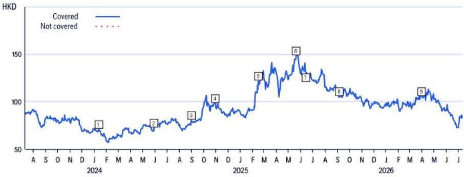
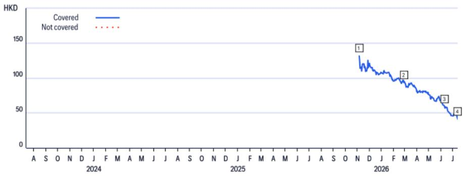
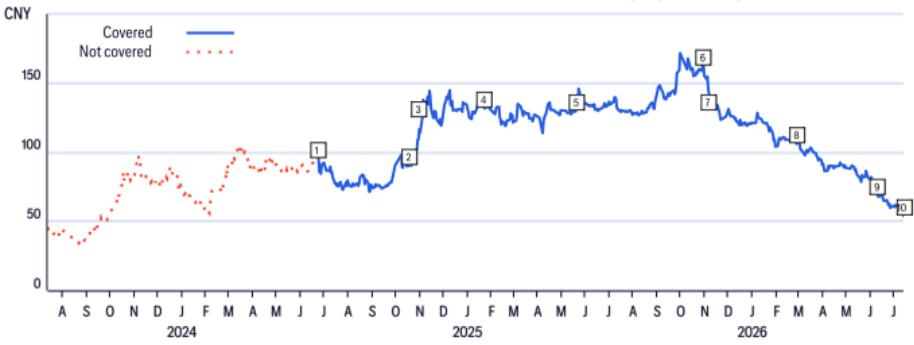
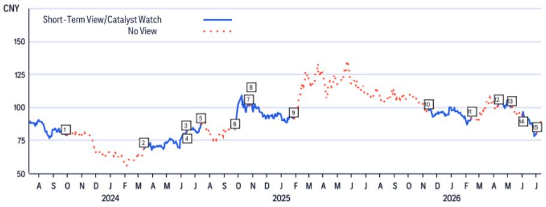
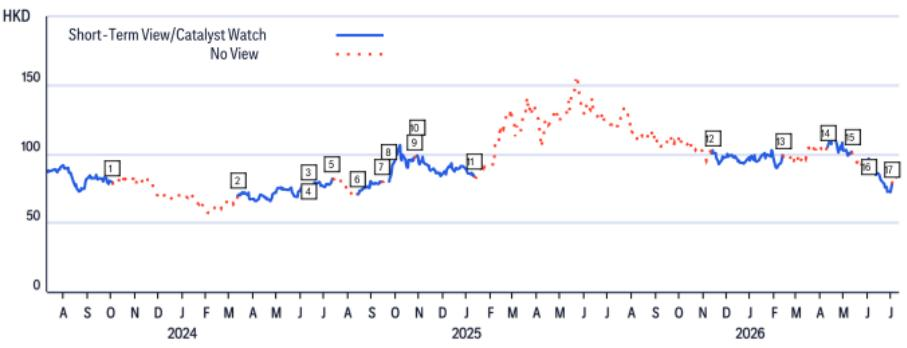

# China Auto Manufacturers

## Weekly Orders Update - July EV Retail Observations

## RESEARCH PERSPECTIVE

Based on industry channel observations, overall 2nd week July (6 Jul - 12 Jul) EV orders showed a sequential change of -16% week-over-week (-5% month-to-date). If the monthly pace of orders aligns with retail trends, assuming a -5% NEV retail sales month-over-month change for the full month of Jul-26, this would suggest monthly EV retail sales around 950k units, indicating Jul-26 NEV retail approximately -2.7% year-over-year (7M26 at -12.4% year-over-year). In terms of month-to-date pace, BYD (+59%) and Leapmotor (+11%) showed relative strength compared to the sector average of -5%; while Li Auto (-9%), Xiaomi (-11%), Geely Galaxy(-14%), Xpeng(-22%), Tesla(-26%) and Zeekr (-27%) showed different patterns. The larger month-over-month changes for Huawei Harmony and Nio were related to the order peak in early-June following new model introductions (all-new M9 and ES9). Further readings: (1) BYD (1211.HK) - July Outlook, after June retail results; (2) Seres (601127.SS/9927.HK) - Perspective on H-shares; A-share Observations.

Figure 1. Weekly Orders

<table><tr><td rowspan="3">Brands</td><td colspan="4">Jun-26</td><td colspan="3">Jul-26</td><td rowspan="3">WoW</td><td rowspan="3">MTD MoM</td></tr><tr><td>1st week</td><td>2nd week</td><td>3rd week</td><td>4th week</td><td>1st week</td><td>2nd week</td></tr><tr><td>1 Jun - 7 Jun</td><td>8 Jun - 14 Jun</td><td>15 Jun - 21 Jun</td><td>22 Jun - 28 Jun</td><td>29 Jun - 5 Jul</td><td>6 Jul - 12 Jul</td><td></td></tr><tr><td>Li Auto</td><td>6.7k</td><td>5.5k</td><td>5.9k</td><td>9.9k</td><td>5.7k</td><td>5.4k</td><td>-5%</td><td>-9%</td><td></td></tr><tr><td>Huawei Harmony</td><td>24.2k</td><td>18.2k</td><td>11.7k</td><td>10.8k</td><td>8.1k</td><td>6.8k</td><td>-16%</td><td>-65%</td><td></td></tr><tr><td>Leapmotor</td><td>14.6k</td><td>11.5k</td><td>14.1k</td><td>15.0k</td><td>13.8k</td><td>15.2k</td><td>10%</td><td>11%</td><td></td></tr><tr><td>NIO (incl. ONVO)</td><td>28.0k</td><td>19.5k</td><td>14.5k</td><td>11.6k</td><td>10.8k</td><td>12.2k</td><td>13%</td><td>-52%</td><td></td></tr><tr><td>BYD</td><td>47.7k</td><td>45.7k</td><td>106.8k</td><td>70.6k</td><td>86.5k</td><td>62.1k</td><td>-28%</td><td>59%</td><td></td></tr><tr><td>Xiaomi</td><td>7.4k</td><td>5.0k</td><td>7.2k</td><td>6.1k</td><td>5.4k</td><td>5.6k</td><td>4%</td><td>-11%</td><td></td></tr><tr><td>Zeekr</td><td>6.5k</td><td>5.5k</td><td>5.3k</td><td>5.4k</td><td>4.6k</td><td>4.2k</td><td>-9%</td><td>-27%</td><td></td></tr><tr><td>Tesla</td><td>14.2k</td><td>13.1k</td><td>12.6k</td><td>11.2k</td><td>10.9k</td><td>9.3k</td><td>-15%</td><td>-26%</td><td></td></tr><tr><td>Geely Galaxy</td><td>18.3k</td><td>21.3k</td><td>18.9k</td><td>22.9k</td><td>18.1k</td><td>15.8k</td><td>-13%</td><td>-14%</td><td></td></tr><tr><td>Xpeng (incl. Mona)</td><td>9.5k</td><td>8.3k</td><td>9.0k</td><td>7.3k</td><td>6.8k</td><td>7.1k</td><td>5%</td><td>-22%</td><td></td></tr><tr><td>Sector total (incl. Xiaomi)</td><td>177,110</td><td>153,640</td><td>206,000</td><td>170,770</td><td>170,660</td><td>143,640</td><td>-16%</td><td>-5%</td><td></td></tr><tr><td>Sector total (excl. Xiaomi)</td><td>169,700</td><td>148,630</td><td>198,800</td><td>164,670</td><td>165,260</td><td>138,040</td><td>-16%</td><td>-5%</td><td></td></tr><tr><td>Lithium Carbonate ASPBattery Grade (Rmb/ton)</td><td>159,000</td><td>173,800</td><td>162,700</td><td>146,500</td><td>166,500</td><td>150,000</td><td>-10%</td><td>-14%</td><td></td></tr></table>

Jeff Chung $^{AC}$ +852-2501-2787
jeff.m.chung@citi.com

© 2026 Citi Inc. No redistribution without Citi's written permission.

Source: Citi, Citi Dealership Check

Kyle Wu

+852-2501-8483

kyle.wu@citi.com

Figure 2. Weekly Orders  
  
© 2026 Citi Inc. No redistribution without Citi's written permission.
Source: Citi, Citi Dealership Check  
Horizontal Axis: WoW

## BYD

(1211.HK; HK\$83.95; 1; 13 Jul 26; 16:10)

## Valuation Framework

Applying 1.2x 2026E PEG on a +25% 2026-28E NP CAGR, the reference point is HK\$142, implying 30x/25x 2026E/27E PER. PEG valuation is used as it may more accurately reflect the characteristics of this growth company.

## Considerations

Key factors that could affect the BYD H-share relative to the reference point include: 1) NEV bus or PV sales differing from expectations; 2) the ramp-up of the Skyrail business proceeding at a different pace; 3) a prolonged capex cycle; and 4) unexpected cash flow developments.

## BYD

(002594.SZ; Rmb86.98; 1; 13 Jul 26; 15:00)

## Valuation Framework

The reference point of Rmb131 is set at 1.2x 26E PEG based on a +25% 2025-27E NP CAGR. This implies 30x/25x 2026E/27E P/Es. PEG valuation is adopted as it may more accurately reflect the potential of a growth company.

## Considerations

Factors that could affect the BYD A-share relative to the reference point include 1) NEV bus or PV sales differing from expectations, 2) the ramp-up of the Skyrail business proceeding at a different pace, 3) a prolonged capex cycle, and 4) unexpected cash flow developments.

## Seres Group

(9927.HK; HK\$41.32; 3; 13 Jul 26; 16:10)

## Valuation Framework

P/S valuation is used given near-term profitability considerations. Applying 0.35x 2026E P/S (2SD below average since H-share listing to reflect margin considerations and competitive dynamics), the reference point is HK\$33.5.

## Considerations

Potential factors that could influence outcomes include: (1) Changes in auto market sentiment related to government subsidy support; (2) Operating efficiency developments; (3) Export sales performance; (4) ADAS adoption trends affecting smart EV sales.

Other factors: (1) Macro environment developments; (2) Research and development outcomes; (3) Market competition dynamics; (4) NEV and software system considerations; (5) Partnership developments.

Any of these factors could cause the shares to differ from the reference point.

## Seres Group

(601127.SS; Rmb53.91; 3; 13 Jul 26; 15:00)

## Valuation Framework

P/S valuation is used given near-term profitability considerations. Applying 0.45x 2026E P/S (2SD below 1-year average to reflect margin considerations and competitive dynamics), the reference point is Rmb37.4.

## Considerations

Potential factors that could influence outcomes include: (1) Changes in auto market sentiment related to government subsidy support; (2) Operating efficiency developments; (3) Export sales performance; (4) ADAS adoption trends affecting smart EV sales.

Other factors: (1) Macro environment developments; (2) Research and development outcomes; (3) Market competition dynamics; (4) NEV and software system considerations; (5) Partnership developments.

Any of these factors could cause the shares to differ from the reference point.

If you are visually impaired and would like to speak to a Citi representative regarding the details of the graphics in this document, please call USA 1-888-500-5008 (TTY: 711), from outside the US +1-210-677-3788

## Appendix A-1

## ANALYST CERTIFICATION

The research analysts primarily responsible for the preparation and content of this research report are either (i) designated by "AC" in the author block or (ii) listed in bold alongside content which is attributable to that analyst. If multiple AC analysts are designated in the author block, each analyst is certifying with respect to the entire research report other than (a) content attributable to another AC certifying analyst listed in bold alongside the content and (b) views expressed solely with respect to a specific issuer which are attributable to another AC certifying analyst identified in the price charts or rating history tables for that issuer shown below. Each of these analysts certify, with respect to the sections of the report for which they are responsible: (1) that the views expressed therein accurately reflect their personal views about each issuer and security referenced and were prepared in an independent manner, including with respect to Citi Global Markets Inc. and its affiliates; and (2) no part of the research analyst's compensation was, is, or will be, directly or indirectly, related to the specific recommendations or views expressed by that research analyst in this report.

## IMPORTANT DISCLOSURES

BYD (1211.HK)
Ratings and Target Price History
Fundamental Research

Analyst: Jeff Chung

<table><tr><td></td><td>Date</td><td>Rating</td><td>Target Price</td><td>Closing Price</td></tr><tr><td>1</td><td>11-Jan-24 13:28:07</td><td>1</td><td>*154.33</td><td>70.80</td></tr><tr><td>2</td><td>29-May-24 07:27:17</td><td>1</td><td>*158.33</td><td>72.53</td></tr><tr><td>3</td><td>01-Sep-24 20:09:08</td><td>1</td><td>*162.67</td><td>80.40</td></tr></table>

\*Indicates Change

<table><tr><td></td><td>Date</td><td>Rating</td><td>Target Price</td><td>Closing Price</td></tr><tr><td>4</td><td>30-Oct-24 11:36:39</td><td>1</td><td>*166.67</td><td>98.33</td></tr><tr><td>5</td><td>14-Feb-25 11:26:49</td><td>1</td><td>*229.33</td><td>121.40</td></tr><tr><td>6</td><td>20-May-25 14:45:04</td><td>1</td><td>*242.33</td><td>148.20</td></tr></table>

<table><tr><td>Date</td><td>Rating</td><td>Target Price</td><td>Closing Price</td></tr><tr><td>7 13-Jun-25 00:00:04</td><td>1</td><td>*233.00</td><td>131.10</td></tr><tr><td>8 07-Sep-25 20:44:21</td><td>1</td><td>*174.00</td><td>105.60</td></tr><tr><td>9 30-Mar-26 12:12:39</td><td>1</td><td>*142.00</td><td>105.80</td></tr></table>

Rating/target price changes above reflect Eastern Time

## BYD (002594.SZ)

Ratings and Target Price History
Fundamental Research

Analyst: Jeff Chung

<table><tr><td></td><td>Date</td><td>Rating</td><td>Target Price</td><td>Closing Price</td></tr><tr><td>1</td><td>11-Jan-24 13:28:07</td><td>1</td><td>*140.33</td><td>65.59</td></tr><tr><td>2</td><td>29-May-24 07:27:17</td><td>1</td><td>*145.67</td><td>74.90</td></tr><tr><td>3</td><td>01-Sep-24 20:09:08</td><td>1</td><td>*149.67</td><td>83.14</td></tr></table>

\*Indicates Change

<table><tr><td></td><td>Date</td><td>Rating</td><td>Target Price</td><td>Closing Price</td></tr><tr><td>4</td><td>30-Oct-24 11:36:39</td><td>1</td><td>*153.33</td><td>101.85</td></tr><tr><td>5</td><td>14-Feb-25 11:26:49</td><td>1</td><td>*210.00</td><td>118.68</td></tr><tr><td>6</td><td>20-May-25 14:45:04</td><td>1</td><td>*223.00</td><td>131.60</td></tr></table>

<table><tr><td></td><td>Date</td><td>Rating</td><td>Target Price</td><td>Closing Price</td></tr><tr><td>7</td><td>29-Jul-25 23:21:33</td><td>1</td><td>*214.00</td><td>111.42</td></tr><tr><td>8</td><td>07-Sep-25 20:44:21</td><td>1</td><td>*160.00</td><td>107.26</td></tr><tr><td>9</td><td>30-Mar-26 12:12:39</td><td>1</td><td>*131.00</td><td>106.05</td></tr></table>

Rating/target price changes above reflect Eastern Time

Seres Group (9927.HK)

Ratings and Target Price History
Fundamental Research

Analyst: Jeff Chung

<table><tr><td></td><td>Date</td><td>Rating</td><td>Target Price</td><td>Closing Price</td></tr><tr><td>1</td><td>05-Nov-25 10:48:26</td><td>*2</td><td>*140.40</td><td>131.50</td></tr><tr><td>2</td><td>26-Feb-26 03:57:58</td><td>2</td><td>*98.90</td><td>93.60</td></tr></table>

\*Indicates Change

<table><tr><td></td><td>Date</td><td>Rating</td><td>Target Price</td><td>Closing Price</td></tr><tr><td>3</td><td>10-Jun-26 05:07:18</td><td>2</td><td>*63.70</td><td>58.80</td></tr><tr><td>4</td><td>13-Jul-26 04:56:33</td><td>*3</td><td>*33.50</td><td>41.32</td></tr></table>

Rating/target price changes above reflect Eastern Time

## Seres Group (601127.SS)

Ratings and Target Price History
Fundamental Research

Analyst: Jeff Chung

<table><tr><td></td><td>Date</td><td>Rating</td><td>Target Price</td><td>Closing Price</td></tr><tr><td>1</td><td>24-Jun-24 06:23:05</td><td>*1</td><td>*124.10</td><td>95.23</td></tr><tr><td>2</td><td>18-Oct-24 07:02:36</td><td>1</td><td>*126.70</td><td>90.82</td></tr><tr><td>3</td><td>30-Oct-24 11:46:40</td><td>1</td><td>*143.90</td><td>109.46</td></tr><tr><td>4</td><td>22-Jan-25 00:59:36</td><td>1</td><td>*161.70</td><td>131.90</td></tr></table>

\*Indicates Change

<table><tr><td></td><td>Date</td><td>Rating</td><td>Target Price</td><td>Closing Price</td></tr><tr><td>5</td><td>20-May-25 15:00:33</td><td>1</td><td>*165.50</td><td>130.50</td></tr><tr><td>6</td><td>30-Oct-25 10:38:34</td><td>*2</td><td>165.50</td><td>162.94</td></tr><tr><td>7</td><td>05-Nov-25 10:48:26</td><td>*3</td><td>*129.10</td><td>146.03</td></tr><tr><td>8</td><td>26-Feb-26 03:57:58</td><td>3</td><td>*88.10</td><td>106.08</td></tr></table>

<table><tr><td></td><td>Date</td><td>Rating</td><td>Target Price</td><td>Closing Price</td></tr><tr><td>9</td><td>10-Jun-26 05:07:18</td><td>3</td><td>*55.40</td><td>68.88</td></tr><tr><td>10</td><td>13-Jul-26 04:56:33</td><td>3</td><td>*37.40</td><td>53.91</td></tr></table>

Rating/target price changes above reflect Eastern Time

## BYD (002594.SZ)

Short-Term View/Catalyst Watch Research

Analyst: Jeff Chung

<table><tr><td></td><td>Date</td><td>Action</td><td>Expected Direction</td><td>Duration</td><td>Closing Price</td></tr><tr><td>1</td><td>03-Oct-23 13:11:32</td><td>Remove CW</td><td>Upside</td><td>90 Days</td><td>78.90</td></tr><tr><td>2</td><td>13-Mar-24 05:44:35</td><td>Add CW</td><td>Upside</td><td>90 Days</td><td>68.79</td></tr><tr><td>3</td><td>11-Jun-24 13:00:44</td><td>Remove CW</td><td>Upside</td><td>90 Days</td><td>81.54</td></tr><tr><td>4</td><td>12-Jun-24 20:03:36</td><td>Add CW</td><td>Upside</td><td>30 Days</td><td>80.97</td></tr><tr><td>5</td><td>12-Jul-24 12:04:28</td><td>Remove CW</td><td>Upside</td><td>30 Days</td><td>87.54</td></tr></table>

CW - Catalyst Watch, STV - Short-Term View

<table><tr><td></td><td>Date</td><td>Action</td><td>Expected Direction</td><td>Duration</td><td>Closing Price</td></tr><tr><td>6</td><td>23-Sep-24 21:08:42</td><td>Add CW</td><td>Upside</td><td>30 Days</td><td>83.33</td></tr><tr><td>7</td><td>24-Oct-24 23:28:51</td><td>Remove CW</td><td>Upside</td><td>30 Days</td><td>101.23</td></tr><tr><td>8</td><td>28-Oct-24 22:24:43</td><td>Add CW</td><td>Upside</td><td>90 Days</td><td>101.70</td></tr><tr><td>9</td><td>27-Jan-25 21:14:39</td><td>Remove CW</td><td>Upside</td><td>90 Days</td><td>91.50</td></tr><tr><td>10</td><td>12-Nov-25 21:56:41</td><td>Add CW</td><td>Upside</td><td>90 Days</td><td>97.77</td></tr></table>

<table><tr><td colspan="2">Date</td><td>Action</td><td>Expected Direction</td><td>Duration</td><td>Closing Price</td></tr><tr><td>11</td><td>11-Feb-26 21:14:42</td><td>Remove CW</td><td>Upside</td><td>90 Days</td><td>92.28</td></tr><tr><td>12</td><td>10-Apr-26 04:39:55</td><td>Add CW</td><td>Upside</td><td>30 Days</td><td>101.67</td></tr><tr><td>13</td><td>10-May-26 23:13:11</td><td>Remove CW</td><td>Upside</td><td>30 Days</td><td>100.02</td></tr><tr><td>14</td><td>01-Jun-26 07:20:22</td><td>Add CW</td><td>Upside</td><td>30 Days</td><td>93.65</td></tr><tr><td>15</td><td>01-Jul-26 23:05:17</td><td>Remove CW</td><td>Upside</td><td>30 Days</td><td>80.66</td></tr></table>

Rating/target price changes above reflect Eastern Time

<table><tr><td></td><td>Date</td><td>Action</td><td>Expected Direction</td><td>Duration</td><td>Closing Price</td></tr><tr><td>1</td><td>03-Oct-23 00:16:29</td><td>Remove CW</td><td>Upside</td><td>90 Days</td><td>79.53</td></tr><tr><td>2</td><td>12-Mar-24 15:43:32</td><td>Add CW</td><td>Upside</td><td>90 Days</td><td>69.87</td></tr><tr><td>3</td><td>11-Jun-24 00:18:43</td><td>Remove CW</td><td>Upside</td><td>90 Days</td><td>76.13</td></tr><tr><td>4</td><td>12-Jun-24 06:02:24</td><td>Add CW</td><td>Upside</td><td>30 Days</td><td>73.33</td></tr><tr><td>5</td><td>12-Jul-24 00:12:00</td><td>Remove CW</td><td>Upside</td><td>30 Days</td><td>82.20</td></tr><tr><td>6</td><td>13-Aug-24 21:14:13</td><td>Add CW</td><td>Upside</td><td>30 Days</td><td>71.00</td></tr></table>

CW - Catalyst Watch, STV - Short-Term View

<table><tr><td></td><td>Date</td><td>Action</td><td>Expected Direction</td><td>Duration</td><td>Closing Price</td></tr><tr><td>7</td><td>13-Sep-24 14:17:22</td><td>Remove CW</td><td>Upside</td><td>30 Days</td><td>79.93</td></tr><tr><td>8</td><td>23-Sep-24 21:08:42</td><td>Add CW</td><td>Upside</td><td>30 Days</td><td>80.13</td></tr><tr><td>9</td><td>25-Oct-24 00:28:51</td><td>Remove CW</td><td>Upside</td><td>30 Days</td><td>97.53</td></tr><tr><td>10</td><td>28-Oct-24 22:24:43</td><td>Add CW</td><td>Upside</td><td>90 Days</td><td>98.20</td></tr><tr><td>11</td><td>12-Jan-25 22:48:43</td><td>Remove CW</td><td>Upside</td><td>90 Days</td><td>83.80</td></tr><tr><td>12</td><td>12-Nov-25 21:56:41</td><td>Add CW</td><td>Upside</td><td>90 Days</td><td>100.50</td></tr></table>

<table><tr><td colspan="2">Date</td><td>Action</td><td>Expected Direction</td><td>Duration</td><td>Closing Price</td></tr><tr><td>13</td><td>11-Feb-26 22:14:43</td><td>Remove CW</td><td>Upside</td><td>90 Days</td><td>99.15</td></tr><tr><td>14</td><td>10-Apr-26 04:39:55</td><td>Add CW</td><td>Upside</td><td>30 Days</td><td>105.10</td></tr><tr><td>15</td><td>11-May-26 00:13:29</td><td>Remove CW</td><td>Upside</td><td>30 Days</td><td>101.70</td></tr><tr><td>16</td><td>01-Jun-26 07:20:22</td><td>Add CW</td><td>Upside</td><td>30 Days</td><td>90.75</td></tr><tr><td>17</td><td>02-Jul-26 00:35:24</td><td>Remove CW</td><td>Upside</td><td>30 Days</td><td>78.30</td></tr></table>

Rating/target price changes above reflect Eastern Time

<table><tr><td colspan="7">The Firm has made a market in the publicly traded equity securities of BYD Co Ltd on at least one occasion since 1 Jan 2025.</td></tr><tr><td colspan="7">Citi Global Markets Inc. or its affiliates received compensation for products and services other than investment banking services from BYD,Seres Group in the past 12 months.</td></tr><tr><td colspan="7">Citi Global Markets Inc. or its affiliates currently has, or had within the past 12 months, the following as clients, and the services provided were non-investment-banking, securities-related: BYD,Seres Group.</td></tr><tr><td colspan="7">Citi Global Markets Inc. or its affiliates currently has, or had within the past 12 months, the following as clients, and the services provided were non-investment-banking, non-securities-related: BYD,Seres Group.</td></tr><tr><td colspan="7">Citi Global Markets Inc. and/or its affiliates has a significant financial interest in relation to BYD. (For an explanation of the determination of significant financial interest, please refer to the policy for managing conflicts of interest which can be found at www.citiVelocity.com.)</td></tr><tr><td colspan="7">Analysts&#x27; compensation is determined by Citi management and Citi&#x27;s senior management and is based upon activities and services intended to benefit the investor clients of Citi Global Markets Inc. and its affiliates (the &quot;Firm&quot;). Compensation is not linked to specific transactions or recommendations. Like all Firm employees, analysts receive compensation that is impacted by overall Firm profitability which includes investment banking, sales and trading, and principal trading revenues. One factor in equity research analyst compensation is arranging corporate access events between institutional clients and the management teams of covered companies. Typically, company management is more likely to participate when the analyst has a positive view of the company.</td></tr><tr><td colspan="7">For financial instruments recommended in the Product in which the Firm is not a market maker, the Firm is a liquidity provider in such financial instruments (and any underlying instruments) and may act as principal in connection with transactions in such instruments. The Firm is a regular issuer of traded financial instruments linked to securities that may have been recommended in the Product. The Firm regularly trades in the securities of the issuer(s) discussed in the Product. The Firm may engage in securities transactions in a manner inconsistent with the Product and, with respect to securities covered by the Product, will buy or sell from customers on a principal basis.</td></tr><tr><td colspan="7">The Firm is a market maker in the publicly traded equity securities of BYD.</td></tr><tr><td colspan="7">Unless stated otherwise neither the Research Analyst nor any member of their team has viewed the material operations of the Companies for which an investment view has been provided within the past 12 months.</td></tr><tr><td colspan="7">For important disclosures (including copies of historical disclosures) regarding the companies that are the subject of this Citi product (&quot;the Product&quot;), please contact Citi, 388 Greenwich Street, 6th Floor, New York, NY, 10013, Attention: Legal/Compliance [E6WYB6412478]. In addition, the same important disclosures, with the exception of the Valuation and Risk assessments and historical disclosures, are contained on the Firm&#x27;s disclosure website at https://www.citivelocity.com/cvr/eppublic/citi_research_disclosures. Valuation and Risk assessments can be found in the text of the most recent research note/report regarding the subject company. Pursuant to the Market Abuse Regulation a history of all Citi recommendations published during the preceding 12-month period can be accessed via Citi Velocity (https://www.citivelocity.com/cv2) or your standard distribution portal. Historical disclosures (for up to the past three years) will be provided upon request.</td></tr><tr><td colspan="7">Citi Equity Ratings Distribution</td></tr><tr><td></td><td colspan="3">12 Month Rating</td><td colspan="3">Catalyst Watch</td></tr><tr><td>Data current as of 01 Jul 2026</td><td>Buy</td><td>Hold</td><td>Sell</td><td>Buy</td><td>Hold</td><td>Sell</td></tr><tr><td>Citi Global Fundamental Coverage (Neutral=Hold)</td><td>61%</td
