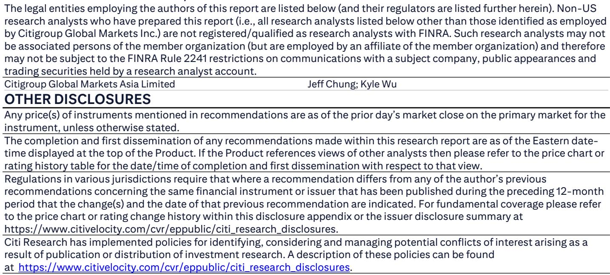
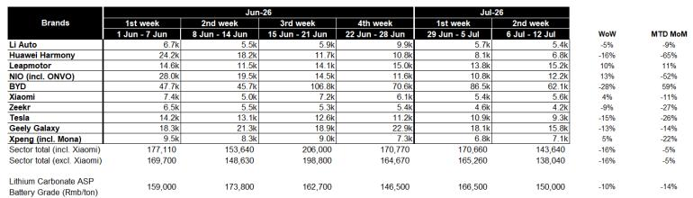
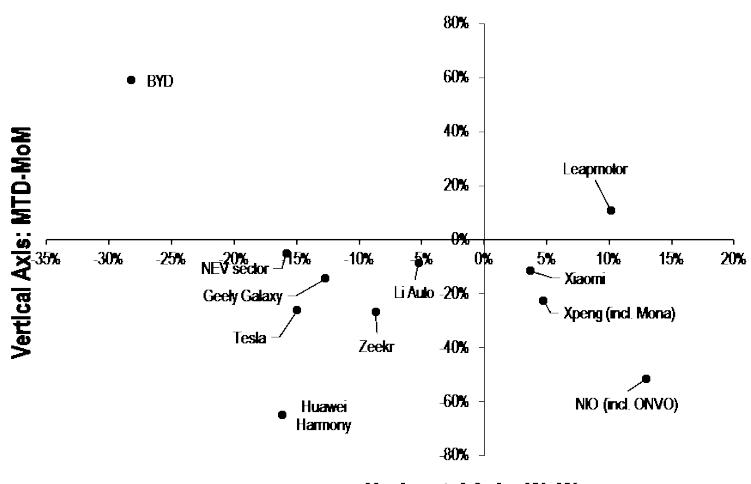

# 中国新能源汽车市场正呈现两种发展路径，其中一种更具可持续性

中国新能源汽车市场进入2026年7月后，呈现出明显的分化格局。根据某全球研究机构的经销商渠道数据，7月第二周整体订单环比下降16%，月初至今较6月下降5%。若这一订单趋势直接转化为零售销量，7月新能源车零售量约为95万辆，同比下降2.7%，七个月累计降幅扩大至12.4%。整体数据背后隐藏着更重要的信息：品牌间的差异显著扩大，优胜劣汰的格局并非随机。

关键洞察不在于需求整体走弱，而在于市场正在分化：一类品牌能在正常季节性周期中维持订单动能，另一类则依赖集中发布带来的短期高峰。第二周数据显示，比亚迪月初至今订单较6月增长59%，零跑增长11%，而其他跟踪品牌——理想、小米、吉利银河、小鹏、特斯拉、极氪——均出现9%至27%的下降。更为极端的是，华为鸿蒙和蔚来订单较6月月均分别下降65%和52%，这是6月初全新M9和ES9发布后订单高峰的直接后果。市场不再同步运行，而是分化为持续增长和依赖发布事件的波动两种模式。

这种分化需要战略层面的重新评估。对于研究者和企业规划者而言，问题不再是“新能源汽车市场是否在增长”，而是“哪种商业模式能在不依赖持续产品更新周期的情况下产生稳定的订单流”。7月前两周的数据为回答这一问题提供了实证基础。

## 比亚迪和零跑证明：订单稳定性而非发布热度才是竞争壁垒的真正衡量标准

7月跟踪数据中最引人注目的是比亚迪月初至今订单较6月周均增长59%。这并非单一重磅发布的结果。比亚迪的订单簿从6月开始稳步增长，周订单从第一周的47,700辆加速至第三周的106,800辆，最后一周回落至70,600辆。7月第一周86,500辆的读数已经强劲，第二周回落至62,100辆，若维持这一水平，意味着月零售量将远超6月表现。

这一模式的可防御性在于其广度。比亚迪的产品组合覆盖从入门级到高端的价格区间，包括纯电动和插电混动两种动力系统。公司不依赖单一明星车型来驱动周期性高峰，而是产生高基数的日常订单，波动在可控范围内。零跑以11%的月初至今增长，遵循类似的逻辑但规模较小：其订单连续四周保持在每周11,000辆以上，7月第二周达到15,200辆，为跟踪期内最高。

战略含义清晰。构建了多细分市场产品架构和有序生产规模的企业，能够吸收正常的周度波动，而不会陷入发布间“盛宴或饥荒”的循环。其竞争壁垒并非单一技术突破，而是一个可重复的需求生成系统。对于研究者而言，订单动能不应仅基于单周变化来评估，而应关注多周订单基线的稳定性。比亚迪和零跑通过了这一检验。市场中的其他品牌，除少数例外，未能做到。

## 依赖新车型高峰的品牌面临结构性增长天花板，营销投入无法克服

华为鸿蒙和蔚来代表了最极端的发布依赖案例，其7月数据暴露了这一模式的脆弱性。6月第一周，华为鸿蒙因全新M9发布录得24,200辆订单。到7月第二周，这一数字降至6,800辆，较峰值下降72%，较6月月均下降65%。蔚来的轨迹几乎相同：6月第一周28,000辆订单，7月第二周降至12,200辆，较峰值下降56%，较6月月均下降52%。

背后的机制并非需求问题。M9和ES9显然是受欢迎的产品。问题在于需求集中在发布事件周围的狭窄窗口。一旦初始订单积压被消化，周度运行率回落到一个低得多的水平，可能无法支撑这些公司已建立的固定成本结构。这一模式产生了逆向激励：为维持收入增长，管理层必须不断推出新车型或更新现有车型，每次承担产品开发、营销和渠道准备的全部成本，而收益在数周内消散。

其他依赖发布的品牌数据强化了这一结论。小米尽管拥有品牌影响力和汽车首秀的光环效应，月初至今订单较6月下降11%。极氪下降27%。特斯拉长期依赖定期降价和产品更新来刺激需求，录得26%的下降。吉利银河作为拥有多款新能源车型的品牌，下降14%。即使是理想汽车，被广泛视为管理较好的中国新能源汽车公司之一，也录得9%的下降。模式一致：当发布刺激消退时，订单回落到较低基线，且峰值与基线之间的差距可能随时间扩大，因为消费者注意力在日益增多的新车型中分散。

对于企业战略制定者而言，这一含义令人不安但无法回避。依赖发布的模式并非增长战略，而是一条“跑步机”。无法建立独立于产品周期的自维持订单引擎的公司，将面临营销成本上升、研发投入回报下降，以及最终在发布间低谷期被迫价格竞争导致的利润压缩。

## 7月数据为区分可持续与不可持续的新能源汽车商业模式提供了决策框架

7月上半月的周度订单数据可转化为评估任何新能源汽车制造商竞争地位的实用框架。该框架基于三个指标，每个指标直接来自数据中可观察的模式。

第一个指标是订单基线稳定性。计算给定月份最低周订单与最高周订单的比率。6月比亚迪的比率为0.45（47,700除以106,800）。零跑为0.77（11,500除以15,000）。华为鸿蒙为0.45（10,800除以24,200），但7月数据表明发布后真实比率远低于此。比率高于0.5表明品牌即使在非高峰周也能维持峰值需求的相当一部分。比率低于0.3则表明结构性依赖发布事件。

第二个指标是独立于发布的月度订单动能。比较7月前两周平均周订单与6月最后两周平均周订单，排除包含重大发布事件的任何一周。比亚迪7月前两周平均为74,300辆，而6月最后两周平均为88,700辆。16%的下降是可控的，可能具有季节性。华为鸿蒙的对应数据为7月7,450辆，6月最后两周11,250辆，下降34%，无法仅用季节性解释。在非发布期显示环比下降超过20%的品牌，可能面临结构性需求侵蚀。

第三个指标是订单波动性与盈利能力的相关性。订单波动性高的公司通常销售和营销成本占收入比例更高，因为它们在低谷期必须积极投入以重新刺激需求。它们还面临更高的库存风险，因为生产规划在发布驱动的激增和发布后的低谷之间成为猜测游戏。研究者应比较周订单变异系数与公司运营利润率。高变异系数加上低或负利润率，是商业模式无法自我修正的危险信号。

将这一框架应用于7月数据，得出清晰的排名。比亚迪和零跑是相对少见在所有三个指标上得分良好的跟踪品牌。理想、特斯拉和吉利银河处于中间层级：其订单基线相当稳定，但月度动能负面，盈利能力仍受价格竞争压力。华为鸿蒙、蔚来、小米、小鹏和极氪在基线稳定性和动能方面得分较低，其盈利能力挑战已有充分记录。该框架不预测哪些公司会生存，但能识别哪些公司拥有无需持续外部资本注入即可产生可持续现金流的商业模式。

## 市场的结构性转变对估值方法和风险评估有直接影响

订单模式的分化不仅是运营细节，对研究者如何评估新能源汽车公司以及贷款机构如何评估信用风险有直接影响。传统方法对所有新能源汽车制造商应用统一的市销率或市盈率倍数，假设其收入轨迹具有可比性。7月数据表明这一假设不再有效。

对于像比亚迪这样展示稳定订单流和多细分市场产品架构的公司，基于PEG的估值是合适的。该全球研究机构报告对比亚迪采用25%盈利复合年增长率下的1.2倍PEG，意味着市场应为可预测的增长支付溢价。逻辑合理：如果一家公司能证明其订单引擎在产品周期中产生可重复的结果，其未来盈利更可预测，更高的倍数也是合理的。

对于像赛力斯集团这样的公司——同一报告指出其估值低于历史平均水平——估值方法必须反映潜在的商业模式风险。报告明确对赛力斯采用市销率估值，因为其近期盈利能力已大幅恶化。这种恶化并非暂时现象，而是依赖发布模式的直接后果：发布期高收入，随后随着销量正常化和固定成本居高不下而利润压缩。

风险影响超出股权估值。向新能源汽车制造商提供贷款的机构应将订单波动性纳入其契约结构。一家公司周订单从峰值到低谷定期波动超过50%，承担更高的营运资金风险、更高的库存过时风险和更高的再融资风险。此类公司的资本成本应显著高于订单基线稳定的公司，无论其整体收入增长率如何。

对于持有依赖发布的新能源汽车公司头寸的研究者而言，7月数据应促使重新评估退出时机。整体行业第二周订单环比下降16%并非灾难性，但分化模式表明最弱的品牌将继续向较强的品牌失去份额。无法建立稳定订单基线的公司将面临复合劣势：订单减少导致产能利用率下降，进而导致单位成本上升，进而导致利润压缩或价格上涨，进一步减少订单。这一循环在没有商业模式根本性重组的情况下难以打破。

7月数据并未回答关于中国新能源汽车市场轨迹的所有问题。月初至今订单较6月下降5%可能在月下半月逆转，同比比较也受发布周期时间影响。但分化模式并不模糊。市场正在分化为两种路径：一种是持续、稳定的增长，另一种是偶发、依赖发布的波动。早期认识到这一转变的研究者和企业规划者，将能够将资源分配给已证明能在第一种路径中运营的公司，远离仍困在第二种路径中的公司。

*仅供参考。部分内容可能基于源材料通过AI辅助生成、翻译、总结或编辑，可能存在遗漏或错误。请独立核实。本文不构成专业建议。*

仅供参考。部分内容可能基于源材料通过AI辅助生成、翻译、总结或编辑，可能存在遗漏或错误。请独立核实。本文不构成专业建议。

