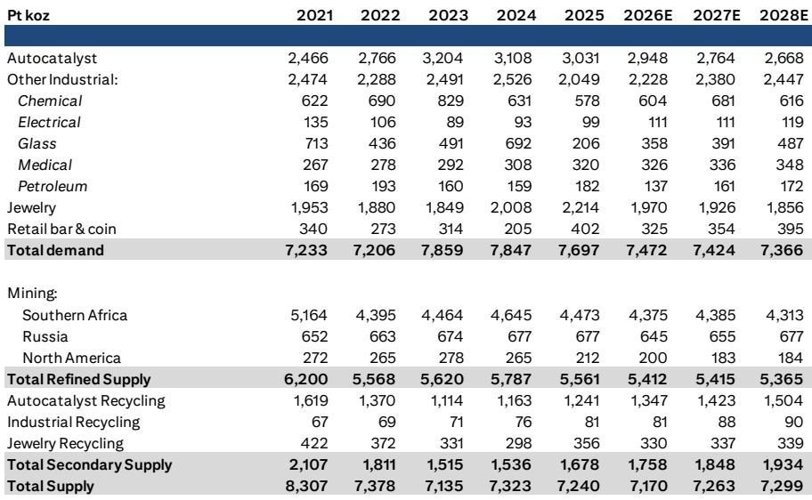
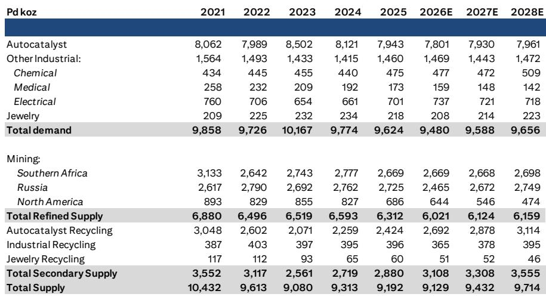
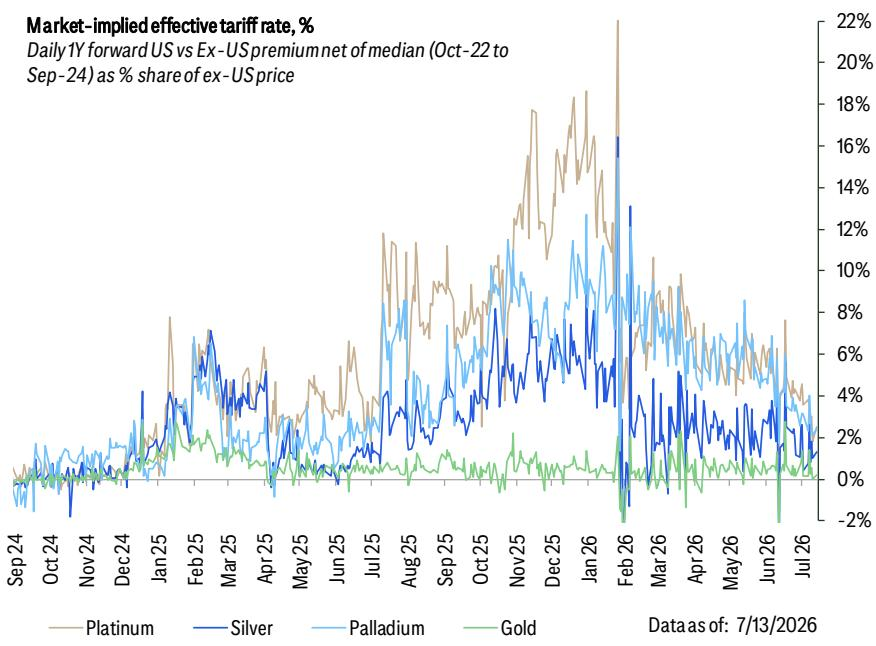

# Citi：金属专题-铂族金属更新-上海铂金周要点

铂金从2025年5月的每盎司不到1000美元，到2026年1月一度逼近2800美元，又在随后的几个月里跌回1600美元附近。Citi在最新一期上海铂金周后的报告中指出，驱动这轮行情的核心变量不是供需缺口，而是研究需求。当宏观环境收紧，ETF资金持续流出，铂族金属的涨幅便迅速回吐。

这份报告的价值在于，它把铂族金属的定价逻辑从“基本面叙事”拉回到“宏观与资金面框架”，并认为霍尔木兹海峡局势升级和美联储偏鹰仍是短期节奏变化不确定性。但报告的核心判断是：随着通胀不确定性缓解，美联储加息不确定性下降，研究需求有望回归，铂族金属价格将随之修复。

> **KC评论：** Citi的框架很清晰——铂族金属当前更像黄金的高贝塔版本，而不是独立商品。读者如果只看供需平衡表，可能会错过真正的定价驱动因素。

## 1. 中国珠宝和研究需求并未接住这轮涨势

上海铂金周期间，Citi与境内市场参与者交流后发现，中国铂金珠宝和研究需求整体偏弱。2025年牛市早期的触发因素之一是中国的珠宝补库，但终端消费并未跟上。原因有二：铂金珠宝相对黄金仍缺乏竞争力；珠宝需求本身正在被金条和金币研究所替代。

中国零售读者表现出明显的趋势跟随特征——上涨时买入，涨势停止后离场。Citi预计这一模式将持续：当前价格疲软，读者保持观望；一旦价格反弹，他们会重新入场。但这种后续买盘的力量可能弱于上一轮，因为不少读者在近期下跌后仍处于浮亏状态。

## 2. AI相关需求是亮点，但短期无法主导定价

在传统领域（如汽车催化剂）需求前景偏弱的背景下，AI相关需求被与会者视为一抹亮色。部分参与者对2030年前的需求展望相当乐观。但Citi认为，AI应用仍处于早期开发阶段，当前难以量化其实际需求规模。

报告预计，AI相关的化工、电子和玻璃行业对铂金的需求增长，将在今明两年部分抵消汽车催化剂领域的结构性下滑。但长期增长规模仍不清晰。Citi的判断是：AI需求主题可以吸引读者关注，并在应用成熟后转化为实际需求，但这是一个更长期的叙事。未来几个月，宏观和地缘政治因素仍将主导铂族金属的交易。

## 3. 资金面和实物面都在释放冷却信号

Citi报告中的几张图表提供了关键佐证。ETF持仓数据显示，2026年至今出现了大规模清算，直接压制了铂族金属价格。CFTC持仓数据也显示，产品已削减铂金多头头寸，并对钯金重新转为净空头。

实物市场方面，租赁利率正在正常化，表明现货市场紧张程度在缓解。NYMEX铂金库存显著下降，但原因并非需求强劲，而是关税不确定性降低后，市场不再需要囤积库存。EFP市场隐含的关税概率已大幅下降——Citi自2026年1月以来的基准假设一直是，美国不会对铂族金属征收S232关税。

这些信号叠加在一起，指向同一个结论：铂族金属的上涨驱动因素正在退潮，价格需要等待新的催化剂。

> **KC评论：** Citi的框架可以复用——当一种资产的价格驱动从“基本面”切换到“研究需求”时，跟踪ETF持仓和CFTC仓位比跟踪供需平衡表更有效。当前铂族金属的仓位和资金流都在降温，但这也意味着，一旦宏观条件改善，反弹的弹性可能同样很大。

---

For informational purposes only. Portions may be generated,translated,summarized,or edited with AI assistance based on source materials and may contain omissions or errors. Please verify independently. This is not investment,legal,tax,accounting,or other professional advice.

For informational purposes only. Portions may be generated,translated,summarized,or edited with AI assistance based on source materials and may contain omissions or errors. Please verify independently. This is not investment,legal,tax,accounting,or other professional advice.

