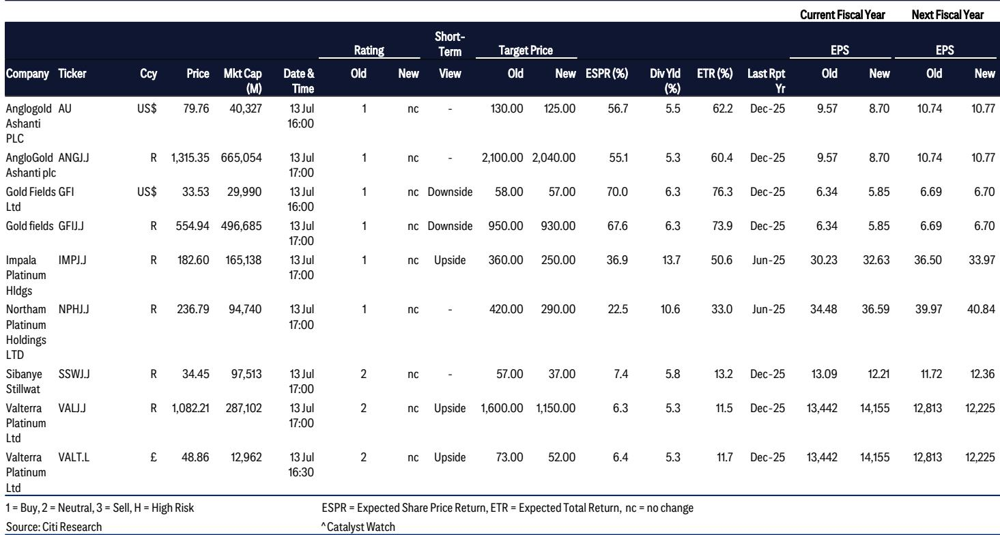
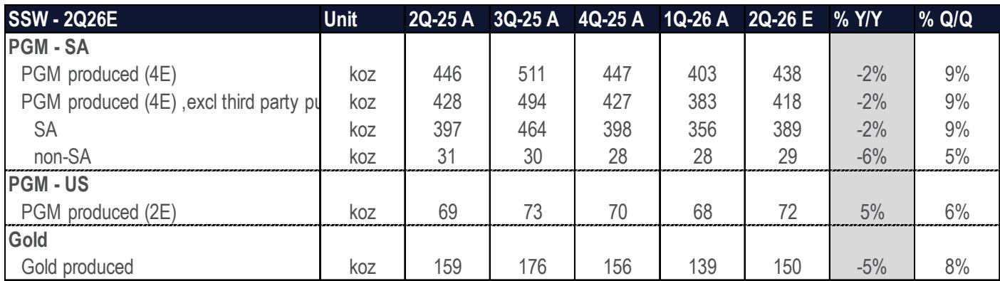
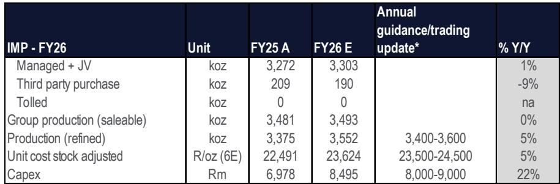

# 贵金属矿业公司面临战略十字路口：产量回升，但估值纪律比产量增长更重要

7月17日开始的贵金属矿业公司6月季度报告季，将显示产量从季节性疲弱的3月季度出现明显的环比回升，但市场的关注点已经转移。读者不再询问矿企能否生产更多，而是询问矿企能否以足够盈利的方式生产，以支撑当前的市场定价。在覆盖范围内包括AngloGold Ashanti、Gold Fields、Impala Platinum、Northam、Sibanye Stillwater和Valterra的研究报告中，产量正朝着全年指引目标迈进。原因是较低的商品价格假设和压缩的估值倍数正在重新计算这些公司的价值。

这种张力十分明显。AngloGold Ashanti和Gold Fields都面临近期黄金价格假设下调5%的情况，但由于市场愿意为铂族金属生产商支付的估值倍数已经下降，且倍数更低。这不是一个关于产量的行业故事。这是一个关于市场在“更低更久”的商品价格环境下，重新评估这些资产盈利能力的行业故事。报告季将确认产量数据，但读者面临的战略问题是，当前的价格水平是否已经反映了这种重新评估，还是进一步的压缩还在前方。

## 产量环比回升是真实的，但掩盖了黄金与铂族金属矿企之间更重要的分化

6月季度的产量数据将显示比3月季度有显著改善，3月季度通常是一年中最弱的时期，原因是南非夏季假期和计划性维护等季节性因素。Valterra的总产量预计环比增长10%，其中矿产产量增长16%，几乎完全由低基数效应驱动。Gold Fields的归属黄金产量预计为62.2万盎司，同比增长7%，得益于Salares Norte项目的爬坡和Gruyere矿山的完全合并（此前按50%权益核算）。这些是值得注意的运营改善，但基本在年度指引范围内，并不代表产能的阶梯式变化。

更重要的模式在于黄金矿企和铂族金属矿企之间的分化。黄金生产商的业绩表现与黄金价格预测和外汇假设相关，但这并未改变任何一家公司的基本研究逻辑。相比之下，铂族金属生产商的估值倍数从R420降至R290，下降31%。Sibanye的目标从R57降至R37，下调35%。这种幅度差异无法用产量表现来解释。Impala集团的可销售产量预计同比持平，约为349万盎司，处于指引区间上端，精炼产量预计增长5%。问题不在于这些公司产量减少，而在于市场对每单位铂族金属盈利赋予了根本性更低的倍数。

这种分化表明，黄金和铂族金属市场处于不同的估值体系。黄金矿企的估值基于价格预测和运营执行的增量变化。铂族金属矿企的估值基于对读者应为铂、钯、铑、钌、铱这一篮子金属敞口支付多少的结构性重新评估——这些金属的需求前景因内燃机转型而蒙上阴影，其供应动态正被南非运营调整所重塑。报告季将确认产量数据，但战略洞察在于，铂族金属矿企现在需要展示的不仅是运营稳定性，还有一条通往更高资本回报的可信路径，因为市场不再给予它们怀疑的余地。

## 成本通胀与库存管理是影响盈利惊喜的两个隐藏变量

报告指出了两个将在业绩电话会上受到读者不成比例关注的运营因素：成本表现，特别是原油价格上涨对采矿投入成本的影响；以及库存释放，尤其是在Impala和Northam。这些不是头条新闻话题，但它们有可能在报告产量和报告盈利之间造成显著差异。

原油价格直接影响露天采矿作业和南非铂族金属及黄金生产中高能耗加工设施的成本基础。报告指出，6月季度的成本数据将反映原油价格上涨的传导效应。对于Gold Fields，6月季度的全维持成本估计为每盎司1,844美元，与3月季度持平，但比去年同期高7%。对于Impala，按库存调整后的单位成本，2026财年预计为每盎司23,624兰特，在23,500至24,500兰特的指引区间内，但同比上涨5%。这些成本增加在当前黄金和铂族金属价格水平下是可控的，但它们收窄了安全边际。如果商品价格进一步走软而成本通胀持续，盈利影响将是非线性的。

库存释放是一个更公司特定但同样重要的变量。报告明确指出，Impala和Northam的库存释放是市场将关注的因素。对于Valterra，报告指出，6月季度的精炼产量预计将高于正常水平，因为公司计划在9月季度进行年度库存盘点和计划性维护，这将降低该季度的精炼产量。这意味着Valterra的6月季度精炼产量相对于基础产量运行率被人为抬高。如果读者在不调整库存时间效应的情况下向前推算6月季度数据，将高估Valterra的可持续精炼产量。同样的动态也适用于Impala，其精炼产量指引为340万至360万盎司，这意味着如果库存正在被消耗，6月半年的运行率可能高于可持续水平。战略要点是，报告产量和精炼产量不是一回事，库存时间可能造成运营势头的虚假信号。

## 铂族金属股票的倍数压缩并非市场异常，而是对长期风险理性重新定价的反映

报告中最引人注目的数值变化是对铂族金属生产商估值倍数的下调。Impala Platinum的估值倍数从7.0倍企业价值/EBITDA降至3.5倍。Northam的倍数从9.0倍降至5.0倍。Sibanye的倍数从3.6倍降至2.2倍。报告指出，这些倍数是合适的，因为每家公司在此前“更高更久”铂族金属价格时期都曾接近这些水平交易。这是一个关键的承认。这意味着分析师并非施加临时折扣，而是在规范化估值框架，以反映一个结构性环境：铂族金属价格保持高位，但市场拒绝为可能被证明是暂时的盈利支付溢价。

逻辑很直接。铂族金属需求高度依赖汽车催化转换器，而随着电动汽车普及加速，催化转换器面临长期结构性下滑。即使近期价格受到供应限制和库存补充的支撑，铂族金属资产的终值仍不确定。因此，读者要求更高的折现率或更低的入场倍数，以补偿当前盈利不可持续的风险。报告决定应用3.5倍或5.0倍的倍数，而不是对具有类似盈利的黄金矿企可能适用的7.0至9.0倍，是对这种长期风险的理性回应。这不是对下个季度产量的看空判断，而是对未来盈利流中多少是可信的结构性重新评估。

对于读者而言，这创造了一个清晰的框架。铂族金属股票在追溯或近期盈利上可能看起来便宜，但它们便宜是有原因的。倍数压缩反映了一个已经定价了较低终值的市场。问题是当前倍数是太低还是仍然太高。答案取决于铂族金属价格能否在现有水平维持而不引发需求破坏或替代，以及这些公司在维持性资本支出后能否在这些价格水平产生自由现金流。这种风险是存在的，但这并不意味着估值重估即将到来。倍数压缩可能已经完成，但扩张的催化剂尚未显现。

## 读者的决策框架：区分运营势头与估值体系

报告季提供了一个应用结构化决策框架的机会，该框架将季度产量的噪音与结构性估值变化的信号区分开来。该框架有三个层次。

第一，评估公司的产量轨迹是在指引范围内还是超出指引。对于像AngloGold Ashanti和Gold Fields这样的黄金矿企，产量在指引范围内，全年指引预计不会有实质性变化。这是一个中性信号。它确认了运营基准情况完好，但并未提供可能改变盈利轨迹的积极惊喜。对于铂族金属矿企，产量也在指引范围内，但Impala的同比持平以及Sibanye的温和回升并不表明存在产量驱动的盈利上调。运营故事是稳定，而非加速。

第二，评估成本轨迹相对于商品价格。Gold Fields的全维持成本为每盎司1,844美元，环比持平但同比上升，意味着利润率扩张完全取决于黄金价格上涨，而非成本改善。Impala的单位成本同比上涨5%，在指引区间内且暗示进一步的成本压力，表明利润率压缩已纳入近期展望。关键问题是商品价格假设是否稳定。对2026日历年的估计没有变化，2027年和2028年也没有进一步变化。如果黄金价格在当前水平稳定，安全边际是充足的。如果进一步下跌，盈利修正将是负面的。

第三，也是最重要的，确定估值倍数是否适合资产基础和商品周期。对于黄金矿企，倍数没有实质性调整，表明分析师认为当前估值在黄金价格展望下是合理的。对于铂族金属矿企，倍数已被削减约50%，报告明确指出这些较低的倍数与“更高更久”价格环境下的历史交易区间一致。这意味着铂族金属股票的估值风险现在更加对称。如果铂族金属价格意外上涨，股票可能重新定价。如果令人失望，下行空间受到已压缩倍数的限制。因此，决策框架指向一种杠铃式方法：黄金矿企提供运营可见性和适度的估值风险，而铂族金属矿企提供更高的风险回报不对称性，但需要确信商品周期不会进一步恶化。

## 报告季将确认指引，但不会解决估值争论

6月季度的产量数据将如预期报告：环比改善，在指引范围内，没有重大运营意外。Gold Fields将显示同比增长7%，由Salares Norte和Gruyere合并驱动。Impala将显示可销售产量持平，精炼产量增长5%。Sibanye将显示南非铂族金属和黄金产量环比温和回升，美国铂族金属产量也有所改善。Valterra将显示总产量环比增长10%，部分因库存时间而膨胀。这些结果都不会改变任何一家公司的基本研究逻辑。

重要的是围绕成本通胀、库存动态和商品价格展望的评论。报告已经表明，原油价格上涨带来的成本压力是一个因素，Impala和Northam的库存释放将受到审视，铂族金属生产商的估值倍数已被结构性重置。报告季将提供数据点，但它不会解决关于铂族金属股票当前估值体系是新常态还是读者情绪改善后将修正的临时折扣这一根本性争论。

对于严肃的读者而言，战略含义是明确的。基于商品价格将继续上涨的假设而为贵金属矿企支付溢价倍数的时代已经结束。市场现在要求现金流产生、成本纪律和资本配置审慎的证据。能够展示这些属性的公司将获得回报，但回报将以盈利增长的形式出现，而非倍数扩张。无法做到的公司将看到其股票无论产量如何都保持区间波动。报告季将确认谁在正轨上。估值争论将在数据发布后长期持续。

*仅供参考。部分内容可能基于源材料通过AI辅助生成、翻译、总结或编辑，可能存在遗漏或错误。请独立核实。本文不构成专业建议。*

仅供参考。部分内容可能基于源材料通过AI辅助生成、翻译、总结或编辑，可能存在遗漏或错误。请独立核实。本文不构成专业建议。

