# Estun (002747.SZ)

2Q26 Preliminary Earnings Could Grow by 9.8x-14.8x YoY to Rmb52mn-82mn from a Low Base

## CITI'S TAKE

Estun released its 1H26 preliminary results today (14 July), indicating that net profit could reach Rmb150mn-180mn, up 21x-26x YoY from a very low base of Rmb7mn in 1H25. This implies that Estun's 2Q26 net income could increase by 9.8x to 14.8x YoY to Rmb52mn-82mn, significantly higher than Bloomberg consensus of Rmb37mn and CitiE of Rmb26mn, which we believe was due more to its cost reduction efforts (e.g., procuring reducers from low-cost suppliers and disciplining OPEX) than to the industrial robot demand improvement. Although 2Q26/1H26 results beat, we are concerned about earnings growth momentum since ~60% of 1H26 net profit, or Rmb98 on average, was from one-off items, mainly the revaluation gains on Nanjing Yigong. Plus that its share price has risen by ~60% YTD and is trading at ~160x 2026E P/E and 16.9x 2026E P/B; we keep our Sell rating on Estun.

Implications — While we don't rule out the possibility that the share price could react positively to the better-than-expected 2Q26/1H26 results, we remain cautious on Estun as we are worried that its earnings growth momentum may not be sustainable to support its rich valuation, in terms of both P/E and P/B (see Estun (002747.SZ) - Fundamentals Improve But Share Price Seems Overshooting; Maintain Sell). In the China factory automation and equipment space, AI-related names are still our top picks: Han's Laser (002008.SZ, Apple and AI PCB equipment) > Han's CNC-H (3200.HK, AI PCB equipment) > Hongfa Technology (600885.SS, AIDC relay) > SUPCON (688777.SS, Industrial AI)

<table><tr><td colspan="2">Sell</td></tr><tr><td>Price (14 Jul 26 15:00)</td><td>Rmb38.400</td></tr><tr><td>Target price</td><td>Rmb28.000</td></tr><tr><td>Expected share price return</td><td>-27.1%</td></tr><tr><td>Expected dividend yield</td><td>0.0%</td></tr><tr><td>Expected total return</td><td>-27.1%</td></tr><tr><td>Market Cap</td><td>Rmb33,447MUS$4,941M</td></tr></table>

<table><tr><td>Year to 31 Dec</td><td>Net Profit (RmbM)</td><td>Diluted EPS (Rmb)</td><td>EPS growth (%)</td><td>P/E (x)</td><td>P/B (x)</td><td>ROE (%)</td><td>Yield (%)</td></tr><tr><td>2024A</td><td>-810</td><td>-0.930</td><td>na</td><td>na</td><td>18.7</td><td>-36.1</td><td>na</td></tr><tr><td>2025A</td><td>45</td><td>0.050</td><td>105.4</td><td>na</td><td>17.1</td><td>2.4</td><td>na</td></tr><tr><td>2026E</td><td>233</td><td>0.241</td><td>382.5</td><td>159.2</td><td>16.9</td><td>11.2</td><td>na</td></tr><tr><td>2027E</td><td>273</td><td>0.282</td><td>16.7</td><td>136.4</td><td>15.1</td><td>11.7</td><td>na</td></tr><tr><td>2028E</td><td>345</td><td>0.357</td><td>26.8</td><td>107.6</td><td>13.2</td><td>13.1</td><td>na</td></tr></table>

Source: Powered by dataCentral

Eric Lau
+852-2501-2726
eric.h.lau@citi.com

## Earnings Summary

Jamie Wang $^{AC}$ +852-2501-2772
jamie.ck.wang@citi.com

See Appendix A-1 for Analyst Certification, Important Disclosures and Research Analyst Affiliations

Figure 1. Estun: 2Q26/1H26 preliminary results snapshot

<table><tr><td rowspan="2">(Rmb mn)</td><td rowspan="2">1H25</td><td colspan="3">1H26P</td><td rowspan="2">2Q25</td><td rowspan="2">1Q26</td><td colspan="3">2Q26P</td></tr><tr><td>Lower bound</td><td>Mid point</td><td>Upper bound</td><td>Lower bound</td><td>Mid point</td><td>Upper bound</td></tr><tr><td>P&L</td><td></td><td></td><td></td><td></td><td></td><td></td><td></td><td></td><td></td></tr><tr><td>Net profit</td><td>7</td><td>150</td><td>165</td><td>180</td><td>(6)</td><td>98</td><td>52</td><td>67</td><td>82</td></tr><tr><td>Recurring profit</td><td>(18)</td><td>60</td><td>68</td><td>75</td><td>(22)</td><td>19</td><td>41</td><td>48</td><td>56</td></tr><tr><td>YoY</td><td></td><td></td><td></td><td></td><td></td><td></td><td></td><td></td><td></td></tr><tr><td>Net profit</td><td>109%</td><td>2146%</td><td>2370%</td><td>2595%</td><td>93%</td><td>675%</td><td>977%</td><td>1229%</td><td>1481%</td></tr><tr><td>Recurring profit</td><td>82%</td><td>441%</td><td>484%</td><td>526%</td><td>74%</td><td>364%</td><td>287%</td><td>321%</td><td>356%</td></tr></table>

© 2026 Citi Inc. No redistribution without Citi's written permission.  
Source: Citi, Company Reports

## Bull/Bear: Estun

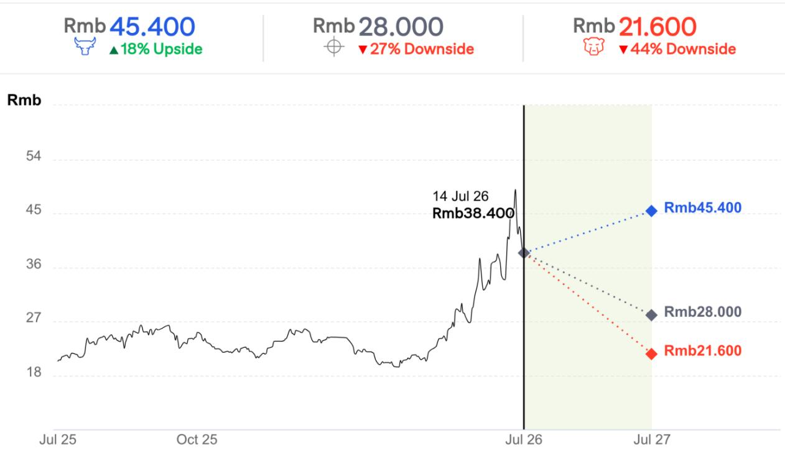  
Spread 62pp
Current Price and expected returns (upside/downside) as of 14 Jul 2026

## BULL Assumptions

- Rerated to 20.0x P/B due to better-than-expected Estun & CLOOS shipment

## BASE Assumptions

- Valued at 12.3x 2026E P/B

## BEAR Assumptions

- Worse-than-expected Estun & CLOOS shipment

## Estun

## Valuation

We use P/B as our valuation methodology due to Estun's fluctuating earnings. Our target price of Rmb28.0 is based on 12.3x 2026E P/B, set at 2.0 SD above average to reflect Estun's improving fundamentals.

## Risks

Key upside risks that could cause Estun shares to trade above our target price include: 1) stronger-than-expected industrial robot shipments or market share gains; 2) better-than-expected GPM due to lower raw material costs or alleviated price competition; and 3) favorable FX.

## Han's CNC Technology

(3200.HK; HK\$126.9; 1; 14 Jul 26; 16:10)

## Valuation

Our target price of HK\$325 is based on ~51x 2027E P/E, set at 25% discount to its A-share's valuation. We believe that our target multiple is not aggressive given a ~81% earnings CAGR for 2026E-27E.

## Risks

Potential downside risks that could impede the shares from reaching our target price include: 1) weaker-than-expected AI PCB equipment demand, 2) worse-than-expected GPM due to rising component costs, and 3) intensifying price competition due to the industry's equipment supply increase.

## Han's Laser Technology

(002008.SZ; Rmb119.5; 1; 14 Jul 26; 15:00)

## Valuation

Our 12-month target price for Han's Laser of Rmb177.0 is based on 55x 2027E P/E, set at the previous peak P/E in 2018 to reflect its "super cycle" led by stronger demand for PCB and IT (Apple) equipment.

## Risks

Key fundamental downside risks that could prevent the shares from reaching our target price include: 1) fewer-than-expected Apple orders; 2) fiercer competition, which could pressure margins; 3) any weakening of auto sales, which would hurt high-power laser equipment demand; 4) failure of any of the new investment projects; and 5) newly emerging technologies substituting laser equipment.

## Hongfa Technology

(600885.SS; Rmb34.15; 1; 14 Jul 26; 15:00)

## Valuation

Our 12-month target price of Rmb43.0 is based on ~32x 2026E P/E, set at +1.0x SD to reflect Hongfa's faster earnings growth driven by strong demand and ASP hikes, despite GPM pressure.

## Risks

Key downside risks include: 1) weaker relay demand especially from NEV and auto sectors; 2) worse-than-expected GPM pressure; and 3) intensifying competition particularly from home appliance segement.

## SUPCON Technology

(688777.SS; Rmb98.24; 1; 14 Jul 26; 15:00)

## Valuation

Our TP of Rmb99.0 is based on SOTP methodology. We assign ~60x P/E (avg.) to the value of SUPCON's business as a whole and add an incremental market cap to value SUPCON's fast-growing industrial AI revenue at 60x 2026 P/S, set at the difference of P/S between SUPCON and Chinese pure AI model companies such as MiniMax (100.HK), Knowledge Atlas (2513.HK), Deepexi (1384.HK), and Xunce (3317.HK)

## Risks

Downside risks that could prevent the stock from reaching our target price include 1) weaker-than-expected industrial AI revenue growth, 2) worse industrial AI monetization, and 3) worse-than-expected GPM contraction due to unfavorable product mix changes.

<table><tr><td>Date1 18-Feb-24 16:00:08</td><td>Rating*1</td><td>Target Price*50.00</td><td>Closing Price40.14</td></tr><tr><td>2 06-Apr-25 18:46:58</td><td>*3</td><td>*46.00</td><td>52.38</td></tr></table>

If you are visually impaired and would like to speak to a Citi representative regarding the details of the graphics in this document, please call USA 1-888-500-5008 (TTY: 711), from outside the US +1-210-677-3788

## Appendix A-1

## ANALYST CERTIFICATION

The research analysts primarily responsible for the preparation and content of this research report are either (i) designated by "AC" in the author block or (ii) listed in bold alongside content which is attributable to that analyst. If multiple AC analysts are designated in the author block, each analyst is certifying with respect to the entire research report other than (a) content attributable to another AC certifying analyst listed in bold alongside the content and (b) views expressed solely with respect to a specific issuer which are attributable to another AC certifying analyst identified in the price charts or rating history tables for that issuer shown below. Each of these analysts certify, with respect to the sections of the report for which they are responsible: (1) that the views expressed therein accurately reflect their personal views about each issuer and security referenced and were prepared in an independent manner, including with respect to Citi Global Markets Inc. and its affiliates; and (2) no part of the research analyst's compensation was, is, or will be, directly or indirectly, related to the specific recommendations or views expressed by that research analyst in this report.

## IMPORTANT DISCLOSURES

Hongfa Technology (600885.SS)
Ratings and Target Price History
Fundamental Research

Analyst: Jamie Wang

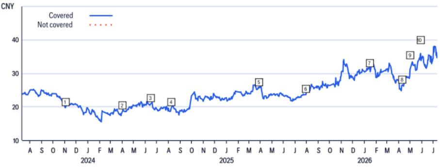

<table><tr><td></td><td>Date</td><td>Rating</td><td>Target Price</td><td>Closing Price</td></tr><tr><td>1</td><td>02-Nov-23 10:35:31</td><td>1</td><td>*25.71</td><td>19.72</td></tr><tr><td>2</td><td>01-Apr-24 06:20:14</td><td>1</td><td>*25.00</td><td>18.68</td></tr><tr><td>3</td><td>14-Jun-24 11:56:27</td><td>1</td><td>*23.86</td><td>20.86</td></tr><tr><td>4</td><td>08-Aug-24 13:47:41</td><td>1</td><td>*24.29</td><td>19.69</td></tr></table>

*Indicates Change

<table><tr><td></td><td>Date</td><td>Rating</td><td>Target Price</td><td>Closing Price</td></tr><tr><td>5</td><td>28-Mar-25 14:38:49</td><td>1</td><td>*30.00</td><td>25.68</td></tr><tr><td>6</td><td>29-Jul-25 12:10:44</td><td>1</td><td>*30.00</td><td>23.61</td></tr><tr><td>7</td><td>14-Jan-26 05:18:38</td><td>*2</td><td>*33.00</td><td>31.39</td></tr><tr><td>8</td><td>09-Apr-26 10:50:44</td><td>2</td><td>*28.00</td><td>26.47</td></tr></table>

<table><tr><td></td><td>Date</td><td>Rating</td><td>Target Price</td><td>Closing Price</td></tr><tr><td>9</td><td>04-May-26 08:17:57</td><td>*1</td><td>*38.00</td><td>31.14</td></tr><tr><td>10</td><td>27-May-26 13:09:01</td><td>1</td><td>*43.00</td><td>35.61</td></tr></table>

Rating/target price changes above reflect Eastern Time

## SUPCON Technology (688777.SS)

Ratings and Target Price History
Fundamental Research

Analyst: Jamie Wang

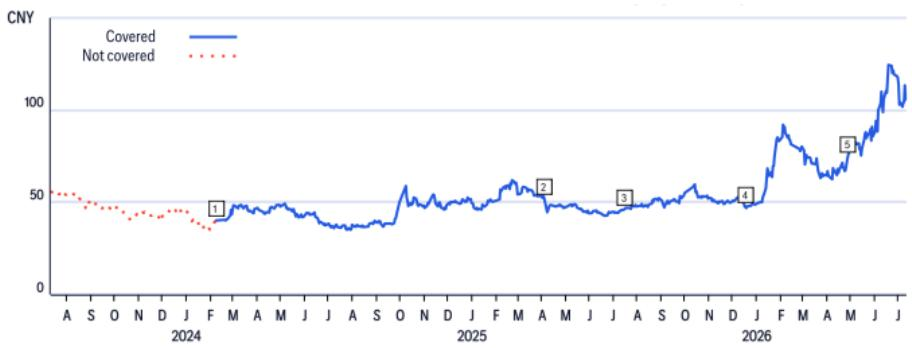  
*Indicates Change  
Rating/target price changes above reflect Eastern Time

Ratings and Target Price History
Fundamental Research

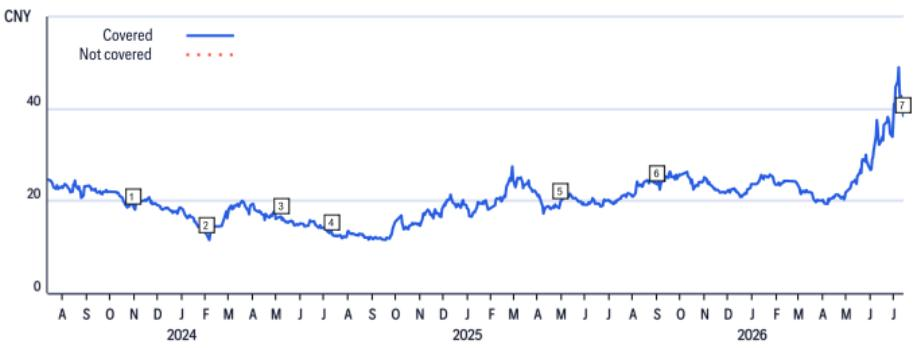

<table><tr><td></td><td>Date</td><td>Rating</td><td>Target Price</td><td>Closing Price</td></tr><tr><td>1</td><td>31-Oct-23 15:07:48</td><td>1</td><td>*29.00</td><td>18.80</td></tr><tr><td>2</td><td>02-Feb-24 02:20:39</td><td>1</td><td>*16.00</td><td>12.63</td></tr><tr><td>3</td><td>07-May-24 03:17:15</td><td>*3</td><td>*14.00</td><td>16.59</td></tr></table>

*Indicates Change

<table><tr><td></td><td>Date</td><td>Rating</td><td>Target Price</td><td>Closing Price</td></tr><tr><td>4</td><td>11-Jul-24 13:42:47</td><td>3</td><td>*10.60</td><td>13.10</td></tr><tr><td>5</td><td>04-May-25 18:27:04</td><td>3</td><td>*13.60</td><td>20.00</td></tr><tr><td>6</td><td>01-Sep-25 19:52:14</td><td>3</td><td>*13.80</td><td>23.63</td></tr></table>

<table><tr><td>Date</td><td>Rating</td><td>Target Price</td><td>Closing Price</td></tr><tr><td>13-Jul-26 05:08:34</td><td>3</td><td>*28.00</td><td>38.50</td></tr></table>

Rating/target price changes above reflect Eastern Time

## Han's CNC Technology (3200.HK)

Ratings and Target Price History
Fundamental Research

Analyst: Jamie Wang

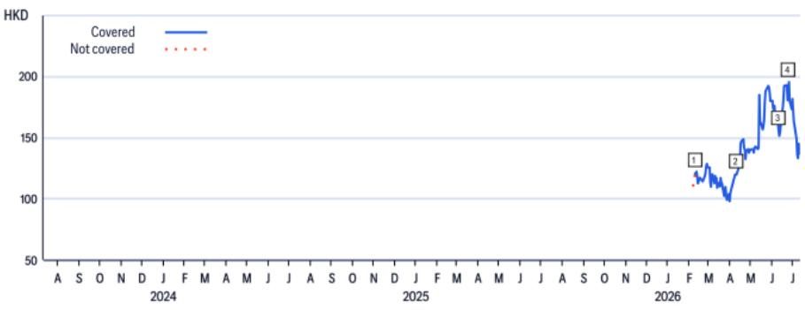

<table><tr><td>Date109-Feb-26 03:30:27</td><td>Rating*1</td><td>Target Price*142.00</td><td>Closing Price120.80</td></tr><tr><td>210-Apr-26 12:18:38</td><td>1</td><td>*160.00</td><td>119.80</td></tr></table>

*Indicates Change  
Rating/target price changes above reflect Eastern Time

## Han's Laser Technology (002008.SZ)

Ratings and Target Price History
Fundamental Research

Analyst: Jamie Wang

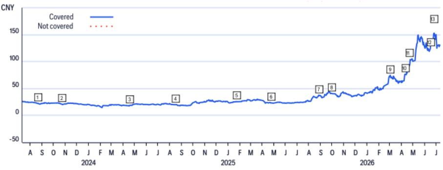

<table><tr><td></td><td>Date</td><td>Rating</td><td>Target Price</td><td>Closing Price</td></tr><tr><td>1</td><td>22-Aug-23 02:00:19</td><td>1</td><td>*28.00</td><td>22.53</td></tr><tr><td>2</td><td>23-Oct-23 15:54:01</td><td>1</td><td>*25.00</td><td>21.11</td></tr><tr><td>3</td><td>18-Apr-24 13:03:24</td><td>1</td><td>*23.00</td><td>18.95</td></tr><tr><td>4</td><td>16-Aug-24 03:59:06</td><td>1</td><td>*24.00</td><td>20.12</td></tr><tr><td>5</td><td>26-Jan-25 11:17:15</td><td>1</td><td>*31.00</td><td>25.75</td></tr></table>

*Indicates Change

<table><tr><td></td><td>Date</td><td>Rating</td><td>Target Price</td><td>Closing Price</td></tr><tr><td>6</td><td>25-Apr-25 13:05:16</td><td>1</td><td>*28.00</td><td>23.44</td></tr><tr><td>7</td><td>28-Aug-25 00:11:15</td><td>1</td><td>*45.00</td><td>37.19</td></tr><tr><td>8</td><td>30-Sep-25 09:43:36</td><td>1</td><td>*54.00</td><td>40.71</td></tr><tr><td>9</td><td>02-Mar-26 09:47:27</td><td>1</td><td>*89.00</td><td>74.62</td></tr><tr><td>10</td><td>10-Apr-26 12:18:38</td><td>1</td><td>*99.00</td><td>76.55</td></tr></table>

<table><tr><td></td><td>Date</td><td>Rating</td><td>Target Price</td><td>Closing Price</td></tr><tr><td>11</td><td>20-Apr-26 13:52:14</td><td>1</td><td>*103.00</td><td>89.18</td></tr><tr><td>12</td><td>15-Jun-26 22:58:34</td><td>1</td><td>*155.00</td><td>124.20</td></tr><tr><td>13</td><td>24-Jun-26 11:21:29</td><td>1</td><td>*177.00</td><td>152.23</td></tr></table>

Rating/target price changes above reflect Eastern Time

Estun (002747.SZ)
Short-Term View/Catalyst Watch Research  
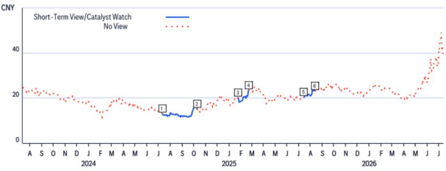

<table><tr><td></td><td>Date</td><td>Action</td><td>Expected Direction</td><td>Duration</td><td>Closing Price</td></tr><tr><td>1</td><td>11-Jul-24 09:42:47</td><td>Add STV</td><td>Downside</td><td>90 Days</td><td>13.10</td></tr><tr><td>2</td><td>09-Oct-24 23:26:15</td><td>Remove STV</td><td>Downside</td><td>90 Days</td><td>15.18</td></tr></table>

CW - Catalyst Watch, STV - Short-Term View

<table><tr><td>Date</td><td>Action</td><td>ExpectedDirection</td><td>Duration</td><td>ClosingPrice</td></tr><tr><td>3 24-Jan-25 02:16:06</td><td>Add STV</td><td>Downside</td><td>30 Days</td><td>20.17</td></tr><tr><td>4 23-Feb-25 21:14:39</td><td>Remove STV</td><td>Downside</td><td>30 Days</td><td>23.54</td></tr></table>

<table><tr><td></td><td>Date</td><td>Action</td><td>ExpectedDirection</td><td>Duration</td><td>ClosingPrice</td></tr><tr><td>5</td><td>14-Jul-25 08:31:16</td><td>Add STV</td><td>Downside</td><td>30 Days</td><td>20.39</td></tr><tr><td>6</td><td>13-Aug-25 23:05:37</td><td>Remove STV</td><td>Downside</td><td>30 Days</td><td>23.17</td></tr></table>

Rating/target price changes above reflect Eastern Time

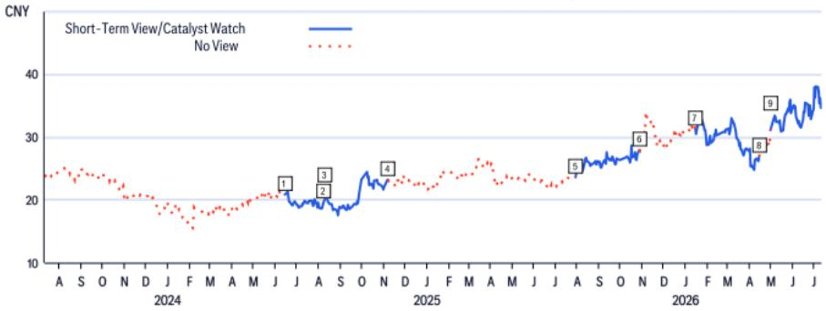

<table><tr><td></td><td>Date</td><td>Action</td><td>Expected Direction</td><td>Duration</td><td>Closing Price</td></tr><tr><td>1</td><td>14-Jun-24 21:57:45</td><td>Add CW</td><td>Downside</td><td>90 Days</td><td>20.86</td></tr><tr><td>2</td><td>08-Aug-24 09:47:41</td><td>Remove CW</td><td>Downside</td><td>90 Days</td><td>19.69</td></tr><tr><td>3</td><td>08-Aug-24 09:47:41</td><td>Add STV</td><td>Upside</td><td>90 Days</td><td>19.69</td></tr></table>

CW - Catalyst Watch, STV - Short-Term View

<table><tr><td></td><td>Date</td><td>Action</td><td>Expected Direction</td><td>Duration</td><td>Closing Price</td></tr><tr><td>4</td><td>06-Nov-24 21:28:12</td><td>Remove STV</td><td>Upside</td><td>90 Days</td><td>23.21</td></tr><tr><td>5</td><td>29-Jul-25 08:10:44</td><td>Add STV</td><td>Upside</td><td>90 Days</td><td>23.61</td></tr><tr><td>6</td><td>27-Oct-25 23:20:09</td><td>Remove STV</td><td>Upside</td><td>90 Days</td><td>27.96</td></tr></table>

<table><tr><td></td><td>Date</td><td>Action</td><td>Expected Direction</td><td>Duration</td><td>Closing Price</td></tr><tr><td>7</td><td>14-Jan-26 00:18:38</td><td>Add CW</td><td>Downside</td><td>90 Days</td><td>31.39</td></tr><tr><td>8</td><td>14-Apr-26 23:05:00</td><td>Remove CW</td><td>Downside</td><td>90 Days</td><td>26.90</td></tr><tr><td>9</td><td>04-May-26 04:17:57</td><td>Add STV</td><td>Upside</td><td>90 Days</td><td>31.14</td></tr></table>

Rating/target price changes above reflect Eastern Time

Han's Laser Technology (002008.SZ)
Short-Term View/Catalyst Watch Research  
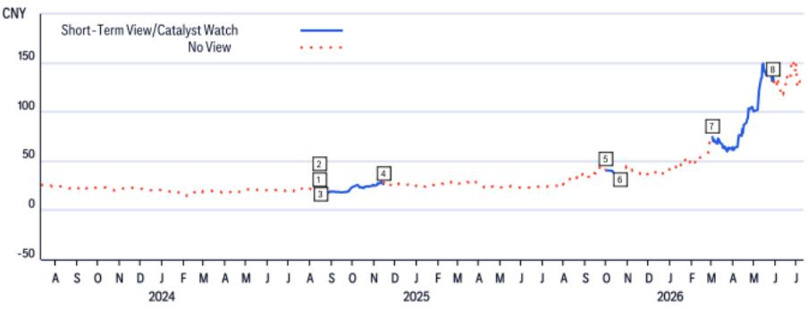

<table><tr><td></td><td>Date</td><td>Action</td><td>ExpectedDirection</td><td>Duration</td><td>ClosingPrice</td></tr><tr><td>1</td><td>14-Aug-24 08:42:14</td><td>Add STV</td><td>Upside</td><td>30 Days</td><td>20.03</td></tr><tr><td>2</td><td>15-Aug-24 23:59:06</td><td>Remove STV</td><td>Upside</td><td>30 Days</td><td>20.19</td></tr><tr><td>3</td><td>15-Aug-24 23:59:06</td><td>Add CW</td><td>Upside</td><td>90 Days</td><td>20.19</td></tr></table>

CW - Catalyst Watch, STV - Short-Term View

<table><tr><td></td><td>Date</td><td>Action</td><td>ExpectedDirection</td><td>Duration</td><td>ClosingPrice</td></tr><tr><td>7</td><td>02-Mar-26 04:47:27</td><td>Add STV</td><td>Upside</td><td>90 Days</td><td>74.62</td></tr><tr><td>8</td><td>31-May-26 23:01:52</td><td>Remove STV</td><td>Upside</td><td>90 Days</td><td>131.85</td></tr></table>

Rating/target price changes above reflect Eastern Time

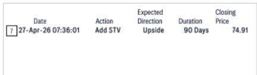

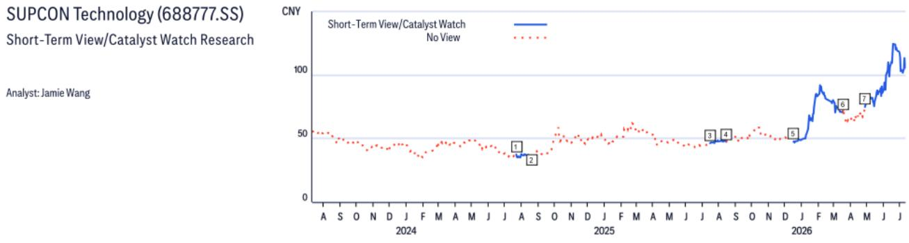

<table><tr><td colspan="2">Date</td><td>Action</td><td>Expected Direction</td><td>Duration</td><td>Closing Price</td></tr><tr><td>1</td><td>22-Jul-24 00:56:02</td><td>Add CW</td><td>Downside</td><td>30 Days</td><td>37.47</td></tr><tr><td>2</td><td>19-Aug-24 06:30:41</td><td>Remove CW</td><td>Downside</td><td>30 Days</td><td>36.75</td></tr><tr><td>3</td><td>15-Jul-25 05:29:44</td><td>Add CW</td><td>Downside</td><td>30 Days</td><td>46.39</td></tr></table>

CW - Catalyst Watch, STV - Short-Term View  
Rating/target price changes above reflect Eastern Time

Citi Global Markets Inc. or its affiliates received compensation for products and services other than investment banking services from Estun, Han's Laser Technology, SUPCON Technology in the past 12 months.

Citi Global Markets Inc. or its affiliates currently has, or had within the past 12 months, the following as clients, and the services provided were non-investment-banking, securities-related: Han's Laser Technology, SUPCON Technology.

Citi Global Markets Inc. or its affiliates currently has, or had within the past 12 months, the following as clients, and the services provided were non-investment-banking, non-securities-related: Estun, Han's Laser Technology, SUPCON Technology.

Analysts' compensation is determined by Citi management and Citi's senior management and is based upon activities and services intended to benefit the investor clients of Citi Global Markets Inc. and its affiliates (the "Firm").
Compensation is not linked to specific transactions or recommendations. Like all Firm employees, analysts receive compensation that is impacted by overall Firm profitability which includes investment banking, sales and trading, and principal trading revenues. One factor in equity research analyst compensation is arranging corporate access events between institutional clients and the management teams of covered companies. Typically, company management is more likely to participate when the analyst has a positive view of the company.

For financial instruments recommended in the Product in which the Firm is not a market maker, the Firm is a liquidity provider in such financial instruments (and any underlying instruments) and may act as principal in connection with transactions in such instruments. The Firm is a regular issuer of traded financial instruments linked to securities that may have been recommended in the Product. The Firm regularly trades in the securities of the issuer(s) discussed in the Product. The Firm may engage in securities transactions in a manner inconsistent with the Product and, with respect to securities covered by the Product, will buy or sell from customers on a principal basis.

Unless stated otherwise neither the Research Analyst nor any member of their team has viewed the material operations of the Companies for which an investment view has been provided within the past 12 months.

For important disclosures (including copies of historical disclosures) regarding the companies that are the subject of this Citi product ("the Product"), please contact Citi, 388 Greenwich Street, 6th Floor, New York, NY, 10013, Attention: Legal/Compliance [E6WYB6412478]. In addition, the same important disclosures, with the exception of the Valuation and Risk assessments and historical disclosures, are contained on the Firm's disclosure website at

https://www.citivelocity.com/cvr/eppublic/citi\_research\_disclosures. Valuation and Risk assessments can be found in the text of the most recent research note/report regarding the subject company. Pursuant to the Market Abuse Regulation a history of all Citi recommendations published during the preceding 12-month period can be accessed via Citi Velocity (https://www.citivelocity.com/cv2) or your standard distribution portal. Historical disclosures (for up to the past three years) will be provided upon request.

<table><tr><td colspan="7">Citi Equity Ratings Distribution</td></tr><tr><td></td><td colspan="3">12 Month Rating</td><td colspan="3">Catalyst Watch</td></tr><tr><td>Data current as of 01 Jul 2026</td><td>Buy</td><td>Hold</td><td>Sell</td><td>Buy</td><td>Hold</td><td>Sell</td></tr><tr><td>Citi Global Fundamental Coverage (Neutral=Hold)</td><td>61%</td><td>32%</td><td>7%</td><td>36%</td><td>48%</td><td>16%</td></tr><tr><td>% of companies
