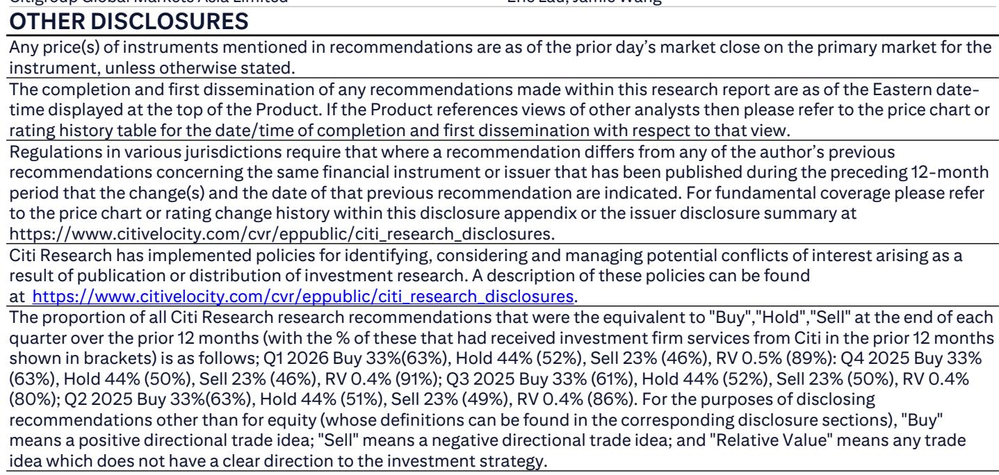
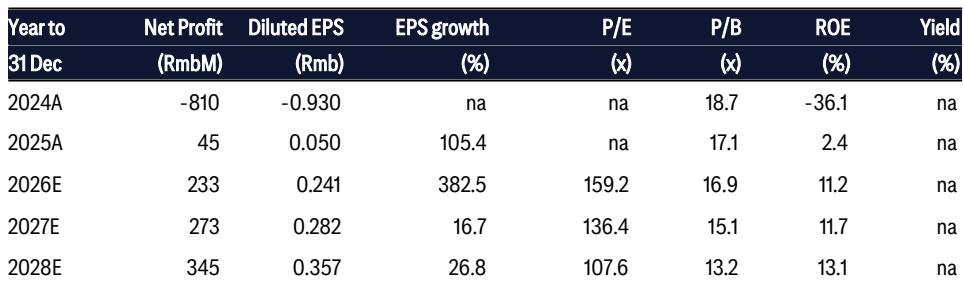
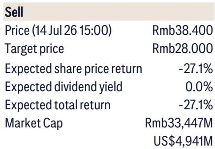

# Citi：埃斯顿2Q26初步盈利同比增9.8-14.8倍至5200-8200

这份来自Citi的研报，关注的是一家中国工业机器人公司——埃斯顿（Estun）刚刚发布的2026年上半年业绩预告。表面数字非常亮眼：上半年净利润预计同比增长21倍至26倍，第二季度单季净利润同比增长9.8倍至14.8倍，大幅超出市场一致预期和Citi自己的预测。

但Citi分析师在报告里做了一个关键拆解：上半年约60%的净利润来自一次性项目，主要是对南京一工的重新估值收益。剔除这部分后，经常性利润的增速要温和得多——上半年同比增长约4.4倍至5.3倍，第二季度同比增长约2.9倍至3.6倍。Citi认为，利润改善更多来自成本控制（比如从低成本供应商采购减速器、控制运营开支），而非工业机器人需求的实质性回升。

## 1. 利润增长的驱动力是降本，不是行业需求回暖

市场容易把这份业绩预告解读为工业机器人行业景气度反转的信号。但Citi的分析指向另一个方向：利润改善的核心是公司自己在做减法。

报告提到，埃斯顿的利润改善主要来自两个动作：一是将减速器采购转向低成本供应商，二是严格管控运营开支。这两项都属于内部管理优化，不依赖下游需求扩张。换句话说，如果工业机器人整体需求没有明显回升，这种利润改善的可持续性存疑。

> **KC评论：** Citi在报告里做了一个很清晰的对比——上半年净利润中位数1.65亿元，但经常性利润中位数只有0.68亿元。这0.68亿元才是公司主营业务真正赚到的钱。读者如果只看净利润增速，容易高估公司内生盈利能力。

## 2. 高估值与盈利可持续性之间存在明显张力

Citi在报告中给出了一个估值参照：埃斯顿当前报价对应2026年预期市盈率约160倍，市净率约16.9倍。对于一个2024年还在亏损、2025年净利润仅4500万元的公司来说，这个估值水平隐含了相当高的增长预期。

Citi的担忧在于，一旦市场意识到利润增长主要来自一次性收益和成本削减，而非收入端的持续扩张，估值支撑就会松动。报告特别指出，埃斯顿报价年初至今已上涨约60%，较当前水平有明显差距。

## 3. Citi在工业自动化领域的偏好：AI相关设备商

这份报告虽然主要讨论埃斯顿，但Citi在末尾给出了一个明确的排序：在工业自动化和设备领域，AI相关公司仍是首选。具体排序为：大族激光（苹果和AI PCB设备）优于创世纪（AI PCB设备），优于宏发股份（AIDC继电器），优于中控技术（工业AI）。

这个排序传递了两个信息：一是Citi认为AI对工业设备的需求拉动是当前最确定的增长主线，二是传统工业机器人公司如果没有AI相关业务支撑，估值可能面临不确定性。

## 4. 对产业观察者的启示：区分“公司变好”和“行业变好”

这份报告提供了一个很实用的分析框架：当一家公司利润突然增长时，需要区分是行业需求驱动、公司竞争力提升，还是一次性因素或成本削减。三种情况对应的研究逻辑完全不同。

埃斯顿的案例说明，成本削减可以快速改善利润表，但它有天花板——当采购成本压到极限、运营费用砍到不能再砍时，下一阶段的增长必须依赖收入增长。而收入增长能否实现，取决于下游需求是否真正回暖，以及公司在行业中的竞争地位是否提升。这两个问题，这份业绩预告并没有给出答案。

For informational purposes only. Portions may be generated,translated,summarized,or edited with AI assistance based on source materials and may contain omissions or errors. Please verify independently. This is not investment,legal,tax,accounting,or other professional advice.

For informational purposes only. Portions may be generated,translated,summarized,or edited with AI assistance based on source materials and may contain omissions or errors. Please verify independently. This is not investment,legal,tax,accounting,or other professional advice.

