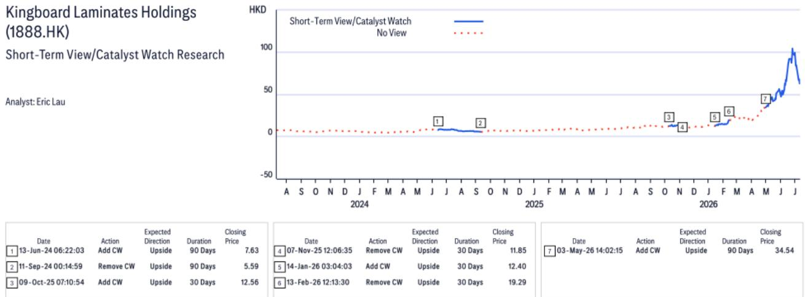
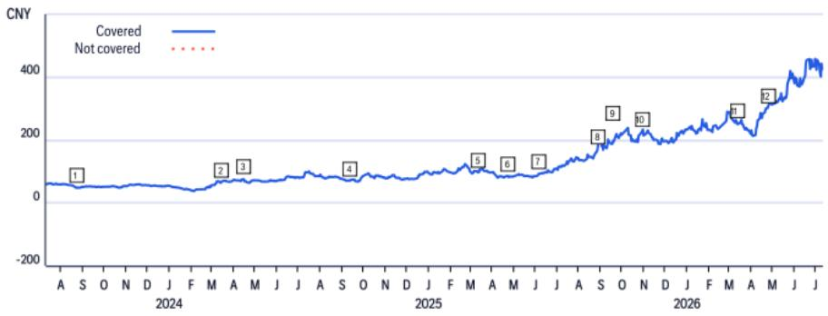
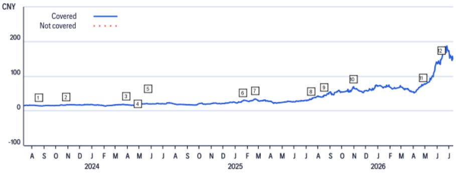

# The AI Supply Chain's Profit Gradient Favors Upstream Materials Over Downstream Assembly

Shennan Circuit guided first-half 2026 net profit of RMB2.10-2.30 billion, representing 54-69% year-on-year growth, driven by AI-related storage and computing-power demand from its Guangzhou ABF substrate plant. That headline number, on its own, looks strong. But it masks a critical divergence: Shennan's second-quarter net profit growth decelerated to a midpoint of 55% year-on-year, while its upstream copper-clad laminate supplier Shengyi Technology delivered a 135% surge. The vertical integrator Kingboard Laminates likely saw first-half net profit jump by 3.3 times. The pattern is unmistakable. In the current AI infrastructure cycle, profit gravity pulls harder toward the top of the supply chain.

This is not a temporary quarterly anomaly. It reflects a structural shift in how value accrues across the AI-printed circuit board ecosystem. As raw material costs inflate, capacity constraints tighten at the glass-fabric and copper-foil layer, and pricing power concentrates in upstream segments that face less competitive intensity, the profit pool is migrating away from downstream PCB and substrate assemblers. Those who treat all AI-related electronics exposure as interchangeable are missing the most important distinction in the sector today.

## The Second-Quarter Profit Growth Deceleration at Shennan Is Not a Company-Specific Problem but a Supply Chain Positioning Problem

Shennan's first-quarter 2026 net profit grew 73% year-on-year to RMB850 million. The second-quarter midpoint guidance of RMB1.35 billion implies 55% growth, a deceleration of 18 percentage points. The company attributed part of this to a stronger prior-year comparison base, but the more consequential driver is material cost inflation. The gross margin trajectory tells the story: after peaking at 31.4% in the third quarter of 2025, Shennan's gross margin declined to 28.6% in the fourth quarter and recovered only modestly to 29.2% in the first quarter of 2026. Meanwhile, the cost of goods sold grew 29.8% year-on-year in the first quarter, outpacing the revenue growth rate of 37.9% only because of volume expansion.

This margin compression is not unique to Shennan. It is a function of where the company sits in the value chain. PCB and substrate manufacturers purchase copper-clad laminate, glass fabric, and copper foil as inputs. When those upstream materials tighten, the downstream assembler absorbs the cost increase until it can renegotiate contracts, which typically lags by one to two quarters. The upstream suppliers, by contrast, realize the price uplift immediately. In a rising-cost environment, the profit pool shifts upward before it trickles back down. Shennan's quarterly net profit run rate increased 59% quarter-on-quarter in the second quarter. That is a strong absolute number. But it is 17 percentage points below Shengyi's 76% quarter-on-quarter increase and dramatically below Kingboard Laminates' estimated 200% sequential jump. The relative performance gap is the signal.

## Upstream Material Suppliers Command Pricing Power Because Capacity Expansion Takes Years, Not Quarters

The reason upstream players are capturing disproportionate profit growth lies in the supply dynamics of their core products. Copper-clad laminate, glass fabric, and copper foil require capital-intensive kiln and electrolytic foil production lines that take 18 to 36 months to bring online. In contrast, PCB and substrate assembly capacity can be expanded in 12 to 18 months with lower capital intensity per unit of output. When AI demand surged starting in late 2024, downstream assemblers rushed to add capacity, but the upstream material base had not expanded proportionally. The result is a capacity bottleneck at the top of the chain.

Kingboard Laminates, which integrates backward into glass fabric and copper foil production, is the purest expression of this advantage. The company recently kicked off three new kilns for AI-grade fabric starting in the second quarter of 2026, yet even with that expansion, the market remains tight enough that analysts project a continued gross margin expansion cycle through 2028. The valuation framework applied by a global research report captures this: Kingboard trades above its historical mean. That is not speculative exuberance. It is a rational response to a company whose three-year earnings compound annual growth rate is projected at 99% through 2028, driven by volume and price simultaneously.

Shengyi Technology occupies the middle ground. As a pure-play copper-clad laminate manufacturer without backward integration into glass or copper, it benefits from the same pricing tailwind but lacks the margin amplification that Kingboard Laminates achieves through vertical integration. Still, Shengyi's 45% three-year earnings compound annual growth rate and its demonstrated ability to increase wallet share at Nvidia from the GB200 platform through GB300 and into the Vera Rubin architecture justify a valuation multiple of 56 times forward earnings, four standard deviations above its mean. The key point is that both upstream players are valued at multiples far exceeding their historical ranges, while Shennan's target multiple of 38 times forward earnings sits at only two standard deviations above its mean. The market is already pricing in the supply chain hierarchy.

## The Decision Framework for AI Supply Chain Exposure Should Prioritize Vertical Integration Over Pure Play, and Upstream Over Downstream

For institutional observers constructing exposure to the AI hardware ecosystem, the critical question is not whether to observe the supply chain but where to position within it. The evidence from the first half of 2026 provides a clear framework with three tiers.

The highest-conviction positioning is in vertically integrated upstream producers that control their own raw material inputs. Kingboard Laminates exemplifies this category. Its ability to capture both the glass-fabric price inflation and the copper-clad laminate margin expansion simultaneously creates a compounding effect on earnings that pure-play competitors cannot replicate. The 0.3 times price-to-earnings-to-growth ratio assigned by a global research report, compared with a regional peer average of 0.6 times, suggests that the market has not yet fully priced in the duration of this earnings cycle. The risk to this position is that AI-related demand for glass fabric and copper foil decelerates faster than expected, but even in that scenario, the vertical integrator retains a cost advantage over non-integrated peers.

The second tier is upstream pure plays such as Shengyi Technology. These companies benefit from the same pricing environment as vertical integrators but lack the margin buffer that comes from internalizing raw material cost advantages. Shengyi's risk profile is asymmetric: if AI demand continues to scale, its earnings upgrades will be substantial because operating leverage is high in a fixed-cost-intensive CCL production model. If demand disappoints, however, the margin contraction will be sharper than for a vertical integrator because Shengyi must purchase glass fabric and copper foil at market prices. The appropriate hedge for this position is to pair it with a shorter duration or to size it relative to conviction in the AI demand trajectory.

The third tier is downstream PCB and substrate assemblers such as Shennan Circuit. These companies offer exposure to AI volume growth but with structurally lower earnings sensitivity to the cycle because they lack pricing power over their largest input costs. Shennan's unique business model includes BT substrate for smartphones and ABF substrate for memory, which provides diversification, but the core dynamic remains the same: in a rising-cost environment, the downstream assembler is a volume play, not a margin expansion play. The Guangzhou ABF plant reaching breakeven one year earlier than initial guidance is a positive catalyst, but it does not change the fundamental profit pool allocation. Observers should consider downstream names only when they believe that raw material costs are peaking and about to decline, because that is the environment in which downstream margins expand fastest.

Applying this framework to the current cycle requires an assessment of where material costs are heading. The data from the first half of 2026 suggests that copper foil and glass fabric prices are still inflating, with Kingboard Laminates experiencing a higher run rate of price increases in June. Until there is clear evidence that upstream capacity additions are sufficient to meet demand, the profit gradient will continue to favor the top of the chain. The appropriate portfolio tilt, therefore, is to overweight vertical integrators, maintain a neutral to overweight position in upstream pure plays, and underweight downstream assemblers until the cost cycle turns.

## The Valuation Premium for Upstream Companies Is Justified by Structural, Not Cyclical, Advantages

Skeptics will argue that the valuation multiples for Kingboard Laminates and Shengyi Technology are extreme by historical standards. A 56 times forward multiple for a CCL manufacturer and a 29 times multiple for a laminates producer appear stretched against regional comps that trade at 0.6 times price-to-earnings-to-growth. This argument misses the structural change underway.

The AI infrastructure buildout is not a typical electronics cycle. It is driven by hyperscaler capital expenditure that is less sensitive to interest rates, consumer demand, or macroeconomic cycles than previous demand waves. Nvidia's product roadmap, from GB200 to GB300 to Vera Rubin, implies a multi-year upgrade cycle that forces continuous specification improvements in the PCB and CCL layers. Each generation requires higher glass-transition temperatures, lower signal loss, and tighter dimensional stability in the laminate materials. This creates a rising barrier to entry for upstream suppliers and a pricing environment that rewards incumbents with proven qualification at the OEM level.

Shengyi Technology's market share in global CCL has risen from 8% in 2007 to 13% in 2024, a trajectory that predates the AI cycle and reflects a secular shift in manufacturing capability. The company was the first Chinese CCL player to enter the Nvidia supply chain, which provides a qualification advantage that new entrants cannot replicate quickly. The increasing premium for domestic component sourcing, driven by geopolitical restrictions on U.S. companies sourcing certain materials, adds another layer of structural demand that is independent of the economic cycle. These factors justify a valuation premium that goes beyond the current earnings upcycle.

Kingboard Laminates' vertical integration into glass fabric and copper foil provides a structural cost advantage that becomes more valuable as AI-grade material specifications tighten. The company's three new kilns for AI fabric, coming online in the second half of 2026, will expand its customer base within the Nvidia and ASIC ecosystem. This is not a one-time earnings boost; it is a market share expansion that should persist across multiple product cycles. The 0.3 times price-to-earnings-to-growth ratio, far below the regional average, suggests that the market has not yet fully discounted the duration of this advantage.

Shennan Circuit's valuation, at 38 times forward earnings with a 32% three-year earnings compound annual growth rate, is reasonable but not compelling in relative terms. The company's technology leadership in AI-server, communication, datacenter, and automotive ADAS applications is real, and its state-owned enterprise background provides stability. But the valuation premium of 20-30% above the sector average reflects these qualities adequately. The risk is that material cost inflation continues to compress margins, which would make the current multiple look expensive rather than cheap.

## The Profit Pool Migration Will Persist Until Upstream Capacity Catches Up with Downstream Demand

The most important variable for observers to monitor is not Shennan's quarterly order book or Shengyi's revenue growth. It is the pace of upstream capacity additions relative to downstream demand. As long as glass fabric and copper foil producers operate at high utilization rates and CCL manufacturers can pass through price increases to PCB assemblers, the profit gradient will favor the top of the chain.

The timeline for capacity equilibrium is uncertain. Kingboard Laminates' three new kilns will add supply in the second half of 2026, but they are dedicated to AI-grade fabric, which is the fastest-growing segment. Other producers are likely to add capacity as well, but the 18 to 36 month lead time means that any capacity decisions made today will not impact the market until late 2027 or 2028. In the meantime, AI demand continues to scale. The risk is that upstream capacity additions overshoot and cause a price correction, but that risk is at least 12 to 18 months away based on current investment cycles.

For observers with a 6 to 12 month horizon, the current configuration is clear. Vertical integrators offer the best risk-adjusted return because they capture price and volume simultaneously while maintaining cost advantages. Upstream pure plays offer higher beta to the AI demand cycle with corresponding downside risk if demand disappoints. Downstream assemblers offer the lowest earnings sensitivity to the cycle and should be treated as tactical positions rather than core holdings.

The AI supply chain is not a monolith. It is a hierarchy of profit pools that shift over time based on capacity dynamics, pricing power, and competitive structure. Right now, the evidence points in one direction. The top of the chain is where the money is being made.

*For informational purposes only. Portions may be generated, translated, summarized, or edited with AI assistance based on source materials and may contain omissions or errors. Please verify independently. This is not professional advice.*

For informational purposes only. Portions may be generated, translated, summarized, or edited with AI assistance based on source materials and may contain omissions or errors. Please verify independently. This is not professional advice.

