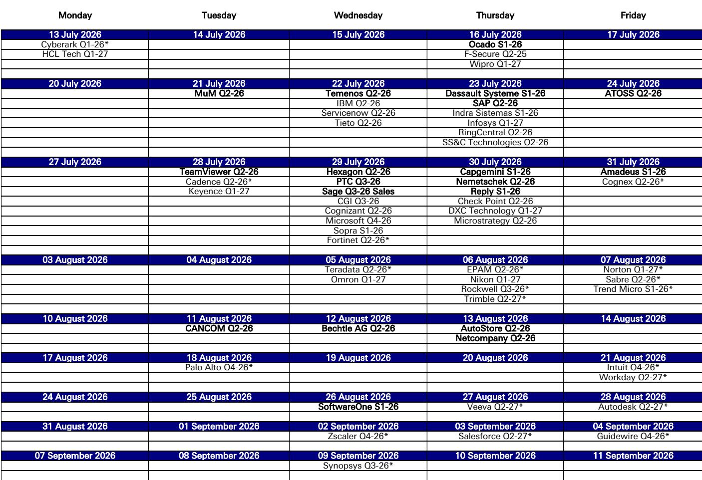
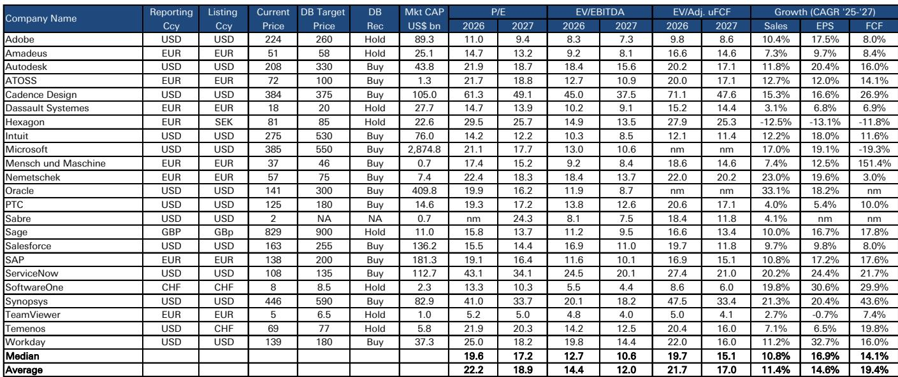
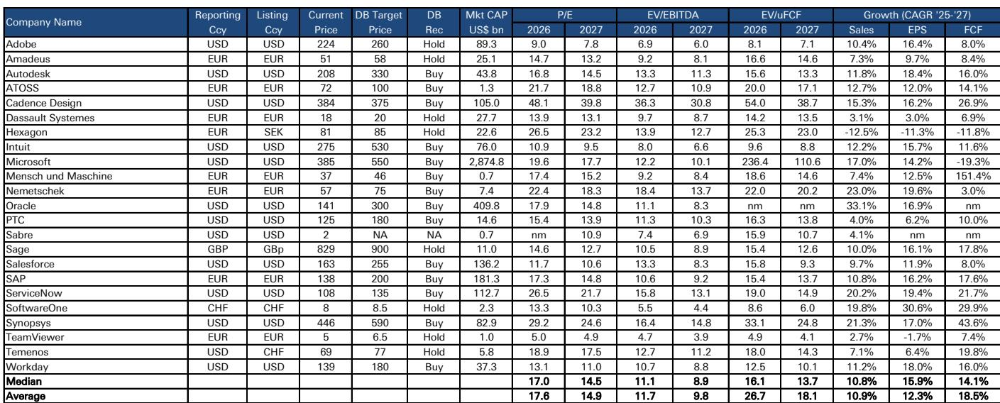

# Q2 软件公司业绩预计稳健，但报价变动更多取决于市场布局，而非基本面

进入欧洲软件和IT服务公司第二季度财报季，最重要的一个事实是：市场已经预期到一份喜忧参半的业绩，并且以深度看跌的布局将其计入报价。对冲基金和纯多头机构已大幅削减软件板块敞口，以应对数月来AI驱动的叙事风险和地缘局势变化。这意味着，出现积极惊喜的门槛较低，但推动报价持续上涨的催化剂门槛却很高。一份不错的季度业绩，甚至好于预期的业绩，都不足以改变这些公司的走势。如今，推动报价的主要因素并非收入增长、利润率或业绩指引，而是市场布局、AI硬件和半导体公司的相对强势，以及软件公司如何在AI时代创造价值这一悬而未决的问题。

最后一个问题最为关键。市场并非在等待第二季度数据来决定软件公司的命运，而是在等待一个商业模式。在SAP和达索系统等主要参与者为其AI业务如何在本十年末之前产生收入、利润和自由现金流提供具体框架之前，该板块将处于观望状态。本季度最重要的基本面数据点并非每股收益或有机增长率，而是客户验证、AI合同签约，以及任何关于AI如何转化为商业成果的增量披露。财报季将表现稳健，但不会成为转折点。

## 市场关注的是AI验证点，而非季度业绩超预期——以该板块最重要公司为例

SAP进入第二季度时，在欧洲大型软件公司中拥有较强劲的需求环境，该公司很可能交出一份稳健的季度业绩。当前云积压订单增长预计约为25%，符合公司自身关于在2026财年之前略有放缓的指引，并处于市场预期的上端。云ERP套件收入应继续同比增长近30%，这得益于健康的订单势头。整体损益表指标应大致符合市场共识，尽管本季度的自由现金流预期似乎过高，受到异常值干扰。管理层预计将重申其全年收入、息税前利润和自由现金流指引，这将消除任何关于中东局势可能导致下调预期的残余担忧。

但这些都不是市场等待的。真正的焦点在于SAP在2026年Sapphire大会上宣布的新AI解决方案的商业进展。早期客户反馈良好，而决定将大部分AI路线图提供给本地部署客户（前提是签署RISE云迁移协议）为云迁移的后来者创造了强大的催化剂。这一动态应能支撑云业务增长至明年及2028财年。但市场需要的不仅仅是定性反馈，还需要围绕AI机会的增量关键绩效指标和详细的财务框架——预计到2030年，AI机会将约占云收入的1/3。该框架不太可能在第四季度业绩或2027年Sapphire大会之前出现，届时公司在新产品下已有6至12个月的实际AI交易签约。目前，每个季度都将根据新的AI交易公告和客户签约情况来评判。第二季度的业绩超预期已被市场消化。

## 在工程软件领域，质量和经常性收入是抵御宏观和AI挑战的相对少见防线

工程软件子板块面临双重挑战。近期宏观风险正在上升，而持续的伊朗冲突对客户决策和交易时间表产生了二阶效应，这些效应尚未完全反映在公司指引中。中东地区的直接敞口在整个覆盖范围内有限，但更广泛的不确定性正导致客户推迟承诺，尤其是在周期性终端市场。与此同时，AI原生挑战者正在工程软件栈中取得进展，瞄准特定用例并宣布合作伙伴关系，持续对市场情绪施压。两者结合意味着该子板块不适合广泛布局，而需要精选。

在报告观点评级的公司中，预计Nemetschek将提供更新的指引，纳入近期完成的HCSS收购，确认按固定汇率计算14%至15%的有机增长，以及该交易带来的高个位数贡献。第二季度本身应表现不错，得益于Build板块的持续强势和Design板块在艰难对比下的稳健增长，但Media板块仍令人担忧。预计PTC将交出相对符合预期的第三财季业绩，继续相对于达索系统表现优异。达索系统本身应报告大致符合预期的第二季度业绩，尽管宏观环境多变，但交易活动保持稳健，不过该公司预计将对第三季度给出谨慎指引，同时确认全年数据，将更多权重放在第四季度和执行上，以达到区间的上端。如果宏观条件持续，下半年出现一些影响也不足为奇。

这些公司的共同点是，经常性收入和较低的周期性敞口提供了缓冲，但并未消除风险。市场正在奖励那些能够通过高留存率和长期合同展现韧性的公司，同时惩罚那些依赖可自由支配支出或项目收入的公司。对高质量公司的偏好并非战术性选择，而是一种结构性的布局，将持续到宏观和AI叙事发生转变。

## IT服务面临需求低迷的背景，但凯捷和Reply在敞口和势头方面脱颖而出

IT服务子板块正面临一个持续低迷的需求环境。可自由支配支出尚未显著恢复，而近期中东局势升级为客户的决策和交易时机增添了另一层不确定性。除了周期性逆风外，市场情绪还受到结构性问题的拖累，即AI将如何重塑交付模式、定价和竞争格局，因为超大规模云服务商和模型提供商继续构建其部署能力。最终结果是，在该子板块中，差异化比以往任何时候都更重要。

凯捷是该子板块中的首选公司，原因明确：对中东地区的有限敞口应使该公司免受近期地缘局势干扰。第二季度可能相对于同行表现尤为强劲，得益于英国和美国的势头以及BPO业务的持续强势。当前预测已领先于指引框架，本季度上调指引的可能性不能排除。Reply是另一家首选公司，其第一季度在增长和利润率方面均令人安心，并且全年有进一步改善的空间，这得益于意大利和美国的强势、德国趋势的改善以及法国的持续复苏。读者还将关注近期推出的Reply Model Factory的早期进展，以及它是否能转化为增量需求机会。

在经销商中，Bechtle仍是优于Cancom和SoftwareOne的首选，尽管SoftwareOne在近期上调指引和建设性的资本市场日后，预计将交出另一份稳健的季度业绩。第二季度应能更清晰地检验潜在需求和合并后SoftwareOne-Crayon平台的运营轨迹，此前第一季度受益于几笔大型续约。关注点将集中在北美、渠道趋势、利润率和自由现金流执行上。

## 下半年的决策框架：区分周期性噪音与结构性AI风险

在未来六个月审视欧洲软件和IT服务板块时，最有用的方法是将公司分为三类，依据它们对两大主导力量的敞口：宏观周期性和AI颠覆。

第一类包括具有高经常性收入、低周期性敞口和清晰AI变现路径的公司。SAP是最明显的例子。这些公司能比同行更好地吸收宏观冲击，其AI策略足够先进，市场可以根据验证点而非猜测来评估它们。其研究案例取决于管理层能否提供市场等待的财务框架，而非下一季度是否超预期或未达预期。

第二类包括具有高经常性收入但AI定位不确定的公司。ATOSS Software就是一个例子。该公司第一季度业绩稳健，净留存率稳定在112%，总留存率保持健康，但其报价却与许多其他应用软件公司一样，被归入“受AI不利影响”的类别。第一季度相对少见的负面因素是云和订阅订单积压的环比增长持平，公司将其归因于宏观疲软，但一些读者将其解读为AI相关逆风的早期迹象。对于这些公司，一份不错的第二季度业绩几乎无法改变叙事。风险在于，任何失望，即使是宏观驱动的，都可能被解读为AI颠覆的证据。这里的决策框架是等待多个季度的数据，然后再判断AI叙事是真实还是夸大。

第三类包括直接暴露于周期性终端市场或地缘局势的公司。Amadeus是最明显的例子。第二季度可能标志着交易量的低谷，预订量和登机旅客量在中东局势干扰后仍面临压力，但单位收入、定价和组合的韧性应能缓冲影响。关键问题在于指引。该地区近期局势升级降低了人们对公司能否在当前展望区间下端实现目标的信心，风险平衡倾向于更谨慎的立场。对于这些公司，决策框架是二元的：要么宏观和地缘环境稳定，此时低谷创造买入机会；要么进一步恶化，此时下行风险显著。

## 重新定价的路径在于商业模式，而非利润表

从第二季度展望中得出的最重要结论是，软件板块正夹在两股强大力量之间，无论是强劲的执行力还是疲软的对比基数都无法解决。一方面，市场对软件极度看跌，布局已反映了关于AI颠覆的最坏假设。这为数据未如预期糟糕时的反弹创造了可能性。另一方面，关于软件和IT服务公司在AI时代的商业模式的中期不确定性尚未解决。这种不确定性不会由一个季度的业绩来解决。只有当主要参与者提供一个框架，用于建模其AI业务以及本十年末相关的财务机会时，它才会得到解决。

该框架预计将在2027年开始出现，SAP和达索系统很可能引领潮流。目前，市场仍处于观望状态，相对少见能改变局面的数据点是新客户签约和AI合同验证点。第二季度财报季将表现稳健，但不会成为转折点。转折点将在市场能够从数字上看到AI如何转化为收入、利润和现金流时到来。在此之前，报价将继续由市场布局、AI硬件的相对强势，以及缓慢而耐心地积累证据——证明重要的软件公司正在做出正确的战略决策——所驱动。

*仅供参考。部分内容可能基于源材料通过AI辅助生成、翻译、总结或编辑，可能存在遗漏或错误。请独立核实。这不构成研究、法律、税务、会计或其他专业建议。*

仅供参考。部分内容可能基于源材料通过AI辅助生成、翻译、总结或编辑，可能存在遗漏或错误。请独立核实。这不构成研究、法律、税务、会计或其他专业建议。

