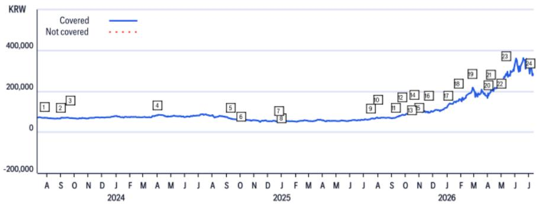
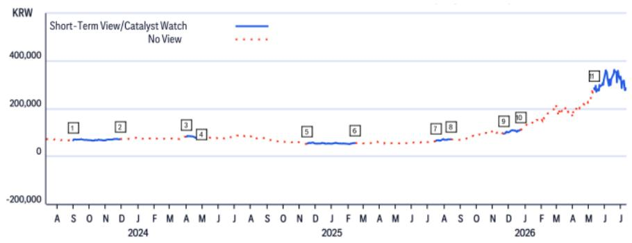

# Citi：韩国半导体-存储基本面在市场关注中展现韧性

市场对韩国存储芯片股的关注集中在两个时间点：二季度业绩可能节奏变化，以及下半年长期协议（LTA）可能影响均价。但Citi在7月14日发布的研报中给出了相反的判断——LTA的定价影响大部分要到2027年上半年才会体现，而HBM价格在2027年仍有70%的同比涨幅。这意味着，当前报价回调更多是技术性调整，而非基本面转折。

这份报告的核心锚点在于，市场把LTA视为均价节奏变化的触发因素，但Citi认为，LTA反而会在中长期为供应商创造稳定的运营利润。真正需要关注的不是LTA本身，而是供应商在供应紧张期如何利用LTA条款锁定更有利的定价。

## 1. LTA的定价影响被市场提前关注，实际影响在2027年才集中体现

市场普遍认为，存储LTA将在2026年下半年开始影响均价。但Citi的分析显示，LTA的定价条款大部分要到2027年上半年才会生效。即便LTA在2027年全面执行，超出LTA确认量的部分仍有充足的均价上行空间。

报告进一步指出，韩国存储供应商正在充分利用当前的供应紧张局面。假设服务器DRAM需求在2026至2027年持续强劲，供应商在LTA谈判中将保持审慎，签约时间可能推迟至2026年下半年甚至2027年。这意味着，2026年下半年的均价走势不会受到LTA的实质影响。

> **KC评论：** 市场往往将LTA简单理解为“锁定低价”，但Citi的推演显示，在供应紧张周期中，LTA更像是供应商用来管理客户预期、同时保留现货市场涨价弹性的工具。真正需要跟踪的不是LTA签约数量，而是超出LTA覆盖范围的“超额需求”部分的价格走势。

## 2. HBM价格在2027年仍有70%同比涨幅，成为均价上行的第二引擎

Citi预计，2027年HBM价格将同比增长70%。这一增速远超市场对存储均价自然回落的预期。HBM的定价逻辑与通用DRAM不同，其技术门槛和客户定制化程度更高，供应商在定价上拥有更强的话语权。

结合Citi对2026年DRAM和NAND均价分别增长234%和236%的预测，存储均价的上升周期至少延续至2027年。HBM的贡献正在从“增量收入”转变为“均价支撑因素”。

## 3. 当前报价回调是技术性调整，而非基本面转折

Citi明确将近期韩国存储股的下跌定性为“市场整体获利了结驱动的技术性回调”。报告认为，二季度业绩节奏变化的担忧被过度放大，而LTA对均价的影响被提前关注。

从供需角度看，Citi判断2026年下半年存储供应缺口不会收窄。64GB DDR5 RDIMM的报价预计从2026年二季度的1310美元升至四季度的1805美元，这一价格路径本身就否定了均价节奏变化的叙事。

---

对于关注存储周期的读者而言，这份报告提供的观察框架是：不要用LTA签约本身来判断均价转折，而要区分“LTA覆盖的量”和“超额需求的价格弹性”。在供应紧张周期中，后者的定价权才是决定供应商利润弹性的关键变量。

For informational purposes only. Portions may be generated,translated,summarized,or edited with AI assistance based on source materials and may contain omissions or errors. Please verify independently. This is not investment,legal,tax,accounting,or other professional advice.

For informational purposes only. Portions may be generated,translated,summarized,or edited with AI assistance based on source materials and may contain omissions or errors. Please verify independently. This is not investment,legal,tax,accounting,or other professional advice.

