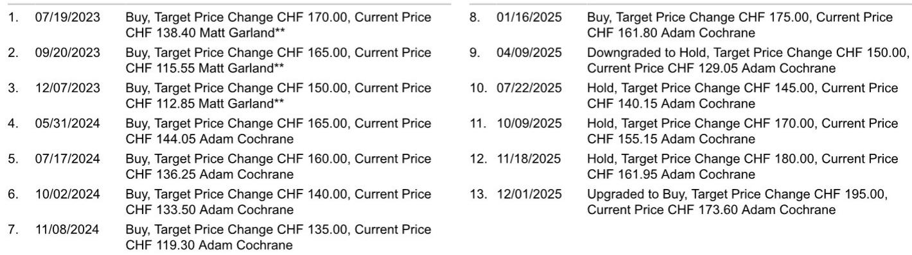
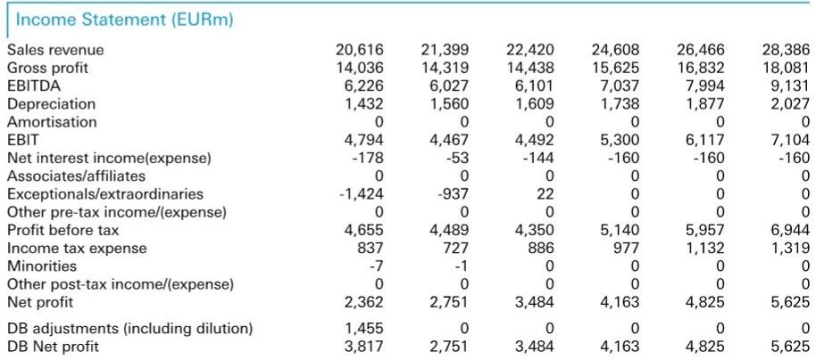

# DB：历峰集团CFR.SW首季销售增20%远超预期

历峰集团交出了一份让市场意外的季度成绩单。截至2026年6月底的第一财季，集团固定汇率销售同比增长20%，远超市场共识预期的11%和DB自己的10%预测。这份超预期并非来自单一因素——美洲、日本、亚太三大区域均录得两位数增长，珠宝部门以24%的增速领跑，专业制表部门也从上一季度的2%回升至8%。

对于一直关注中国奢侈品需求仍在调整的市场而言，这份报告提供了一个值得重新审视的观察窗口。亚太地区固定汇率增长21%，其中中国内地、香港和澳门均实现两位数增长。这不是一个“局部亮点”的故事，而是一个“全面超预期”的案例。

## 1. 珠宝部门仍是增长引擎，但制表业务的回暖更值得关注

珠宝部门贡献了集团约75%的收入，24%的固定汇率增速比市场预期高出11个百分点，延续了其异常强劲的势头。但更值得注意的信号来自专业制表部门。该部门增速从上一季度的2%跃升至8%，明显高于市场预期的4%。DB分析师指出，这表明制表业务的交易动能正在显著改善。

> **KC评论：** 珠宝和制表是两种不同的消费逻辑。珠宝更依赖品牌溢价和情感消费，制表则对可自由支配支出更敏感。制表业务的回暖，可能意味着高端消费意愿正在从“保值型购买”向“体验型购买”扩展。

## 2. 中国需求并未“消失”，而是被其他区域稀释了关注

市场对历峰集团最大的关注点之一是中国奢侈品消费的可持续性。但这份报告显示，中国内地、香港和澳门均实现两位数增长，韩国和台湾等其他亚洲市场同样表现强劲。美洲增长27%，日本增长36%，欧洲增长11%——每个区域都在增长，只是速度不同。

一个容易被忽略的细节是中东和非洲区域。该区域固定汇率增长3%，而市场预期是下降6%。报告提到，本地需求抵消了该区域游客支出的减少。这意味着历峰集团在全球的客户基础比许多读者想象的要分散和稳固。

## 3. 零售渠道增长24%，线上渠道加速至18%

按渠道看，零售增长24%至45亿欧元，远高于市场预期的13%。线上渠道增长18%，也明显超过8%的共识预期。批发渠道增长9%，略高于预期。这种全渠道的增长格局说明，需求并非由单一促销或渠道驱动，而是来自真实的消费意愿。

报告还提到，欧洲业务受益于本地客户以及北美和中东游客的消费。日本市场则同时受到本地需求和旅游支出的支撑。这种“本地+游客”的双轮驱动模式，在宏观环境不确定性增加时提供了额外的缓冲。

## 4. 这份报告的行业含义：奢侈品板块可能被低估了韧性

DB明确表示，历峰集团的业绩对整个奢侈品行业是一个积极的参考信号。但分析师也谨慎地指出，目前尚不清楚有多少增长来自奢侈品消费的整体回暖，有多少是珠宝品类的结构性优势，又有多少是历峰集团自身的品牌执行力。

> **KC评论：** 历峰集团的表现不能简单等同于“奢侈品行业全面复苏”。珠宝品类的特殊性——高品牌集中度、低价格透明度、强情感属性——意味着它的增长可能部分来自其他品类（如皮具、成衣）的消费转移。读者在解读这份报告时，需要区分“行业贝塔”和“公司阿尔法”。

一个值得关注的额外变量是金价变化。报告提到，金价节奏变化正在为历峰集团的毛利率提供顺风。这意味着即使收入增速节奏变化，利润端的表现可能仍会超出预期。对于跟踪奢侈品板块的读者而言，历峰集团这份报告提供了一个比市场共识更乐观的基准，但真正的考验在于：这种增长能否在下一季度持续，以及能否在更广泛的奢侈品公司中得到验证。

For informational purposes only. Portions may be generated,translated,summarized,or edited with AI assistance based on source materials and may contain omissions or errors. Please verify independently. This is not investment,legal,tax,accounting,or other professional advice.

For informational purposes only. Portions may be generated,translated,summarized,or edited with AI assistance based on source materials and may contain omissions or errors. Please verify independently. This is not investment,legal,tax,accounting,or other professional advice.

