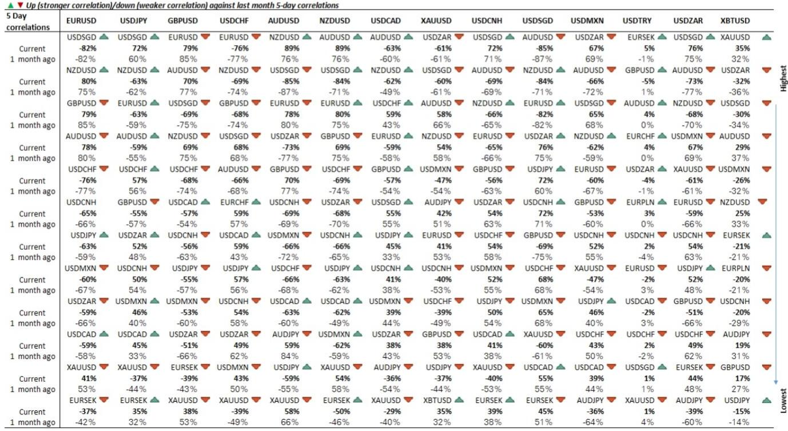
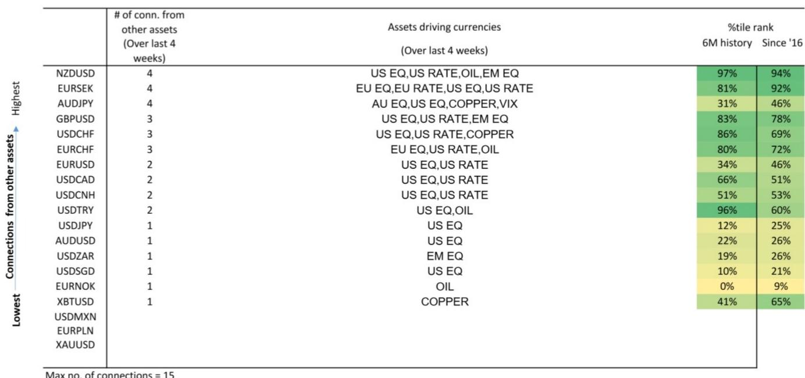

# 美国股票已成为全球外汇市场的主要高频驱动因素，重塑汇率交易者的风险分配方式

一项针对19个主要货币对的高频分析揭示了跨资产关联性的结构性转变，这要求我们重新思考外汇交易的分析框架。美国股票现在驱动了样本中超过60%的货币对，这种影响力的集中度在经历了此前地缘局势引发的波动后，随着美国股票的持续上涨而进一步增强。这不是一个暂时的相关性峰值。这是一种制度性变化，反映了风险情绪如何以五分钟频率在货币市场中传播，并对头寸规模、对冲和跨资产组合构建具有直接影响。

证据是具体且明确的。对于美元/日元、澳元/美元和美元/新加坡元等货币对，美国股票是相对少见主导的高频驱动因素。对于欧元/美元、美元/加元和美元/离岸人民币，美国股票和美国利率共同解释了日内波动的大部分。过去三个月的历史数据强化了这一模式：在超过90%的交易日内，美国股票一直是美元/瑞士法郎、美元/新加坡元和新西兰元/美元的主导驱动因素。当一个资产类别在十有八九的日子里解释货币波动时，它就不再是一个背景因素，而是成为了主要的风险传导渠道。

对于汇率交易者而言，这一结论虽令人不安，却无法回避。过去将外汇驱动因素划分为不同类别的思维模式——股票代表风险情绪、利率代表利差、石油和铜代表商品敞口——已不再符合数据。关联性已经简化为一个更集中、更简单的结构。忽视这种转变意味着错误评估风险，尤其是在股票市场承压时期，届时外汇的反应将比历史模型预测的更快、更一致。

## 美国利率已成为高频外汇网络的结构性枢纽，而不仅仅是次要驱动因素

基于相关性的最小生成树分析将美国利率确定为高频外汇动态中的主要枢纽，而VIX（波动率指数）则是跨资产关联性的第二重要来源。这种网络视角并非格兰杰因果关系结果的简单复制。它揭示了不同的东西：跨市场关系的同期结构，而不仅仅是预测性联系。美国利率位于一个同时连接股票、大宗商品和货币的网络中心。

其实际意义有两点。首先，网络结构意味着对美国利率的冲击比任何其他单一资产类别的冲击更快、更广泛地通过外汇系统传播。美国国债回报表现的突然变动不仅会通过传统的利差渠道影响美元/日元和欧元/美元，还会波及整个网络，包括那些历史上看似与利率动态绝缘的货币对。其次，美国利率的中心地位意味着VIX虽然重要，但处于次要位置。市场的恐慌指标固然重要，但它在一个以利率为锚的系统中运作。

这一发现挑战了常见的实践者捷径，即把风险偏好/风险规避视为一个由股票波动驱动的单一维度。数据表明，风险情绪和利率动态是共同传导的，它们在不同货币对中的相对重要性各不相同。对于新西兰元/美元和美元/离岸人民币，在过去三个月中，美国利率在超过60%的交易日内是主导驱动因素。对于美元/新加坡元，其与美国利率的相关性为68%，是样本中最高的。这些并非边际效应，而是特定、流动性强、交易广泛的货币对的主要解释变量。

## 外汇网络中有一个关键的桥梁货币，它传递着跨资产溢出效应：美元/南非兰特

在货币世界中，美元/南非兰特占据着独特的结构性位置。最小生成树将其识别为一个关键的桥梁货币，连接着利率、股票和大宗商品。这不是关于南非兰特的经济基本面或其套息交易吸引力的陈述，而是关于兰特在全球风险高频传导机制中的作用。

美元/南非兰特位于多种资产类别影响的交汇点。正如格兰杰因果关系分析所示，它受到新兴市场股票的驱动，但其网络中心性意味着它也将来自美国利率和大宗商品的冲击传递给其他货币对。当兰特波动时，这不仅仅是南非的故事，而是跨资产溢出效应正在通过系统传播的信号。

对于一个全球宏观组合而言，这有一个具体的操作含义。美元/南非兰特不仅应作为新兴市场敞口来监控，还应作为更广泛外汇错位的早期预警指标。如果兰特的波动方式与其传统驱动因素不一致，可能表明网络结构本身正在发生变化。报告的方法论以五分钟频率更新这些关系，使得这种监控在实时中成为可能。忽视美元/南非兰特桥梁角色的交易者，将错过风险传导网络中的一个关键节点。

## 经典的风险偏好/风险规避相关性结构依然存在，但存在重要的不对称性，需要精确把握

基础的跨资产相关性继续显示出经典的风险偏好/风险规避模式。美国和新兴市场股票通常与顺周期资产（包括澳元、新西兰元、英镑、欧元、新加坡元、墨西哥比索、南非兰特、黄金和比特币）呈正相关。石油与几种货币兑美元呈负相关，特别是南非兰特、新加坡元、瑞士法郎、离岸人民币、新西兰元、黄金和澳元。美国利率与主要货币保持广泛的负相关，其中与新加坡元、南非兰特、日元、瑞士法郎、新西兰元、澳元、黄金、欧元和英镑的逆相关关系较强。

但总体模式掩盖了对于执行而言重要的不对称性。这些相关性的强度在不同时间跨度和货币对之间差异显著。例如，澳元/美元与美国利率的相关性为-60%，而美元/新加坡元与美国利率的相关性为+68%。两者都很大且显著，但方向相反。一个笼统的“风险偏好”交易——做空美元兑一篮子顺周期货币——将根据包含哪些货币以及利率如何变动而产生截然不同的结果。

五日相关性表格提供了最具可操作性的数据。它不仅显示了当前的相关性，还显示了一周前和一个月前的变化。对于欧元/美元，其与美国利率的相关性在过去一周从-47%加强到-54%，而与VIX的相关性从-19%变动到-34%。这些并非微小的变化。它们表明欧元与其传统驱动因素之间的关系正在实时收紧。使用过时相关性估计的交易者将系统性地误判欧元/美元对利率变动或波动率飙升的敏感度。

## 基于高频驱动机制的外汇风险分配决策框架

数据支持一种超越静态因子模型的结构化外汇风险分配方法。该框架包含三个层面。

首先，根据每个货币对的主要高频驱动机制对其进行分类。格兰杰因果关系结果和三个月历史影响数据提供了一个清晰的分类。美元/日元、澳元/美元和美元/新加坡元是股票驱动的。欧元/美元、美元/加元和美元/离岸人民币是股票和利率共同驱动的。欧元/挪威克朗是石油驱动的。新西兰元/美元由股票、利率、石油和新兴市场股票共同驱动——这是样本中最多样化的机制。这种分类应每周更新，因为滚动四周的数据显示关联性可能发生显著变化。

其次，根据驱动因素影响力的集中度来配置头寸规模。对于单一资产类别在超过90%的交易日内解释波动的货币对——例如美元/瑞士法郎、美元/新加坡元和新西兰元/美元（股票驱动），或欧元/挪威克朗（石油驱动）——需要与驱动因素更多样化的货币对不同的风险管理方法。对于集中机制货币对，主要风险因素就是主导资产类别本身。对冲应针对该因素，而非泛泛的外汇波动。对于多样化机制货币对，风险在于多个因素同时变动，这需要组合层面的对冲。

第三，监控网络结构以发现机制转变。最小生成树和美元/南非兰特的中心地位提供了一个实时诊断工具。如果美元/南非兰特开始与其传统驱动因素脱钩，或者如果VIX取代美国利率成为主要网络枢纽，那么整个外汇风险分配框架都需要重新校准。报告的五分钟频率数据使这种监控成为可能，但前提是交易者拥有相应的系统来接收并据此采取行动。

## 二阶含义：跨资产组合构建必须将外汇作为传导渠道，而非独立资产类别

这一分析最重要的战略含义是，在多元资产组合中，外汇不能再被视为一个独立的回报流。高频关联性意味着货币波动现在主要是股票和利率冲击的传导渠道。一个持有美国股票、美国国债和一篮子G10货币的组合，并非分散投资于三个独立的资产类别。它集中于两个基础风险因素——股票贝塔和利率久期——而货币敞口根据相关性结构放大或削弱这些因素敞口。

考虑一个做多美国股票并做多澳元/美元的组合。高频数据显示澳元/美元是股票驱动的。货币头寸并非分散化，而是对同一股票风险因素的杠杆押注。类似地，一个做空美国国债并做空美元/日元的组合，是在加倍押注利率观点，因为美元/日元与美国利率有55%的相关性，并且主要由美国股票驱动。

正确的应对方式不是放弃货币敞口，而是通过因子敏感度而非名义敞口的视角来衡量它。货币头寸的规模应基于其对组合主导风险因素的贝塔值，而非其独立的波动性或利差。这需要报告所提供的基于因果关系的高频分析。没有它，组合看似分散，实则集中，真实风险隐藏在相关性结构中。

数据是清晰的。美国股票和美国利率现在是高频外汇的双引擎。其他所有驱动因素——石油、铜、新兴市场股票——对大多数货币对而言都是次要的。构建一个忽视这一现实的货币策略，不仅不是最优的，而且与全球市场在最短、最具影响力的时间范围内传导风险的方式在结构上不一致。

*仅供参考。部分内容可能基于源材料通过AI辅助生成、翻译、总结或编辑，可能存在遗漏或错误。请独立核实。本文不构成投资、法律、税务、会计或其他专业建议。*

仅供参考。部分内容可能基于源材料通过AI辅助生成、翻译、总结或编辑，可能存在遗漏或错误。请独立核实。本文不构成投资、法律、税务、会计或其他专业建议。

