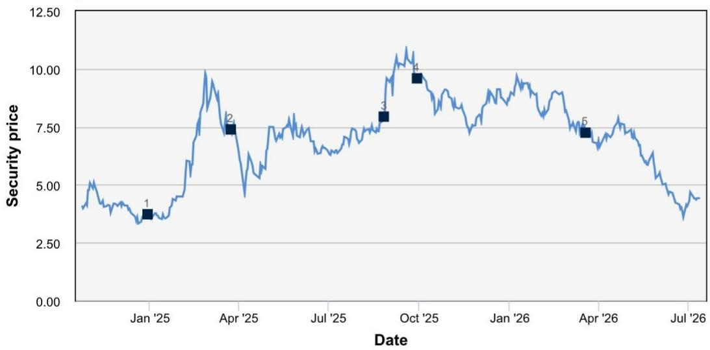

# DB：HorizonRobotics 9660.HK HSD V2.0

深圳路测中，地平线第二代全场景智驾系统“Horizon SuperDrive V2.0”展现出与经验丰富的驾驶员几乎无异的操控水平。这份来自DB的研究笔记，基于实地试驾和与管理层的交流，给出了一个清晰判断：地平线的技术架构已从单阶段端到端模块化设计，切换到“世界模型+强化学习”的双引擎框架。这意味着，智驾系统不再只是识别和响应，而是开始具备对复杂交通场景的预判能力。

报告的核心证据来自深圳路测。HSD V2.0通过世界模型，利用真实专家驾驶数据训练，发展出时空理解能力，能够模拟长尾场景并动态预测未来交通状态。系统可以自主完成从驶出停车位到驶出停车场、识别车道与红绿灯、以及利用相邻车道主动变道超车等一系列操作。用户只需设定导航，其余交给系统。这种“防御性驾驶”能力，正是人类驾驶员的核心技能。

> **KC评论：** 世界模型+强化学习的组合，本质上是让智驾系统从“记住规则”进化到“理解场景”。路测中表现出的主动变道和预判能力，是这一架构差异的直接体现。报告没有给出量化对比数据，但“接近人类老司机”这一表述，在专业研究笔记中并不常见。

## 1. 与比亚迪的合作并未因“玄机A3”芯片而松动，反而形成多层绑定

读者对比亚迪自研芯片的担忧，曾引发地平线报价调整。但研报披露的管理层信息显示，双方的合作远不止芯片供应。地平线向比亚迪的“玄机A3”芯片提供BPU智能加速引擎，并据此收取基于出货量的IP许可费，报告估算每颗芯片约10至50美元。同时，地平线仍是比亚迪“天神之眼C”高速NOA方案的主要芯片供应商，该方案主要面向中低价位车型。而比亚迪自研的“玄机A3”芯片（三颗集群算力超过2100 TOPS）则主要用于高价车型。此外，管理层透露，地平线有望为比亚迪“天神之眼B”方案供应一款新高端芯片，其算力预计介于J6H（256 TOPS）和J6P（560 TOPS）之间。

## 2. 2026年芯片出货量预计超500万颗，毛利率维持在60-65%

报告预测，地平线2026年全年芯片总出货量将超过500万颗，同比增长超过25%。主力出货产品是“Horizon Mono”系列相关芯片，包括J2、J3和J6B。基于此，研报预计2026年上半年营收同比增长20%至30%，同时维持60%至65%的毛利率水平。这一判断的关键在于，尽管低价产品占比提升可能拉低均价，但规模效应和IP许可费收入为利润率提供了缓冲。

## 3. 从L2+量产数据积累向L4和Robotaxi渐进式扩张

地平线的L4策略并非另起炉灶。管理层明确表示，Robotaxi的算法框架将与现有L2+的HSD算法保持一致。这意味着，其从数百万辆预装车辆中积累的L2+量产数据和工程经验，可以直接用于加速Robotaxi的商业化。目前，公司正在测试配备安全员的Robotaxi，计划逐步过渡到完全无人驾驶。这种“渐进式”路径，降低了技术迁移的不确定性和成本，也使得L2+市场的规模优势能够直接转化为L4领域的竞争壁垒。

> **KC评论：** 算法框架的统一是这份报告中最容易被忽略的战略信息。它意味着地平线在L2+市场每多卖一颗芯片，其L4系统的训练数据就多一份来源。这种数据飞轮效应，是纯L4公司难以复制的。

For informational purposes only. Portions may be generated,translated,summarized,or edited with AI assistance based on source materials and may contain omissions or errors. Please verify independently. This is not investment,legal,tax,accounting,or other professional advice.

For informational purposes only. Portions may be generated,translated,summarized,or edited with AI assistance based on source materials and may contain omissions or errors. Please verify independently. This is not investment,legal,tax,accounting,or other professional advice.

