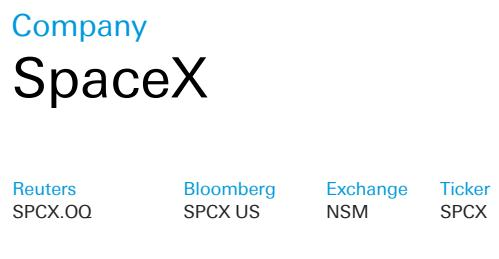
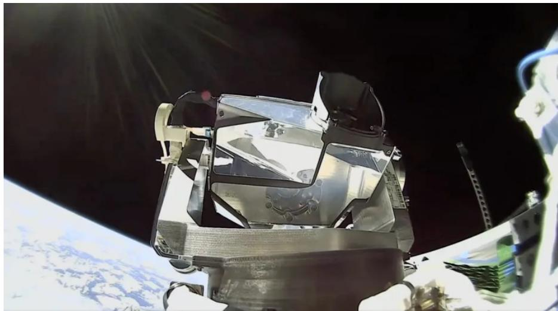
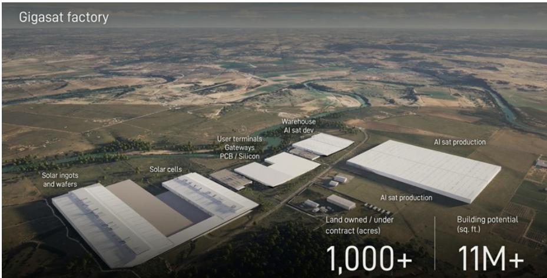

## 研究笔记

北美
美国

工业
太空技术

日期
2026年7月14日

## 专题报告

<table><tr><td>2026年7月13日价格 (美元)</td><td>139.14</td></tr><tr><td>目标价格</td><td>255.00</td></tr><tr><td>52周区间</td><td>201.80 - 139.14</td></tr></table>

# 太空数据中心 第四部分

继上周的初步研究之后，我们进一步深入探讨轨道数据中心，并继续我们的“太空数据中心”系列。我们将介绍一个更新的成本模型（可应要求提供Excel文件），并对光学/激光、频谱、太阳能、散热器和计算密度进行进一步分析。我们考虑了SpaceX关于其AI1卫星和Starmind星座的最新披露。我们的总体结论是，物理原理是可行的，最大的挑战将是成本/规模，我们认为SpaceX可以通过极致的垂直整合来实现这一目标。结合星舰发射规模的扩大，我们设想在2030年代初期，成本可以与地面持平。

图1：SpaceX AI1卫星设计

来源：公司网站

## 估值与风险

Edison Yu
研究分析师
+1-212-250-7263

Bryan Kraft
研究分析师
+1-212-250-0117

Corinne Blanchard
研究分析师
+1-904-645-2360

Gary Zhou, CFA
研究分析师
+852-2203-5889

Ross Seymore
研究分析师
+1-415-617-3268

Roshan Ranjit, CFA
研究分析师
+44-20-754-52908

Laura Li
研究助理
+1-212-250-2266

## 光学激光与频谱

## Starmind

AI1卫星将依赖光学星间链路（OISL）在Starmind星座内部路由流量，然后进入Starlink星座，Starlink的激光网状网络再将流量回传至地面站。因此，AI1卫星不需要在星上搭载复杂的多面板相控阵天线（即，除了可能用于遥测备份的某些Ka波段外，通信不需要大量频谱）。我们估计目前在轨的Starlink卫星超过10,000颗，每颗V2 mini卫星拥有3个光学终端，能够处理约600 Gbps的容量（每个终端200 Gbps）。对于即将推出的V3卫星，我们推测每颗卫星的容量可能至少达到2-3 Tbps。随着数据量的增加，我们也预计SpaceX将增强和/或升级其地面站网络。

图2：Starlink mini激光终端

来源：公司报告

光学终端的主要供应商包括Tesat-Spacecom（空客子公司）、Mynaric（今年早些时候被收购）、SA Photonics（2021年被CACI收购）以及SpaceX（内部使用，但也开始对外销售“mini”激光终端——Muon Space和Starcloud已宣布计划使用）。

## Starlink

采用这种架构意味着空对地层将承担更多流量的负担。光学链路使Starmind星座本身无需频谱，但离开激光网状网络的数据最终必须通过Starlink的网关进行传输，而轨道数据中心改变了这种数据流的形态。Starlink的Gen1/Gen2网关授权是针对消费者宽带业务设计的，其流量是不对称的（下行链路重）。因此，SpaceX越来越多地使用Ku-/Ka-波段之外的非传统频谱波段，例如：

E波段：已用于网关回传；上行+下行

■ V波段：已获准用于高级用户终端和网关；上行+下行

■ W波段：已获准用于网关回传；主要用于上行

D波段：提议主要用于AI的网关回传；主要用于上行

历史上，较高频段面临严重的雨衰、氧气吸收和大气衰减问题，使其对消费者用户终端不可靠。因此，Starlink似乎主要将它们用于高容量网关回传链路（大型天线、站点分集和光学星间路由可以缓解这些问题），同时优先将成熟的Ku-/Ka-波段用于消费者天线，并随着硬件和法规的成熟逐步为高级用户增加V波段。

另外，FCC最近通过了针对卫星的新标准，取代了1990年代的等效功率通量密度（EPFD）限制。旧限制迫使像Starlink这样的低轨系统严重限制功率和波束密度以保护地球同步轨道卫星。相反，新规则采用了基于性能的保护标准，考虑了当今的自适应编码/调制、波束赋形和实际协调。在关键的Ku-/Ka-波段（10.7–12.7 GHz, 17.3–18.6 GHz, 19.7–20.2 GHz），这使得运营商能够以更高的功率运行，并且在同一区域可以有更多同频卫星/波束（例如，从有效1个增加到7-8个）。FCC指出，相同数量的卫星容量可提升高达7倍。

## 太阳能

## 当前解决方案

卫星主要使用多结或硅太阳能电池。多结电池通过堆叠不同材料（如砷化镓（GaAs）和锗（Ge））来实现更高的性能（效率约30%或更高），这些材料能够捕获更宽光谱的太阳光；这些材料还提供了更强的抗辐射能力。然而，这两种材料的生产高度集中在特定地区，尤其是镓（可作为铝精炼的副产品生产）和锗（作为锌冶炼的副产品）。Spectrolab（波音子公司）、AZUR Space（总部位于德国，2021年被5N Plus收购）和SolAero（2022年被收购）是多结空间级电池的主要供应商。硅材料成本低得多（最多可降低80%），受益于更大的工业规模，但性能较差（通常效率为15-20%），并且由于抗辐射能力较低而耐用性较差。在硅电池中，主要类型是钝化发射极和背面电池（PERC）。台湾太阳能能源公司（TSEC）是SpaceX此类电池的供应商。亚马逊LEO也使用PERC，但供应商尚不清楚。

## 未来趋势

未来几年，我们认为一种新型方法可能出现在卫星上：异质结（HJT）。这种电池将晶体硅与非晶硅薄层结合以提高性能。有趣的是，HJT使用更简单（5-7步，而典型为12-13步）、温度更低的制造工艺，可节省高达70%的能源，尽管前期设备成本会更高；还有可能用铜替代涂层中的银，从而节省成本。在性能方面，记录到的效率高达27%，对称设计使电池能够从两侧吸收几乎相等的光线。最后，HJT具有很强的抗辐射能力，在轨道上退化缓慢。在美国，Solestial（最近被York Space Systems收购）正在利用Meyer Burger的设备开发超薄、柔性硅HJT太阳能电池。

在HJT之后，使用钙钛矿叠层电池可能是未来的方向。钙钛矿是一种合成晶体结构，基本上可以印刷或喷涂到表面上，这意味着它非常轻，理论上与多结电池一样高效。目前的太阳能电池都是刚性的，但有了钙钛矿，利用薄膜或柔性面板成为可能。刚性面板（无论是多结还是硅）意味着电池安装在由铝或碳纤维复合材料制成的蜂窝状基板上。这些面板随后被堆叠起来，并使用机械铰链和弹簧在轨道上展开。

在相关地区，Drinda（2865.HK）在5月的SNEC展会上展示了一个专门的“空间光伏”区域，突出了其开发用于空间应用的钙钛矿基太阳能解决方案的努力。该公司展示了其钙钛矿/TOPCon叠层技术（小面积效率约33.5%），以及基于柔性CPI的基板和商业卫星模型。该公司是空间太阳能业务的早期参与者。其子公司Xuntian计划在2026年制造并部署12-15颗卫星（订单积压54颗卫星）。GCL（3800.HK）在SNEC的展台设计和产品展示反映出其关注点明显超越了传统光伏，电池材料（正极和负极）和空间太阳能都 prominently 展示在其展区前方。在空间太阳能方面，该公司展示了一种柔性钙钛矿太阳能电池样品以及卫星相关用例。

## SpaceX路线图

SpaceX目前正在德克萨斯州奥斯汀附近的巴斯特罗普建设一个太阳能电池制造工厂，这是其更大规模的国内太阳能电池生产雄心的一部分。巴斯特罗普工厂的目标是拥有10 GW的太阳能电池产能，分为两层（每层5 GW）。该工厂占地面积约110万平方英尺，有可能扩建至160万平方英尺，并与SpaceX现有的Starlink生产基地相邻。太阳能工厂的建设于2026年3月下旬开始，设备安装已经开始。该工厂的目标是在2027年底前实现产量提升和“合理规模”。据我们了解，该工厂将首先生产硅太阳能电池，效率约为19%。

图3：SpaceX ODC卫星生产基地

来源：公司网站

展望未来，SpaceX可能会转向HJT或钙钛矿电池，但我们认为这不会在短期内发生，因为他们可能无法及时为AI1卫星的部署获得合适的设备。最终，Elon Musk已表示计划在三年内建设100 GW的国内太阳能电池产能。

## 散热器

## 热管理

卫星在真空中运行，这意味着没有空气或介质像在地球上那样通过传导或对流散热。相反，卫星依靠热辐射来排出星载电子设备和其他组件产生的多余热量。散热器通过发射电磁能量（主要在红外光谱范围内）来工作，以光子的形式带走热量。该过程遵循斯特藩-玻尔兹曼定律，其中热辐射速率取决于温度和表面积。

## 被动还是主动？

散热器通常有两种类型：被动式和主动式。被动式散热器仅利用材料特性和几何形状来散热。这利用了材料、表面和几何配置的内在热特性，在不消耗任何电能的情况下管理热流。主要缺点是散热器面积受限于航天器的外形尺寸，这限制了被动散热能力。主动式散热器是动力热回路的一部分——泵将流体从电子设备上的冷板循环到散热器面板。这会消耗功率并增加故障模式，但可以处理更高的热负荷，并且比被动设计保持更精确的温度控制。几乎所有卫星都使用被动式散热器。主动式散热器基本上只用于空间站（国际空间站、天宫）和飞船（龙飞船、星际客机）。

历史上，主承包商大多内部制造自己的散热器面板。商业供应商包括Advanced Cooling Technologies (ACT)、Paragon Space Development、Redwire、Beyond Gravity、Iberespacio和Admatis。

## SpaceX路线图

SpaceX在当前的Starlink卫星上内部生产散热器（被动式），并将继续为AI1卫星生产（主动式）。AI1将使用双面主动可展开液体散热器，能够耗散1,400 W/m²（每面700 W/m²），覆盖110 m²的表面积。这种类型的散热器需要电力和/或运动部件将热量从计算模块传输到散热器面板。考虑到120-150 kW的高功率载荷，这是必要的，因为热通量对于纯被动传导来说太高了。主动式散热器通常是产量非常低的组件，因此SpaceX将成为第一个大规模生产这种设计的公司。

## 计算密度

SpaceX的目标是在明年晚些时候部署其AI1卫星的原型。FCC文件概述了一个在低轨拥有多达一百万颗卫星的星座。由于每颗卫星都有固定的功率和热预算，当务之急是最大化计算密度。SpaceX的目标密度是每吨100 kW，但AI1不会达到这个阈值，起始功率约为70 kW，这意味着最初每次星舰发射（假设有效载荷能力为85吨）可提供约6 MW的计算能力。SpaceX表示愿意为其AI1卫星托管所有类型的芯片载荷，包括Nvidia GPU、Google TPU、Amazon Trainium，当然还有优先考虑能效的特斯拉AI芯片。AI1预计将以约120 kW的功率持续运行，大致与NVIDIA GB300 NVL72机架的功耗相当。在我们的模型中，我们假设计算密度在2032年（估计）提高到接近85-90 kW，然后在之后的AI3卫星上达到100 kW。

## 经济性最终可能具有吸引力

为了设定基准，我们假设地面1 GW AI计算的前期资本支出为380亿美元，年度运营支出（电力、维护、人工等）为9亿美元，五年内总计425亿美元（基于Epoch AI分析）。其中，计算成本为210亿美元，我们假设这一成本会以10%的加价转移到轨道数据中心，以应对GPU故障时的过度配置。我们的感觉是，GPU故障不会通过维护直接解决，而只是每颗卫星在发生故障时以较低的功率运行。因此，地面的非计算成本为215亿美元，而轨道数据中心基本上必须低于这个水平（在过度配置后）或195亿美元才能达到持平。展望未来，我们假设地面成本未来会上升。举例来说，NVIDIA的CEO黄仁勋最近在GTC Taipei 2026上评论说，一个新的1 GW“AI工厂”的成本可能接近1000亿美元，其中大约一半与计算相关。

使用当前的SpaceX运载火箭和卫星设计，我们估计部署1 GW空间数据中心星座的近期成本将是地面（不含计算）的6倍。到本十年末，这一差距可以缩小到1.0-1.5倍，然后在2030年代初期最终变得更便宜。这种降低主要由星舰（快速可重复使用）和AI系列卫星的积极优化/规模化推动。我们还更新了DB轨道数据中心模型，该模型更深入地探讨了将AI基础设施发射到轨道的经济可行性（可应要求提供Excel文件）。

图4：地面与轨道数据中心部署成本对比

<table><tr><td></td><td>2027 (通用)</td><td>2029 (AI1)</td><td>2032 (AI2)</td><td>未来 (AI3)</td></tr><tr><td>每公斤发射成本</td><td>$1,429</td><td>$398</td><td>$170</td><td>$43</td></tr><tr><td>卫星成本（不含计算，$/kW）</td><td>50,133</td><td>13,256</td><td>8,857</td><td>5,008</td></tr><tr><td>计算密度 (W/kg)</td><td>33</td><td>56</td><td>87</td><td>98</td></tr><tr><td>轨道成本 (十亿美元)</td><td>115</td><td>27</td><td>15</td><td>9</td></tr><tr><td>地面成本（不含计算）</td><td>20</td><td>23</td><td>25</td><td>25</td></tr><tr><td>成本差异倍数</td><td>5.9x</td><td>1.2x</td><td>0.6x</td><td>0.3x</td></tr></table>

来源：公司报告，DB

图5：星舰发射成本轨迹假设

<table><tr><td>(百万美元)</td><td>物料清单</td><td>可变</td><td>固定</td><td>总计</td><td>有效载荷 (吨)</td><td>价格/公斤</td></tr><tr><td>星舰 (早期，无飞船复用)</td><td>52</td><td>2</td><td>267</td><td>321</td><td>65</td><td>$4,933</td></tr><tr><td>星舰 (部分复用)</td><td>5</td><td>2</td><td>27</td><td>34</td><td>85</td><td>$398</td></tr><tr><td>星舰 (完全复用)</td><td>2</td><td>2</td><td>13</td><td>17</td><td>100</td><td>$170</td></tr><tr><td>星舰 (完全+快速复用)</td><td>1</td><td>1</td><td>4</td><td>6</td><td>200</td><td>$32</td></tr></table>

来源：公司报告，DB

图6：轨道数据中心卫星成本轨迹假设

<table><tr><td>(千美元)</td><td>2027(通用)</td><td>2029 (AI1)</td><td>2032 (AI2)</td><td>未来(AI3)</td></tr><tr><td>太阳能</td><td>1,750</td><td>600</td><td>375</td><td>300</td></tr><tr><td>散热器</td><td>709</td><td>438</td><td>204</td><td>127</td></tr><tr><td>计算</td><td>1,620</td><td>2,880</td><td>1,440</td><td>720</td></tr><tr><td>总线结构</td><td>500</td><td>600</td><td>500</td><td>400</td></tr><tr><td>激光</td><td>300</td><td>150</td><td>100</td><td>75</td></tr><tr><td>其他</td><td>250</td><td>200</td><td>150</td><td>100</td></tr><tr><td>总计</td><td>5,129</td><td>4,868</td><td>2,769</td><td>1,722</td></tr><tr><td>不含计算</td><td>3,509</td><td>1,988</td><td>1,329</td><td>1,002</td></tr><tr><td>卫星功率 (kW)</td><td>70</td><td>150</td><td>150</td><td>200</td></tr><tr><td>卫星计算功率 (kW)</td><td>50</td><td>120</td><td>130</td><td>195</td></tr><tr><td>PUE</td><td>1.40</td><td>1.25</td><td>1.15</td><td>1.03</td></tr><tr><td>卫星硬件成本 ($/W)</td><td>73</td><td>32</td><td>18</td><td>9</td></tr><tr><td>不含计算 ($/W)</td><td>50</td><td>13</td><td>9</td><td>5</td></tr><tr><td>质量 (kg)</td><td>1,500</td><td>2,140</td><td>1,500</td><td>2,000</td></tr><tr><td>功率密度 (W/kg)</td><td>47</td><td>70</td><td>100</td><td>100</td></tr><tr><td>计算密度 (W/kg)</td><td>33</td><td>56</td><td>87</td><td>98</td></tr><tr><td>太阳能电池效率</td><td>20%</td><td>19%</td><td>24%</td><td>30%</td></tr><tr><td>太阳常数 (AMO)</td><td>1,366</td><td>1,366</td><td>1,366</td><td>1,366</td></tr><tr><td>退化+指向余量</td><td>5%</td><td>5%</td><td>5%</td><td>5%</td></tr><tr><td>太阳能面积 (m²)</td><td>270</td><td>600</td><td>482</td><td>514</td></tr><tr><td>太阳能性能 (W/m²)</td><td>260</td><td>250</td><td>311</td><td>389</td></tr><tr><td>$/W</td><td>$25.00</td><td>$4.00</td><td>$2.50</td><td>$1.50</td></tr><tr><td>$/m²</td><td>$6,489</td><td>$999</td><td>$779</td><td>$584</td></tr><tr><td>散热器面积 (m²)</td><td>89</td><td>110</td><td>102</td><td>127</td></tr><tr><td>散热器热耗散 (W/m²)</td><td>750</td><td>1,300</td><td>1,400</td><td>1,500</td></tr><tr><td>$/m²</td><td>$8,000</td><td>$4,000</td><td>$2,000</td><td>$1,000</td></tr><tr><td>每芯片成本 ($)</td><td>$45,000</td><td>$40,000</td><td>$20,000</td><td>$10,000</td></tr><tr><td>芯片数量 (GB300e)</td><td>36</td><td>72</td><td>72</td><td>72</td></tr>
