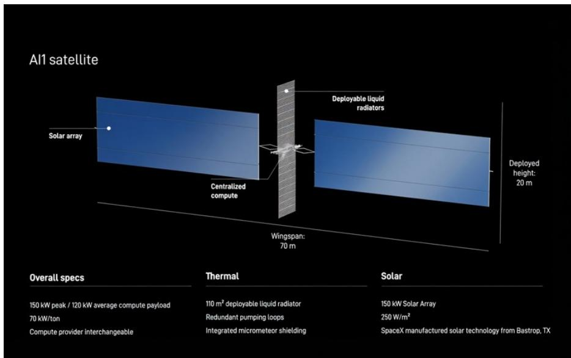

# DB：SpaceX-SPCX.OQ太空数据中心第四部分

把AI算力送上天，听起来像科幻小说的开场。但DB一份长达数十页的系列报告，正在认真计算这件事的物理和宏观环境可行性。报告的核心判断是：轨道数据中心（ODC）的物理原理没有问题，真正的挑战在于成本和规模——而SpaceX的垂直整合和星舰复用，可能让这个等式在2030年代初与地面持平。

这份报告并非空谈概念。它基于SpaceX最新披露的AI1卫星和Starmind星座设计，拆解了从光学激光、频谱、太阳能、散热器到计算密度的每一个子系统，并给出了从2027年到2030年代后的成本演进路径。

## 1. 光学激光和频谱架构让卫星摆脱了对地面频谱的依赖

AI1卫星不依赖传统多面板相控阵天线。它们通过光学星间链路（OISL）在Starmind星座内部路由流量，再接入Starlink的激光网格网络，最终回传地面站。这意味着AI1卫星本身几乎不需要频谱资源——除了可能保留Ka波段作为遥测备份。

目前轨道上已有超过1万颗Starlink V2 mini卫星，每颗配备3个光学终端，每个终端可处理约600 Gbps容量。即将到来的V3卫星，单颗容量可能达到2-3 Tbps。随着数据量增长，SpaceX也在扩建地面站网络。

但真正值得关注的是频谱政策的转变。FCC最近通过了新的卫星标准，取代了1990年代制定的等效功率通量密度（EPFD）限制。新规采用基于性能的保护标准，允许运营商在Ku/Ka波段以更高功率运行，同一区域可同时服务的卫星/波束数量从有效1个增加到7-8个。FCC估计，同等卫星数量下，新规可带来最多7倍的容量提升。

> **KC评论：** 频谱政策变化往往比技术突破更具杠杆效应。FCC这次调整相当于在不增加卫星数量的情况下，直接放大了每颗卫星的通信能力。对于依赖星间链路和地面回传的ODC架构，这是一个被低估的变量。

## 2. 太阳能电池的路线选择：从硅到HJT再到钙钛矿，SpaceX正在押注国产化

卫星太阳能电池目前以多结电池（效率约30%以上）和硅基PERC电池（效率15-20%）为主。多结电池性能更好，但关键材料镓和锗的生产高度集中——镓是铝精炼的副产品，锗是锌冶炼的副产品。硅基电池成本低80%，但效率低、抗辐射能力弱。

报告认为，异质结电池（HJT）可能在未来几年成为卫星的新选择。HJT结合晶体硅和非晶硅薄膜，效率可达27%，生产工艺更简单（5-7步 vs 传统12-13步），能耗降低70%，还有可能用铜替代银来降低成本。更重要的是，HJT抗辐射能力强，在轨道上退化缓慢。

SpaceX正在德克萨斯州巴斯特罗普建设太阳能电池工厂，目标产能10 GW（分两层各5 GW），与现有Starlink生产设施相邻。工厂于2026年3月底开工，设备已开始安装，计划2027年底达到“合理产量”。初期将生产效率约19%的硅基电池。报告推测，HJT或钙钛矿电池的切换不会在AI1卫星部署前发生——设备供应时间线可能跟不上。

马斯克曾表示，计划在三年内将美国国内太阳能电池产能提升至100 GW。

## 3. 主动散热器是AI1卫星的关键差异化设计，SpaceX将首次实现大规模量产

卫星在真空中只能通过热辐射散热。传统卫星几乎全部使用被动散热器——依靠材料特性和几何形状散热，不消耗电力。但AI1卫星的载荷功率高达120-150 kW，热流密度远超被动散热能力。

AI1将采用双面主动展开式液体散热器，散热能力达到每平方米1400 W（双面各700 W），覆盖面积110平方米。这种设计需要电力驱动泵循环流体，将热量从计算模块输送到散热面板。主动散热器过去只用于空间站和飞船，SpaceX将是第一个大规模量产这种设计的公司。

## 4. 成本演进路径：从6倍差距到低于地面，关键变量是星舰复用和卫星迭代

报告给出了一个清晰的成本对标框架。以1 GW AI算力为基准，地面部署的初始资本支出为380亿美元，5年运营支出约90亿美元，总计约425亿美元。其中计算部分占210亿美元，非计算部分为215亿美元。轨道数据中心只要将非计算成本压到195亿美元以下（考虑10%的GPU故障冗余），就能实现宏观环境对等。

当前（2027年）的轨道部署成本是地面的5.9倍。但到2029年AI1卫星部署时，差距将缩小到1.2倍。到2032年AI2卫星阶段，轨道成本将降至地面的0.6倍。2030年代后的AI3卫星，成本仅为地面的0.3倍。

驱动这一变化的核心变量是星舰的复用程度和卫星自身的成本优化。报告假设星舰从早期无回收（每公斤4933美元）演进到完全快速复用（每公斤32美元），卫星硬件成本（不含计算）从每瓦50美元降至5美元，计算密度从每公斤33瓦提升至98瓦。

> **KC评论：** 这份成本模型的关键假设不是技术突破，而是规模效应和垂直整合。SpaceX同时控制火箭、卫星、太阳能电池和散热器生产，这种一体化能力是其他竞争者难以复制的。但报告也隐含了一个前提：星舰的复用频率和载荷能力必须达到预期，否则整个成本曲线会右移。

## 5. 计算密度是最终瓶颈，但AI1只是起点

AI1卫星的目标计算密度是每吨100 kW，但初期只能达到约70 kW。这意味着每次星舰发射（假设85吨有效载荷）可提供约6 MW的计算能力。AI1卫星可持续运行功率约120 kW，大致相当于一台NVIDIA GB300 NVL72机架的功耗。

报告假设计算密度在2032年提升至85-90 kW/吨，AI3卫星达到100 kW/吨。SpaceX已表示对各类芯片载荷持开放态度，包括NVIDIA GPU、Google TPU、Amazon Trainium和特斯拉AI芯片。

一个值得注意的细节：报告认为GPU故障不会通过维修解决，而是让卫星在低功率下继续运行。这意味着轨道数据中心的可靠性设计逻辑与地面完全不同——不是追求单点修复，而是通过大规模冗余来容忍故障。

这份报告的价值不在于证明“太空数据中心可行”，而在于它把可行性拆解成了可验证的工程参数和成本曲线。物理原理已经通过验证，剩下的问题是：SpaceX能否在2030年前把星舰的发射成本降到每公斤43美元，同时把卫星的硬件成本压到每瓦5美元。如果这两个条件同时成立，轨道数据中心将从概念变成产业。

For informational purposes only. Portions may be generated,translated,summarized,or edited with AI assistance based on source materials and may contain omissions or errors. Please verify independently. This is not investment,legal,tax,accounting,or other professional advice.

