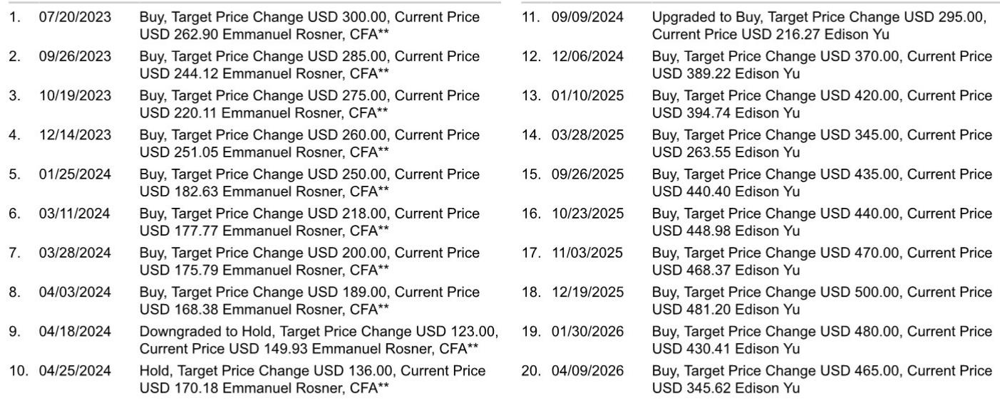
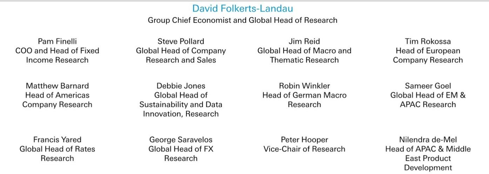
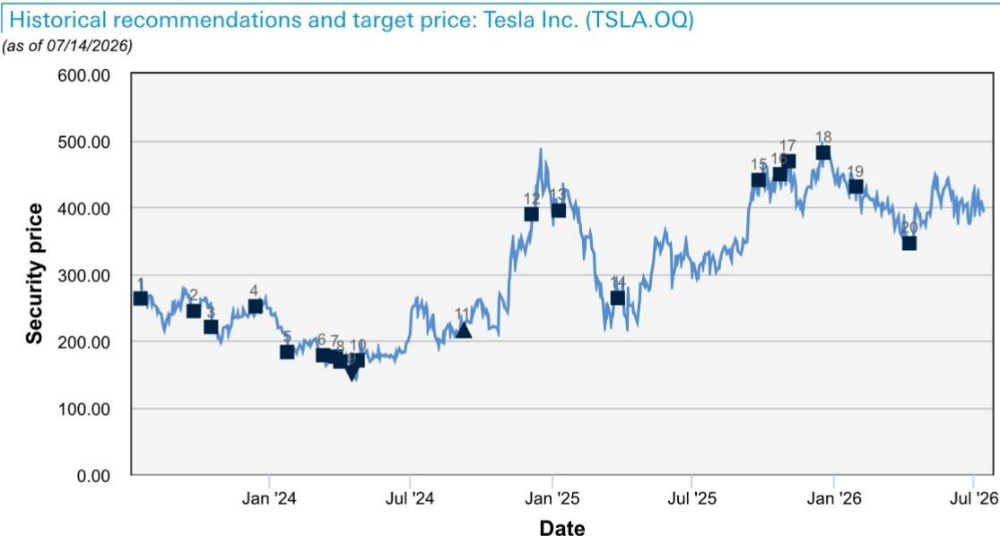

# DB：特斯拉TSLA.OQ二季度预览，交付超预期但利润承压

交付量远超预期，利润却可能环比下降。DB在特斯拉二季度业绩预览中指出，二季度约48万辆的交付量显著高于市场预期，但公司主动选择了以利润换规模的路径。0.99%的促销融资利率、FSD买断选项的取消、以及一季度一次性保修和关税减免的逆转，共同构成了二季度利润的三大逆风。报告估算，GAAP口径下汽车业务毛利率将从一季度的21.1%降至19.2%，剔除积分收入后约为18.0%。量增利减，是这一季最核心的财务特征。

## 1. 促销融资和FSD调整是利润调整的直接推手

DB拆解了二季度毛利率环比下降的构成。最大的单项影响来自FSD买断选项的取消——公司在2月中旬停止了FSD的前端买断，二季度首次承受完整季度的收入缺失，估算影响约2亿美元。其次是促销融资：5月10日至31日，特斯拉在美国为Model Y提供了0.99%的APR融资方案。报告假设约4.5万辆美国销量享受了这一优惠，按每辆车约4000美元的利率买断成本计算，对利润的冲击约为1.8亿美元。两项合计近4亿美元，基本解释了毛利率调整的绝大部分。

> **KC评论：** 这两项决策都不是外部环境强加的，而是特斯拉主动做出的选择。促销融资是为了在季度末冲量，FSD买断取消则是为了推动用户转向订阅模式。短期利润受损，但管理层显然在押注更大的长期回报——订阅收入更稳定，且能扩大FSD的用户基数。

## 2. 一季度的一次性利好正在二季度反转

报告特别指出，一季度利润中包含了两项不可持续的因素：约1.5亿美元的保修费用一次性释放，以及约8000万美元的关税减免。这两项合计2.3亿美元，在二季度将自然消失。保修费用的释放属于会计处理上的时间差，关税减免则与最高法院对IEEPA关税的裁决有关——特斯拉在二季度尚未确认任何相关收益。这意味着，即使交付量环比增长，利润基数也被垫高了，二季度的同比不确定性因此被放大。

## 3. 机器人出租车和Optimus的进展比预期慢，但关键节点明确

报告对特斯拉的非汽车业务给出了更具体的观察。机器人出租车服务仍集中在奥斯汀，已扩展至湾区、达拉斯和休斯顿，但车辆可用性导致的等待时间仍是主要瓶颈。Cybercab的量产被马斯克定性为“痛苦地缓慢”，目前更多处于工程验证和内部测试阶段，大规模爬坡要等到2026年下半年甚至2027年。Optimus Gen 3方面，报告引用中国供应链信息，认为特斯拉已向供应商提出更具体的采购要求：9月前达到每周1000台，年底前达到每周2000至2500台。初期应用场景集中在工厂内部——搬运、装卸、仓储。AI5芯片的流片已完成，三星确认将在其德州泰勒工厂使用2纳米工艺制造，算力较HW4提升约40倍，内存带宽提升约5倍，且首批产能将优先分配给特斯拉的超级计算机集群和Optimus项目。

> **KC评论：** 机器人出租车和Optimus的进展虽然慢，但供应链和芯片层面的信号比之前更具体。AI5的流片完成和2纳米工艺的确认，意味着特斯拉在自研芯片上进入了新的迭代周期。Optimus的产量目标如果兑现，2026年底的周产量将是9月的2.5倍，这个节奏值得持续跟踪。

## 4. 特斯拉与SpaceX合并的可能性正在成为市场焦点

报告在估值与不确定性部分提出了一个值得注意的观察：读者越来越关注特斯拉与SpaceX在未来1至2年内合并的可能性。这一话题可能在即将到来的财报电话会上被讨论，涉及马斯克如何管理两家实体、以及合并可能带来的协同效应。报告认为，这一预期正在影响市场对特斯拉的定价逻辑，而不仅仅是基于汽车业务的基本面。对于关注特斯拉长期价值的读者而言，这一变量可能比季度毛利率的波动更具结构性意义。

For informational purposes only. Portions may be generated,translated,summarized,or edited with AI assistance based on source materials and may contain omissions or errors. Please verify independently. This is not investment,legal,tax,accounting,or other professional advice.

