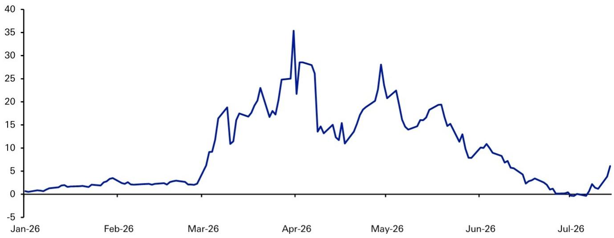
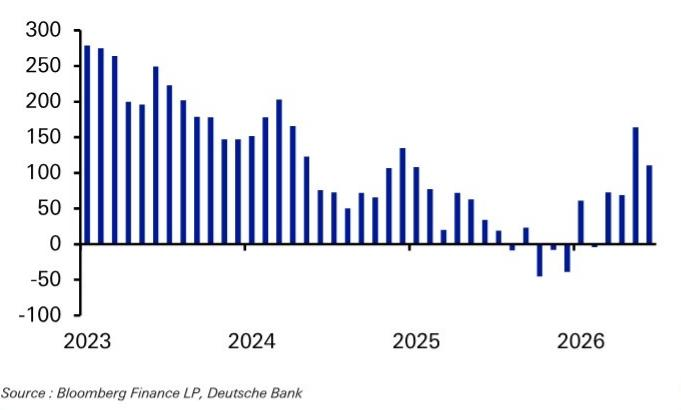
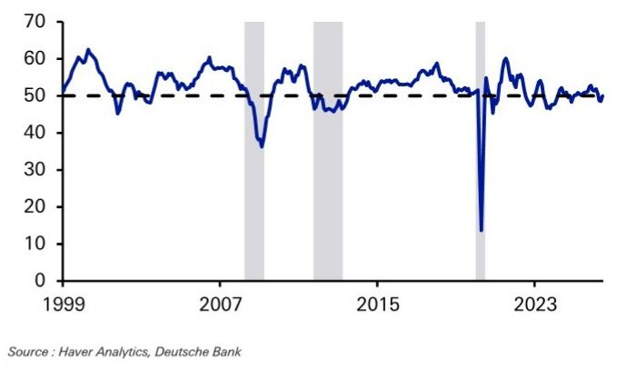

## 市场观察：油价上涨到什么程度，可能引发更显著的市场调整？

*** 固定收益研究调查正在进行中，您的参与对我意义重大，尤其是在跨资产和宏观策略类别中。如需参与，请访问相关网站。 ***

昨日，布伦特原油价格出现了自六年前疫情复苏以来的最大单日涨幅（+9.6%），这重新引发了市场对于“滞胀式冲击”的担忧。

然而，迄今为止，更广泛的跨资产市场反应相对温和：标普500指数仅略低于其历史高点约1%，而美国和欧洲的高收益债券利差仍比冲突前水平更紧。只有利率市场受到了更明显的影响。

但考虑到今年早些时候的情况，这并不太令人意外。布伦特原油在目前每桶80-90美元的水平，对风险资产而言并非一个足够高的“疼痛阈值”。事实上，只有当价格突破每桶110美元时，我们才看到股票和信用市场出现明显的脆弱性。回顾2022年的能源冲击，当时布伦特原油的实际价格阈值（按当前价格计算约为每桶110美元以上）同样引发了这些脆弱性，并导致了当年的股票熊市。

## 什么因素可能引发更显著的市场调整？

今年早些时候伊朗冲突开始时，我们曾提出一个框架，用以思考什么条件可能引发风险资产的显著调整。我们指出了需要关注的3个标准，以便在油价冲击后出现大规模的风险规避走势（例如，标普500指数下跌15%）。通常，至少需要满足以下条件之一：

1.  **大规模且持续的油价飙升**：油价至少飙升+50%至100%，并持续数月。
2.  **鹰派的政策回应**：冲击迫使央行采取强硬的政策转向，以应对由此产生的通胀（例如1979年、2022年）。
3.  **更广泛的宏观损害**：冲击足够大，足以使本已放缓的经济陷入衰退，或导致显著的经济放缓（例如1990年海湾战争）。

然而，就以上三个标准而言，当前的冲击尚未达到这些阈值，即使在油价最新一轮上涨之后，情况依然如此。

## 1. 我们是否看到了大规模且持续的油价飙升？

从历史上看，需要大规模且持续的石油冲击才能引发显著的市场调整。例如，1973年的石油冲击导致价格几乎翻了两番，而1990年海湾战争期间价格则上涨了一倍多。即使在2022年，布伦特原油价格也有大约6个月的时间高于每桶100美元，并且12个月期货价格也一度突破每桶100美元，这意味着冲击持续了一年多。

相比之下，目前布伦特原油价格在每桶86美元，仅比冲突前水平上涨了18%，自年初以来上涨了41%。从市场角度看，这显然值得注意，但与历史上更大的冲击相比，仍不可同日而语。

此外，如果与2022年的冲击相比，有必要考虑自那时起累计超过10%的通胀因素。因此，即使2022年油价有大约6个月的时间高于每桶100美元，也需要看到价格至少达到每桶110美元才能产生同等规模的冲击。而实际上，在2026年，我们仅有大约2周的时间油价高于每桶110美元，而非6个月。因此，我们距离那些曾给风险资产带来更大问题的阈值还有一段距离。

**图1：布伦特近月期货与6个月期货之间的价差（美元/桶）——在6月恢复正常后，原油曲线再次变为现货溢价，这意味着读者预期未来几个月价格将回落；这并未被市场定价为持续性冲击。**

来源：彭博财经LP，DB

## 2. 我们是否看到央行为了应对由此产生的通胀而采取鹰派回应？

以往与石油相关的市场调整的另一个关键驱动因素是鹰派的政策回应。例如，2022-23年，美联储加息525个基点，欧洲央行加息450个基点。而在1979年第二次石油冲击之后，时任美联储主席保罗·沃尔克启动了大规模的货币紧缩政策，以最终控制通胀。

同样，如果我们将当前的冲击与之比较，其规模远不能相提并论，且当前通胀率要低得多。例如，市场对美联储的定价目前指向到2027年4月会议时，紧缩峰值约为55个基点。此外，当前鹰派倾向的一个关键原因实际上是增长数据超预期，而不仅仅是通胀数据超预期。

## 3. 我们是否在数据中看到了显著的经济损害？

过去最严重的石油冲击往往伴随着数据的迅速恶化——其影响无需数月就能显现。例如，1973年的第一次石油冲击之后，失业率立即上升。随后在1990年8月海湾战争开始时，美国非农就业人数出现了7年来的最大降幅（-20.8万）。

相比之下，当前石油冲击的一个持续特征是，我们尚未看到这种更广泛的宏观环境恶化——如果非要说的话，全球数据总体上反而超预期。美国非农就业数据持续为正，失业率在6月触及12个月低点。即使在理论上因其地理位置和对进口能源的依赖而更容易受到石油冲击影响的欧洲，欧元区综合PMI在6月仍为50.0。这正好处于扩张与收缩的分界线上，表明此次能源冲击并未导致大规模衰退。

**图2：美国非农就业人数3个月均值（千人）在去年之后强劲复苏，尽管存在能源冲击**

**图3：即使在欧洲，欧元区综合PMI在6月为50.0，正好处于扩张与收缩之间，并未指向急剧下滑**

## 那么，油价需要达到什么水平才能引发显著的市场调整？

今年和2022年冲击的经验都表明，我们需要看到油价持续维持在每桶110美元的水平，才能引发更负面的市场反应。

首先，每桶110美元的价格高到足以被消费者明显感知，并挑战通胀预期。因此，在这些水平上，央行无法简单地将其视为暂时性冲击而“忽略”，尤其是在通胀已经连续多年高于目标水平的背景下。

其次，每桶110美元是今年早些时候我们开始看到显著金融压力的水平。事实上，标普500指数在3月30日的低点，以及同日美国和欧洲高收益债券利差的峰值，都出现在油价高于每桶110美元之时。一旦达到这一点，还可能引发自我实现的预言（如2022年），即金融状况收紧和股票下跌本身就会导致消费者支出回落，并对增长造成打击。这些负面的财富效应是2022年熊市的一个关键传导渠道。

第三，值得记住的是，原油曲线的形态也至关重要。像今年早些时候那样，油价短暂触及每桶110美元，并不足以驱动熊市。然而，如果2022年的情况重演，即油价预计将在这些水平上维持数月，那么这意味着市场将其定价为永久性冲击，央行也无法再“忽略”它。届时，市场将计入更多鹰派预期，从而引发更广泛的市场反应。

回想一下3月底市场调整最剧烈的时期，当时人们对这种负反馈循环的担忧日益加剧。那是在为期两周的停火协议达成（并随后延长）前不久，当时市场的一个关键担忧是石油基础设施可能遭受更广泛的破坏。如果发生这种情况，就有可能造成更持久的能源冲击，因为修复和恢复供应需要数月时间。但一旦为期两周的停火协议达成并延长，市场便开始消化冲突的影响。

然而，在目前的油价水平下，虽然冲击是显著的，但还不足以引发更广泛的市场调整。事实上，2024年布伦特原油的平均价格为每桶80美元，而当前的涨幅从相对值来看远非历史性的。此外，由于能源强度的降低，石油冲击所带来的影响已不如从前，因为我们现在每单位经济产出所消耗的能源比过去更少。

**图4：WTI原油实际价格（美元/桶）——当前的冲击根本无法与近几十年来许多更大的石油冲击相提并论**

来源：彭博财经LP，DB

## 附录1

## 重要披露

## *其他信息可应要求提供

*除非另有说明，否则价格均为截至前一交易日收盘时的价格，并来自路透、彭博及其他供应商的当地交易所。其他信息来自DB、标的公司及其他来源。有关DB相关披露的更多信息，请访问我们的网站 https://research.db.com/Research/Disclosures/FICCDisclosures 上的全球披露查询页面。除本报告外，重要的风险和利益冲突披露也可在 https://research.db.com/Research/Disclosures/Disclaimer 上找到。强烈建议读者在投资前审阅此信息。

## 分析师认证

本报告中表达的观点准确反映了以下署名首席分析师的个人观点。此外，署名首席分析师过去没有、将来也不会因在本报告中提供具体建议或观点而获得任何报酬。Henry Allen。

## 附加信息

本报告中的信息和意见由DB AG或其附属公司（统称“DB”）编制。尽管本文信息被认为是可靠的，并且来自被认为可靠的公共来源，但DB对其准确性或完整性不作任何陈述。本报告中指向第三方网站的超链接仅为方便读者提供。DB既不认可其内容，也不对这些网站的安全性控制负责。

如果您使用DB的服务购买或出售本报告中讨论的证券，或包含在DB分析师的其他（口头或书面）沟通中，DB可能为其自身账户作为委托人行事，或作为他人的代理人行事。

DB在决定作为委托人进行交易时可能会考虑本报告。它也可能以与本研究报告中所持观点不一致的方式，为其自身账户或与客户进行交易。DB内部的其他人员，包括策略师、销售人员和其他分析师，可能持有与本研究报告中所持观点不一致的观点。DB发布多种研究产品，包括基本面分析、股权挂钩分析、定量分析和交易思路。一种沟通方式中包含的建议可能与其他沟通方式中的建议不同，无论是由于不同的时间范围、方法论、视角或其他原因。DB和/或其附属公司也可能持有其所撰写报告的发行人的债务或股权证券。分析师的薪酬部分取决于DB AG及其附属公司的盈利能力，其中包括投资银行、交易和自营交易收入。

意见、估计和预测构成本报告作者截至报告日期的当前判断。它们不一定反映DB的意见，并可能随时更改，恕不另行通知。DB为其所覆盖公司发行的证券的买卖双方提供流动性。DB分析师有时会有较短期的交易思路，这些思路可能与DB现有的长期评级不一致。一些股票的交易思路在研究网站（https://research.db.com/Research/）上列为催化剂电话，并可在总体覆盖列表和所覆盖公司的页面上找到。催化剂电话代表分析师高度确信某只股票将在不少于两周且不超过三个月的时间范围内跑赢或跑输市场和/或特定板块。除催化剂电话外，分析师可能偶尔与我们的客户以及DB的销售人员和交易员讨论交易策略或想法，这些策略或想法涉及可能对本报告中讨论的证券市场价格产生短期或中期影响的催化剂或事件，这种影响可能在方向上与分析师当前对本报告所述总回报或投资回报的12个月观点相反。DB没有义务更新、修改或修订本报告，或在意见、预测或估计发生变化或不准确时通知接收方。市场状况以及一般和公司特定经济前景的变化频率使得难以按固定间隔更新研究。更新由覆盖分析师或研究部门管理层自行决定，并且大多数报告不定期发布。本报告仅供参考，并未考虑个别客户的特定投资目标、财务状况或需求。它不是购买或出售任何金融工具或参与任何特定交易策略的要约或要约邀请。目标价格本质上是不精确的，是分析师判断的产物。本报告中讨论的金融工具可能不适合所有读者，读者必须自行做出明智的投资决策。金融工具的价格和可用性可能随时更改，恕不另行通知，投资交易可能因价格波动和其他因素而导致损失。如果金融工具以读者货币以外的货币计价，汇率变化可能对投资产生不利影响。过往表现并不一定预示未来结果。除非另有说明，否则业绩计算不包括交易成本。除非另有说明，否则价格均为截至前一交易日收盘时的价格，并来自路透、彭博及其他供应商的当地交易所。数据也来自DB、标的公司及其他方。人工智能工具可能用于准备此材料，包括但不限于协助事实查找、数据分析、模式识别、内容起草以及与研究报告材料相关的编辑更正。

DB部门独立于银行的其他业务部门。关于我们为防止和避免研究方面的利益冲突而制定的组织安排和信息壁垒的详细信息，请访问我们的网站（https://research.db.com/Research/）上的免责声明部分。

宏观经济波动通常构成与承诺支付固定或浮动利率的工具相关的风险的大部分。对于持有固定利率工具（从而接收这些现金流）的读者而言，利率上升自然会提高应用于预期现金流的贴现因子，从而导致损失。特定现金流的期限越长，贴现因子变动越大，损失就越大。通胀意外上行、财政融资需求和外汇贬值率是接收方最常见的负面宏观经济冲击。但交易对手风险、发行人信用状况、客户细分、监管（包括对不同类型读者的资产持有限额的变化）、税收政策变化、货币可兑换性（可能限制货币兑换、利润汇回和/或头寸清算）以及当地清算所的结算问题也是重要的风险因素。固定收益工具对宏观经济冲击的敏感性可以通过将合同现金流与通胀、外汇贬值或特定利率挂钩来缓解——这在新兴市场很常见。指数固定值可能——由于其构建方式——滞后或错误衡量其旨在跟踪的标的变量的实际变动。在掉期市场中，浮动票息率（即与通常为短端利率参考指数挂钩的票息）与固定票息交换，选择正确的固定值（或指标）尤为重要。以与票息计价货币不同的货币融资会带来外汇风险。掉期期权（swaptions）除了与利率变动相关的风险外，还具有期权的典型风险。

衍生品交易涉及多种风险，包括市场风险、交易对手违约风险和流动性风险。这些产品是否适合读者使用取决于读者自身的具体情况，包括其税务状况、监管环境以及其其他资产和负债的性质；因此，读者在进入与本出版物内容类似或受其启发的任何交易之前，应寻求专业的法律和财务建议。期货和期权交易（无论是国内还是国外）的损失风险可能很大。由于期货和期权交易具有高杠杆性，可能产生的损失大于最初存入的资金金额——理论上损失可能无限。期权交易涉及风险，并不适合所有读者。在购买或出售期权之前，读者必须审阅“标准化期权的特征和风险”，网址为 https://www.theocc.com/company-information/documents-and-archives/options-disclosure-document。如果您无法访问该网站，请联系您的DB代表以获取此重要文件的副本。

外汇交易的参与者可能面临由多种因素引起的风险，包括：(i) 汇率可能波动且波动较大；(ii) 货币价值可能受到众多市场因素的影响，包括世界和国家的经济、政治和监管事件、股票和债务市场的事件以及利率变化；(iii) 货币可能面临贬值或政府实施的汇率管制，这可能会影响货币的价值。投资于诸如美国存托凭证（ADR）等其价值受基础证券货币影响的证券的读者，实际上承担了货币风险。

除非管辖法律另有规定，所有交易均应通过读者所在司法管辖区的DB实体执行。除本报告外，重要的利益冲突披露也可在研究网站（https://research.db.com/Research/）上每家公司的研究页面或“披露”选项卡下找到。强烈建议读者在投资前审阅此信息。

DB（包括DB AG、其分支机构和关联公司）不就本报告中提供的任何信息向您或您的任何代理人（统称“您”或“您的”）担任财务顾问、顾问或受托人。DB不提供投资、法律、税务或会计建议，DB不作为您的公正顾问行事，并且不就材料中呈现的任何策略、产品或任何其他信息表达任何意见或建议。本文所含信息仅基于接收方将独立评估任何投资决策的优劣而提供，并不构成对任何产品或服务或任何交易策略的建议或意见。

所呈现的信息具有一般性，不针对退休账户或任何特定个人或账户类型，因此是在明确其并非建议的基础上提供给您，您不得依赖它来做出您的决定。我们提供的信息仅针对我们认为具有财务成熟度、能够独立评估投资风险（无论是总体上还是针对特定交易和投资策略）并且理解DB在其产品和服务提供中拥有财务利益的人士。如果情况并非如此，或者您是IRA或其他零售读者直接收到此信息，我们要求您立即告知我们。

2018年7月，DB修订了其短期思路的评级系统，品牌名称已从SOLAR思路更改为催化剂电话（“CC”）；源自美洲地区的催化剂电话的评级类别已与全球分析师使用的类别保持一致；CC的有效时间范围已从最长180天缩短至90天。

美国：由DB Securities Incorporated（FINRA和SIPC成员）批准和/或分发。位于美国以外的分析师受雇于非美国附属公司，并未注册/具备FINRA研究分析师的资格。

欧洲经济区（不包括英国）：由DB AG批准和/或分发，DB AG是一家根据德意志联邦共和国法律注册成立的股份有限公司，其主要办事处位于法兰克福。DB AG根据德国银行法获得授权，并受欧洲中央银行和德国联邦金融监管局（BaFin）的监管。

英国：由DB AG通过其伦敦分行（地址：21 Moorfields, London EC2Y 9DB）批准和/或分发。DB AG在英国由审慎监管局授权，并受审慎监管局和金融行为监管局的有限监管。有关我们授权和监管范围的详细信息可应要求提供。

香港特别行政区：由DB AG香港分行分发，但任何涉及《香港证券及期货条例》第571章含义内的期货合约的研究内容除外。关于此类期货合约的研究报告不旨在供位于、注册于、组成于或居住于香港的人士访问。研究报告的作者及其所代表和/或关联的实体可能未获发牌在香港进行受规管活动，如果未获发牌，则不会声称能够这样做。上述“附加信息”部分中的规定应在当地法律法规允许的最大范围内适用，包括但不限于《证券及期货事务监察委员会持牌人或注册人操守准则》。本报告旨在仅分发给《证券及期货条例》附表1第1部分所定义的“专业读者”。非专业读者不得依据或依赖本文件行事。本文件所涉及的任何投资或投资活动仅适用于专业读者，并且将仅与专业读者进行。

印度：由Deutsche Equities India Private Limited (DEIPL) 编制，公司识别码：U65990MH2002PTC137431，注册办事处：14th Floor, The Capital, C-70, G Block, Bandra Kurla Complex, Mumbai (India) 400051。电话：+91 22 7180 4444。它在印度证券交易委员会（SEBI）注册为股票经纪人，注册号：INZ000252437；商人银行家，SEBI注册号：INM000010833；研究分析师，SEBI注册号：INH000001741。DEIPL的合规/申诉官是Rashmi Poddar女士（电话：+91 22 7180 4929，电子邮件：complaints.deipl@db.com）。SEBI授予的注册和NISM的认证绝不保证DEIPL的业绩或为读者提供任何回报保证。证券市场投资存在市场风险。在投资前请仔细阅读所有相关文件。DEIPL可能因违反印度法规而收到SEBI的行政警告。DB和/或其关联公司可能持有标的公司的债务头寸或头寸。关于关联公司的信息，请参阅年度报告中的“持股”部分：https://www.db.com/ir/en/annual-reports.htm。最新的印度研究审计报告，请参阅 https://country.db.com/india/deutsche-equities-india/index?language\_id=1。

日本：由Deutsche Securities Inc. (DSI) 批准和/或分发。注册号 - 注册为金融工具交易商，由关东地方财务局局长（金商）第117号注册。协会成员：日本证券业协会、第二类金融工具交易商协会和日本金融期货协会。股票交易的佣金和风险 - 对于股票交易，我们按与每位客户约定的佣金率乘以交易金额收取股票佣金和消费税。股票交易可能因股价波动和其他因素导致损失。外国股票交易可能因外汇波动导致额外损失。对于某些类别的研究交流、产品和服务，我们可能收取佣金和费用。推荐的投资策略、产品和服务存在本金损失以及因市场和/或经济趋势变化和/或市场价值波动导致的其他损失的风险。在决定购买金融产品和/或服务之前，客户应仔细阅读相关的披露文件、招股说明书和其他文件。本报告中提到的“穆迪”、“标准普尔”和“惠誉”除非在实体名称中特别指定为日本或“日本”，否则不是在日本注册的信用评级机构。非DSI分析师撰写的关于日本上市公司的报告是由DB集团的分析师撰写的，覆盖公司由DSI指定。本报告中所述的一些外国证券未根据日本《金融工具和交易法》进行披露。DB股票分析师设定的目标价格基于12个月的预测期。

韩国：由Deutsche Securities Korea Co. 分发。

南非：DB AG约翰内斯堡分公司在德意志联邦共和国注册成立（南非分公司注册号：1998/003298/10）。

新加坡：本报告由DB AG新加坡分行（地址：One Raffles Quay #18-00 South Tower Singapore 048583，电话：65 6423 8001）发行，可就与本报告相关的任何事宜联系该分行。如果DB在新加坡向非认可读者、专家读者或机构读者（定义见适用的新加坡法律法规）发行或发布本报告，则DB对此类人士承担其内容的法定责任。

台湾：关于在台湾交易的证券/投资的信息仅供参考。读者应独立评估投资风险，并对其投资决策全权负责。未经书面同意，DB不得分发给台湾公共媒体，也不得被台湾公共媒体引用或使用。关于不在台湾交易的证券/工具的信息仅供参考，不得解释为交易此类证券/工具的建议。

卡塔尔：卡塔尔金融中心（注册号00032）的DB AG受卡塔尔金融中心监管局监管。DB AG - QFC分行只能从事其现有QFCRA许可证范围内的金融服务活动。其在QFC的主要营业地点：Qatar Financial Centre, Tower, West Bay, Level 5, PO Box 14928, Doha, Qatar。此信息由DB AG分发。相关的金融产品或服务仅适用于卡塔尔金融中心监管局定义的商业客户。

俄罗斯：此处提交的信息、解释和意见并非在俄罗斯联邦需要许可的任何评估或估值活动的背景下，也不构成此类活动。

沙特阿拉伯王国：Deutsche Securities Saudi Arabia (DSSA) 是一家封闭式股份公司，由沙特阿拉伯王国资本市场管理局授权，许可证号（第37-07073号），可从事以下业务活动：交易、安排、咨询和托管活动。DSSA注册办事处：Faisaliah Tower, 17th Floor, King Fahad Road - Al Olaya District Riyadh, Kingdom of Saudi Arabia P.O. Box 301806。

阿拉伯联合酋长国：迪拜国际金融中心（注册号00045）的DB AG受迪拜金融服务管理局监管。DB AG - DIFC分行只能从事其现有DFSA许可证范围内的金融服务活动。其在DIFC的主要营业地点：Dubai International Financial Centre, The Gate Village, Building 5, PO Box 504902, Dubai, U.A.E. 此信息由DB AG分发。相关的金融产品或服务仅适用于迪拜金融服务管理局定义的专业客户。

澳大利亚和新西兰：本研究仅针对《澳大利亚公司法》和《新西兰金融顾问法》含义内的“批发客户”。请参阅澳大利亚特定的研究披露及相关信息，网址为 https://www.dbresearch.com/PROD/RPS\_EN-PROD/PROD0000000000521304.xhtml。如果研究涉及任何特定的金融产品，研究接收方应在做出是否购买该产品的任何决定之前，考虑任何产品披露声明、招股说明书或其他适用的披露文件。在编制本报告时，首席分析师或协助编制本报告的个人可能已与作为本研究对象的公司联系，以确认/澄清数据、事实、声明，获得在公司材料中使用公司来源材料的许可，和/或进行实地考察。未经研究管理部门事先批准，分析师不得接受当前或潜在银行客户支付的参加实地考察、会议、社交活动等所产生的差旅费、住宿费或其他费用。同样，未经研究管理部门和反贿赂与反腐败（“ABC”）团队事先批准，分析师不得从其覆盖的发行人处接受供个人使用的福利或其他有价物品。

关于本报告中讨论的证券、其他金融产品或发行人的附加信息可应要求提供。未经DB事先书面同意，不得复制、分发或发布本报告。

回测、假设或模拟的业绩结果具有固有的局限性。与基于实际客户投资组合交易的实际业绩记录不同，模拟结果是通过追溯应用一个本身具有事后诸葛亮优势的回测模型而获得的。考虑到历史事件，回测业绩也与实际账户业绩不同，因为实际投资策略可能随时因任何原因进行调整，包括对重大经济或市场因素的反应。回测业绩包括假设结果，这些结果不反映股息和其他收益的再投资，也不反映咨询费、经纪费或其他佣金以及客户本应支付或实际支付的任何其他费用的扣除。未声明任何交易策略或账户将或可能实现与所示类似的利润或损失。替代的建模技术或假设可能产生显著不同的结果，并且可能更合适。过去的假设回测结果既不是未来回报的指标，也不是保证。实际结果将有所不同，可能与分析结果存在重大差异。

本文所述的计算单个E、S、G和综合ESG分数的方法是DB AG研究部门开发的一种新颖方法，使用系统方法计算，无需人工干预。不同的数据提供商、市场部门和地区采用不同的方式处理ESG分析并将结果纳入考量。因此，本文所指的ESG分数可能与市场上其他ESG数据提供商开发和实施的等效评级不同，也可能与DB集团内其他部门开发和实施的等效评级不同。此类ESG分数也不同于DB AG先前发布的研究报告中通常使用的其他评级和排名。此外，此类ESG分数并不代表DB AG的正式或官方观点。

需要注意的是，将ESG因素纳入任何投资策略的决定可能会抑制参与某些原本符合您的投资目标和其他主要投资策略的研究线索的能力。主要由可持续投资组成的投资组合的回报可能低于或高于不考虑ESG因素、排除项或其他可持续性问题的投资组合，并且此类投资组合可用的研究线索可能有所不同。公司可能不一定在ESG或可持续投资问题的所有方面都达到高绩效标准；也无法保证任何公司将在企业责任、可持续性和/或影响力绩效方面达到预期。

版权所有 © 2026 DB AG

<table><tr><td colspan="4">David Folkerts-Landau集团首席经济学家兼全球研究主管</td></tr><tr><td>Pam Finelli首席运营官兼固定收益研究主管</td><td>Steve Pollard全球公司研究和销售主管</td><td>Jim Reid全球宏观和主题研究主管</td><td>Tim Rokossa欧洲公司研究主管</td></tr><tr><td>Matthew Barnard美洲公司研究主管</td><td>Debbie Jones全球可持续发展和数据创新研究主管</td><td>Robin Winkler德国宏观研究主管</td><td>Sameer Goel全球新兴市场和亚太研究主管</td></tr><tr><td>Francis Yared全球利率研究主管</td><td>George Saravelos全球外汇研究主管</td><td>Peter Hooper研究副主席</td><td>Nilendra de-Mel亚太和中东产品开发主管</td></tr></table>

国际生产地点

<table><tr><td>DB AG</td><td>DB AG</td><td>DB AG</td><td>Deutsche Securities Inc.</td></tr><tr><td>DB Place</td><td>Equity Research</td><td>Filiale Hongkong</td><td>1-3-1 Azabudai</td></tr><tr><td>Level 16</td><td>Mainzer Landstrasse 11-17</td><td>International Commerce</td><td>Azabudai Hills Mori JP Tower</td></tr><tr><td>Corner of Hunter &amp; Phillip</td><td>60329 Frankfurt am Main</td><td>Centre,</td><td>Minato-ku, Tokyo 106-0041</td></tr><tr><td>Streets</td><td>Germany</td><td>1 Austin Road West,Kowloon,</td><td>Japan</td></tr><tr><td>Sydney, NSW 2000</td><td>Tel: (49) 69 910 00</td><td>Hong Kong</td><td>Tel: (81) 3 6730 1000</td></tr><tr><td>Australia</td><td></td><td>Tel: (852) 2203 8888</td><td></td></tr><tr><td>Tel: (61) 2 8258 1234</td><td></td><td></td><td></td></tr></table>
