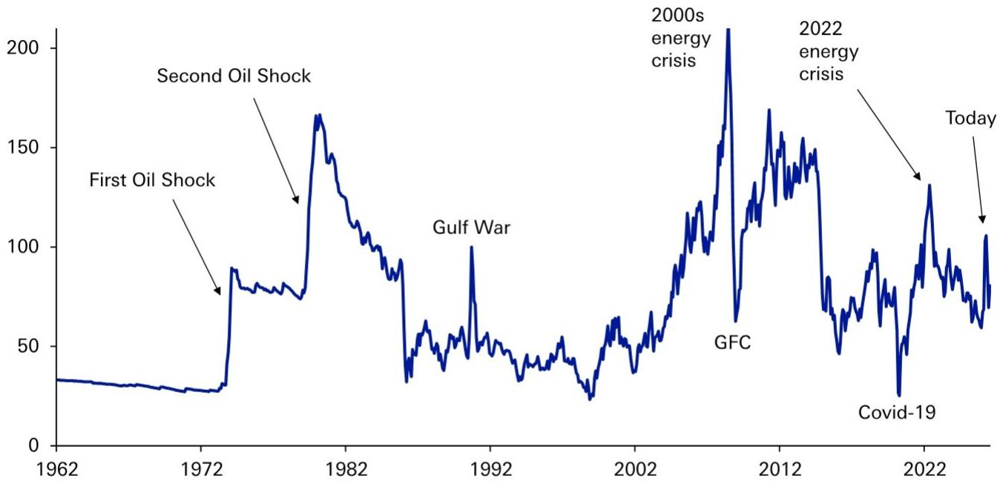

# The $110 Threshold: Why Today's Oil Shock Still Falls Short of Triggering a Broader Risk-Asset Selloff

Brent crude oil posted its largest single-day gain in six years yesterday, surging 9.6% and reviving concerns about a stagflationary shock. Yet the cross-asset reaction has been conspicuously muted. The S&P 500 sits barely 1% below its record high. High-yield credit spreads in both the US and Europe remain tighter than their pre-conflict levels. Only rates markets have shown a more meaningful repricing.

This apparent disconnect between a sharp oil spike and a calm risk-asset response is not a market anomaly. It reflects a clear, empirically grounded threshold: Brent crude at $80-90 per barrel is simply not high enough to trigger the kind of self-reinforcing selloff that defines a genuine risk-off episode. The evidence from both this year and the 2022 energy shock points to a consistent real-terms threshold of approximately $110 per barrel, sustained over months, before equities and credit begin to show material vulnerabilities.

Understanding why this threshold exists, and why today's shock does not meet it, is essential for any observer trying to distinguish between a tradable correction and the start of a bear market. The framework that follows draws on three historical criteria, each of which must be assessed independently before concluding that an oil-driven selloff is imminent.

## A Large and Sustained Oil Price Spike Remains the First Necessary Condition, and Today's Move Does Not Meet It

Historical precedent is unambiguous. The 1973 oil shock saw prices nearly quadruple. The 1990 Gulf War spike more than doubled oil prices. Even the 2022 shock, which many recall as painful, saw Brent spend roughly six months above $100 per barrel, with the 12-month futures contract also trading above that level, implying the market priced in a sustained shock lasting over a year.

Compare that with today. Brent crude at $86 per barrel is up 18% from its pre-conflict level and 41% from the start of the year. That is a noticeable move, but it does not approach the magnitude of prior shocks that actually broke risk assets. Moreover, cumulative inflation of over 10% since 2022 means that the real equivalent of that earlier $100 threshold is now approximately $110. By that measure, oil prices have spent only about two weeks above $110 in 2026, not six months.

The shape of the oil futures curve reinforces this point. After normalising in June, the Brent curve has become backwardated again, meaning that observers expect prices to fall back in the months ahead. A backwardated curve is the market's way of saying that the current spike is not expected to persist. When a shock is truly sustained, the curve shifts into contango or remains flat at elevated levels for an extended period. That is not what we are seeing now.

The implication is straightforward: the oil price move, while significant in headline terms, does not meet the historical standard for a shock that forces a broad-based repricing of risk. Observers should not confuse volatility with regime change.

## Central Banks Are Not Being Forced into a Hawkish Pivot, and That Changes the Entire Transmission Mechanism

The second criterion for a major oil-driven selloff is a hawkish policy response. In 2022-23, the Federal Reserve hiked rates by 525 basis points and the European Central Bank by 450 basis points, directly transmitting the energy shock into tighter financial conditions. In 1979, Paul Volcker's aggressive tightening after the second oil shock became the defining monetary event of a generation.

Today, the situation is fundamentally different. Market pricing for the Fed points to a peak tightening of only 55 basis points by the April 2027 meeting. That is not a tightening cycle; it is a modest adjustment. Crucially, the hawkishness that does exist in current market pricing is driven by upside growth surprises, not by upside inflation surprises. That distinction matters enormously for the transmission mechanism.

When central banks tighten because growth is strong, the effect on risk assets is very different from when they tighten because inflation is spiralling out of control. In the former case, higher rates are accompanied by stronger corporate earnings and a healthier economic base. In the latter, higher rates crush demand and compress margins simultaneously. The current constellation of factors points to the former scenario, not the latter.

Furthermore, inflation rates are much lower today than they were in 2022. Central banks have more room to look through a temporary energy spike, especially if inflation expectations remain anchored. The risk of a Volcker-style response, where a central bank deliberately induces a recession to break inflation, is simply not present in the current data.

## The Broader Economy Is Not Showing Signs of the Damage That Characterises Severe Oil Shocks

The third criterion is perhaps the most important: does the oil shock tip an already-slowing economy into recession? The most severe oil shocks of the past did not take months to show up in the data. After the 1973 oil shock, the unemployment rate rose immediately. When the Gulf War began in August 1990, US payrolls posted their largest monthly contraction in seven years.

Today, the macro data tells a very different story. US payrolls have been consistently positive, and the unemployment rate hit a 12-month low in June. Even in Europe, which is theoretically more exposed to the oil shock given its geography and reliance on imported energy, the Eurozone composite PMI stood at exactly 50.0 in June. That is the boundary between expansion and contraction, not a signal of imminent recession.

This resilience matters because it breaks the negative feedback loop that turns an oil spike into a bear market. In 2022, tighter financial conditions and equity declines induced a pullback in consumer spending, which in turn dented growth and validated the initial selloff. That self-fulfilling dynamic is absent when the real economy continues to generate jobs and output growth.

The absence of broader macro damage also means that credit markets have not repriced aggressively. High-yield spreads remain tight because corporate balance sheets, supported by a still-growing economy, can absorb higher energy costs without triggering a wave of defaults. The oil shock is being absorbed as a cost push rather than a demand destroyer.

## A Decision Framework for Observers: Three Conditions That Must Be Met Before Treating an Oil Spike as a Systemic Risk

For those trying to navigate the current environment, the historical evidence supports a clear decision framework. An oil-driven selloff of the magnitude that matters for strategic asset allocation requires at least one of three conditions to be met. If none are present, the appropriate response is to treat the oil spike as a tactical event, not a structural one.

The first condition is a sustained oil price increase of 50% to 100% or more, maintained over several months. This threshold is not arbitrary. It reflects the point at which energy costs become a material drag on consumer spending and corporate margins, and at which inflation expectations begin to de-anchor. Today's 18% move from pre-conflict levels does not come close.

The second condition is a hawkish policy response that amplifies the shock. If central banks are forced to tighten aggressively to contain energy-driven inflation, the resulting rise in real rates compresses equity valuations and widens credit spreads independently of the oil price itself. Current market pricing for central bank policy does not reflect this dynamic.

The third condition is observable macro damage. If payrolls turn negative, if PMIs fall decisively below 50, or if consumer confidence collapses, then the oil shock is no longer an isolated event. It has become embedded in a broader economic deterioration that will feed back into corporate earnings and credit quality. None of these indicators are flashing red today.

Observers should apply this framework as a checklist, not a forecast. The fact that none of the three conditions are currently met does not mean they cannot be met in the future. A further escalation of the conflict, damage to oil infrastructure, or a sustained move above $110 could change the calculus quickly. But for now, the evidence argues against treating this as the beginning of a major risk-off episode.

## The $110 Threshold Is Not Just a Number; It Represents the Point at Which the Transmission Mechanism Changes

The experience of both this year and 2022 converges on a consistent finding: $110 per barrel for Brent, sustained over months, is the level at which the transmission mechanism from oil to risk assets fundamentally changes. Below that threshold, central banks can look through the shock, consumers can absorb higher costs without cutting spending, and credit markets remain orderly.

Above that threshold, everything changes. At $110, energy costs become clearly felt by consumers and begin to challenge inflation expectations. Central banks lose the ability to look through the shock, particularly after several years of above-target inflation. Financial stress becomes visible, as it did earlier this year when the S&P 500 hit its 2026 low and high-yield spreads peaked on the same day that oil traded above $110.

The danger above $110 is that a self-fulfilling prophecy takes hold. Tighter financial conditions and equity declines induce a pullback in consumer spending, which damages growth and validates the initial selloff. This was the key channel in the 2022 bear market, and it is the mechanism that observers should watch most closely.

But the shape of the oil curve matters as much as the level. A temporary blip above $110, as happened earlier this year, is not enough to drive a bear market. It is when the futures curve prices in sustained elevation, as it did in 2022, that the shock becomes permanent in the market's eyes and central banks lose their ability to look through it. That is when hawkish expectations become priced in, and the broader reaction begins.

For now, the curve is backwardated, inflation expectations remain anchored, and the real economy is still growing. The $110 threshold has not been breached on a sustained basis, and the conditions for a broader selloff are not in place. Observers should monitor the level and the curve shape, but they should not pre-empt a selloff that the data does not yet support.

*For informational purposes only. Portions may be generated, translated, summarized, or edited with AI assistance based on source materials and may contain omissions or errors. Please verify independently. This is not investment, legal, tax, accounting, or other professional advice.*

For informational purposes only. Portions may be generated, translated, summarized, or edited with AI assistance based on source materials and may contain omissions or errors. Please verify independently. This is not investment, legal, tax, accounting, or other professional advice.

