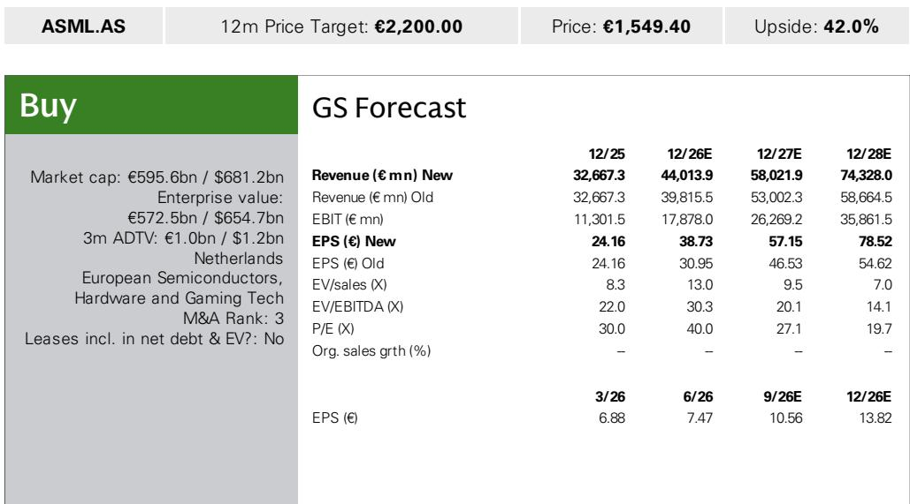
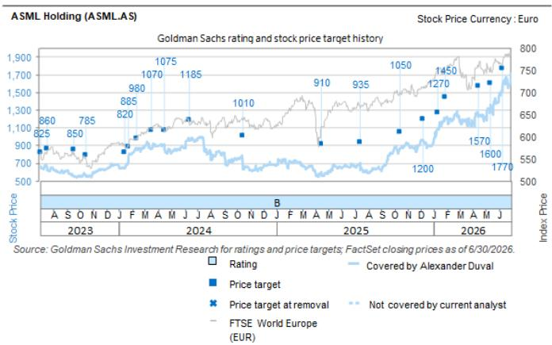

# ASML's Revised Guidance Reveals a Structural Shift in Semiconductor Manufacturing Demand, Not Just a Cyclical Upturn

ASML raised its 2026 revenue guidance by a full €6 billion at the midpoint, from a prior range of €36-40 billion to €43-45 billion, and lifted gross margin expectations by 300 basis points to 54-56%. The scale of this revision is not merely a reflection of a stronger chip cycle. It signals a deeper structural transformation: the simultaneous migration of advanced logic to smaller nodes, a dramatic expansion in memory capacity driven by HBM demand, and a pricing environment that is shifting from technology-enabling to capacity-driven. Those who treat this as a standard cyclical upgrade risk underestimating the duration and magnitude of the opportunity.

The semiconductor industry is entering a period where lithography intensity is rising across multiple end markets at once. ASML's guidance implies revenue roughly 11% above consensus at the midpoint and 14% above at the top end. More telling than the absolute numbers is the composition of the growth. Memory system sales are expected to grow by more than 75% in 2026, while advanced logic system sales should grow by over 25%. These are not uniform demand signals. They reflect distinct drivers that, taken together, create a multi-year expansion in ASML's addressable market.

The implications for observers are clear. The traditional framework for valuing ASML, which relied heavily on a single leading-edge logic cycle, no longer captures the full picture. The company is now benefiting from three concurrent structural trends: node migration in logic, capacity expansion in memory, and a pricing model that rewards technological scarcity. Each of these trends has its own timeline and risk profile, but together they create a compound effect that supports a re-rating of the company.

## The Logic Node Migration Is Accelerating, Not Slowing, Driven by a Broadening Set of AI Applications

Advanced logic remains ASML's most important growth engine, but the nature of the demand is changing. The company has reiterated that investment is flowing not only into leading-edge nodes like 2nm for high-performance computing and mobile, but also into more mature 4nm and 5nm technologies. This is a critical point. The conventional narrative held that AI-driven demand would concentrate on the most advanced nodes. In practice, AI inference workloads and edge applications are creating demand across a wider spectrum of process technologies.

Customers are already planning the transition from 2nm to 1.4nm, which will further increase lithography intensity. Each node migration requires more layers of EUV and immersion lithography, directly boosting ASML's system revenue per wafer. The company's expectation of over 25% growth in advanced logic system sales in 2026 is therefore not a one-off event. It reflects a multi-year roadmap where each successive node adds more lithography content than the previous one.

The High NA EUV deployment at Intel on the 18A node, used for a subset of Core Ultra processors, marks a pivotal milestone. It demonstrates that High NA is ready for production environments, not just R&D. As platform maturity improves, ASML management believes High NA will transition from a technology enabler to a viable capacity solution. This distinction matters. Technology enablers are delivered in small volumes to a few early adopters. Capacity solutions are delivered in higher volumes to a broad customer base. The shift from one to the other creates an incremental demand opportunity that is not yet fully priced into consensus estimates.

## Memory Demand Is No Longer Just About Volume; It Is About Lithography Intensity Per Wafer

The memory segment has historically been viewed as more cyclical and less technologically intensive than logic. That characterization is outdated. ASML expects memory system sales to grow by more than 75% in 2026, and the drivers are structural, not cyclical.

The first driver is capacity expansion. Tight supply conditions in both HBM and DDR are supporting elevated pricing, which in turn justifies new fab investments. Customers are adding near-term capacity and committing to longer-term mega-fab projects. This is a direct consequence of the AI buildout. HBM requires more wafers per chip than standard DRAM, and the proliferation of AI accelerators is creating a sustained demand pull.

The second driver is more important for ASML's margin profile. As DRAM migrates to the 1b and 1c nodes, the number of EUV and immersion layers per wafer increases significantly. This is not a trivial change. It means that even if wafer output grows at a moderate pace, ASML's revenue per wafer will rise. The combination of expanding memory capacity and rising lithography intensity creates a compound growth effect that is unique to this cycle.

For observers, the key insight is that memory is becoming a higher-margin business for ASML, not just a volume business. The shift to advanced nodes in DRAM mirrors what happened in logic several years ago. The difference is that the memory transition is happening faster and at a larger scale, because the end-market demand from AI is more concentrated and more urgent.

## Pricing Flexibility and Product Mix Are Creating a Margin Trajectory That Outpaces Revenue Growth

ASML's gross margin guidance of 54-56% for 2026 represents a 300 basis point improvement over the prior range. This is not simply a function of higher volumes. It reflects a deliberate shift in pricing strategy and product mix that will compound over the next several years.

The company's value-based pricing approach is gaining traction because the economic value of EUV systems to customers is increasing. Each EUV system enables a customer to produce more advanced chips at higher yields, and in a supply-constrained environment, the willingness to pay rises. While long lead times mean that pricing benefits feed through gradually, the direction of travel is clear. ASML has pricing flexibility that it did not have in previous cycles, because the technology is more differentiated and the customer base is more concentrated.

Product mix is an equally important margin driver. In 2026, shipments will still be weighted toward the NXE:3800D platform. But the transition to the higher-productivity NXE:3800E and NXE:3800F platforms, which command higher average selling prices and gross margins, is expected to be largely complete by 2027. This is a multi-year margin tailwind that is independent of end-market demand.

Additionally, higher scanner volumes across immersion and DUV improve fixed-cost absorption. And the growing installed base generates higher-margin service and upgrade revenue. The combination of pricing power, mix shift, and scale effects means that ASML's margin improvement is likely to persist into 2027 and beyond, even if demand growth moderates.

## A Decision Framework for Observers: How to Assess the Upside from ASML's Capacity Expansion Plans

The most underappreciated aspect of ASML's outlook is the capacity expansion roadmap. The company has already secured the majority of EUV orders required for 2027 and a meaningful number of orders for 2028. It is working toward a roughly 30% increase in both EUV and immersion manufacturing capacity in 2027, and investigating a similar step-up in 2028. Current optimization efforts could support EUV output of around 110 systems in 2028 through more efficient use of existing cleanroom space.

For observers, the critical question is not whether ASML can build capacity. It is whether the demand environment justifies that capacity. The company has stated explicitly that its capacity plans are grounded in customer conversations. A significant portion of expected demand for 2027 is already covered by orders, and the same is true for a meaningful portion of 2028. This is not speculative capacity building. It is a matching of manufacturing capability to confirmed customer requirements.

The decision framework for assessing upside is straightforward. First, track the pace of order conversion for 2028. If customers continue to place orders at the current rate, the capacity expansion for 2028 will be validated, and the potential for further increases in 2029 will emerge. Second, monitor the adoption of High NA EUV as a capacity solution. If High NA moves beyond early adopters and into volume production, it will open a new revenue stream that is not fully reflected in current estimates. Third, watch the memory segment. If DRAM node migration continues at the current pace, lithography intensity will rise faster than wafer output, creating a tailwind for ASML's system revenue that is independent of capacity additions.

The risk to this framework is that customer demand softens, which would leave ASML with excess capacity and lower utilization. But the company's strategy of building capacity only after securing orders mitigates this risk. The orders are already in place for 2027, and the discussions for 2028 are ongoing. The burden of proof is on the alternative view to explain why customers would walk away from commitments that are already made.

The bottom line is that ASML is not just riding a cyclical wave. It is benefiting from a structural expansion in semiconductor manufacturing complexity that spans logic and memory, across multiple nodes, and across multiple geographies. The revenue guidance revision is the headline. The capacity expansion plans, the pricing flexibility, and the product mix shift are the substance. Those who focus only on the near-term numbers will miss the longer-term compounding that is already embedded in the company's strategy.

*For informational purposes only. Portions may be generated, translated, summarized, or edited with AI assistance based on source materials and may contain omissions or errors. Please verify independently. This is not professional advice.*

For informational purposes only. Portions may be generated, translated, summarized, or edited with AI assistance based on source materials and may contain omissions or errors. Please verify independently. This is not professional advice.

