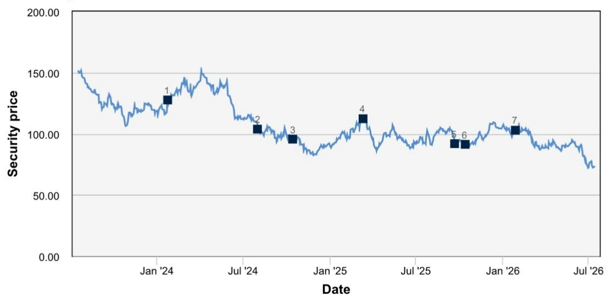
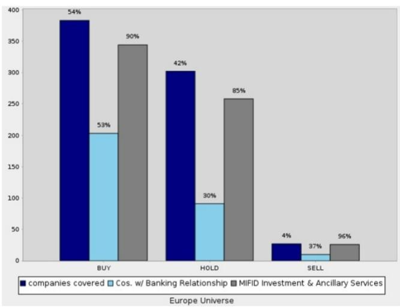
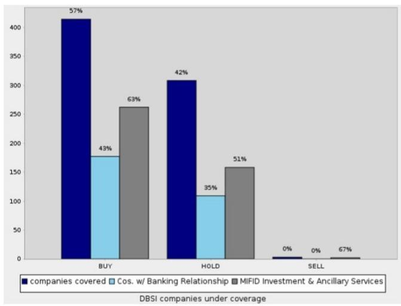

## Company Volkswagen AG

Rating 关注

Europe Germany

Autos
Auto Manufacturing

Reuters VOWG.DE

ADR
VLKAY

Bloomberg VOW GR

Exchange GER

ISIN US9286623031

Ticker VOWG

Date 15 July 2026

Company Update

Price at 14 Jul 2026 (EUR) 73.65
Price Target (EUR) 120.00
52-week range (EUR) 109.40 - 72.05

# 欧洲需求稳健，中国市场表现持续调整——第二季度前瞻

## 业绩预计于7月24日发布

大众汽车预计将于7月24日公布第二季度业绩并召开电话会议。集团本季度交付量同比下降8%至210万辆，主要受中国市场影响，该地区因市场环境变化、销售补贴终止及车型持续更新，交付量下降37%。其他区域均保持增长，欧洲增长3%，北美增长8%，南美增长9%。交付量下降在乘用车业务中较为普遍，核心品牌和进取品牌集团均同比下降约8-9%，保时捷交付量下降18%。Traton实现4%的交付增长。欧洲需求继续受到强劲订单的支撑，订单量年初至今增长12%，纯电动车占欧洲总订单的31%。

从盈利角度看，我们认为销量贡献有限，而价格组合将因欧洲和北美市场价格竞争加剧而同比承压。金融服务业务也可能因第一代纯电动车残值下降而受到一定影响。此外，我们了解到第二季度将包含一笔与终止与博世自动驾驶联盟相关的低三位数百万欧元非现金支出。现金流方面，新车发布相关的库存积累以及一项10亿美元的软件定义汽车相关股权投资将对表现产生影响，但第二季度汽车业务净现金流预计仍将略为正值。

我们认为，关键问题在于，中国以外地区依然稳健的需求趋势（反映为强劲的欧洲订单和积压订单），以及大众汽车成本改善计划的持续效益，是否足以抵消中国市场及高端品牌持续面临的市场调整。

## 业绩指引——预计不变

大众汽车预计2026财年销售收入同比增长0-3%，营业利润率4.0-5.5%。汽车业务方面，投资比率预计在11-12%之间，报告净现金流为30-60亿欧元，净流动性为320-340亿欧元。我们预计公司不会随第二季度业绩调整其指引。

## 估值与风险

Tim Rokossa
Head of European Equity Research
+49-69-910-31998

Christoph Laskawi Research Analyst +49-69-910-31924

Nicolai Kempf Research Analyst +49-162-5168792

Nikita Papaccio
Research Analyst
+49-69-910-48637

Mira Wiegratz
Research Associate
+49-69-9103-1733

## 关键图表

## 图1：大众汽车第二季度业绩前瞻

<table><tr><td></td><td colspan="2">收入</td><td>同比变化</td><td colspan="2">报告EBIT</td><td>同比变化</td><td colspan="2">报告EBIT利润率</td></tr><tr><td>百万欧元</td><td>Q2-25</td><td>Q2-26E</td><td>同比</td><td>Q2-25</td><td>Q2-26E</td><td>同比</td><td>Q2-25</td><td>Q2-26E</td></tr><tr><td>大众品牌</td><td>22,222</td><td>22,256</td><td>0%</td><td>991</td><td>897</td><td>-10%</td><td>4.5%</td><td>4.0%</td></tr><tr><td>斯柯达</td><td>7,811</td><td>7,744</td><td>-1%</td><td>739</td><td>609</td><td>-18%</td><td>9.5%</td><td>7.9%</td></tr><tr><td>西雅特</td><td>3,703</td><td>3,845</td><td>4%</td><td>33</td><td>47</td><td>43%</td><td>0.9%</td><td>1.2%</td></tr><tr><td>奥迪</td><td>17,142</td><td>15,838</td><td>-8%</td><td>550</td><td>463</td><td>-16%</td><td>3.2%</td><td>2.9%</td></tr><tr><td>保时捷</td><td>8,319</td><td>7,867</td><td>-5%</td><td>154</td><td>642</td><td>317%</td><td>1.9%</td><td>8.2%</td></tr><tr><td>商用车</td><td>4,560</td><td>4,595</td><td>1%</td><td>170</td><td>161</td><td>-5%</td><td>3.7%</td><td>3.5%</td></tr><tr><td>金融服务</td><td>14,496</td><td>13,255</td><td>-9%</td><td>863</td><td>586</td><td>-32%</td><td>6.0%</td><td>4.4%</td></tr><tr><td>其他/剩余公司</td><td>2,553</td><td>4,313</td><td>69%</td><td>333</td><td>347</td><td>4%</td><td>13.0%</td><td>8.0%</td></tr><tr><td>集团</td><td>80,806</td><td>79,713</td><td>-1%</td><td>3,833</td><td>3,751</td><td>-2%</td><td>4.7%</td><td>4.7%</td></tr><tr><td>调整项</td><td></td><td></td><td></td><td>-500</td><td>-200</td><td>nm</td><td></td><td></td></tr><tr><td>商品对冲影响</td><td></td><td></td><td></td><td>0</td><td>0</td><td>nm</td><td></td><td></td></tr><tr><td>调整后基础EBIT</td><td></td><td></td><td></td><td>3,273</td><td>3,951</td><td>21%</td><td></td><td></td></tr><tr><td>调整后基础EBIT利润率</td><td></td><td></td><td></td><td>4.1%</td><td>5.0%</td><td>91bps</td><td></td><td></td></tr></table>

来源：DB，公司数据

## 附录1

重要披露

\*其他信息可应要求提供

<table><tr><td colspan="4">披露清单</td></tr><tr><td>公司</td><td>代码</td><td>近期价格*</td><td>披露</td></tr><tr><td>Volkswagen AG</td><td>VOWG.DE</td><td>73.65 (EUR) 14 Jul 2026</td><td>1, 2, 7, 8, 11, 14, 15, 24</td></tr></table>

\*价格截至前一交易日收盘，除非另有说明，数据来源于路透、彭博等当地交易所。其他信息来源于DB、标的公司及其他来源。有关本研究报告主要标的以外证券的建议或估计的披露，请参阅最近发布的公司报告或访问我们在https://research.db.com/Research/Disclosures/EquityResearchDisclosures的全球披露查询页面。除本报告外，重要的风险与利益冲突披露也可在https://research.db.com/Research/Disclosures/Disclaimer找到。强烈建议读者在投资前审阅此信息。

## 美国监管机构要求的重要披露

标有星号的披露可能也至少需要一个美国以外的司法管辖区要求。请参阅非美国监管机构要求的重要披露及解释性说明。

1. 在过去一年内，DB及/或其关联公司曾担任本公司的公开发行主承销或联席主承销，并因此获得费用。

2. DB及/或其关联公司可能担任本公司发行的金融工具的市场做市商或流动性提供者。

7. 在过去一年内，DB及/或其关联公司已从本公司获得投资银行或财务顾问服务的报酬。

8. DB及/或其关联公司预计在未来三个月内寻求从本公司获得投资银行服务的报酬。

14. DB及/或其关联公司在过去一年内已从本公司获得非投资银行相关服务的报酬。

15. 本公司在过去一年内曾是DB Securities Inc.的客户，并在此期间获得了投资银行服务。

## 非美国监管机构要求的重要披露

标有星号的披露可能也至少需要一个美国以外的司法管辖区要求。请参阅非美国监管机构要求的重要披露及解释性说明。

1. 在过去一年内，DB及/或其关联公司曾担任本公司的公开发行主承销或联席主承销，并因此获得费用。

2. DB及/或其关联公司可能担任本公司发行的金融工具的市场做市商或流动性提供者。

24. DB及/或其关联公司在过去12个月内是或曾经是与本公司就提供2014/65/EU指令附件I A和B部分所述服务达成协议的当事方，或在过去12个月内因提供2014/65/EU指令附件I A和B部分所述服务而有义务或有权（视情况而定）支付或收取报酬。

## 特别披露

11. 本公司的一名董事或高级管理人员是DB管理委员会或监事会的成员。

有关本研究报告主要标的以外证券的建议或估计的披露，请参阅最近发布的公司报告或访问我们在https://research.db.com/Research/Disclosures/EquityResearchDisclosures的全球披露查询页面。除本报告外，重要的风险与利益冲突披露也可在https://research.db.com/Research/Disclosures/Disclaimer找到。强烈建议读者在投资前审阅此信息。

## 分析师认证

本报告中表达的观点准确反映了以下签署的首席分析师对标的发行人及其证券的个人观点。此外，以下签署的首席分析师过去没有、将来也不会因在本报告中提供特定建议或观点而获得任何报酬。Tim Rokossa。

1. 01/24/2024 关注，目标价调整 EUR 180.00，当前价格 EUR 127.60 Tim Rokossa 5. 09/22/2025 关注，目标价调整 EUR 120.00，当前价格 EUR 91.85 Tim Rokossa

2. 08/02/2024 关注，目标价调整 EUR 150.00，当前价格 6. 10/14/2025 关注，目标价调整 EUR 110.00，当前价格 EUR 103.80 Tim Rokossa EUR 91.30 Tim Rokossa

3. 10/15/2024 关注，目标价调整 EUR 115.00，当前价格 7. 01/28/2026 关注，目标价调整 EUR 120.00，当前价格 EUR 95.60 Tim Rokossa EUR 102.90 Tim Rokossa

4. 03/12/2025 关注，目标价调整 EUR 125.00，当前价格 EUR 112.30 Nicolai Kempf

股票评级分布与银行业务关系  
  
股票评级与分布关键

  
股票评级分布图描述如下：

过去12个月内被评为"关注"、"观察"和"持有"的建议比例。这以指定区域（例如"欧洲范围"）发行的证券显示。请参阅下面的评级定义。这由图表中的"覆盖公司"柱状图表示。柱状图上方显示的百分比值为比例百分比。例如，"关注"/"覆盖公司"柱状图上方显示50%意味着过去12个月内DB股票研究覆盖的公司中有50%获得"关注"评级。

在分别显示"关注"、"观察"和"持有"建议比例的三个柱状图旁边，我们提供了两个额外的柱状图来显示：

- 在过去12个月内DB及/或其关联公司提供MIFID投资或辅助服务的"关注"、"观察"或"持有"建议的比例。这由"MIFID投资和辅助服务"柱状图表示。柱状图上方显示的百分比值显示了DB在过去12个月内同时提供MIFID投资和辅助服务的覆盖公司比例。例如，"提供MIFID投资和辅助服务的公司"柱状图上方显示50%意味着具有所述评级的覆盖公司中有50%也从DB获得了MIFID投资和辅助服务。

- 在过去12个月内DB及/或其关联公司提供投资银行服务并已获得报酬的"关注"（或"观察"或"持有"）建议的比例。柱状图上方显示的百分比值显示了DB在过去12个月内同时提供投资银行服务的覆盖公司比例。例如，"具有投资银行关系的公司"柱状图上方显示50%意味着具有所述评级的覆盖公司中有50%也与DB存在投资银行关系。

关注：基于当前12个月的TSR展望，我们建议读者关注该股票。

观察：基于当前12个月的TSR展望，我们建议读者观察该股票。

持有：我们对股票未来12个月持中性看法，基于此时间范围，不建议关注或观察。

TSR = 股东总回报。股价从当前价格到预测目标价格的百分比变化加上预测股息回报表现

新发布的研究建议和目标价取代先前发布的研究。

## 附加信息

本报告中的信息和意见由DB AG或其关联公司（统称"DB"）编制。尽管此处信息被认为是可靠的，并且来自被认为可靠的公开来源，但DB不对其准确性或完整性作出任何陈述。本报告中指向第三方网站的超链接仅为方便读者提供。DB既不认可其内容，也不对这些网站的准确性或安全控制负责。

如果您在使用DB的服务购买或出售本报告中讨论的证券，或包含在DB分析师的另一份（口头或书面）沟通中，DB可能作为其自身账户的本金或作为他人的代理人行事。

DB可能考虑本报告以决定作为本金进行交易。它也可能为其自身账户或与客户进行交易，其方式与本研究报告中的观点不一致。DB内部的其他人员，包括策略师、销售人员和其他分析师，可能采取与本研究报告中的观点不一致的观点。DB发布多种研究产品，包括基本面分析、股权挂钩分析、定量分析和交易思路。一种类型的沟通中包含的建议可能与其他类型的沟通中的建议不同，无论是由于不同的时间范围、方法论、视角或其他原因。DB及/或其关联公司也可能持有其撰写报告的发行人的债务或股权证券。分析师的薪酬部分基于DB AG及其关联公司的盈利能力，包括投资银行、交易和本金交易收入。

意见、估计和预测构成本报告作者截至报告日期的当前判断。它们不一定反映DB的意见，并可能随时更改，恕不另行通知。DB为其覆盖的公司发行的证券的买卖双方提供流动性。DB分析师有时会有较短期的交易思路，可能与DB现有的较长期评级不一致。一些股票的交易思路在研究网站（https://research.db.com/Research/）上列为催化剂电话，可以在一般覆盖列表以及覆盖公司的页面上找到。催化剂电话代表分析师高度确信股票将在不少于两周且不超过三个月的时间范围内跑赢或跑输市场和/或特定板块。除催化剂电话外，分析师可能偶尔与我们的客户以及DB的销售人员和交易员讨论交易策略或思路，这些策略或思路涉及可能对本报告中讨论的证券市场价格产生短期或中期影响的催化剂或事件，这种影响可能在方向上与分析师当前12个月的总回报或投资回报观点相反。DB没有义务更新、修改或修订本报告，或在意见、预测或估计发生变化或不准确时通知接收方。覆盖范围以及市场状况和一般及公司特定经济前景的变化频率使得难以按固定间隔更新研究。更新由覆盖分析师或研究部门管理层自行决定，大多数报告以不规则间隔发布。本报告仅供参考，不考虑个别客户的特定投资目标、财务状况或需求。它不是购买或出售任何金融工具或参与任何特定交易策略的要约或要约邀请。目标价格本质上是不精确的，是分析师判断的产物。本报告中讨论的金融工具可能不适合所有读者，读者必须自行做出明智的投资决策。金融工具的价格和可用性可能随时更改，恕不另行通知，投资交易可能因价格波动和其他因素导致损失。如果金融工具以读者货币以外的货币计价，汇率变化可能对投资产生不利影响。过往表现不一定预示未来结果。除非另有说明，业绩计算不包括交易成本。除非另有说明，价格截至前一交易日收盘，数据来源于路透、彭博等当地交易所。数据也来源于DB、标的公司和其他方。人工智能工具可能用于准备本材料，包括但不限于协助事实查找、数据分析、模式识别、内容起草以及与研究报告材料相关的编辑更正。

DB部门独立于银行的其他业务部门。关于我们组织安排和信息壁垒的详细信息，请访问我们的网站（https://research.db.com/Research/）的免责声明部分。

宏观经济波动通常构成与承诺支付固定或浮动利率的工具相关的风险的大部分。对于持有固定利率工具（从而接收这些现金流）的读者来说，利率上升自然会提高应用于预期现金流的贴现因子，从而导致损失。特定现金流的期限越长，贴现因子的变动越大，损失就越大。通胀、财政融资需求和外汇贬值率的意外上行是接收方最常见的负面宏观经济冲击。但交易对手风险、发行人信用度、客户细分、监管（包括不同类型读者资产持有限制的变化）、税收政策变化、货币可兑换性（可能限制货币兑换、利润汇回和/或头寸清算）以及与当地清算机构相关的结算问题也是重要的风险因素。固定收益工具对宏观经济冲击的敏感性可以通过将合同现金流与通胀、外汇贬值或特定利率挂钩来缓解——这些在新兴市场很常见。指数固定值可能——按设计——滞后或错误衡量其旨在跟踪的基础变量的实际变动。在掉期市场中，浮动票息率（即与通常为短期的利率参考指数挂钩的票息）与固定票息交换，选择正确的固定值（或指标）尤为重要。以与票息计价货币不同的货币融资会带来外汇风险。掉期期权（swaptions）除了与利率变动相关的风险外，还具有期权的典型风险。

衍生品交易涉及多种风险，包括市场、交易对手违约和流动性风险。这些产品是否适合读者使用取决于读者自身的情况，包括其税务状况、监管环境以及其其他资产和负债的性质；因此，读者在进入与本出版物内容类似或受其启发的任何交易之前，应寻求专业的法律和财务建议。期货交易和期权（无论是国内还是国外）的损失风险可能很大。由于期货和期权交易可获得的高度杠杆，可能产生的损失大于最初存入的资金金额——理论上可达无限损失。期权交易涉及风险，不适合所有读者。在购买或出售期权之前，读者必须审阅"标准化期权的特征和风险"，网址为https://www.theocc.com/company-information/documents-and-archives/options-disclosure-document。如果您无法访问该网站，请联系您的DB代表以获取此重要文件的副本。

外汇交易参与者可能面临多种因素产生的风险，包括：(i) 汇率可能波动并大幅波动；(ii) 货币价值可能受到众多市场因素的影响，包括世界和国家经济、政治和监管事件、股票和债务市场的事件以及利率变化；以及 (iii) 货币可能受到贬值或政府实施的汇率管制的影响，这可能会影响货币的价值。投资于其价值受基础货币影响的证券（如ADR）的读者实际上承担了货币风险。

除非适用法律另有规定，所有交易应通过读者所在司法管辖区的DB实体执行。除本报告外，重要的利益冲突披露也可在https://research.db.com/Research/上每个公司的研究页面或"披露"选项卡下找到。强烈建议读者在投资前审阅此信息。

DB（包括DB AG、其分支机构和关联公司）不就本报告中提供的任何信息担任您的财务顾问、顾问或受托人。DB不提供投资、法律、税务或会计建议，DB不作为您的公正顾问行事，并且不就材料中呈现的任何策略、产品或任何其他信息表达任何意见或建议。此处包含的信息仅基于接收方将独立评估任何投资决策的优点的原则提供，并不构成对任何产品或服务或任何交易策略的建议或意见。

所呈现的信息具有一般性，不针对退休账户或任何特定个人或账户类型，因此是在明确其不是建议的基础上向您提供，您不得依赖它做出您的决定。我们提供的信息仅针对我们认为财务上成熟、能够独立评估投资风险（无论是总体上还是针对特定交易和投资策略）并且理解DB在其产品和服务提供中具有财务利益的人士。如果不是这种情况，或者您是IRA或其他直接从此处接收信息的零售读者，我们要求您立即通知我们。

2018年7月，DB修订了其短期思路评级系统，品牌名称从SOLAR思路更改为催化剂电话（"CC"）；源自美洲地区的催化剂电话评级类别已与全球分析师使用的类别保持一致；CC的有效期已从最长180天缩短至90天。

美国：由DB Securities Incorporated批准和/或分发，该公司是FINRA和SIPC的成员。位于美国以外的分析师受雇于非美国关联公司，未在FINRA注册/具备研究分析师资格。

欧洲经济区（不包括英国）：由DB AG批准和/或分发，DB AG是一家在德意志联邦共和国注册的股份有限公司，主要办事处在法兰克福。DB AG根据德国银行法获得授权，并受欧洲中央银行和德国联邦金融监管局（BaFin）的监管。

英国：由DB AG通过其伦敦分行（地址：21 Moorfields, London EC2Y 9DB）批准和/或分发。DB AG在英国由审慎监管局授权，并受审慎监管局和金融行为监管局的有限监管。有关我们授权和监管范围的详细信息可应要求提供。

香港特别行政区：由DB AG香港分行分发，但属于《香港证券及期货条例》第571章含义内的期货合约的研究内容除外。关于此类期货合约的研究报告不打算供位于、注册、组成或居住在香港的人士访问。研究报告的作者及其代表和/或关联的实体可能未获许可在香港进行受规管活动，如果未获许可，则不会声称能够这样做。上述"附加信息"部分中的规定应在当地法律法规允许的最大范围内适用，包括但不限于《证券及期货事务监察委员会持牌人或注册人行为准则》。本报告仅旨在分发给《证券及期货条例》附表1第1部分定义的"专业读者"。非专业读者不得依据或依赖本文件行事。本文件相关的任何投资或投资活动仅适用于专业读者，并将仅与专业读者进行。

印度：由Deutsche Equities India Private Limited (DEIPL) 编制，公司识别号：U65990MH2002PTC137431，注册办事处：14th Floor, The Capital, C-70, G Block, Bandra Kurla Complex, Mumbai (India) 400051。电话：+91 22 7180 4444。它在印度证券交易委员会（SEBI）注册为股票经纪人，注册号：INZ000252437；商人银行家，SEBI注册号：INM000010833；研究分析师，SEBI注册号：INH000001741。DEIPL的合规/申诉官是Rashmi Poddar女士（电话：+91 22 7180 4929，电子邮件：complaints.deipl@db.com）。SEBI的注册和NISM的认证绝不保证DEIPL的业绩或向读者提供任何回报保证。证券市场的投资受市场风险影响。在投资前请仔细阅读所有相关文件。DEIPL可能因违反印度法规而收到SEBI的行政警告。DB及/或其关联公司可能持有标的公司的债务头寸或头寸。有关关联公司的信息，请参阅年度报告中的"持股"部分，网址：https://www.db.com/ir/en/annual-reports.htm。最新的印度研究审计报告，请参阅https://country.db.com/india/deutsche-equities-india/index?language\_id=1。

日本：由Deutsche Securities Inc.(DSI) 批准和/或分发。注册号 - 注册为金融工具交易商，由关东地方财政局局长（金商）第117号。协会成员：JSDA、第二类金融工具交易商协会和日本金融期货协会。股票交易的佣金和风险 - 对于股票交易，我们按与每位客户约定的佣金率乘以交易金额收取股票佣金和消费税。股票交易可能因股价波动和其他因素导致损失。外国股票交易可能因外汇波动导致额外损失。对于某些类别的研究交流、产品和服务，我们可能收取佣金和费用。推荐的投资策略、产品和服务存在本金损失以及因市场和/或经济趋势变化和/或市场价值波动导致的其他损失的风险。在决定购买金融产品和/或服务之前，客户应仔细阅读相关的披露文件、招股说明书和其他文件。本报告中提到的"Moody's"、"Standard Poor's"和"Fitch"除非实体名称中特别指定日本或"Nippon"，否则不是日本注册的信用评级机构。非DSI分析师撰写的关于日本上市公司的报告由DB集团的分析师撰写，覆盖公司由DSI指定。本报告中所述的一些外国证券未根据日本《金融工具和交易法》披露。DB股票分析师设定的目标价基于12个月的预测期。

韩国：由Deutsche Securities Korea Co.分发。

南非：DB AG约翰内斯堡在德意志联邦共和国注册（南非分行注册号：1998/003298/10）。

新加坡：本报告由DB AG新加坡分行（地址：One Raffles Quay #18-00 South Tower Singapore 048583，电话：65 6423 8001）发布，可就与本报告相关的任何事宜联系该分行。如果DB在新加坡向非认可读者、专家读者或机构读者（定义见适用的新加坡法律法规）发布或传播本报告，他们对此人承担其内容的法律责任。

台湾：有关在台湾交易的证券/投资的信息仅供参考。读者应独立评估投资风险，并对其投资决策全权负责。未经书面同意，DB不得分发给台湾公共媒体，也不得被台湾公共媒体引用或使用。有关不在台湾交易的证券/工具的信息仅供参考，不得解释为交易此类证券/工具的建议。

卡塔尔：卡塔尔金融中心（注册号00032）的DB AG受卡塔尔金融中心监管局监管。DB AG - QFC分行只能从事其现有QFCRA许可证范围内的金融服务活动。其在QFC的主要营业地点：Qatar Financial Centre, Tower, West Bay, Level 5, PO Box 14928, Doha, Qatar。此信息由DB AG分发。相关金融产品或服务仅适用于卡塔尔金融中心监管局定义的商业客户。

俄罗斯：此处提交的信息、解释和意见不属于任何需要俄罗斯联邦许可证的评估或鉴定活动的背景，也不构成此类活动。

沙特阿拉伯王国：Deutsche Securities Saudi Arabia (DSSA) 是一家封闭式股份公司，由沙特阿拉伯王国资本市场管理局授权，许可证号（第37-07073号），从事以下业务活动：交易、安排、咨询和托管活动。DSSA注册办事处：Faisaliah Tower, 17th Floor, King Fahad Road - Al Olaya District Riyadh, Kingdom of Saudi Arabia P.O. Box 301806。

阿拉伯联合酋长国：迪拜国际金融中心（注册号00045）的DB AG受迪拜金融服务管理局监管。DB AG - DIFC分行只能从事其现有DFSA许可证范围内的金融服务活动。在DIFC的主要营业地点：Dubai International Financial Centre, The Gate Village, Building 5, PO Box 504902, Dubai, U.A.E.。此信息由DB AG分发。相关金融产品或服务仅适用于迪拜金融服务管理局定义的专业客户。

澳大利亚和新西兰：本研究仅适用于《澳大利亚公司法》和《新西兰金融顾问法》含义内的"批发客户"。请参阅澳大利亚特定的研究披露及相关信息，网址：https://www.dbresearch.com/PROD/RPS\_EN-PROD/PROD0000000000521304.xhtml。如果研究涉及任何特定的金融产品，研究接收方应在做出是否购买该产品的任何决定之前考虑任何产品披露声明、招股说明书或其他适用的披露文件。在准备本报告时，首席分析师或协助准备本报告的个人可能已与作为本研究标的的公司联系，以确认/澄清数据、事实、陈述，获得使用公司来源材料的许可，和/或进行实地考察。未经研究管理部门事先批准，分析师不得接受当前或潜在银行客户支付的参加实地考察、会议、社交活动等所产生的差旅、住宿或其他费用。同样，未经研究管理部门和反贿赂与反腐败团队事先批准，分析师不得从其覆盖的发行人处接受供个人使用的福利或其他有价物品。

可应要求提供与本报告中讨论的证券、其他金融产品或发行人相关的附加信息。未经DB事先书面同意，不得复制、分发或发布本报告。

回测、假设或模拟的业绩结果具有固有的局限性。与基于实际客户投资组合交易的实际业绩记录不同，模拟结果是通过追溯应用一个本身具有事后之明的回测模型实现的。考虑历史事件的回测业绩也与实际账户业绩不同，因为实际投资策略可能随时因任何原因进行调整，包括对重大经济或市场因素的反应。回测业绩包括假设结果，这些结果不反映股息和其他收益的再投资，也不反映咨询费、经纪费或其他佣金以及客户本应支付或实际支付的任何其他费用。未声明任何交易策略或账户将或可能实现与所示类似的利润或损失。替代建模技术或假设可能产生显著不同的结果，并可能被证明更合适。过去的假设回测结果既不是未来回报的指标，也不是保证。实际结果将有所不同，可能与分析结果存在重大差异。

本文阐述的计算单个E、S、G和综合ESG分数的方法是DB AG研究部门开发的一种新方法，使用系统方法计算，无需人工干预。不同的数据提供商、市场部门和地区以不同方式处理ESG分析并纳入研究结果。因此，本文提及的ESG分数可能与市场上其他ESG数据提供商开发和实施的等效评级不同，也可能与DB集团内其他部门开发和实施的等效评级不同。此类ESG分数也不同于DB AG先前发布的研究报告中历史上应用的评级和排名。此外，此类ESG分数并不代表DB AG的正式或官方观点。应注意，将ESG因素纳入任何投资策略的决定可能会抑制参与某些研究线索的能力，而这些机会原本符合您的投资目标和其他主要投资策略。主要由可持续投资组成的投资组合的回报可能低于或高于不考虑ESG因素、排除或其他可持续性问题的投资组合，并且此类投资组合可用的研究线索可能不同。公司可能不一定在ESG或可持续投资问题的所有方面都达到高标准表现；也不能保证任何公司将在企业责任、可持续性和/或影响力表现方面达到预期。

版权所有 © 2026 DB AG

<table><tr><td colspan="4">David Folkerts-Landau Group Chief Economist and Global Head of Research</td></tr><tr><td>Pam Finelli COO and Head of Fixed Income Research</td><td>Steve Pollard Global Head of Company Research and Sales</td><td>Jim Reid Global Head of Macro and Thematic Research</td><td>Tim Rokossa Head of European Company Research</td></tr><tr><td>Matthew Barnard Head of Americas Company Research</td><td>Debbie Jones Global Head of Sustainability and Data Innovation, Research</td><td>Robin Winkler Head of German Macro Research</td><td>Sameer Goel Global Head of EM &amp; APAC Research</td></tr><tr><td>Francis Yared Global Head of Rates Research</td><td>George Saravelos Global Head of FX Research</td><td>Peter Hooper Vice-Chair of Research</td><td>Nilendra de-Mel Head of APAC &amp; Middle East Product Development</td></tr></table>

<table><tr><td>DB AG</td><td>DB AG</td><td>DB AG</td><td>Deutsche Securities Inc.</td></tr><tr><td>DB Place</td><td>Equity Research</td><td>Filiale Hongkong</td><td>1-3-1 Azabudai</td></tr><tr><td>Level 16</td><td>Mainzer Landstrasse 11-17</td><td>International Commerce</td><td>Azabudai Hills Mori JP Tower</td></tr><tr><td>Corner of Hunter &amp; Phillip</td><td>60329 Frankfurt am Main</td><td>Centre,</td><td>Minato-ku, Tokyo 106-0041</td></tr><tr><td>Streets</td><td>Germany</td><td>1 Austin Road West,Kowloon,</td><td>Japan</td></tr><tr><td>Sydney, NSW 2000</td><td>Tel: (49) 69 910 00</td><td>Hong Kong</td><td>Tel: (81) 3 6730 1000</td></tr><tr><td>Australia</td><td></td><td>Tel: (852) 2203 8888</td><td></td></tr><tr><td>Tel: (61) 2 8258 1234</td><td></td><td></td><td></td></tr></table>

DB AG
21 Moorfields
London EC2Y 9DB
United Kingdom
Tel: (44) 20 7545 8000
DB Securities Inc.
The DB Center
1 Columbus Circle
New York, NY 10019
Tel: (1) 212 250 2500
DB AG
Filiale Singapur
One Raffles Quay, South Tower,
Singapore 048583
Tel: +65 6423 8001
