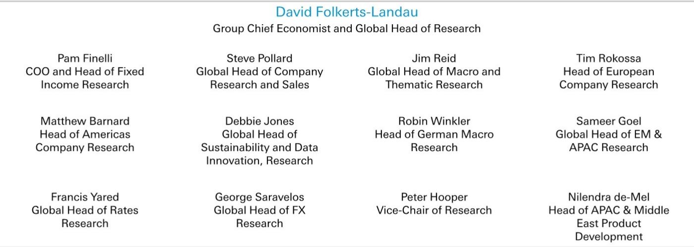
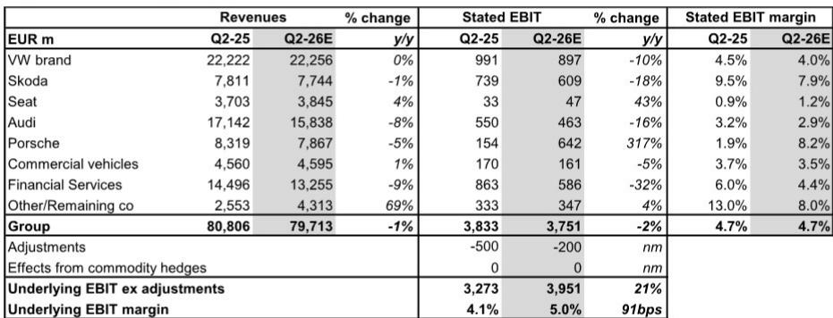

# 大众汽车在中国市场的结构性变化：欧洲复苏难以弥补的缺口

大众汽车2026年第二季度的交付数据显示，公司正面临两个难以调和的市场现实。集团交付量同比下降8%至210万辆，但这一总体数字掩盖了更重要的分化：中国市场下降37%，而欧洲增长3%，北美增长8%，南美增长9%。这种地域分化并非暂时现象，而是反映了公司最大利润来源的收缩速度超过了其成本结构调整的能力，欧洲订单的增长无法填补这一缺口。

7月24日发布的第二季度预览不仅是一次业绩发布，更是对大众汽车战略——成本改善计划、新车型推出以及向软件定义汽车转型——能否应对中国市场结构性变化的考验。数据显示，目前来看还难以做到。对于观察者而言，关键问题是公司欧洲和美国的增长势头是否足够持续，以争取中国市场复苏所需的时间，还是中国市场的调整将继续侵蚀利润率和现金流。

报告估计集团收入同比下降1%至797亿欧元，而公布的息税前利润下降2%至37.5亿欧元。但实际情况更为复杂：剔除调整项后，基础息税前利润增长21%至39.5亿欧元，基础利润率扩大91个基点至5.0%。然而，这一改善并非来自有机增长，而是反映了较低的调整费用——2亿欧元对比去年同期的5亿欧元——以及保时捷息税前利润从1.54亿欧元跃升至6.42亿欧元的临时性推动，这一317%的增长主要是从低基数恢复。剔除保时捷的复苏和自动驾驶联盟解散的非现金费用，利润率的故事就远没有那么引人注目。

## 中国市场37%的交付量下降反映市场对大众现有模式的挑战

中国交付量同比下降37%是报告中最关键的数据点。这并非仅由周期性下行驱动。报告提到市场环境偏弱、销售补贴终止以及车型过渡等因素。但这些因素并非大众汽车独有，它们影响着所有在华传统车企。大众汽车下降幅度较大的原因在于，它在一个本身增速放缓的市场中失去份额，而结构性挑战——本土竞争者主导、电动车普及加速超过燃油车峰值、政策偏向国内供应链——正在叠加。

37%的降幅意味着年化运行率，如果持续，将使大众汽车2026年中国市场销量较2025年下降超过40%。这不是需求冲击，而是市场份额的流失。报告未明确下降是集中在大众的量产车型还是高端奥迪和保时捷系列，但核心品牌和进取品牌集团全球均下降8-9%的事实表明，中国市场的疲软是全面的。保时捷历来依赖中国市场获取高利润销售，其全球交付量下降18%，证实高端细分市场也未能幸免。

对业绩的影响是直接的。中国一直是大众汽车最大的单一利润贡献者，其产生的利润补贴了其他地区的投资。随着销量收缩，每单位固定成本负担上升，曾经让大众在中国享有溢价能力的定价权正在削弱。报告指出，价格组合将同比为负，欧洲和北美的价格压力都在加大。如果中国市场的定价也走弱——考虑到市场动态，这几乎可以肯定——利润率压缩将成为多地区现象。

## 欧洲订单强劲但无法弥补中国市场的下降规模

欧洲交付量同比增长3%，订单簿年初至今增长12%，其中电动车占欧洲总订单的31%。这确实是积极信号。这表明大众在欧洲的产品周期与消费者产生共鸣，电动化转型正在取得进展，公司在本土市场并未失去阵地。订单积压为近期生产和收入提供了可见性。

但算术是无情的。中国近年来约占大众全球交付量的35-40%。该地区37%的下降意味着仅中国市场就使集团总销量减少约13-15%。欧洲3%的增长，基于较小的基数，只能抵消其中一小部分。即使北美增长8%、南美增长9%，非中国地区合计也无法吸收中国市场的销量损失。集团交付量下降8%正是这种不平衡的数学结果。

战略问题是欧洲能否维持其增长势头。订单簿增长令人鼓舞，但部分原因是供应链中断后的积压需求。随着生产正常化和订单履行加速，积压量将减少。报告未表明新订单是加速还是减速，只显示库存年初至今有所增加。观察者应关注订单接收率，而不仅仅是积压水平，以判断欧洲需求是真正增强还是仅仅在追赶。

## 金融服务和一次性费用将影响第二季度业绩，但基础趋势是利润率压缩

报告指出了两个将影响第二季度业绩的具体因素。首先，金融服务部门将面临第一代电动车残值下降带来的负担。这是一个结构性问题：随着电动车价格因竞争和技术进步而下降，早期车型的残值下降速度快于预期。这对金融服务部门的盈利能力造成直接冲击，因为租赁到期车辆的价值低于原先假设。该部门的息税前利润预计同比下降32%至5.86亿欧元，利润率从6.0%收缩至4.4%。

其次，第二季度将包括与博世自动驾驶联盟终止相关的低三位数百万欧元非现金费用。这是一次性项目，但标志着战略调整。大众实际上是在注销一项旨在加速自动驾驶开发的合作投资。该费用是非现金的，但反映了联盟未达到预期效果的认识，大众将需要以额外成本寻求替代路径——可能是更多内部开发或新的合作。

这两项因素的组合意味着公布的息税前利润将比基础运营趋势更弱。但基础趋势并不像调整后息税前利润21%的增长所显示的那样强劲。改善主要来自较低的调整费用和保时捷的基数效应。核心品牌——大众、斯柯达、奥迪——均显示利润率压缩。大众品牌利润率估计为4.0%，低于4.5%。斯柯达利润率从9.5%降至7.9%。奥迪利润率从3.2%降至2.9%。这些并非灾难性下降，但与一家在其主流产品组合中面临定价压力和销量疲软的公司一致。

## 大众汽车发展轨迹的三种情景分析

第二季度预览提供了足够的数据来构建评估大众汽车风险收益特征的分析框架。观察者应考虑三种情景，每种情景都有不同的含义。

**情景一：中国市场企稳，欧洲加速。** 在此情景下，37%的中国市场下降被证明是低谷，由2026年下半年解决的车型过渡驱动。欧洲订单接收以更快速度转化为交付，北美继续获得份额。基础息税前利润温和增长，公司维持2026财年4.0-5.5%运营利润率的指引。第二季度电话会议中需要看到中国订单企稳和新车型推出取得进展的证据。

**情景二：中国市场继续下降，欧洲保持。** 这是最可能的近期结果。由于结构性竞争和政策因素，中国销量仍面临压力。欧洲维持当前轨迹但未加速。成本改善计划抵消部分利润率压力，但集团利润率保持在指引范围的下限。汽车净现金流仍略为正，但新车型推出的库存积累和SDV股权投资消耗现金。

**情景三：中国市场的疲软蔓延至欧洲和北美。** 在这种谨慎情景下，报告中提到的定价压力在所有地区加剧。随着积压订单消化，欧洲订单接收减速。北美增长放缓，因特斯拉和中国制造商进入市场的竞争加剧。金融服务部门因电动车价格继续下降而面临进一步残值损失。公司被迫下调指引。

该分析框架取决于一个变量：中国市场的下降是周期性的还是结构性的。如果是周期性的，当前报价可能提供有吸引力的观察点。

## 成本改善计划是相对少见可以弥合差距的杠杆，但其影响受规模限制

大众汽车的成本改善计划常被提及为缓解因素。报告提到了该计划的持续收益。但计算很清楚：每季度几亿欧元的成本节省无法抵消公司最盈利市场37%的销量下降。成本改善计划在销量稳定或增长时效果最佳，因为它们允许固定成本杠杆放大节省。当销量下降时，成本节省只是减缓利润率侵蚀的速度。

报告未量化成本节省，但基础息税前利润计算中隐含的利润率改善表明它们是有意义的。然而，核心品牌仍出现利润率压缩的事实表明，节省被定价压力和销量疲软所消耗。成本计划是大众维持盈利能力的必要条件，但并非恢复增长的充分条件。

## SDV投资和库存积累将在短期内限制现金流

汽车净现金流预计在第二季度略为正，但报告指出了两个具体的现金消耗：与新车型推出相关的库存积累和10亿美元的SDV相关股权投资。SDV（软件定义汽车）投资是战略必要——大众必须开发自己的软件栈以与特斯拉和中国制造商竞争——但这是一项不产生即时回报的现金流出。库存积累是产品周期的正常部分，但在公司最难以承受的时候占用了营运资金。

2026财年公布的净现金流指引为30-60亿欧元，但第二季度的表现表明公司将处于该范围的下限。如果中国销量继续下降，现金流可能面临进一步压力，限制公司投资增长或向股东返还资本的能力。

## 保时捷的复苏是亮点，但不是集团的解决方案

保时捷息税前利润从1.54亿欧元跃升至6.42亿欧元是报告中最引人注目的数字。但这主要是正常化效应。保时捷2025年第二季度1.9%的息税前利润率异常低，可能是由于车型切换和供应链问题。2026年第二季度8.2%的估计更接近保时捷的历史常态。317%的同比增长令人印象深刻，但这并非加速增长的迹象，而是回归趋势。

保时捷仅占集团交付量的约10%，但利润占比不成比例。其复苏值得欢迎，但无法弥补量产车型和奥迪的疲软。报告对奥迪的估计显示收入下降8%，息税前利润下降16%，利润率下滑至2.9%。奥迪是大众的高端销量品牌，其在中国市场的挑战已有充分记录。没有奥迪的复苏，集团的利润结构仍然偏斜且脆弱。

## 指引不会改变，但市场将关注中国订单的轨迹

报告明确指出，预计2026财年指引不会发生变化。这与公司仅在半年或全年业绩时更新指引的历史做法一致。但市场不会等待指引变化。它将关注7月24日电话会议中的定性评论，特别是关于中国订单、车型过渡时间表以及欧洲需求的可持续性。

关键风险在于，如果中国销量未能企稳，公司4.0-5.5%运营利润率的指引范围可能过于乐观。第二季度5.0%的基础利润率在范围内，但包括较低调整的一次性收益。没有这一收益，利润率将更接近4.5%，即指引范围的中点。中国市场的任何进一步恶化都将推动利润率走向下限，如果中国市场的疲软持续到下半年，指引可能需要下调。

*仅供参考。部分内容可能基于源材料通过AI辅助生成、翻译、总结或编辑，可能存在遗漏或错误。请独立核实。这不构成专业建议。*

仅供参考。部分内容可能基于源材料通过AI辅助生成、翻译、总结或编辑，可能存在遗漏或错误。请独立核实。这不构成专业建议。

