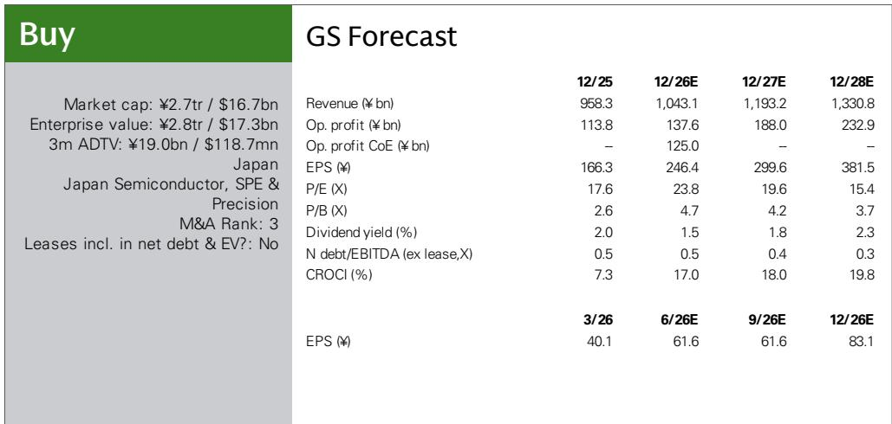
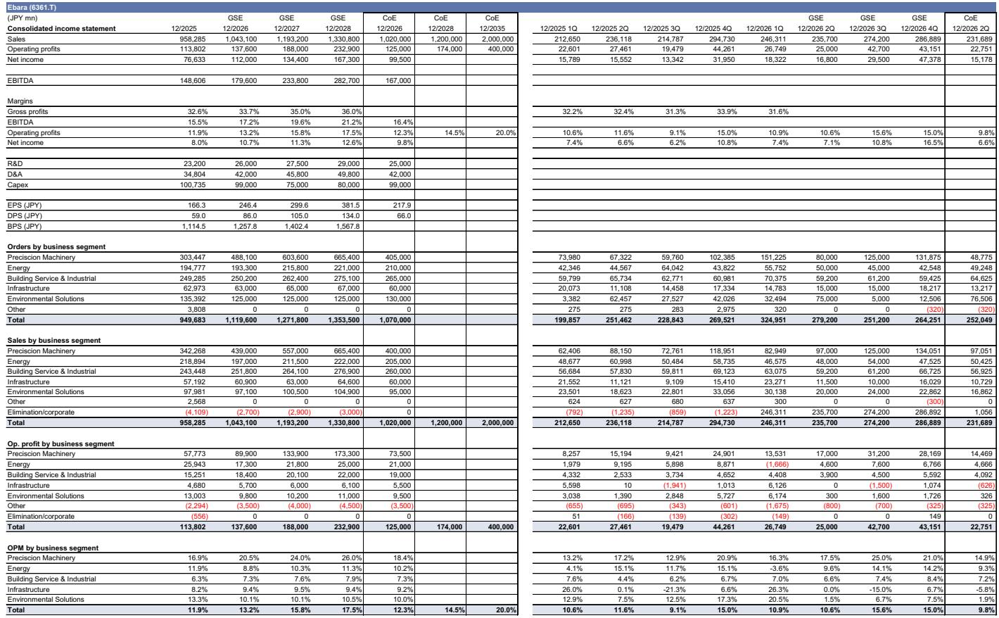
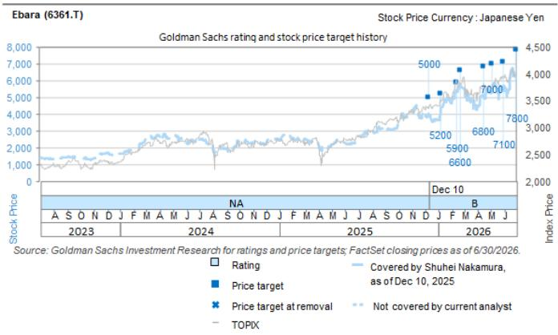

# GS：荏原IRDay，半导体驱动销售增长，各业务利润率扩大

荏原制作所（Ebara）在7月14日的IR Day上释放了一个关键信号：精密机械业务的需求环境比公司中期计划假设的更强。GS分析师认为，这一判断并非空泛表态，而是有具体产能扩张和客户资本开支意愿作为支撑。公司已完成的熊本工厂K3厂房建设，使其能够充分满足当前可见需求，而未来产能扩张的研究已在考虑之中。

更值得关注的是，荏原在能源和楼宇服务与工业两个板块中，提出了不依赖外部环境、仅靠内部努力即可推动利润率改善的具体路径。这意味着，即便宏观环境出现波动，公司仍有结构性提升盈利能力的抓手。

## 1. 精密机械业务的需求增速可能跑赢WFE市场

荏原在IR Day上明确表示，CMP（化学机械抛光）系统的市场需求增速将持续高于WFE（晶圆制造设备）整体市场增速。公司设定的CMP系统年复合增长率为9%，而WFE市场的中期计划假设增速为8%。但GS分析师指出，从当前客户资本开支意愿来看，2026-2027年的实际增长率存在高于这些数字的可能性。

产能端已有实质性准备。熊本工厂K3厂房完工后，公司已具备满足当前可见需求的产能。更关键的是，公司正在考虑进一步的产能扩张研究。定价策略上，荏原计划通过提升设备附加值来拉高平均售价，而非简单对同一产品提价——这在通胀环境下是一个更可持续的利润保护方式。

> **KC评论：** 精密机械的订单数据已经显示出加速迹象。2026财年第一季度该板块订单达到1512亿日元，同比弹性较高有余。GS认为，公司在二季度财报时上调全公司订单、营收和利润指引的概率很高。

## 2. 能源业务：中东高毛利订单已锁定，利润率改善不依赖规模

能源业务在2026财年的指引看似保守——营收和利润均低于2025财年。但报告揭示了一个容易被忽略的结构性变化：公司已在中东上游和中游领域锁定了一批利润率较高的订单，且多个后续项目正在推进中。

荏原计划将能源业务的营业利润率从2025财年的11.9%提升至2028财年的14.5%。GS分析师拆解了这2.6个百分点的改善来源：约一半来自订单和营收增长，另一半完全来自内部效率提升——包括LNG领域压缩机电动化转型带来的市场份额扩张、美国制造基地的自动化研究和交付周期缩短，以及服务站点向客户业务集中区域的优化布局。

这意味着，即便能源业务整体营收增长有限，公司仍有信心通过自身努力实现利润率扩张。

## 3. 楼宇服务与工业：数据中心和半导体需求成为新增长极，服务占比提升是利润放大器

这个板块过去常被视为成熟业务，但荏原正在为其注入新的增长动力。公司计划通过扩大面向数据中心和半导体市场的产品（冷却器、冷却泵）销售来驱动营收增长。与此同时，针对中国建筑市场的变化，公司正在进行结构优化。

真正的利润弹性来自服务业务占比的提升。目前服务收入占该板块营收约23%，公司中期目标是将这一比例提升至30%。报告特别指出，服务的利润率是产品利润率的1.5至2倍。EBARA Maintenance Cloud等数字化工具的推广，已经使服务占比提升了几个百分点。随着服务占比从23%向30%迈进，该板块的利润率将获得结构性支撑。

## 4. 三个业务板块的利润率改善路径互不重叠，共同指向公司整体盈利能力的系统性提升

将三个板块的利润率改善逻辑放在一起看，它们各自依赖不同的驱动因素：精密机械靠的是半导体设备需求超预期和产能扩张；能源靠的是中东高毛利订单和内部运营效率；楼宇服务靠的是数据中心需求、中国业务结构优化和服务占比提升。

这种MECE的改善路径意味着，即便某个板块面临短期波动，其他板块的利润率提升仍可独立推进。GS对公司2028财年整体营业利润率达到17.5%的预测（2025财年为11.9%），正是建立在这些具体、可追踪的行动计划之上。

For informational purposes only. Portions may be generated,translated,summarized,or edited with AI assistance based on source materials and may contain omissions or errors. Please verify independently. This is not investment,legal,tax,accounting,or other professional advice.

For informational purposes only. Portions may be generated,translated,summarized,or edited with AI assistance based on source materials and may contain omissions or errors. Please verify independently. This is not investment,legal,tax,accounting,or other professional advice.

